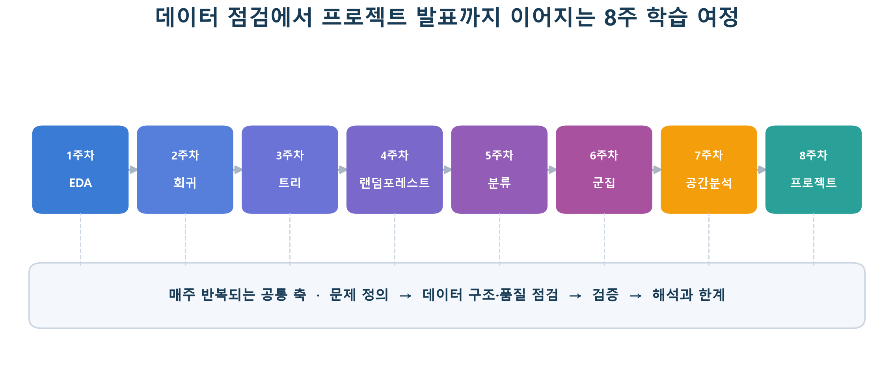
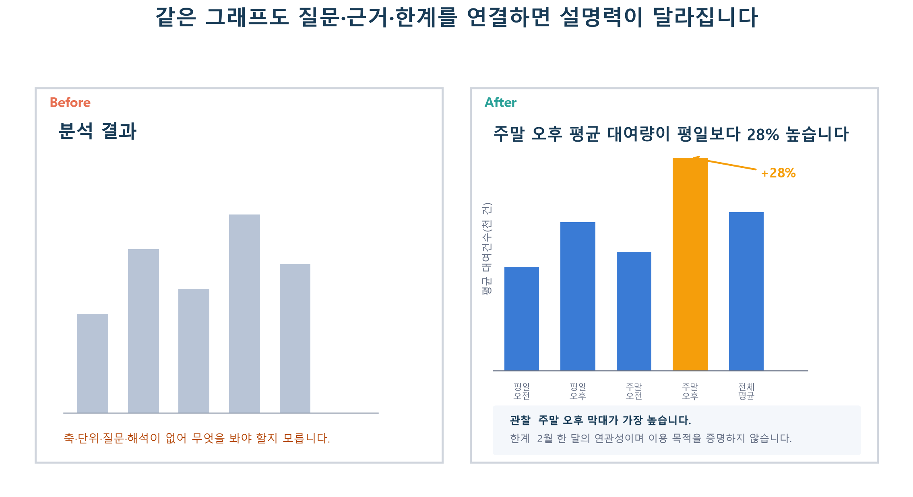

# OT — 자기주도 학습 안내 + 커리큘럼 소개

## 이 스터디에서 도달할 곳

이 스터디의 목표는 알고리즘 이름을 많이 외우는 것이 아닙니다. 처음 보는 데이터를 받았을 때 아래 과정을 스스로 끝까지 연결하는 것이 목표입니다.

1. 풀고 싶은 문제를 한 문장으로 정의합니다.
2. 데이터의 구조와 품질을 점검합니다.
3. 문제에 맞는 분석·모델링 방법과 평가 기준을 고릅니다.
4. 결과가 우연이나 데이터 누수 때문은 아닌지 검증합니다.
5. 숫자와 그래프를 근거로 결론과 한계를 설명합니다.

8주가 끝났을 때는 “코드를 실행했습니다”가 아니라 **왜 이 방법을 골랐고, 결과를 어디까지 믿을 수 있는지 설명할 수 있는 상태**를 목표로 합니다.



*캡션: 1주차의 데이터 점검을 출발점으로 하여, 각 주차의 결과가 다음 분석의 입력으로 이어지는 8주 학습 여정입니다.*

> **그림 읽기:** 화살표를 천천히 따라가며 각 주차의 결과가 다음 주차의 어떤 입력으로 이어지는지 살펴봅니다.

## OT에서 먼저 할 일 — 약 20~40분

OT의 모든 내용을 첫날에 읽을 필요는 없습니다. 아래 네 단계만 진행하면 1주차 기본 학습을 시작할 준비가 됩니다. 패키지 설치와 다운로드에 걸리는 시간은 예상 시간에 포함하지 않습니다.

| 순서 | 먼저 할 일 | 확인할 흔적 |
|---:|---|---|
| 1 | [`학습 폴더를 먼저 맞춥니다`](#학습-폴더를-먼저-맞춥니다)에서 설치·폴더 생성·환경 점검 명령을 실행합니다. | `check_environment.py`의 `[정상]`, `[설치 필요]`, `[확인 필요]` 중 현재 상태가 보입니다. |
| 2 | [`한 주의 기본 완료 기준`](#한-주의-기본-완료-기준)에서 질문·시도·관찰 또는 오류·다음 행동의 네 항목을 읽습니다. | 네 줄 기록을 어디에 남길지 정합니다. |
| 3 | [`세 파일을 오가며 공부하는 기본 리듬`](#세-파일을-오가며-공부하는-기본-리듬)에서 `notion.md`·`example.ipynb`·`assignment_baseline.ipynb`의 역할을 확인합니다. | 각 파일을 언제 열어야 하는지 한 문장으로 말할 수 있습니다. |
| 4 | [1주차 `이번 주 학습 지도`](../01주차/notion.md#이번-주-학습-지도)를 열고 `✅ 기본 학습` 첫 항목을 찾습니다. | 시작할 본문 절과 노트북 셀을 찾았다면 멈춰도 됩니다. |

환경 점검에서 문제가 발견되었다면 같은 날 모두 해결하지 않아도 됩니다. 오류 이름과 현재 경로, 확인한 행동, 다음 행동을 적고 [`복구 사다리`](#복구-사다리) 또는 DM 문의로 이어가면 OT 기본 준비를 마친 것입니다. `8주 학습 지도`, 분석 원칙, 발표 예시는 1주차를 진행하면서 필요한 때 다시 읽습니다.

## 이 자료로 학습하는 방식

이 과정에는 매주 진행되는 강의가 없습니다. 참여자는 자료를 받은 뒤 자신의 속도로 읽고 실행하며, 교사와의 소통은 필요한 경우의 DM 문의로 이루어집니다. 따라서 문서와 노트북만으로 첫 시도를 시작할 수 있어야 하고, 참여자는 막힌 문제를 가능한 만큼 작게 나누어 보는 연습을 합니다.

- 매주 `notion.md`에서 질문과 개념을 읽고 `example.ipynb`를 직접 실행합니다.
- 예제의 숫자와 그림을 확인한 뒤 `assignment_baseline.ipynb`에서 질문 하나를 골라 작은 시도를 합니다.
- 과제의 모든 TODO를 채우거나 코드를 끝까지 성공시키는 것은 필수 조건이 아닙니다.
- 성공한 출력뿐 아니라 오류, 예상과 다른 결과, 해결하지 못한 판단도 이유와 시도를 남기면 학습 결과가 됩니다.
- 매주 한 명이 자신의 학습 경험을 짧은 PPT로 발표합니다. 발표는 평가보다 경험 공유와 질의응답이 목적입니다.
- 완성된 그래프보다 **질문 → 시도 → 관찰 → 해석 또는 다음 시도**의 연결을 더 중요하게 봅니다.

각 주차 폴더의 세 파일은 역할이 다릅니다.

| 파일 | 역할 | 권장 사용법 |
|---|---|---|
| `notion.md` | 개념, 판단 기준, 결과 해석 | 노트북 실행 전후로 두 번 읽기 |
| `example.ipynb` | 작은 예제와 실제 데이터 워크스루 | 셀을 순서대로 실행하고 결과를 말로 설명하기 |
| `assignment_baseline.ipynb` | 첫 시도와 시행착오를 남기는 과제 시작점 | 질문 하나를 골라 시도하고 결과·오류·다음 행동 기록하기 |

### 한 주의 기본 완료 기준

과제 성공 여부와 관계없이 아래 네 가지가 기록되어 있으면 그 주의 기본 학습을 완료한 것으로 봅니다. 예상과 다르거나 막혔다면, 해결하기 전에 문제를 작은 질문으로 나누어 본 기록도 함께 남깁니다.

1. 이번 주에 확인할 **질문 하나**를 적습니다.
2. 코드 실행, 그래프 변경, 전처리 비교 가운데 **시도 하나**를 합니다.
3. 숫자·표·그래프·오류 메시지 중 **관찰 가능한 흔적 하나**를 남깁니다.
4. 다음에 시도할 가장 작은 행동을 한 문장으로 적습니다.

| 실행이 이어졌을 때 | 중간에 막혔을 때 |
|---|---|
| 결과에서 보이는 사실 한 가지를 적습니다. | 마지막으로 성공한 셀과 처음 실패한 셀을 표시합니다. |
| 입력이나 설정 하나를 바꾸어 다시 실행합니다. | 예상한 결과와 실제 오류를 나란히 기록합니다. |
| 두 결과의 차이를 설명해 봅니다. | 가능한 원인을 나누고 한 가지를 확인합니다. |
| 결론의 범위와 한계를 적습니다. | 시도한 방법, 남은 질문과 DM에서 묻고 싶은 내용을 적습니다. |

정상 출력과 오류 기록은 서로 다른 두 개의 학습 경로입니다. 잘 작동하는 코드를 만들지 못했더라도 무엇을 확인했고 어디에서 막혔는지를 다른 사람이 이해할 수 있게 설명했다면 발표할 내용이 충분합니다.

학습 기록에는 현재 상태를 다음 중 하나로 표시할 수 있습니다.

- `완료 — 결과 관찰`: 실행 결과를 확인하고 해석을 남겼습니다.
- `완료 — 막힘 분석`: 처음 막힌 지점을 찾고 복구 시도와 다음 행동을 남겼습니다.
- `완료 — DM 문의`: 자료·환경 장벽을 정리해 DM으로 문의하고 다른 학습을 이어갑니다.

이후 주차별 과제는 다음 세 단계로 정리합니다.

- `✅ 기본 시도`: 누구나 시작할 수 있는 질문 하나와 실행 한 번입니다.
- `🧩 문제 분해`: 예상과 다르거나 막힌 부분을 작은 질문으로 나눕니다.
- `🌱 선택 탐색`: 더 확인하고 싶은 참여자만 범위나 방법을 확장합니다.

### 예상 시간을 읽는 방법

각 주차 `notion.md`에는 `✅ 기본 학습`, `🧩 도전 학습`, `🌱 확장 학습`의 예상 시간이 표시됩니다. 기본 학습 시간에는 선별된 본문 읽기, 예제 노트북의 핵심 셀 실행, 과제 노트북의 기본 기록이 포함됩니다. 데이터 다운로드, 패키지 설치, 예상하지 못한 오류를 해결하는 시간은 포함하지 않습니다.

- 예상 시간은 진도 평가나 제한 시간이 아니라 학습 범위를 고르는 길잡이입니다.
- 한 번에 마칠 필요가 없으며, 30~50분 단위로 나누어 진행해도 됩니다.
- 기본 범위 중간에 막혔다면 같은 시도를 반복하기보다 현재 오류와 다음 행동을 기록하고 그날 학습을 마쳐도 됩니다.
- 도전·확장 학습은 모두 수행하지 않습니다. 관심 있는 항목 하나만 고르거나 건너뛰어도 됩니다.
- 설치·권한·다운로드 문제로 기본 범위를 시작하기 어렵다면 상태를 기록한 뒤 DM으로 문의합니다.

## 학습 폴더를 먼저 맞춥니다

학습 노트북은 모두 같은 상대경로를 사용합니다. 따라서 데이터 파일을 내려받기 전에 폴더 이름과 위치를 먼저 맞추면, 각자 다른 컴퓨터에서도 같은 코드를 그대로 실행하기 쉽습니다. 프로젝트 루트는 `README.md`와 `00_OT`, `01주차` 폴더가 함께 보이는 `PSPY-DataAnalysis` 폴더입니다.

```text
PSPY-DataAnalysis/                         # 프로젝트 루트
├─ 00_OT/
│  ├─ notion.md
│  ├─ setup_folders.py                 # 공통 폴더 생성 도구
│  ├─ check_environment.py             # 파이썬·패키지·공통 폴더 점검 도구
│  └─ assets/
├─ 01주차/
│  ├─ notion.md
│  ├─ example.ipynb
│  ├─ assignment_baseline.ipynb
│  ├─ krx_api.py
│  └─ assets/
├─ 02주차/ ... 08주차/
│  ├─ notion.md
│  ├─ example.ipynb
│  ├─ assignment_baseline.ipynb
│  └─ assets/
├─ dataset/
│  ├─ open/                            # 공개·접근 가능한 데이터
│  │  ├─ raw/                          # 내려받은 파일과 API 원본
│  │  │  └─ KRX/
│  │  ├─ extracted/                    # 노트북이 읽는 압축 해제 자료
│  │  │  ├─ 따릉이 공공데이터/
│  │  │  ├─ KRX/
│  │  │  ├─ 서울시 CCTV 공공데이터/
│  │  │  └─ 주차별 과제 데이터 폴더/
│  │  └─ processed/                    # 정제·병합해 새로 만든 산출물
│  └─ close/                           # 비공개·접근 제한 데이터
│     ├─ raw/
│     ├─ extracted/
│     └─ processed/
├─ .env.example                        # 인증키 입력 형식 예시
├─ .env                                # 개인 인증키, Git 공유 제외
├─ .gitignore                          # 데이터·인증키 제외 규칙
├─ requirements.txt                    # 공통 필수 패키지 목록
└─ README.md
```

### 패키지를 설치하고 현재 환경을 확인합니다

프로젝트 루트에서 다음 명령을 차례로 실행합니다. 첫 번째 명령은 공통 필수 패키지를 설치하고, 두 번째 명령은 현재 파이썬·패키지·공통 폴더를 읽기 전용으로 점검합니다.

```text
python -m pip install -r requirements.txt
python 00_OT/check_environment.py

# Windows에서 python 명령을 찾지 못할 때
py -m pip install -r requirements.txt
py 00_OT/check_environment.py
```

`[정상]`은 다음 단계로 이동해도 된다는 뜻이고, `[설치 필요]`와 `[확인 필요]`는 바로 아래의 다음 행동을 확인하라는 뜻입니다. 환경 점검 도구는 데이터 파일의 내용이나 `.env`의 인증키를 읽지 않으며, 파일을 만들거나 이동하지도 않습니다.

터미널에서는 설치되었다고 나오는데 노트북에서 `ModuleNotFoundError`가 발생한다면, 터미널과 노트북이 서로 다른 파이썬을 사용하고 있을 수 있습니다. 노트북에서 다음 셀로 실행 파일을 확인합니다.

```python
import sys

print(sys.executable)
```

노트북의 현재 작업 폴더가 `0X주차`라면 아래 명령으로 같은 노트북 커널에 필수 패키지를 설치할 수 있습니다. 설치가 끝나면 커널을 다시 시작하고 기본 학습의 첫 코드 셀부터 실행합니다.

```python
%pip install -r ../requirements.txt
```

7주차의 선택형 지도에는 `folium`, 8주차 신용카드 Parquet 트랙에는 `pyarrow`가 추가로 필요합니다. 해당 선택 활동을 진행할 때만 노트북에서 `%pip install folium` 또는 `%pip install pyarrow`를 실행합니다.

### 공통 폴더 한 번에 만들기

저장소를 내려받은 뒤 프로젝트 루트에서 다음 명령 중 자신의 환경에서 실행되는 하나를 사용합니다.

```text
python 00_OT/setup_folders.py

# Windows에서 python 명령을 찾지 못할 때
py 00_OT/setup_folders.py
```

이 스크립트는 없는 폴더만 만들며 기존 파일을 이동하거나 덮어쓰지 않습니다. 다음과 같은 메시지가 보이면 기본 구조가 준비된 것입니다.

```text
[완료] 학습 공통 폴더를 확인했습니다.
프로젝트 루트: .../PSPY-DataAnalysis
공개 데이터 폴더: .../PSPY-DataAnalysis/dataset/open
비공개 데이터 폴더: .../PSPY-DataAnalysis/dataset/close
```

개인 인증키가 들어가는 `.env`는 이 스크립트가 만들거나 수정하지 않습니다. 1주차 KRX API 실습을 시작할 때 루트의 `.env.example`을 `.env`로 복사하고, 발급받은 키는 자신의 `.env`에만 입력합니다.

### 주차별 데이터 폴더 이름

아래 경로는 모두 프로젝트 루트에서 시작합니다. 폴더 이름의 띄어쓰기와 한글 표기를 그대로 유지해야 노트북의 경로와 연결됩니다.

| 주차 | 예제·과제 데이터가 들어갈 위치 |
|---|---|
| 1주차 | `dataset/open/extracted/따릉이 공공데이터/03_대여이력/`, `dataset/open/raw/KRX/`, `dataset/open/extracted/KRX/` |
| 2주차 | `dataset/open/extracted/따릉이 공공데이터/02_이용정보/`, `dataset/open/extracted/감귤 착과량 예측 AI 경진대회/` |
| 3주차 | `dataset/open/extracted/따릉이 공공데이터/02_이용정보/`, `dataset/open/extracted/2023 전력사용량 예측 AI 경진대회/` |
| 4주차 | `dataset/open/extracted/따릉이 공공데이터/02_이용정보/`, `dataset/open/extracted/물류 유통량 예측 경진대회/` |
| 5주차 | `dataset/open/extracted/Loan Prediction Problem Dataset/`, `dataset/open/extracted/월간 데이콘 항공편 지연 예측 AI 경진대회/` |
| 6주차 | `dataset/open/extracted/Customer Personality Analysis/`, `dataset/open/extracted/이커머스 고객 세분화 분석 아이디어 경진대회/` |
| 7주차 | `dataset/open/extracted/서울시 CCTV 공공데이터/` · 심야약국 자료는 출처 확정 후 추가합니다. |
| 8주차 | `dataset/open/extracted/제주도 도로 교통량 예측 AI 경진대회/open/`, `dataset/open/extracted/신용카드 고객 세그먼트 분류 AI 경진대회/train/1.회원정보/`부터 `train/8.성과정보/`까지 |

DACON 압축파일은 압축을 푼 뒤 같은 이름의 폴더가 한 겹 더 생기기도 합니다. 예를 들어 제주 데이터는 노트북이 `open/train.csv`를 읽으므로, 최종 파일이 `open/open/train.csv`처럼 한 단계 더 들어가지 않았는지 파일명까지 확인합니다.

### 루트 기준 경로와 노트북 기준 경로

교재에서 `dataset/open/extracted/...`라고 안내할 때는 프로젝트 루트에서 시작하는 경로입니다. 반면 각 주차 노트북의 `../dataset/open/extracted/...`는 현재 주차 폴더에서 한 단계 위로 올라간 뒤 `dataset`으로 이동한다는 뜻입니다.

```text
PSPY-DataAnalysis/01주차/example.ipynb
             └─ ../dataset/open/extracted/따릉이 공공데이터/...
                ↓
PSPY-DataAnalysis/dataset/open/extracted/따릉이 공공데이터/...
```

주차 노트북에서 다음 셀을 먼저 실행하면 현재 작업 폴더가 올바른지 확인할 수 있습니다.

```python
from pathlib import Path

week_dir = Path.cwd().resolve()
data_dir = (week_dir / ".." / "dataset" / "open" / "extracted").resolve()

print("현재 작업 폴더:", week_dir)
print("데이터 입력 폴더:", data_dir)

expected_week_names = {f"{week:02d}주차" for week in range(1, 9)}
assert week_dir.name in expected_week_names, "현재 작업 폴더를 실행할 주차 폴더로 맞춰 주세요."
assert data_dir.is_dir(), "dataset/open/extracted 폴더를 찾을 수 없습니다. OT의 폴더 생성 명령을 먼저 실행해 주세요."
```

첫 번째 확인에서 오류가 나오면 터미널에서 실행할 주차 폴더로 이동한 뒤 Jupyter를 시작합니다. IDE를 사용한다면 노트북의 현재 작업 폴더를 해당 `0X주차` 폴더로 지정합니다.

```text
cd 01주차
jupyter lab
```

경로를 함께 사용할 때는 다음 원칙을 기억합니다.

1. 압축파일이나 API 원본은 `dataset/open/raw/`에 보관합니다.
2. 압축을 풀어 노트북에서 읽을 파일은 표에 적힌 `dataset/open/extracted/` 하위 폴더에 둡니다.
3. 정제·병합한 결과를 원본과 구분하려면 `dataset/open/processed/`에 저장합니다.
4. 한글·영문·띄어쓰기가 포함된 폴더명은 표의 이름을 그대로 사용합니다. 이름을 축약하거나 번역하면 노트북이 파일을 찾지 못할 수 있습니다.
5. `dataset/`의 원본 파일과 개인용 `.env`는 Git에 포함되지 않습니다. 저장소를 새로 내려받은 뒤에는 폴더를 만들고 데이터를 직접 준비하며, 인증키는 화면 캡처나 제출 파일에 포함하지 않습니다.

> 📷 **스크린샷 플레이스홀더 — 폴더 준비를 마친 프로젝트 탐색기**
> - 캡처 대상: IDE 탐색기에서 `00_OT`~`08주차`, 펼쳐진 `dataset/open/raw`, `dataset/open/extracted`, `dataset/open/processed`가 함께 보이는 화면
> - 표시할 내용: 프로젝트 루트, 주차 폴더, 원본 보관 위치, 노트북 입력 위치, 분석 산출물 위치
> - 독자 질문: “내 데이터 폴더가 주차 폴더 안이 아니라 프로젝트 루트의 `dataset` 아래에 있습니까?”
> - 권장 캡션/대체 텍스트: “모든 참여자가 공통으로 사용하는 주차별 교재와 데이터 폴더 구조”

### 세 파일을 오가며 공부하는 기본 리듬

각 장에서는 다음 다섯 단계를 반복합니다.

```text
① notion.md에서 질문과 원리를 읽습니다.
             ↓
② example.ipynb의 지정 셀을 실행하기 전에 결과를 예상합니다.
             ↓
③ 실제 코드·표·그래프를 실행하고 본문의 예상 출력과 비교합니다.
             ↓
④ notion.md로 돌아와 관찰 → 해석 → 한계를 자기 말로 적습니다.
             ↓
⑤ assignment_baseline.ipynb에서 질문 하나를 골라 시도하고,
   결과 또는 오류 → 문제 분해 → 다음 행동을 기록합니다.
```

본문의 코드 블록은 핵심만 발췌한 것입니다. 전체 데이터 로딩과 실행 순서는 노트북을 기준으로 하며, 본문만 복사해 중간 셀부터 실행하면 필요한 변수가 없을 수 있습니다.

본문에서는 다음 표기를 공통으로 사용합니다.

| 표기 | 의미 |
|---|---|
| `✍️ 실행 전 질문` | 노트북을 실행하기 전에 결과를 먼저 예상하는 지점입니다. |
| `python` 코드 블록 | 노트북에서 찾아 실행할 핵심 코드 또는 독립 실행 가능한 축약 코드입니다. |
| `text` 코드 블록 | 같은 셀에서 확인할 대표적인 출력 형식입니다. 환경이나 데이터 버전에 따라 값은 달라질 수 있습니다. |
| `` | 문서와 함께 제공되는 실제 그림입니다. 캡션과 ‘그림 읽기’ 질문으로 핵심을 확인합니다. |
| `📷 스크린샷 플레이스홀더` | IDE·Jupyter 화면이나 실제 실행 환경이 필요한 캡처 위치를 지정합니다. |
| `🧭 데이터 준비 필요` | 필요한 실제 데이터가 준비된 뒤 진행하는 확장 분석입니다. |

> 📷 **스크린샷 플레이스홀더 — 주차 폴더와 세 파일의 역할**
> - 캡처 대상: IDE 탐색기에서 한 주차 폴더의 `notion.md`, `example.ipynb`, `assignment_baseline.ipynb`가 함께 보이는 화면
> - 표시할 내용: 세 파일에 각각 “읽기”, “따라 실행하기”, “직접 적용하기” 주석
> - 독자 질문: “지금 막혔을 때 어느 파일로 돌아가야 합니까?”
> - 권장 캡션/대체 텍스트: “한 주차를 구성하는 개념서·예제·과제 파일의 역할”

## 막혔을 때 문제를 나누는 방법

여기서 **브레이크다운(problem breakdown)** 은 큰 문제를 바로 해결하려 하기보다, 확인할 수 있는 작은 문제로 나누는 과정을 뜻합니다. 예를 들어 “모델이 작동하지 않습니다”를 그대로 두지 않고 다음처럼 나눕니다.

```text
① 파일을 찾았습니까?
② 파일은 읽혔고 행·열 수가 예상과 비슷합니까?
③ 필요한 열이 있고 자료형이 알맞습니까?
④ 결측치 처리와 변수 선택까지 실행되었습니까?
⑤ 모델 학습에서 막혔습니까, 예측·평가에서 막혔습니까?
```

### 복구 사다리

아래 순서를 한 단계씩 확인합니다. 같은 코드를 이유 없이 반복 실행하기보다, 한 번에 원인 후보 하나만 확인하는 것이 중요합니다.

1. 오류 메시지의 마지막 줄에서 오류 이름과 핵심 문장을 읽습니다.
2. 마지막으로 성공한 셀과 처음 실패한 셀을 찾습니다.
3. 경로·패키지·자료형·결측치·코드 문법·메모리 중 어디에 가까운 문제인지 분류합니다.
4. `head()`나 몇 행짜리 표처럼 입력을 작게 줄여 같은 문제가 재현되는지 확인합니다.
5. `notion.md`의 대표 출력과 앞선 예제 셀을 다시 비교합니다.
6. 한 번 바꾼 뒤 결과가 어떻게 달라졌는지 기록합니다.
7. 같은 원인 후보에서 더 진행하기 어렵다면 아래 형식으로 DM을 보냅니다.

한 문제에 정해진 시간을 반드시 채울 필요는 없습니다. 다만 같은 시도만 반복하고 있다면 잠시 멈추어 기록을 정리합니다. 해결하지 못한 상태를 숨기기보다, 어디까지 확인했는지를 남기는 편이 다음 시도를 찾기 쉽습니다.

설치 실패, 다운로드 권한, API 승인, 누락된 원본 파일, 문서와 맞지 않는 경로처럼 분석 판단과 관계없는 장벽은 오래 붙들 필요가 없습니다. 한 번 기본 안내를 확인한 뒤에도 시작할 수 없다면 바로 DM으로 상황을 공유합니다. 반면 변수 선택, 결측치 처리, 지표 해석처럼 여러 답이 가능한 문제는 먼저 작은 실험으로 비교해 봅니다.

### 오류 이름별로 첫 확인 하나만 해 봅니다

오류를 한 번에 해결하려고 하기보다 아래 표에서 현재 오류와 가까운 행 하나만 고릅니다. 확인 결과를 기록했다면 해결되지 않아도 기본 학습을 마칠 수 있습니다.

| 보이는 현상 | 먼저 확인할 것 | 확인 뒤의 행동 |
|---|---|---|
| `ModuleNotFoundError` | `sys.executable`로 노트북이 사용하는 파이썬을 확인합니다. | 같은 노트북에서 `%pip install -r ../requirements.txt`를 실행하고 커널을 다시 시작합니다. |
| `FileNotFoundError` | `Path.cwd()`와 오류에 표시된 전체 경로를 비교합니다. | 주차 폴더에서 실행했는지, 압축이 한 겹 더 풀렸는지, 파일명이 같은지 하나씩 확인합니다. |
| `NameError` | 오류에 나온 변수명을 만드는 앞선 셀을 찾습니다. | 기본 학습의 첫 코드 셀부터 순서대로 다시 실행합니다. |
| `KeyError` 또는 `usecols` 오류 | `df.columns.tolist()`로 실제 열 이름과 띄어쓰기를 확인합니다. | 문서와 다른 열 이름을 기록하고, 임의로 이름을 바꾸기 전에 데이터 출처·버전을 확인합니다. |
| 숫자 변환 또는 결측치 관련 `ValueError` | `df.dtypes`와 `df.isna().sum()`을 확인합니다. | 문제가 있는 열 하나와 값 몇 개만 살펴보고 처리 방법을 정합니다. |
| 파일 목록이 `[]`이거나 표가 0행입니다 | 검색한 폴더와 파일 패턴, `df.shape`를 확인합니다. | 데이터가 없다면 다운로드·압축 해제 상태를 기록하고 실제 데이터 실행은 멈춥니다. |
| 셀이 계속 `[*]`이거나 출력이 나타나지 않습니다 | 같은 셀을 여러 번 실행하지 말고 실행 중지 버튼을 한 번 사용합니다. | 커널을 다시 시작한 뒤 기본 범위만 위에서부터 실행합니다. |
| 본문과 숫자·그래프가 다릅니다 | 행·열 수, 데이터 날짜, 무작위 시드, 패키지 버전을 비교합니다. | 같은 값에 맞추려고 반복하기보다 차이와 가능한 이유를 관찰로 남깁니다. |

다음 셀은 경로·파이썬·데이터 폴더를 한 번에 확인하는 데 사용할 수 있습니다. 이 셀 자체에서 오류가 나면 출력 전체를 학습 기록이나 DM 문의에 붙입니다.

```python
from pathlib import Path
import sys

print("파이썬:", sys.executable)
print("현재 작업 폴더:", Path.cwd().resolve())
print("데이터 입력 폴더:", (Path.cwd() / ".." / "dataset" / "open" / "extracted").resolve())
print("데이터 폴더 존재:", (Path.cwd() / ".." / "dataset" / "open" / "extracted").resolve().is_dir())
```

### 시행착오 기록 템플릿

아래 블록을 과제 노트북의 Markdown 셀이나 개인 학습 기록에 복사해 사용합니다.

```markdown
## 이번 주 학습 기록

- 확인할 질문:
- 실행 전 예상:
- 시도한 코드 또는 변경:
- 실제 결과 또는 오류:
- 마지막으로 성공한 단계:
- 문제를 나눈 작은 질문:
  1.
  2.
- 확인해 본 방법과 결과:
- 새롭게 알게 된 점:
- 다음에 시도할 행동:
```

### DM 문의 템플릿

DM은 정답 코드를 요청하기보다, 현재 세운 원인 가설과 다음 확인 방법에 대한 도움을 받는 용도로 사용합니다.

```text
[주차 / 노트북 / Part]
하려던 일:
마지막으로 성공한 셀:
예상한 결과:
실제 결과 또는 오류 메시지:
이미 확인한 방법과 달라진 점:
현재 생각하는 원인:
구체적으로 궁금한 한 가지:
실행 환경과 패키지 버전:
```

오류 메시지는 마지막 부분을 텍스트로 함께 보내면 검색과 확인이 쉽습니다. API 인증키, `.env` 내용, 개인식별정보가 포함된 데이터는 코드·출력·화면 캡처에 넣지 않습니다.

## 시작 전 준비

### 필요한 배경지식

파이썬을 능숙하게 다룰 필요는 없습니다. 변수, 리스트, 함수 호출의 뜻을 알고 있다면 조금 더 수월하게 시작할 수 있습니다. pandas가 처음이라면 1주차 노트북의 작은 표 예제를 먼저 천천히 살펴보는 것을 권합니다.

### 권장 실행 환경

- Python 3.10 이상
- Jupyter Notebook 또는 JupyterLab
- 주요 라이브러리: `pandas`, `numpy`, `matplotlib`, `seaborn`, `scikit-learn>=1.4`
- 8주차 신용카드 트랙의 Parquet 파일: `pyarrow`
- 7주차 공간분석: `folium` 등 추가 라이브러리가 필요할 수 있음

공통 필수 패키지는 프로젝트 루트의 `requirements.txt`에 정리되어 있습니다. 처음 설치하거나 빠진 패키지를 다시 설치할 때 다음 명령을 사용합니다.

```bash
python -m pip install -r requirements.txt
```

`folium`과 `pyarrow`는 각각 7주차 선택형 지도와 8주차 신용카드 트랙을 진행할 때만 추가합니다. 설치 뒤에도 노트북에서 패키지를 찾지 못한다면 앞의 `sys.executable` 확인과 노트북 `%pip` 설치 안내를 따릅니다.

환경 차이로 결과가 달라지는 것을 줄이기 위해 패키지 버전과 실행 날짜를 기록합니다. 무작위 분할이나 무작위 초기화를 쓰는 코드에는 가능한 한 `random_state`를 지정합니다.

> 실습을 시작하기 전에 아래 코드를 실행해 실제 패키지 버전을 기록합니다. 오류가 생기면 이 기록을 함께 확인합니다.

Jupyter가 정상적으로 실행되는지는 다음과 같은 첫 셀로 확인할 수 있습니다.

```python
import pandas as pd
import sklearn

print("pandas:", pd.__version__)
print("scikit-learn:", sklearn.__version__)
```

```text
# 예상 출력 형식 — 실제 버전 번호는 환경에 따라 다릅니다.
pandas: 2.x.x
scikit-learn: 1.4 이상
```

> 📷 **스크린샷 플레이스홀더 — 첫 Jupyter 셀 실행 성공 화면**
> - 캡처 대상: 위 버전 확인 코드와 셀 왼쪽의 실행 번호, 오류 없이 출력된 버전 문자열
> - 독자 질문: “셀 왼쪽이 `[*]`로 계속 남아 있습니까, 숫자로 바뀌었습니까?”
> - 권장 캡션/대체 텍스트: “Jupyter에서 pandas와 scikit-learn을 불러온 첫 실행 결과”

## 8주 학습 지도

| 주차 | 핵심 질문 | 주제 |
|---|---|---|
| 1주차 | 이 데이터는 믿고 분석할 수 있습니까? | EDA, 결측치·이상치, 시각화, API |
| 2주차 | 변수와 숫자형 결과 사이의 관계를 어떻게 예측합니까? | 선형회귀, RMSE, 잔차 |
| 3주차 | 비선형 규칙을 어떻게 학습하며 과적합은 어떻게 발견합니까? | Decision Tree, 가지치기 |
| 4주차 | 여러 트리를 합치면 무엇이 안정됩니까? | Random Forest, 모델 비교 |
| 5주차 | 범주 예측에서 어떤 실수를 더 중요하게 봅니까? | 분류, 혼동행렬, 불균형 데이터 |
| 6주차 | 정답 없이 비슷한 대상을 어떻게 묶고 설명합니까? | K-means, 군집 해석 |
| 7주차 | 제한된 시설로 어느 위치를 우선 커버합니까? | 거리, 접근성, 최대커버리지 |
| 8주차 | 분석을 어떻게 하나의 주장으로 완성합니까? | 문제 정의, 외부데이터 결합, 프로젝트 |

주차는 서로 독립적이지 않습니다. 1주차의 데이터 점검은 이후 매주 반복하고, 2주차에서 배운 학습·평가 분리는 3~5주차 모델 비교의 기준이 됩니다. 8주차 프로젝트에서는 앞선 과정 중 문제에 필요한 것만 골라 다시 연결합니다.

## 분석에서 계속 활용할 네 가지 원칙

아래 원칙은 OT에서 모두 이해하거나 외워야 하는 선수 지식이 아닙니다. 각 주차에서 관련 사례를 만날 때 다시 돌아와 확인하는 참고 지도입니다.

### 1. 평가 데이터는 마지막 단계에 확인합니다

모델이 정답을 모르는 새 데이터에서도 작동하는지 확인하려면 평가용 데이터는 마지막까지 학습과 선택에 사용하지 않아야 합니다. 전처리 기준, 변수 선택, 하이퍼파라미터를 평가 데이터의 결과를 보며 고르면 **데이터 누수**가 생겨 성능이 실제보다 좋아 보일 수 있습니다.

이 과정에서는 문맥에 따라 다음 용어를 구분합니다.

- **train**: 모델과 전처리 기준을 학습하는 데이터
- **validation**: 변수·모델·하이퍼파라미터를 비교하는 데이터
- **test**: 모든 선택이 끝난 뒤 한 번만 최종 성능을 확인하는 데이터

데이터가 작아 별도의 validation을 만들기 어렵다면 교차검증을 사용할 수 있습니다. 시계열은 미래가 과거 학습에 섞이지 않도록 시간 순서를 지킵니다.

### 2. 예측과 인과를 구분합니다

어떤 변수가 예측에 도움을 주거나 두 값이 함께 움직인다고 해서, 그 변수가 결과의 원인이라는 뜻은 아닙니다. “영향을 주었습니다”보다 “연관이 관찰되었습니다”, “예측에 기여했습니다”처럼 데이터가 뒷받침하는 범위에 맞춰 표현합니다.

### 3. 여러 성능 근거를 함께 살펴봅니다

평균적인 오차 외에 기준 모델과의 차이, 집단별 성능, 잔차 패턴, 반복 분할에서의 변동도 함께 봅니다. 더 복잡한 모델이 항상 더 좋은 것도 아닙니다.

### 4. 결과의 한계까지 함께 말합니다

표본 기간, 결측치 처리, 포함되지 않은 변수, 측정 오류가 결론에 어떤 영향을 줄 수 있는지 적습니다. 한계를 밝히는 것은 분석을 약하게 만드는 일이 아니라, 결론을 믿을 수 있는 범위를 정하는 일입니다.

## 매주 발표할 학습 경험

발표는 완성된 분석을 평가받는 시간이 아닙니다. 이번 주에 무엇을 궁금해했고, 무엇을 직접 시도했으며, 어디에서 예상과 달랐는지를 함께 살펴보는 시간입니다. 다음 항목 중 자신의 경험에 해당하는 내용을 고릅니다.

- 이번 주에 확인하고 싶었던 질문
- 실행하기 전에 예상한 결과
- 직접 실행하거나 바꾼 코드
- 확인한 숫자·표·그래프 또는 오류 메시지
- 마지막으로 정상 작동한 단계
- 문제를 더 작은 단계로 나눈 방식
- 시도했지만 달라지지 않은 부분
- 이번 주에 새롭게 알게 된 사실
- 아직 해결하지 못한 질문과 다음 시도

분석이 끝까지 실행되었다면 결과와 판단 근거를 보여 줍니다. 실행되지 않았다면 마지막 정상 출력, 처음 실패한 지점, 오류 메시지와 확인한 방법을 보여 줍니다. 두 경우 모두 같은 가치가 있는 학습 경험입니다.

결과가 나온 경우에는 슬라이드 수보다 내용의 연결이 중요합니다. “이 그래프를 그렸습니다”라고 소개한 뒤, “이 질문에 답하기 위해 그렸고, 이 패턴을 근거로 이렇게 해석했습니다”까지 한 단계 더 설명해 봅니다.

발표용 그래프 한 장은 다음 네 요소가 보이도록 구성합니다.

```text
[질문이 드러나는 제목]
┌──────────────────────────────┐
│          핵심 그래프          │
│   축 이름 · 단위 · 범례 표시   │
└──────────────────────────────┘
관찰: 그래프에서 직접 보이는 사실
해석: 가능한 의미
한계: 아직 확인하지 못한 것
```



*캡션: 축과 단위가 없는 그래프만 보여 주는 발표와, 질문·근거·한계를 한 화면에 연결한 발표를 비교했습니다.*

> **그림 읽기:** 코드를 따로 설명하지 않아도 오른쪽 슬라이드의 결론과 한계가 전달되는지 함께 확인해 봅니다.

결과가 완성되지 않은 경우에는 다음 구조로 한 장을 만들 수 있습니다.

```text
[이번 주에 하려던 일]
┌──────────────────────────────┐
│ 마지막 정상 출력 또는 오류 메시지 │
└──────────────────────────────┘
예상: 원래 어떤 결과를 기대했습니까?
시도: 무엇을 실행하거나 바꾸었습니까?
분해: 문제를 어떤 작은 질문으로 나누었습니까?
확인: 지금까지 확실하게 알게 된 것은 무엇입니까?
다음: 다음에는 무엇 하나를 확인하겠습니까?
```

발표를 들은 사람은 정답을 바로 제시하기보다 “마지막으로 확실하게 확인한 것은 무엇입니까?”, “다음 시도를 더 작게 나누면 무엇부터 확인할 수 있습니까?”라고 질문해 봅니다.

## 8주 전 지식 기록

아래 항목은 시험이 아닙니다. 지금 답을 모르겠다면 `모르겠습니다`라고 적어도 좋습니다. 현재 생각을 짧게 남긴 뒤 8주차에 다시 답하면서 무엇이 달라졌는지 확인합니다.

1. 평균과 중앙값은 이상치가 있을 때 어떻게 다르게 반응합니까?
2. 학습 데이터와 평가 데이터를 왜 나눕니까?
3. 회귀 문제와 분류 문제의 차이는 무엇입니까?
4. 정확도가 높은 모델이 반드시 좋은 모델이 아닌 사례를 들 수 있습니까?
5. 그래프에서 함께 움직이는 두 변수를 인과관계로 해석하기 전에 어떤 점을 확인해야 합니까?

## OT 체크리스트

- [ ] `setup_folders.py`를 실행하고 `dataset/open/raw`, `dataset/open/extracted`, `dataset/open/processed`가 만들어졌는지 확인했습니다.
- [ ] `check_environment.py`를 실행하고 `[설치 필요]` 또는 `[확인 필요]` 항목이 있는지 확인했습니다.
- [ ] 주차 노트북에서 `Path.cwd()` 확인 셀을 실행해 현재 작업 폴더와 데이터 입력 폴더를 확인했습니다.
- [ ] 이번 주 데이터가 표에 적힌 정확한 폴더명 아래에 있는지 확인했습니다.
- [ ] 예제 노트북을 열고 셀 하나를 실행할 수 있습니다.
- [ ] 패키지 버전과 실행 환경을 기록할 위치를 정했습니다.
- [ ] 시행착오 기록 템플릿을 복사하고 질문 하나를 적어 보았습니다.
- [ ] 분석과 관계없는 설치·권한·경로 문제는 DM으로 문의할 수 있음을 확인했습니다.
- [ ] 발표 순서와 학습 기록 공유 방식을 확인했습니다.
- [ ] 과제를 끝까지 실행하지 못해도 시도·브레이크다운·다음 행동을 발표할 수 있음을 확인했습니다.
- [ ] 분석 결과와 함께 한계도 공유한다는 원칙에 동의했습니다.
