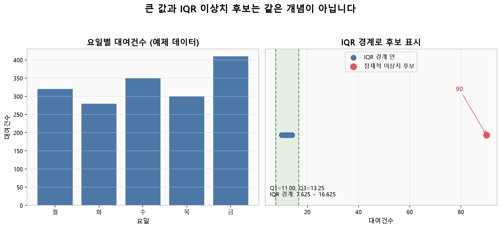
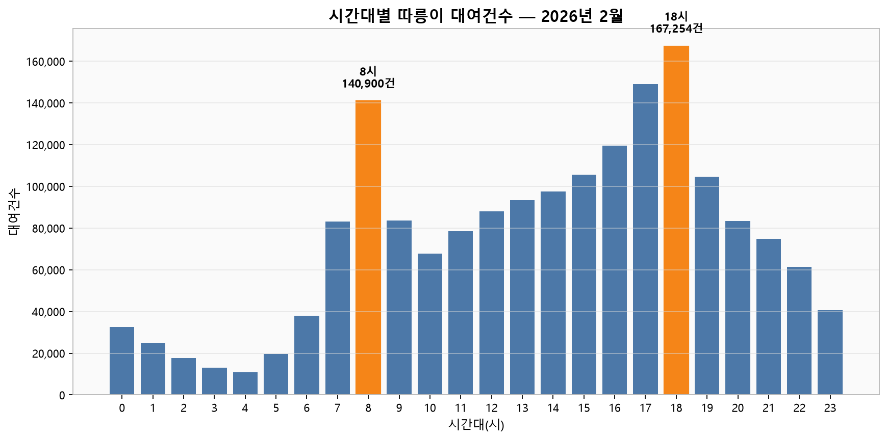
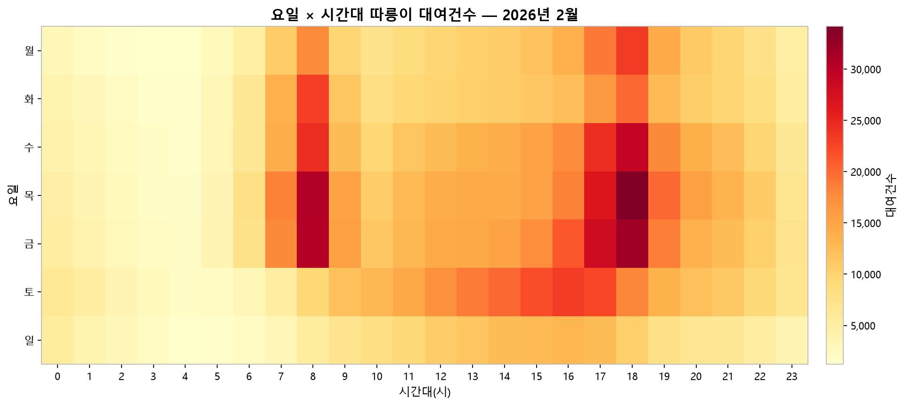
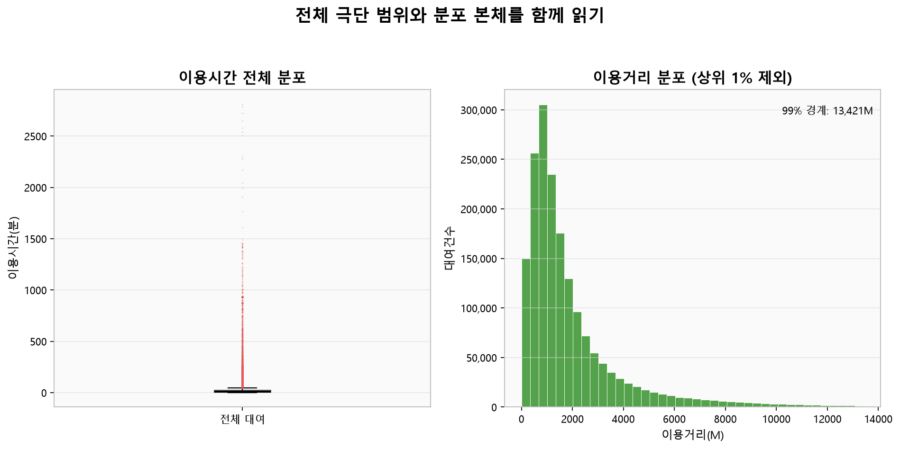
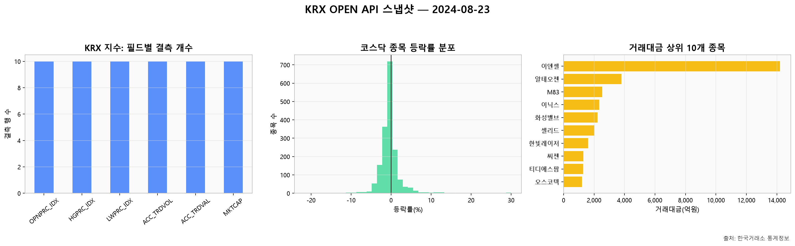

# 1주차 — EDA/시각화 + API 실습

## 이 장을 공부하기 전에

권장 선수 지식은 많지 않습니다. 파이썬에서 변수에 값을 저장하고 함수를 호출하는 법 정도면 시작할 수 있습니다. pandas가 처음이라면 `example.ipynb`의 Part 1을 위에서부터 천천히 실행해 보면 도움이 됩니다. 각 셀의 출력이 왜 그렇게 나오는지 말로 설명해 본 뒤 본문으로 돌아오면 흐름을 이해하기가 한결 쉬워집니다.

> **먼저 알아둘 두 용어**
>
> - **결측치(missing value)**는 원래 기록되어야 할 값이 수집·입력·결합 과정에서 기록되지 않은 상태입니다. pandas에서는 주로 `NaN`으로 표시합니다.
> - **이상치(outlier)**는 같은 변수의 다른 관측값과 비교했을 때 유난히 멀리 떨어진 값입니다. 입력 오류일 수도 있고 실제로 드문 정상 사례일 수도 있으므로, 이상치와 오류를 같은 뜻으로 사용하지 않습니다.

이 장을 마치면 다음 내용을 직접 해 볼 수 있게 됩니다.

- 행과 열, 자료형, 결측 비율, 요약 통계를 순서대로 확인합니다.
- 결측치를 단순히 채우기 전에 발생 원인을 가설로 세웁니다.
- IQR로 **잠재적 이상치 후보**를 찾고, 삭제 여부는 업무 맥락과 함께 판단합니다.
- 날짜·시간 같은 원본 값에서 파생변수를 만들고 그 결과를 다시 검증합니다.
- 질문에 맞는 그래프를 고르고, 관찰·해석·한계를 구분해 적습니다.
- KRX 지수·코스닥 API를 직접 호출하고, 인증키를 노출하지 않은 채 원본·CSV·메타데이터를 관리합니다.

## `notion.md`와 `example.ipynb` 함께 읽는 법

이 문서는 개념과 판단 기준을 설명하고, `example.ipynb`는 같은 개념을 직접 실행해 확인하는 실습 공간입니다. 노트북 전체를 먼저 실행하기보다 아래 순서를 작은 단위로 반복하면 두 파일을 자연스럽게 오가며 학습할 수 있습니다.

| 순서 | `notion.md`에서 할 일 | `example.ipynb`에서 할 일 | 확인할 흔적 |
|---|---|---|---|
| 1 | 단계의 질문과 개념을 읽습니다. | 대응하는 Part의 코드 셀을 찾되 아직 실행하지 않습니다. | 입력 데이터와 출력 모양을 먼저 예상합니다. |
| 2 | 본문의 축약 코드를 읽고 빈칸 없이 설명해 봅니다. | 같은 코드를 위에서부터 실행합니다. | 행 수, 자료형, 비율, 그래프 축이 예상과 같은지 확인합니다. |
| 3 | 본문의 대표 출력과 자신의 출력을 비교합니다. | 값이 다르면 파일 경로·버전·실행 순서를 확인합니다. | 차이가 생긴 이유를 셀 아래 Markdown으로 기록합니다. |
| 4 | 관찰 질문에 한 문장으로 답합니다. | 필요하면 집계 기준이나 그래프를 조금 바꾸어 다시 실행합니다. | 관찰·해석·한계를 구분해 기록합니다. |

매 실습은 **실행 전 예상 → 노트북 실행 → 출력 비교 → 본문 질문 답하기** 순서로 진행합니다. `example.ipynb`에는 실행 결과가 저장되어 있지 않으므로, 본문의 출력 블록은 로컬 데이터와 실제 API 호출로 검증한 대표값입니다. 직접 실행한 출력이 학습 기록의 기준이며, 기준일·원본 버전·라이브러리 버전에 따른 차이는 원인과 함께 기록합니다.

> 노트북 대응표: 판다스·결측·IQR은 Part 1, 따릉이 EDA 1~6단계는 Part 2, KRX API는 Part 3과 연결됩니다.

## 이번 주 학습 지도

처음부터 모든 절과 그래프를 이해하려고 하지 않아도 됩니다. 처음 학습할 때는 `✅ 기본 학습`만 따라가고, 익숙해진 뒤 궁금한 단계로 돌아오면 됩니다.

| 단계 | 예상 시간 | `notion.md`에서 읽을 정확한 범위 | `example.ipynb`에서 실행할 정확한 범위 | 마쳐도 되는 지점 |
|---|---:|---|---|---|
| ✅ 기본 학습 | 약 70~100분 | `파이썬과 판다스를 왜 사용합니까?`, `결측치와 이상치 — 정의부터 판단까지`의 정의와 작은 예제 출력, `EDA, 단계별로 따라가기`의 1~3단계에 저장된 따릉이 출력과 설명, `KRX 정보데이터시스템 API 실습`의 `API란 무엇입니까?`, `과제 안내`의 `✅ 기본 시도` | `example.ipynb` Part 1의 첫 import 셀을 실행한 뒤 `1-1. DataFrame 만들기`, `1-2. 열 선택하기`, `1-5. 요약 통계`, `1-8. 결측치란 무엇인가`, `1-9. 이상치란 무엇인가`만 실행합니다. 따릉이 Part 2는 실행하지 않고 본문의 저장된 결과를 읽습니다. 이어서 `assignment_baseline.ipynb`의 `1. 데이터 수집과 로딩` 첫 코드 셀을 실행해 KRX 키·캐시 상태 또는 연습용 예시 데이터 분기를 확인하고, 맨 아래 `이번 주 학습 기록`의 네 줄을 채웁니다. | 작은 예제에서 결측치와 IQR 경계 밖의 이상치 후보를 한 번 확인하고, KRX 데이터 모드 또는 오류를 적은 뒤 질문·시도·관찰 또는 오류·다음 행동을 한 줄씩 기록하면 마쳐도 됩니다. |
| 🧩 도전 학습 | 약 45~75분 | `EDA, 단계별로 따라가기`의 1~3단계 또는 `KRX 정보데이터시스템 API 실습`의 `두 API는 서로 다른 표를 반환합니다`부터 `실제 출력으로 데이터 계약 검증하기`까지 가운데 하나만 고릅니다. 과제에서는 필요할 때만 `🧩 문제 분해`를 읽습니다. | `example.ipynb`의 `Part 2. 따릉이 대여이력 EDA` 1~3단계를 실제 데이터로 실행하거나, `Part 3. KRX 정보데이터시스템 API 실습`의 `2. 두 엔드포인트와 분석 단위`부터 `4. 공식 필드명을 읽기 쉬운 이름으로 바꾸기`까지 실행합니다. 둘을 모두 실행하지 않아도 됩니다. | 따릉이의 구조·결측·이상치 후보 가운데 하나를 확인하거나, KRX 수집·계약 검증을 한 번 확인한 뒤 근거 한 가지를 기록하면 멈춰도 됩니다. |
| 🌱 확장 학습 | 약 30분 이상 | `EDA, 단계별로 따라가기`의 4~6단계와 `인사이트를 정리하는 법`, `KRX 정보데이터시스템 API 실습`의 `실제 출력으로 데이터 계약 검증하기` 아래 `그림 — KRX 결측과 코스닥 시장 단면 EDA`, 과제의 `🌱 선택 탐색`, `🌱 선택 이해 점검과 작은 실습`, `선택 실습` 가운데 관심 있는 범위를 고릅니다. | `example.ipynb`의 `Part 2. 따릉이 대여이력 EDA` 4~6단계와 인사이트 정리 또는 `Part 3. KRX 정보데이터시스템 API 실습`의 `5. 첫 EDA — 결측, 등락률, 거래대금`을 실행합니다. | 따릉이 그래프나 KRX 그래프 가운데 하나를 더 탐색하고, 새로 생긴 질문과 분석의 한계를 한 문장씩 남기면 충분합니다. |

`✅ 기본 학습`은 약 40~50분씩 두 번으로 나누어 진행해도 됩니다. 위 시간은 끝내야 하는 할당량이 아니라 학습 길잡이입니다. 데이터 다운로드, 패키지 설치, API 승인 대기, 오류 해결에 걸리는 시간은 예상 시간에 포함하지 않습니다.

> **첫 행동:** `01주차/example.ipynb`를 열고 Part 1의 첫 코드 셀(`import pandas as pd` 등)을 실행한 다음 `1-1. DataFrame 만들기`를 실행합니다. 요일 5개가 담긴 작은 표가 보이면 다음 기본 셀로 이동합니다.

### 막혔을 때 먼저 확인합니다

따릉이 실제 데이터 셀은 현재 작업 폴더가 `01주차`일 때 `../dataset/...` 상대경로를 올바르게 찾습니다. KRX 과제 셀은 현재 위치의 상위 폴더를 따라가며 `01주차/krx_api.py`가 있는 프로젝트 루트를 찾습니다. 다음 셀로 두 기준을 먼저 확인할 수 있습니다.

```python
from pathlib import Path
import pandas as pd

start = Path.cwd().resolve()
root = next((p for p in [start, *start.parents] if (p / '01주차' / 'krx_api.py').exists()), None)
print('현재 작업 폴더:', start)
print('프로젝트 루트:', root)

if root is not None:
    bike_path = root / 'dataset/open/extracted/따릉이 공공데이터/03_대여이력/서울특별시 공공자전거 대여이력 정보_2602.csv'
    print('따릉이 파일:', bike_path, bike_path.is_file())
    if bike_path.is_file():
        print('열 이름:', pd.read_csv(bike_path, encoding='cp949', nrows=0).columns.tolist())
```

- `프로젝트 루트: None`이면 저장소 바깥에서 커널을 시작한 상태입니다. `README.md`와 `01주차`가 함께 있는 프로젝트 안에서 노트북을 다시 엽니다.
- 따릉이 파일이 없거나 열 이름이 `대여일시`, `이용시간(분)`, `이용거리(M)`, `생년`, `성별`, `이용자종류`와 다르면 Part 2 실행을 멈춥니다. 기본 학습에서는 본문의 저장된 결과를 읽는 것으로 대신할 수 있습니다.
- 다운로드 페이지가 느리거나 열리지 않으면 반복해서 새로고침하지 않고 본문의 저장된 결과로 기본 학습을 이어가며, 페이지 상태와 다시 확인할 시점을 기록합니다.
- KRX 과제의 첫 셀은 `raw`, `DATA_MODE`, `collection_issue`를 만듭니다. 뒤 셀에서 `NameError`가 나면 이 셀부터 다시 실행합니다. `[수집 보류]`나 빈 응답이 나오면 키를 출력하거나 반복 호출하지 않고 `DATA_MODE`와 오류 문구를 기록합니다.
- 본문의 대표 행 수와 값이 다르더라도 다른 파일 버전이나 거래일을 사용했다면 정상일 수 있습니다. 파일명·기준일·출력 크기를 함께 적어 비교합니다.

해결하지 못해도 아래 네 줄을 남기면 이번 주 기본 기록을 마칠 수 있습니다.

```text
질문:
실행 또는 실행 시도:
관찰한 결과 또는 오류:
다음 행동:
```

## 시작하며 — 왜 데이터 리터러시인가

데이터는 이미 어디에나 있습니다. 데이터를 갖고 있는 것만큼, 그 안에서 좋은 질문을 찾고 근거를 바탕으로 판단하는 일도 중요합니다. 이 스터디에서는 화려한 모델을 서둘러 만드는 것보다, **데이터를 마주했을 때 무엇부터 살펴보고, 무엇을 더 확인하며, 어떤 근거로 결론을 내리는지**를 차근차근 익힙니다.

8주 동안 EDA → 회귀 → 트리/랜덤포레스트 → 분류 → 군집 → 공간분석 → 자유 프로젝트 순으로 이어집니다. 오늘은 그 출발점, 데이터를 "보는 법"입니다.

## 데이터 분석은 어떤 과정으로 진행됩니까?

1. **문제 정의** — 무엇을 알고 싶은지 정합니다.
2. **데이터 수집** — 어디서, 어떻게 데이터를 가져올지 정합니다. *(오늘 KRX API 파트)*
3. **데이터 탐색(EDA)** — 데이터를 살펴보고 특징·문제를 찾습니다. *(오늘 따릉이 파트)*
4. **전처리** — 결측치/이상치 처리, 변수 가공
5. **모델링** — 회귀/트리/분류/군집 등 *(2~6주차)*
6. **해석과 공유** — 결과를 설명 가능한 언어로 전달합니다. *(매주 발표)*

오늘은 3번(EDA)에 집중합니다. 2~7주차에서도 본격적인 모델링 전에 EDA로 데이터를 먼저 점검하므로, 오늘 익힌 순서를 계속 활용합니다.

실제 분석은 위 단계를 한 번씩 통과하고 끝나는 일직선 과정이 아닙니다. EDA 중 컬럼의 뜻이 불명확하면 데이터 수집 단계로 돌아가고, 모델의 잔차에서 새로운 패턴을 발견하면 다시 EDA와 전처리로 돌아갑니다. 중요한 것은 단계 이름을 외우는 것이 아니라, **현재 내 판단이 어떤 근거에 기대고 있는지 기록하는 것**입니다.

> **학습 단계:** ✅ 기본 학습은 여기서 시작합니다. 먼저 Part 1의 작은 표를 실행하고 결측치와 이상치 후보의 뜻을 자신의 말로 설명해 봅니다.

## 파이썬과 판다스를 왜 사용합니까?

- **파이썬**: 데이터 분석에서 가장 널리 쓰이는 언어. 문법이 단순해서 "생각한 걸 코드로 옮기는 속도"가 빠릅니다.
- **pandas**: 표(엑셀 같은 행/열 구조) 형태의 데이터를 다루는 라이브러리. 핵심 자료구조 두 가지만 알면 시작할 수 있습니다.
  - `DataFrame` — 표 전체 (행 × 열)
  - `Series` — 표의 한 열
- `example.ipynb` 앞부분에서 5행으로 구성된 간단한 예제 표로 pandas 기본 문법(열 선택, 조건으로 걸러내기, 정렬, 그룹별 집계, 간단한 그래프)을 먼저 손에 익히고, 그다음 실제 따릉이 데이터로 넘어갑니다. 판다스나 파이썬이 처음이라면 이 부분부터 천천히 살펴보면 이후 실습이 한결 수월해집니다.

## 결측치와 이상치 — 정의부터 판단까지

이번 주 핵심 개념 두 가지는 실제 데이터에 바로 적용하기 전에, 노트북 Part 1의 간단한 예제 데이터로 먼저 원리를 확인합니다.

### 결측치는 "왜 없는가"가 핵심입니다.

결측치는 **관측하거나 입력해야 할 값이 기록되지 않은 상태**입니다. pandas는 `None`, `pd.NA`, `NaN` 등을 결측치로 인식하며, `isna()`로 찾을 수 있습니다. 반면 `0`은 값이 0이라고 기록된 것이므로 결측치가 아닙니다. 빈 문자열(`''`), `-`, `9999`처럼 비어 있음을 대신하는 표기는 데이터에 따라 결측을 뜻할 수 있지만, pandas가 자동으로 결측치로 인식하지 않을 수 있습니다. 따라서 데이터 명세와 원본을 확인한 뒤 필요한 표기를 `NaN`으로 통일하면 분석 과정에서 혼동을 줄일 수 있습니다.

결측치는 여러 수집 과정에서 발생합니다.

- 설문 응답이나 입력 항목을 건너뜁니다.
- 센서 고장, 통신 장애, 저장 실패로 측정값이 남지 않습니다.
- 두 표를 결합할 때 서로 대응하는 키를 찾지 못합니다.
- 질문이 적용되지 않아 의도적으로 값을 비워 둡니다.
- 수집 시스템이 `-`나 특정 숫자를 '값 없음'의 표기로 사용합니다.

이러한 **발생 경로**를 확인한 다음, 결측 여부가 다른 변수나 관측되지 않은 실제 값과 어떤 관계인지 판단합니다. 5명의 응답으로 만든 예제 설문 데이터를 보면 같은 결측치라도 성격이 다를 수 있습니다.

- **그냥 깜빡한 경우라고 가정한 상황** (예: 나이 응답 누락) — 다른 정보나 실제 나이와 무관하게 빠졌다면 무작위 결측에 가깝습니다. 그래도 평균·중앙값 대치는 분포의 퍼짐과 변수 사이의 관계를 약하게 만들 수 있으므로, 자동으로 채워도 된다는 뜻은 아닙니다.
- **응답하지 않은 사실 자체가 정보인 경우** (예: 소득이 아주 높은 사람일수록 답을 피함) — 결측 여부가 관측되지 않은 실제 값과 관련됩니다. 이유를 모르고 평균으로 채우면 '고소득자일 가능성'이라는 신호를 지워버릴 수 있습니다.

먼저 `isna()`로 열별 결측 개수와 비율을 함께 확인합니다. 개수는 영향을 받는 행의 규모를, 비율은 크기가 다른 열이나 집단을 비교할 기준을 보여 줍니다.

```python
survey = pd.DataFrame({
    '이름': ['A', 'B', 'C', 'D', 'E'],
    '나이': [25, 31, None, 40, 29],
    '소득': [3000, None, 4200, None, 3500],
})

missing_summary = pd.DataFrame({
    '결측 개수': survey.isna().sum(),
    '결측 비율': survey.isna().mean(),
})
print(missing_summary)
```

대표 출력은 다음과 같습니다.

```text
    결측 개수  결측 비율
이름       0     0.0
나이       1     0.2
소득       2     0.4
```

이 표는 어디가 비어 있는지는 보여 주지만 왜 비었는지는 알려 주지 않습니다. 전체 비율과 집단별 결측 비율을 비교한 뒤, 설문 방식이나 수집 시스템 같은 원본 정보까지 살펴보면 결측 원인에 대한 가설을 세울 수 있습니다.

결측 원인은 흔히 다음 세 범주로 생각합니다.

| 구분 | 쉬운 설명 | 대응할 때의 핵심 |
|---|---|---|
| 완전 무작위 결측(MCAR) | 결측 여부가 다른 값과도, 빠진 실제 값과도 관련 없음 | 삭제·단순 대치가 비교적 덜 위험하지만 표본 수와 불확실성을 확인 |
| 조건부 무작위 결측(MAR) | 관측된 다른 변수로 결측 패턴을 어느 정도 설명 가능 | 관련 변수를 함께 사용해 대치하거나 결측 표시 변수를 고려 |
| 비무작위 결측(MNAR) | 빠진 실제 값 자체가 결측 여부와 관련 | 도메인 조사와 민감도 분석 없이 단순 대치하면 편향 위험이 큼 |

데이터만 보고 세 유형을 확정할 수 있는 경우는 드뭅니다. 설문 방식, 가입 절차, 수집 시스템 같은 메타데이터와 현업 지식이 필요합니다. 따라서 결측 개수를 세는 데서 한 걸음 더 나아가, **"어떤 집단에서, 어떤 과정 때문에 없을까"라는 검증 가능한 가설**을 세워 봅니다. 이 판단 기준은 노트북 Part 2의 따릉이 `성별` 결측에도 적용합니다.

결측치를 처리할 때는 다음 순서를 참고하면 판단 근거를 정리하기 쉽습니다.

1. 원본이나 수집 시스템에서 값을 복구할 수 있으면 먼저 바로잡습니다.
2. '해당 없음'처럼 의미가 있는 결측은 별도 범주나 결측 표시 변수로 보존할지 검토합니다.
3. 행을 제외한다면 제외 전후의 표본 수와 집단 구성이 어떻게 달라지는지 확인합니다.
4. 값을 대치한다면 분석 목적에 맞는 근거를 밝히고, 예측에서는 학습 데이터로만 대치 기준을 계산합니다.
5. 어떤 방법을 선택하든 처리 전후의 분포와 결론을 비교하고 대상·기준·개수를 기록합니다.

> **노트북 연결:** `example.ipynb` Part 1의 “1-8. 결측치란 무엇인가”에서 `isna()`, `sum()`, `mean()`을 실행합니다. 이어서 Part 2에서 전체 결측률과 이용자종류별 `성별` 결측률을 비교합니다.

### 이상치는 곧 오류라는 뜻이 아닙니다.

이상치는 **같은 변수의 다른 관측값과 비교했을 때 분포에서 유난히 멀리 떨어진 값**입니다. 단위 오입력, 센서 고장, 중복·지연 기록처럼 고쳐야 할 오류일 수도 있고, 장시간 대여처럼 드물지만 실제로 일어난 사례일 수도 있습니다. 서로 다른 이용자 집단이나 운영 조건이 섞이면 한 집단에서는 자연스러운 값이 전체 분포에서는 이상치 후보로 보일 수도 있습니다.

이상치 후보는 한 가지 규칙에만 의존하지 않고 다음 순서로 확인합니다.

1. 음수 거리나 미래의 생년처럼 업무 정의상 불가능한 값인지 검사합니다.
2. 최솟값·최댓값·분위수와 히스토그램·boxplot으로 분포를 확인합니다.
3. 이용자 유형, 시간대 등 의미 있는 집단별로 분포를 다시 비교합니다.
4. IQR 같은 통계 규칙으로 검토할 후보를 표시합니다.

#### IQR(사분위범위)로 이상치 후보를 찾을 수 있습니다.

감으로 "이 값 이상해 보인다"고 판단할 수도 있지만, 자주 쓰는 정량적 기준이 **IQR 방법**입니다.

1. Q1(하위 25% 지점)과 Q3(상위 25% 지점, 즉 하위 75% 지점)을 구합니다.
2. `IQR = Q3 − Q1`
3. `Q1 − 1.5×IQR`보다 작거나 `Q3 + 1.5×IQR`보다 큰 값을 잠재적 이상치 후보로 표시합니다.

**평균이 아니라 분위수를 기준으로 삼기 때문에, 극단값 한두 개가 기준 자체를 크게 흔들지 않는다**는 게 이 방법의 장점입니다. 하지만 IQR 경계는 데이터 오류 판정선이 아닙니다. 오른쪽 꼬리가 긴 이용시간처럼 원래 비대칭인 분포에서는 정상적인 긴 이용도 많이 표시될 수 있고, 표본이 매우 작거나 여러 집단이 섞인 데이터에서도 기준이 불안정할 수 있습니다.

일반적인 boxplot에서 상자의 아래·위 끝은 Q1·Q3이고, 수염은 보통 IQR 경계 **안쪽에 있는 가장 먼 관측값**까지 뻗습니다. 수염 밖의 점은 삭제 대상이 아니라 조사할 후보입니다.

후보를 발견하면 원본 기록과 단위·수집 과정을 먼저 확인합니다. 오류이고 원본 값을 알 수 있으면 수정하며, 복구할 수 없으면 결측 처리 여부를 검토합니다. 실제로 가능한 희귀값이면 그대로 두거나 변환·강건한 분석 방법을 고려합니다. 삭제하거나 상한을 적용할 때는 기준과 대상 개수를 밝히고, 처리 전후에 결론이 달라지는지 비교합니다.

노트북 Part 1-9의 핵심 계산만 떼어 실행해 봅니다.

```python
rental_counts = pd.Series([10, 12, 11, 13, 12, 14, 11, 90])

q1 = rental_counts.quantile(0.25)
q3 = rental_counts.quantile(0.75)
iqr = q3 - q1
lower = q1 - 1.5 * iqr
upper = q3 + 1.5 * iqr

print(f'Q1={q1}, Q3={q3}, IQR={iqr}')
print(f'IQR 탐색 경계: {lower} ~ {upper}')
candidate_mask = (rental_counts < lower) | (rental_counts > upper)
print('IQR 경계 밖 후보:', rental_counts[candidate_mask].tolist())
```

현재 코드의 대표 출력은 다음과 같습니다.

```text
Q1=11.0, Q3=13.25, IQR=2.25
IQR 탐색 경계: 7.625 ~ 16.625
IQR 경계 밖 후보: [90]
```

`90`이 경계 밖이라는 사실과 `90`이 오류라는 판단은 서로 다릅니다. 실행 전에 어느 값이 후보가 될지 예상하고, 실행 후에는 이 값이 실제 업무에서 가능한지 확인하기 위해 어떤 정보가 필요한지 답해 봅니다.



> **그림 — 예제 데이터의 막대와 IQR 후보 비교**
>
> - 노트북 연결: `example.ipynb` Part 1의 "1-7. 그래프 그리기"와 "1-9. 이상치란 무엇인가"를 실행하고 위 그림과 비교합니다.
> - 그림 읽기 질문: 막대에서 가장 큰 값이라는 사실만으로 이상치라고 부를 수 있는지, IQR 계산이 추가로 제공하는 근거는 무엇입니까?
> - 캡션: 예제 대여건수에서 분위수 기반 IQR 경계를 벗어난 값 90을 확인하는 과정입니다.

## 오늘 다룰 데이터 — 따릉이 대여이력

이 장에서는 서울시 공공자전거 따릉이의 2026년 2월 개별 대여 기록을 사용합니다. 대여시각, 이용시간, 이용거리, 이용자의 생년·성별 등이 담겨 있습니다. 개별 대여 단위 기록이라 결측치와 이상치가 실제로 섞여 있어 EDA 연습에 좋습니다.

### 데이터 준비와 접근 경로

[서울 열린데이터광장의 따릉이 대여이력 페이지](https://data.seoul.go.kr/dataList/OA-15182/A/1/datasetView.do)에서 월별·연도별 원본 파일을 내려받을 수 있습니다. 이 장과 `example.ipynb`는 파일 목록의 `서울특별시 공공자전거 대여이력 정보_2602.csv`를 사용합니다. 파일을 `dataset/open/extracted/따릉이 공공데이터/03_대여이력/`에 두고, 출처 URL·다운로드 날짜·파일 버전을 함께 기록하면 나중에 같은 분석을 재현하기가 쉽습니다.

주식 데이터는 파일을 배포받는 대신, 아래의 **KRX 정보데이터시스템 API 실습**에서 공식 API를 호출해 직접 수집합니다. 인증키 발급, 서비스 활용 신청, 수집 명령은 해당 절에 순서대로 안내되어 있습니다.

### 분석 단위와 범위를 먼저 고정하기

- **한 행의 단위**: 한 번의 대여 기록입니다. 같은 사람이 여러 번 대여했을 수 있으므로 행 수는 이용자 수가 아닙니다.
- **관측 기간**: 2026년 2월 한 달입니다. 여기서 본 시간대 패턴을 다른 계절·연도까지 곧바로 일반화할 수 없습니다.
- **관측 연구의 한계**: 그래프는 함께 변하는 패턴을 보여주지만 원인을 증명하지 않습니다. 예를 들어 8시 대여가 많다는 사실은 통근 이용이라는 가설과 잘 맞지만, 이용 목적 변수가 없으므로 확정할 수는 없습니다.
- **재현 정보**: 원본 출처, 다운로드 날짜, 파일 버전, 라이선스, 전처리 이력을 함께 남겨야 같은 결과를 다시 만들 수 있습니다. 실습에 사용한 로컬 파일의 출처와 버전도 분석 기록에 포함합니다.

## EDA, 단계별로 따라가기

`example.ipynb`의 Part 2와 같은 순서입니다. 노트북을 실행하면서 아래 설명과 결과를 같이 맞춰 봅니다.

### 1단계 — 구조 파악
`shape`로 몇 행/몇 열인지, `dtypes`로 컬럼 타입이 기대한 대로인지, `head()`로 실제 값 몇 개를 눈으로 확인합니다. 이 실습 파일은 `cp949` 인코딩이라 `utf-8`로 읽으면 오류가 납니다. 공공데이터의 인코딩은 파일마다 다를 수 있으므로, 새 파일을 읽을 때는 배포 문서나 실제 파일을 확인해 알맞은 인코딩을 선택합니다.
→ 결과는 1,795,860행, 6개 컬럼입니다. `이용시간(분)`은 정수, `이용거리(M)`와 결측치가 있는 `생년`은 실수, 나머지는 문자열입니다.

노트북 Part 2의 첫 세 코드 셀은 다음처럼 연결됩니다. 큰 파일이므로 필요한 열만 읽는 `usecols`가 메모리 사용량을 줄여 줍니다.

```python
cols = ['대여일시', '이용시간(분)', '이용거리(M)', '생년', '성별', '이용자종류']
df = pd.read_csv(
    '../dataset/open/extracted/따릉이 공공데이터/03_대여이력/서울특별시 공공자전거 대여이력 정보_2602.csv',
    encoding='cp949',
    usecols=cols,
)

print(df.shape)
print(df.dtypes)
df.head()
```

현재 로컬 파일의 대표 출력은 다음과 같습니다. `생년`은 결측치 때문에 정수형이 아닌 `float64`로 읽힐 수 있다는 점도 확인합니다.

```text
(1795860, 6)
대여일시        object
이용시간(분)     int64
이용거리(M)    float64
생년          float64
성별           object
이용자종류       object
dtype: object
```

> 📷 **스크린샷 플레이스홀더 — 데이터 구조를 확인하는 첫 화면**
>
> - 캡처 출처: `example.ipynb` Part 2 "1단계 — 데이터 불러오기 & 구조 파악"의 `df.shape`, `df.dtypes`, `df.head()` 출력 셀입니다.
> - 화면에 포함할 내용: `(1795860, 6)`, 여섯 열의 자료형, 첫 5행을 한 화면에 담습니다. 개인 식별 가능 정보가 새로 추가되었다면 개인정보 보호를 위해 해당 부분을 가린 뒤 캡처합니다.
> - 학습자 관찰 질문: 숫자로 분석할 열과 문자열·날짜로 변환할 열은 각각 무엇입니까?
> - 권장 캡션/대체 텍스트: "2026년 2월 따릉이 대여이력의 크기, 자료형, 첫 5행을 순서대로 점검한 화면"

### 2단계 — 결측치 확인
컬럼별 결측 비율을 봅니다. 이번 데이터는 `생년` 약 6%, `성별` 약 25%가 비어 있습니다.
→ `이용자종류`(내국인/비회원/외국인)별로 나눠보면 성별 결측률이 그룹마다 크게 다릅니다. 이는 완전 무작위 누락이라기보다 이용자 유형별 수집 절차 차이에서 생긴 구조적 결측일 가능성을 시사합니다. 다만 이 표만으로 원인을 확정하기는 어려우므로 데이터 명세나 가입 절차 문서를 함께 확인합니다.

전체 비율과 그룹별 비율은 다음 두 줄을 연달아 실행해 비교합니다.

```python
print(df.isna().mean())
print(df.groupby('이용자종류')['성별'].apply(lambda s: s.isna().mean()))
```

```text
# 핵심 출력(반올림)
생년    약 0.06
성별    약 0.25

# 이용자종류별 성별 결측률은 서로 크게 다르게 나타남
```

대표 출력은 숫자를 외우기 위한 답안이라기보다, 자신의 실행 결과와 비교하는 참고값입니다. 직접 실행한 뒤 전체 결측률이 어떤 이용자 유형의 구성비에 크게 영향을 받는지 천천히 살펴봅니다.

> 📷 **스크린샷 플레이스홀더 — 전체 결측률과 그룹별 결측률 비교**
>
> - 캡처 출처: `example.ipynb` Part 2 "2단계 — 결측치 확인"의 `df.isna().mean()`과 `groupby(...).apply(...)` 출력 셀입니다.
> - 화면에 포함할 내용: 전체 열별 결측률과 이용자종류별 `성별` 결측률을 함께 보여 줍니다.
> - 학습자 관찰 질문: 전체 평균만 보았을 때 감춰지는 그룹 차이는 무엇이며, MCAR로 단정할 수 없는 이유는 무엇입니까?
> - 권장 캡션/대체 텍스트: "성별 결측이 이용자종류에 따라 다르게 나타나는 구조적 결측 점검 결과"

### 3단계 — 이상치 확인
`이용시간(분)`, `이용거리(M)`의 `describe()`를 보면 평균은 20분·2km 정도지만 최댓값은 2,813분(약 47시간), 93km에 달합니다. IQR 공식을 그대로 적용하면 이용시간의 위쪽 경계(upper fence)는 약 47.5분인데, 전체의 약 10.9%가 이 경계를 넘습니다. 0분·0M 이용 비율도 각각 2.5%, 3.9% 정도 존재합니다.
→ 여기서 47.5분은 '정상/비정상'을 가르는 기준이 아니라 이 표본의 IQR 규칙으로 얻은 탐색용 경계입니다. 전체의 10.9%가 표시된다는 사실은 분포가 비대칭이거나 서로 다른 이용 유형이 섞였을 가능성도 보여 줍니다. 이 값들을 먼저 검토 후보로 두고, "왜 이런 값이 나왔을까"를 살펴봅니다(거치대 오류로 즉시 반납했습니까? 장시간 실제 이용입니까? 반납 처리가 지연되었습니까?). 삭제나 상한 처리를 고려한다면 처리 전후에 결론이 얼마나 달라지는지도 함께 비교합니다.

노트북에서는 같은 IQR 공식을 실제 열에 다시 적용합니다.

```python
q1 = df['이용시간(분)'].quantile(0.25)
q3 = df['이용시간(분)'].quantile(0.75)
upper = q3 + 1.5 * (q3 - q1)

print(f'이용시간 IQR 탐색 상한: {upper:.1f}분')
print('IQR 상한 밖 후보 비율:', (df['이용시간(분)'] > upper).mean())
print('이용시간 0분 비율:', (df['이용시간(분)'] == 0).mean())
print('이용거리 0M 비율:', (df['이용거리(M)'] == 0).mean())
```

```text
이용시간 IQR 탐색 상한: 47.5분
IQR 상한 밖 후보 비율: 약 0.109
이용시간 0분 비율: 약 0.025
이용거리 0M 비율: 약 0.039
```

> **학습 단계:** 🌱 확장 학습은 여기서 시작할 수 있습니다. 기본 학습을 마쳤다면 파생변수와 여러 그래프로 탐색 범위를 조금씩 넓힙니다.

### 4단계 — 파생변수 만들기
`대여일시`에서 날짜·시간대·요일을 뽑아내고, `생년`으로 대여 연도와 출생 연도의 차이를 계산합니다. 원본에 없던 컬럼을 새로 만드는 것을 **파생변수**라고 부릅니다. 이런 파생변수가 있어야 "시간대별로 다릅니까?", "요일별로 다릅니까?" 같은 질문에 답할 수 있습니다. 단, 생년만으로 만든 값은 생일이 지났는지 알 수 없는 **대략적인 연령**이지 정확한 만 나이는 아닙니다.

```python
dt = pd.to_datetime(df['대여일시'])
df['날짜'] = dt.dt.date
df['연도'] = dt.dt.year
df['시간대'] = dt.dt.hour
df['요일'] = dt.dt.day_name()
df['나이'] = df['연도'] - df['생년']
df[['날짜', '시간대', '요일', '나이']].head()
```

```text
# 출력 형태(첫 행의 실제 값은 원본 정렬에 따라 확인)
         날짜  시간대    요일    나이
0  2026-02-01    0  Sunday  24.0
...
```

실행 전에는 원본 `대여일시` 한 값을 골라 날짜·시간대·요일을 손으로 예상합니다. 실행 후 첫 행과 비교하고, `나이`가 정확한 만 나이가 아닌 이유를 본문 질문에 답합니다.

### 5단계 — 파생변수도 다시 점검
`나이`를 계산해서 `describe()`를 보면 최솟값이 음수, 최댓값이 2,000살에 가깝게 나옵니다. 계산식은 올바르더라도 원본 `생년`에 입력 오류가 섞여 있을 수 있다는 뜻입니다. 이 사례를 통해 **파생변수도 만든 뒤에 값의 범위와 이상치 후보를 다시 점검하는 과정이 필요함**을 확인할 수 있습니다.

### 6단계 — 시각화로 질문에 답하기
아래는 노트북에 실제로 담긴 그래프와, 그 그래프가 답하려는 질문입니다.

| 그래프 종류 | 질문 | 확인한 결과(예시) |
|---|---|---|
| 막대그래프 (이용자종류) | 이용자 구성은 어떻게 됩니까? | 내국인이 압도적 다수, 외국인은 소수 |
| 막대그래프 (시간대별) | 출퇴근 시간대에 몰립니까? | 8시·18시 전후로 뚜렷한 피크 |
| 꺾은선그래프 (날짜별) | 한 달 동안 이용량이 변합니까? | 월 초반보다 후반부로 갈수록 증가 추세 |
| 히트맵 (요일 × 시간대) | 평일과 주말 패턴이 다릅니까? | 평일은 출퇴근 피크가 뚜렷, 주말은 오후에 완만히 분산 |
| Boxplot (이용시간) | 이상치가 얼마나 극단적입니까? | 대부분 20분 이내, 소수가 수백~수천 분까지 벌어짐 |
| 히스토그램 (이용거리) | 분포의 모양은 어떻습니까? | 오른쪽으로 긴 꼬리(long tail) 분포 |

표의 마지막 열은 이번 실습 데이터에서 관찰한 예시이지 모든 시기에도 성립하는 법칙은 아닙니다. 또한 히스토그램에서 상위 1%를 제외했다면 제목·주석에 그 사실과 기준을 함께 적어 두는 것이 좋습니다. 이렇게 하면 독자가 제외 범위를 알고 그래프를 정확하게 해석할 수 있습니다.

시간대별 집계와 그래프는 노트북의 두 단계를 한 덩어리로 읽으면 이해하기 쉽습니다.

```python
hourly = df.groupby('시간대').size()

fig, ax = plt.subplots(figsize=(8, 4))
hourly.plot(kind='bar', ax=ax)
ax.set_xlabel('시간대(시)')
ax.set_ylabel('대여건수')
ax.set_title('시간대별 대여건수')
plt.show()
```



> **그림 — 시간대별 대여건수의 두 피크**
>
> - 노트북 연결: `example.ipynb` Part 2 "그래프 ② 막대그래프 — 시간대별 이용 패턴"에서 같은 집계를 실행하고 위 그림과 비교합니다.
> - 그림 읽기 질문: 가장 높은 두 시간대는 언제이며, 이것을 통근의 인과효과보다 가설과 일치하는 패턴으로 표현하는 편이 정확한 이유는 무엇입니까?
> - 캡션: 2026년 2월 따릉이 대여가 오전 8시와 오후 6시 전후에 집중된 시간대별 막대그래프입니다.



> **그림 — 요일과 시간대를 함께 보는 히트맵**
>
> - 노트북 연결: `example.ipynb` Part 2 "그래프 ④ 히트맵 — 요일 × 시간대"에서 `pivot_table`, 요일 재정렬, `imshow`를 실행하고 위 그림과 비교합니다.
> - 그림 읽기 질문: 평일의 출퇴근 피크와 주말 오후 분산이 어느 셀에서 대비되며, 단순 시간대 막대보다 추가로 알 수 있는 점은 무엇입니까?
> - 캡션: 요일별·시간대별 따릉이 대여건수를 색 농도로 비교한 7×24 히트맵입니다.



> **그림 — 전체 범위와 본체 분포를 함께 읽기**
>
> - 노트북 연결: `example.ipynb` Part 2 "그래프 ⑤ Boxplot — 이용시간 이상치"와 "그래프 ⑥ 히스토그램 — 이용거리 분포"를 실행하고 위 그림과 비교합니다.
> - 그림 읽기 질문: boxplot은 극단 범위를, 잘린 히스토그램은 분포 본체를 어떻게 다르게 보여 주며 각각 무엇을 감춥니까?
> - 캡션: 장시간 대여의 극단값과 상위 1%를 제외한 이용거리의 오른쪽 꼬리를 서로 다른 그래프로 비교합니다.

### 시각화를 더 정확하게 읽는 방법

- **개수와 비율을 함께 살펴봅니다**: 그룹 크기가 다르면 결측 '개수'와 함께 그룹별 결측 '비율'을 보면 비교가 더 정확해집니다.
- **집계 수준을 일관되게 표시합니다**: 개별 대여 기록과 일별 합계는 서로 다른 질문에 답하므로, 그래프마다 한 점·한 막대의 단위를 적습니다.
- **축과 제외 기준을 알려 줍니다**: 0에서 시작하지 않는 막대축, 잘린 y축, 상위 1% 제외 여부를 표시하면 차이가 과장되거나 축소되어 보이는 일을 줄일 수 있습니다.
- **연관성과 원인을 구분합니다**: "출퇴근 피크와 일치합니다"라는 관찰은 가능하지만, "통근 때문에 증가했습니다"라는 인과 설명에는 이용 목적 등 추가 근거가 필요합니다.
- **질문에 맞는 그래프를 고릅니다**: 먼저 알고 싶은 질문을 적고, 그 질문에 가장 직접적으로 답하는 표현을 선택합니다.

## 인사이트를 정리하는 법

그래프 하나를 읽을 때 아래 네 질문을 차례로 생각해 보면 인사이트를 정리하기가 수월합니다.

1. 무엇이 궁금해서 이 그래프를 그렸습니까?
2. 그래프에서 실제로 무엇을 보았습니까?
3. 그것은 어떤 의미로 해석됩니까? 또는 다음에 더 확인하면 좋은 내용은 무엇입니까?
4. **이 결론의 한계와 확인 방법은 무엇입니까?**

기본 시도에서는 그래프 하나에 네 질문 중 답할 수 있는 내용을 적어 봅니다. 여유가 있을 때만 `🌱 선택 탐색`에서 그래프를 최대 세 개로 늘립니다.

예: "8시와 18시에 대여가 많습니다 → 출퇴근 이용 가설과 일치합니다 → 다만 2월 한 달 집계만으로 이용 목적을 확정할 수 없으므로, 이용 목적 설문이나 대여소 위치·평일/주말 분해로 확인합니다."

## 다음 주 모델링 전에 알아둘 데이터 누수

EDA 자체에는 학습/평가 분할이 필수는 아닙니다. 다만 앞으로 **새 데이터에서의 예측 성능을 평가**할 때는 평가 데이터를 의사결정 과정과 분리해 두는 것이 중요합니다. 평가 데이터의 정보를 이용해 전처리 규칙이나 변수를 정하면 성능이 실제보다 좋아 보일 수 있는데, 이를 데이터 누수(data leakage)라고 합니다.

- 평균·중앙값 대치 값, 스케일링 기준, 이상치 경계는 학습 데이터에서만 계산한 뒤 평가 데이터에 그대로 적용합니다.
- 파생변수는 실제 예측 시점에 알 수 있는 값으로 만듭니다. 정답값이나 이후 시점의 값이 들어가면 미래 정보가 섞일 수 있기 때문입니다.
- 평가 데이터의 정답 분포를 본 뒤 그래프나 변수를 골랐다면 그 평가는 이미 낙관적으로 치우칠 수 있습니다.
- EDA에서 정한 삭제·변환 규칙은 코드와 근거를 기록해 새 데이터에도 동일하게 적용합니다.

## KRX 정보데이터시스템 API 실습

이 실습에서는 승인된 키와 공식 API로 검증한 수집 흐름을 사용합니다. 인증키 값은 코드·노트북 출력·메타데이터에 기록하지 않으며, 환경 변수 이름은 `KRX_API_KEY`, HTTP 요청 헤더 이름은 KRX 명세에 맞게 `AUTH_KEY`로 구분합니다. `.env`와 수집 결과가 저장되는 `dataset/`은 Git에서 제외되어 있습니다.

> **학습 단계:** `example.ipynb` Part 3의 0~1은 API 개념과 승인 절차를 읽는 기본 안내입니다. 실제 키·캐시 상태와 연습용 예시 데이터 전환은 `assignment_baseline.ipynb`의 `1. 데이터 수집과 로딩` 첫 코드 셀에서 확인합니다. Part 3의 2~4 수집·계약 검증은 `🧩 도전 학습`, Part 3의 5 그래프는 `🌱 확장 학습`입니다.

### `notion.md`와 노트북을 번갈아 읽는 순서

| 순서 | 이 문서에서 확인할 내용 | `example.ipynb`에서 할 일 |
|---|---|---|
| 1 | 두 API의 분석 단위 차이를 읽습니다. | Part 3의 엔드포인트 비교표를 확인합니다. |
| 2 | 아래의 요청·검증 코드를 먼저 읽고 예상 행 수를 적습니다. | 기준일 `20240823`으로 두 데이터를 수집합니다. |
| 3 | 대표 실행 결과와 실제 출력을 비교합니다. | 행 수·열·고유키·결측·무거래 종목을 검산합니다. |
| 4 | 0과 결측을 구분하는 이유를 읽습니다. | 세 개의 EDA 그래프에서 근거를 찾습니다. |
| 5 | 기본 완료선과 선택 탐색 범위를 확인합니다. | `assignment_baseline.ipynb`에서 코스닥 단면 EDA를 이어서 작성합니다. |

### API란 무엇입니까?

**API(Application Programming Interface)** 는 "이런 형식으로 요청하면 이런 형식으로 데이터를 주겠다"는 약속입니다. 웹사이트에서 눈으로 데이터를 보는 대신, 프로그램이 데이터를 바로 받아갈 수 있게 정해둔 창구라고 생각하면 됩니다.

- **요청(Request)**: '이 주소로, 이런 조건으로 데이터를 달라'고 보내는 것
- **인증키**: 아무나 무한정 요청하지 못하도록 승인된 사용자임을 증명하는 열쇠입니다. 로컬 환경 변수는 `KRX_API_KEY`, 요청 헤더는 `AUTH_KEY`를 사용합니다.
- **응답(Response)**: 서버가 돌려주는 결과. API마다 형식이 다르며, KRX OPEN API는 JSON과 XML 형식을 제공합니다. 이 실습에서는 JSON을 사용합니다.
- **JSON**: `{"이름": "김민준", "나이": 25}`처럼 키-값 쌍으로 이루어진 텍스트 형식. 파이썬 딕셔너리와 구조가 거의 같아서, `response.json()` 한 줄이면 파이썬 객체로 바로 바뀝니다.

네트워크 요청 전에 노트북 Part 3의 작은 JSON 예제를 먼저 실행합니다.

```python
import json

example_json_text = '{"종목명": "삼성전자", "종가": 71000, "등락률": -0.5}'
parsed = json.loads(example_json_text)
print(type(parsed), parsed)
print('종가만 꺼내기:', parsed['종가'])
```

```text
<class 'dict'> {'종목명': '삼성전자', '종가': 71000, '등락률': -0.5}
종가만 꺼내기: 71000
```

실제 API 응답도 먼저 자료형과 키를 확인한 뒤 DataFrame으로 변환합니다. 키는 코드 문자열에 넣지 않고 `.env` 또는 운영체제 환경 변수에서 읽습니다.

### 두 API는 서로 다른 표를 반환합니다

| 역할 | 공식 API | 엔드포인트 | 요청 한 번의 범위 | 한 행의 분석 단위 | 후보 고유키 |
|---|---|---|---|---|---|
| 본문 실습 | KRX 시리즈 일별시세정보 | `idx/krx_dd_trd` | 요청일의 KRX 지수 전체 | 지수 시리즈 하나 | `BAS_DD + IDX_CLSS + IDX_NM` |
| 과제 입력 | 코스닥 일별매매정보 | `sto/ksq_bydd_trd` | 요청일의 코스닥 종목 전체 | 코스닥 종목 하나 | `BAS_DD + ISU_CD` |

여기서 **일별**은 한 번의 요청이 긴 시계열을 반환한다는 뜻이 아닙니다. 두 API 모두 `basDd=YYYYMMDD` 하나를 받고 그 날짜의 시장 단면을 반환합니다. 여러 날짜가 필요하면 거래일별 응답을 모읍니다. 전체 지수 표와 전체 종목 표를 날짜만으로 조인하면 다대다 결합이 생기므로, 먼저 분석할 지수와 종목을 하나씩 선택한 뒤 결합하면 안전하게 분석 단위를 유지할 수 있습니다.

공식 서비스 목록은 두 API를 별도 서비스로 안내하며 데이터 제공 시작일을 2010년 1월 4일로 명시합니다. 인증키 발급과 각 API의 활용 신청도 별도 승인 단계입니다.

- [KRX OPEN API 서비스 목록](https://openapi.krx.co.kr/contents/OPP/INFO/service/OPPINFO004.cmd)
- [KRX 시리즈 일별시세정보 상세](https://openapi.krx.co.kr/contents/OPP/USES/service/OPPUSES001_S2.cmd?BO_ID=SsgXTEspyJESKvyXZtCU)
- [코스닥 일별매매정보 상세](https://openapi.krx.co.kr/contents/OPP/USES/service/OPPUSES002_S2.cmd?BO_ID=hZjGpkllgCBCWqeTsYFj)

### raw HTTP 요청에서 확인할 것

`01주차/krx_api.py`의 수집기는 아래 요청을 안전장치와 캐시 기능까지 포함해 구현합니다. 키를 출력하지 않고 HTTPS만 사용하며, `timeout`, 상태 코드, JSON 형식과 `OutBlock_1`을 차례로 검증합니다.

```python
import requests
from krx_api import ENDPOINTS, load_api_key

response = requests.get(
    ENDPOINTS['krx_index'].url,
    headers={'AUTH_KEY': load_api_key()},
    params={'basDd': '20240823'},
    timeout=(5, 30),
    allow_redirects=False,
)
response.raise_for_status()
payload = response.json()
rows = payload['OutBlock_1']
print(type(payload), payload.keys())
print('행 수:', len(rows))
print('열:', list(rows[0]))
```

```text
<class 'dict'> dict_keys(['OutBlock_1'])
행 수: 38
열: ['BAS_DD', 'IDX_CLSS', 'IDX_NM', 'CLSPRC_IDX', 'CMPPREVDD_IDX',
      'FLUC_RT', 'OPNPRC_IDX', 'HGPRC_IDX', 'LWPRC_IDX',
      'ACC_TRDVOL', 'ACC_TRDVAL', 'MKTCAP']
```

위 출력은 `example.ipynb`에 저장된 출력이 아니라, 2024년 8월 23일 공식 응답을 직접 호출해 확인한 대표 실행 결과입니다. 인증키와 요청 헤더는 출력에 포함하지 않았습니다.

### 원본·가공본을 한 번만 수집하기

프로젝트 루트에서 다음 명령을 실행합니다. 첫 실행은 API를 호출하고, 같은 명령을 다시 실행하면 기존 캐시를 사용합니다.

```powershell
python "01주차/krx_api.py" --date 20240823
```

```text
[API 수집] KRX 시리즈 일별시세정보: 38행 → dataset/open/extracted/KRX/krx_index_20240823.csv
[API 수집] 코스닥 일별매매정보: 1,752행 → dataset/open/extracted/KRX/kosdaq_stocks_20240823.csv
```

수집기는 아래처럼 원본과 분석용 파일을 분리합니다. 실제 데이터는 KRX 이용 조건을 고려해 저장소에 배포하지 않고 각 학습자의 로컬에만 둡니다.

```text
dataset/
├─ raw/KRX/
│  ├─ krx_index_20240823.json
│  └─ kosdaq_stocks_20240823.json
└─ extracted/KRX/
   ├─ krx_index_20240823.csv
   ├─ krx_index_20240823.metadata.json
   ├─ kosdaq_stocks_20240823.csv
   └─ kosdaq_stocks_20240823.metadata.json
```

메타데이터에는 출처 URL, 요청일, 수집 시각, 행·열, 후보 고유키, 원본 SHA-256만 기록하며 인증키는 기록하지 않습니다.

### 실제 출력으로 데이터 계약 검증하기

노트북 Part 3에서 다음 검산 코드를 실행하기 전에 각 값이 얼마일지 예상해 봅니다.

```python
print('KRX 지수:', krx_index.shape)
print('코스닥 종목:', kosdaq.shape)
print('KRX 지수 고유키 중복:', index_duplicates)
print('코스닥 고유키 중복:', stock_duplicates)
print('KRX 지수 결측 칸:', int(krx_index.isna().sum().sum()))
print('코스닥 결측 칸:', int(kosdaq.isna().sum().sum()))
print('코스닥 무거래 종목:', int(zero_volume.sum()))
print('거래 발생 종목의 OHLC·거래량 규칙 위반:', int(ohlc_violations))
```

```text
KRX 지수: (38, 12)
코스닥 종목: (1752, 15)
KRX 지수 고유키 중복: 0
코스닥 고유키 중복: 0
KRX 지수 결측 칸: 60
코스닥 결측 칸: 0
코스닥 무거래 종목: 83
거래 발생 종목의 OHLC·거래량 규칙 위반: 0
```

이 숫자에서 중요한 학습 포인트는 다음과 같습니다.

- KRX 지수의 결측 60칸은 10개 지수에서 시가·고가·저가·거래량·거래대금·시가총액 여섯 필드가 `-`로 제공된 결과입니다. 지수마다 어떤 필드가 정의되는지 먼저 확인하면 결측을 올바르게 해석할 수 있습니다.
- 코스닥에서는 83개 무거래 종목의 종가는 남아 있지만 시가·고가·저가와 거래량이 0입니다. 전체 행에 `고가 ≥ 종가` 규칙을 바로 적용하면 이 83개도 오류 후보로 분류될 수 있으므로 거래 여부를 먼저 구분합니다.
- `거래량 > 0`인 종목만 분리하면 OHLC·음수 거래량 규칙 위반은 0건입니다. 따라서 0, 결측, 오류 후보를 먼저 구분한 뒤 각 상태에 맞는 처리 방법을 선택합니다.

> 📷 **스크린샷 플레이스홀더 — 실제 API 수집과 검산 출력**
> - 캡처 출처: `example.ipynb` Part 3의 수집 상태 셀과 데이터 계약 검증 셀을 한 화면에 배치합니다.
> - 화면 구성: `38행`, `1,752행`, `결측 60칸`, `무거래 83종목`, `규칙 위반 0건`이 보이게 합니다. 인증키와 요청 헤더는 화면에 포함하지 않습니다.
> - 관찰 질문: HTTP 성공 외에 어떤 검사를 통과하면 이 파일을 분석할 준비가 되었다고 판단할 수 있습니까?
> - 대체 텍스트: 2024년 8월 23일 KRX 지수와 코스닥 API 응답의 행 수, 중복, 결측, 무거래와 OHLC 검산 결과입니다.



> **그림 — KRX 결측과 코스닥 시장 단면 EDA**
>
> - 노트북 연결: `example.ipynb` Part 3 마지막의 세 패널 그래프를 실행하고 위 그림과 비교합니다.
> - 그림 구성: 왼쪽은 KRX 지수 필드별 결측 개수, 가운데는 코스닥 종목 등락률 분포, 오른쪽은 거래대금 상위 10개 종목입니다.
> - 그림 읽기 질문: 결측이 특정 필드에만 반복되는 이유는 무엇이며, 거래대금 상위 종목만으로 시장 전체를 설명할 수 있습니까?
> - 캡션: 2024-08-23 KRX OPEN API 스냅샷입니다. 출처는 한국거래소 통계정보입니다.

### 실행 절차

1. [KRX OPEN API 공식 이용방법](https://openapi.krx.co.kr/contents/OPP/INFO/OPPINFO003.jsp)에 따라 인증키를 발급받습니다.
2. `KRX 시리즈 일별시세정보`와 `코스닥 일별매매정보`를 각각 활용 신청하고 승인 상태를 확인합니다.
3. `.env.example`을 복사한 `.env`에 `KRX_API_KEY`를 설정합니다. 인증키 노출을 막기 위해 실제 값은 `.env`에만 보관하고 Git 커밋에서는 제외합니다.
4. `example.ipynb` Part 3을 실행해 원본 JSON → 스키마 검증 → CSV → 시각화 흐름을 확인합니다.
5. `assignment_baseline.ipynb`를 열어 같은 코스닥 CSV에서 자신의 EDA를 이어서 작성합니다.

공식 이용약관은 인증키당 하루 호출을 10,000회 이하로 제한합니다. 이 실습은 고정 거래일에 두 번만 호출하고 캐시를 재사용합니다. 데이터 이용·표기·재배포 조건은 실행 시점의 [KRX OPEN API 이용약관](https://openapi.krx.co.kr/contents/OPP/INFO/OPPINFO002.jsp)을 확인합니다.

### API 실습 안전·재현 체크리스트

- 인증키 노출을 막기 위해 노트북, Git 커밋, 화면 캡처, 예외 메시지에는 실제 값을 넣지 않고 `.env`에서 불러옵니다.
- HTTPS, 연결·읽기 `timeout`, HTTP 상태와 JSON Content-Type을 확인합니다.
- `OutBlock_1` 누락은 응답 오류, 빈 목록은 주말·휴장일 가능성으로 구분합니다.
- 요청한 `basDd`와 반환된 `BAS_DD`, 필수 열, 후보 고유키 중복을 검사합니다.
- 숫자 필드의 `-`는 결측으로 변환해 실제 값 `0`과 구분합니다.
- 같은 날짜의 원본은 캐시와 SHA-256 메타데이터로 재사용하면 불필요한 반복 호출을 줄일 수 있습니다.
- KRX 데이터가 든 `dataset/`은 로컬 전용으로 유지하고 결과물에 `출처: 한국거래소 통계정보`를 표시합니다.

## 과제 안내

이번 과제의 목적은 정답처럼 보이는 분석을 한 번에 완성하는 것이 아닙니다. **직접 시도한 내용, 막힌 지점, 문제를 더 작게 나눈 과정, 다음에 확인할 행동을 남기는 것**이 더 중요합니다. 실행이 성공하지 않았더라도 오류를 읽고 다음 행동을 정했다면 학습 기록이 됩니다.

과제는 다음 세 단계로 나누어 진행합니다.

| 단계 | 이번 주에 할 일 | 권장 범위 |
|---|---|---|
| ✅ 기본 시도 | 데이터 수집 또는 수집 시도, 한 가지 질문, 표나 그래프 한 개 | 모든 학습자 |
| 🧩 문제 분해 | 결측·무거래·이상치 후보 중 하나를 골라 원인과 확인 순서 기록 | 기본 시도 다음 |
| 🌱 선택 탐색 | 그래프 추가, 다른 거래일 수집, 특정 종목의 시계열 비교 | 시간과 관심이 있을 때 |

베이스라인은 `assignment_baseline.ipynb`입니다. 로컬 CSV가 없으면 승인된 키로 `20240823` 코스닥 데이터를 한 번 수집하고, 있으면 캐시를 불러옵니다. 기본 과제의 한 행은 **2024년 8월 23일 코스닥 종목 하나**입니다.

### ✅ 기본 시도

1. “등락률은 어느 구간에 많이 모입니까?”처럼 질문을 하나 고릅니다.
2. 노트북의 수집 셀과 첫 그래프 셀을 실행합니다.
3. 관찰한 값이나 그래프 모양을 한 문장으로 적습니다.
4. 다음에 확인할 열이나 집단을 하나 적습니다.

API 키가 없거나 서비스 승인이 끝나지 않았다면 임의의 키를 넣거나 반복 호출하지 않습니다. 노트북은 이 경우 **연습용 소규모 예시 데이터**로 실행 흐름을 연습하도록 안내합니다. 다음 네 가지를 기록하면 기본 시도를 완료한 것으로 봅니다.

- 실행한 셀 또는 명령
- 키 미설정, 승인 대기, 네트워크 오류 등 확인한 상태
- 오류 메시지에서 이해한 내용 한 가지
- 키 발급 확인, 활용 승인 확인, 캐시 파일 확인 등 다음 행동 한 가지

예시 데이터에서 얻은 결과는 실제 시장에 대한 결론으로 사용하지 않고, 코드의 동작을 연습한 결과라고 표시합니다. 인증키 값은 오류 기록, 노트북, 화면 캡처에 포함하지 않습니다.

### 🧩 문제 분해

결측·무거래·이상치 후보를 모두 한꺼번에 해결할 필요는 없습니다. 한 가지를 골라 다음 순서로 나눕니다.

1. 개수나 비율을 확인합니다.
2. 어떤 행에서 나타나는지 표본 몇 개를 봅니다.
3. 값 `0`, 기록되지 않은 결측, 업무 규칙 위반 후보를 구분합니다.
4. 원본 정의나 거래 상태에서 추가로 확인할 내용을 적습니다.

`고가 ≥ 시가·종가`, `저가 ≤ 시가·종가`, `거래량 ≥ 0` 같은 논리 규칙은 `거래량 > 0`인 행에 적용합니다. IQR 밖의 등락률이나 큰 거래대금을 곧바로 오류로 삭제하지 않습니다.

> **학습 단계:** 🌱 확장 학습은 여기서 시작합니다. 아래 활동은 기본 완료에 필요하지 않으며, 관심 있는 항목 하나만 골라도 충분합니다.

### 🌱 선택 탐색

- 시각화를 세 개까지 늘리고 각 그래프에서 질문 → 관찰 → 가능한 해석 → 한계를 설명합니다.
- 다른 거래일을 추가 수집한 뒤 특정 `ISU_CD`를 골라 시계열을 만듭니다.
- 주말과 휴장일은 거래일 여부를 먼저 확인하고 관측이 없는 날짜로 구분합니다.

### 이번 주 기본 완료 기준

다음 네 가지가 학습 기록에 있으면 충분합니다.

- 질문 1개
- 실행 또는 실행 시도 1개
- 관찰 결과 또는 오류 기록 1개
- 다음 행동 1개

> **여기까지 하면 이번 주 기록 완료입니다.** 그래프 세 개와 선택 탐색은 기본 기록을 남긴 뒤 이어서 진행합니다.

### 선택 탐색 점검

아래 항목은 기본 완료 기준을 충족한 뒤 분석을 더 확장할 때 확인합니다. 모든 항목을 기본 의무로 완료할 필요는 없습니다.

- 데이터의 한 행이 무엇을 뜻하는지, 기간과 단위를 적었습니까?
- 결측치를 채우거나 행을 지웠다면 대상·기준·개수와 이유를 적었습니까?
- 이상치 처리 전후 결과가 달라지는지 확인했습니까?
- 각 그래프에 제목, 축 이름, 단위, 제외 기준이 있습니까?
- 관찰한 사실과 가능한 해석을 구분하고, 적어도 한 가지 한계를 적었습니까?

## 장 요약

- EDA는 그래프를 많이 만드는 일이 아니라 데이터의 구조와 품질을 확인하고 질문을 좁혀가는 과정입니다.
- 결측치는 비율뿐 아니라 어떤 집단·수집 과정에서 발생했는지도 함께 살펴봅니다. 관측값만으로 원인을 확정하기 어려울 때는 데이터 명세와 수집 과정을 추가로 확인합니다.
- IQR은 극단값 후보를 표시하는 탐색 규칙입니다. 경계 밖이라는 이유만으로 삭제하지 않습니다.
- 파생변수는 새로운 질문을 가능하게 하지만, 원본 오류를 증폭하거나 미래 정보를 섞을 수 있어 만든 뒤 다시 검증하는 과정이 도움이 됩니다.
- 그래프에서 보이는 연관성은 인과관계가 아니며, 분석 단위·기간·제외 기준을 밝혀야 합니다.
- API 작업은 상태 코드와 응답 구조를 검증하고 인증키와 원본 데이터를 안전하게 관리함으로써 재현성을 높일 수 있습니다.

## 다음 주와 연결하기

이번 주 EDA에서 확인한 변수와 패턴은 다음 주에 예측값을 만드는 입력과 가설로 이어집니다. 2주차에는 관찰한 관계를 선형회귀로 표현하고, 보지 않은 기간의 오차로 예측 성능을 확인합니다.

## 🌱 선택 이해 점검과 작은 실습

아래 문제는 기본 기록을 마친 뒤 개념을 더 확인하고 싶을 때 골라 봅니다. 모두 풀 필요는 없습니다.

1. 외국인 이용자의 `성별` 결측률이 매우 높다고 가정합니다. 전체 최빈값으로 채우면 어떤 왜곡이 생길 수 있습니까?
2. 이용시간의 10.9%가 IQR 상한을 넘었습니다. 이 행들을 모두 삭제하기 전에 확인할 사항을 세 가지 적어 봅니다.
3. 상위 1%를 제외한 이용거리 히스토그램과 전체 히스토그램을 나란히 그려 보고, 각 그래프가 잘 보여주는 것과 감추는 것을 한 문장씩 적어 봅니다.
4. `나이 = 대여연도 - 생년`으로 만든 나이에 음수와 2,000에 가까운 값이 나왔습니다. 계산 코드와 원본 데이터는 어떤 순서로 확인하면 좋습니까?
5. API 응답의 HTTP 상태는 200이지만 예상한 데이터 키가 없습니다. 빈 DataFrame으로 저장하기 전에 응답을 더 확인하는 이유와 점검할 항목을 적어 봅니다.
6. 코스닥 전체 1,752행에 OHLC 규칙을 적용하면 83행이 위반으로 보이지만, 거래량이 0인 행을 분리하면 위반이 0건입니다. 이 차이가 생긴 이유와 안전한 검사 순서를 설명해 봅니다.

### 해설 가이드

1. 결측이 특정 이용자 유형의 수집 방식과 연결되어 있다면 최빈값 대치는 존재하지 않던 성별 정보를 만들어 그룹 구성을 왜곡합니다. 결측 자체를 하나의 범주·표시 변수로 둘지, 해당 분석에서 제외할지 목적에 따라 비교합니다.
2. 단위와 정의, 동일 이용 기록의 원본 상태, 그룹별 분포, 실제 가능한 장시간 이용인지, 처리 전후 결론의 민감도 등을 확인합니다. IQR 경계만으로 오류 여부는 알 수 없습니다.
3. 잘린 그래프는 다수 관측값의 모양을 자세히 보여 주지만 꼬리의 규모를 감춥니다. 전체 그래프는 극단값의 범위를 보여 주지만 본체 분포가 눌릴 수 있습니다. 두 그래프 모두 제외 기준과 표본 수를 표시합니다.
4. 먼저 수식과 날짜·생년 자료형을 점검하고, 문제가 없다면 해당 행의 원본 `생년` 값을 확인합니다. 이후 허용 범위를 업무 규칙으로 정하고 원본 수정·결측 처리·제외 중 하나를 근거와 함께 선택합니다.
5. 인증 실패나 호출 제한 메시지가 200 응답 본문에 담겼을 수 있습니다. Content-Type, 응답 본문 일부, 오류 코드, 실제 키, 조회 파라미터를 확인하고 예상 스키마 검증을 통과한 경우에만 저장합니다.
6. 무거래 종목은 종가가 남아 있어도 장중 체결이 없어 시가·고가·저가와 거래량이 0일 수 있습니다. 먼저 `거래량 == 0`을 별도 상태로 표시하고, `거래량 > 0`인 행에 고가·저가·음수 거래량 규칙을 적용한 뒤 원본 정의와 종목 상태를 확인합니다.

## 용어집

| 용어 | 뜻 |
|---|---|
| DataFrame | 행×열로 이루어진 표 전체를 담는 pandas 자료구조 |
| Series | DataFrame의 한 열(컬럼)을 담는 pandas 자료구조 |
| 결측치 (missing value) | 관측하거나 입력해야 할 값이 기록되지 않았거나 사용할 수 없는 상태. `0`과는 다르며, pandas에서는 주로 `NaN`으로 표시 |
| 이상치 (outlier) | 같은 변수의 다른 관측값보다 유난히 멀리 떨어진 값. 오류일 수도 있고 실제로 드문 사례일 수도 있으므로 곧바로 삭제하지 않음 |
| IQR (사분위범위) | Q3−Q1. `Q1−1.5×IQR` ~ `Q3+1.5×IQR` 밖의 잠재적 이상치 후보를 찾는 데 흔히 사용 |
| 파생변수 | 원본 컬럼을 가공해서 새로 만든 컬럼 (예: 생년 → 나이) |
| API | "이렇게 요청하면 이렇게 응답하겠다"는 프로그램 간 데이터 교환 약속 |
| JSON | 키-값 쌍으로 이루어진 텍스트 데이터 형식. 파이썬 딕셔너리와 구조가 유사 |
| 인코딩 (cp949/utf-8) | 텍스트를 컴퓨터가 저장하는 방식. 파일마다 다르며 이 장의 따릉이 CSV는 `cp949` 사용 |
| groupby | 특정 기준으로 데이터를 묶어서 그룹별 통계를 계산하는 pandas 기능 |
| pivot_table | 두 개 이상의 범주 기준으로 표를 재구성하는 pandas 기능 (히트맵 그릴 때 자주 사용) |
| 데이터 누수 | 평가 시점에는 알 수 없는 정보가 학습·전처리·변수 선택에 들어가 성능이 실제보다 좋아 보이는 현상 |
| 분석 단위 | 데이터 한 행이 나타내는 대상이나 사건. 이 장에서는 따릉이 한 번의 대여, KRX 지수 시리즈 하나, 코스닥 종목 하나가 각각 다른 분석 단위입니다. |

## 선택 실습

- 여러 거래일의 코스닥 데이터를 날짜별로 수집하고, 특정 `ISU_CD`를 골라 종목별 시계열을 만듭니다. 주말과 휴장일은 거래일 여부를 확인해 관측이 없는 날짜로 구분합니다.
- 따릉이 데이터의 원본 출처 URL·다운로드 날짜·라이선스·파일 버전을 조사해 분석 기록에 덧붙입니다.
