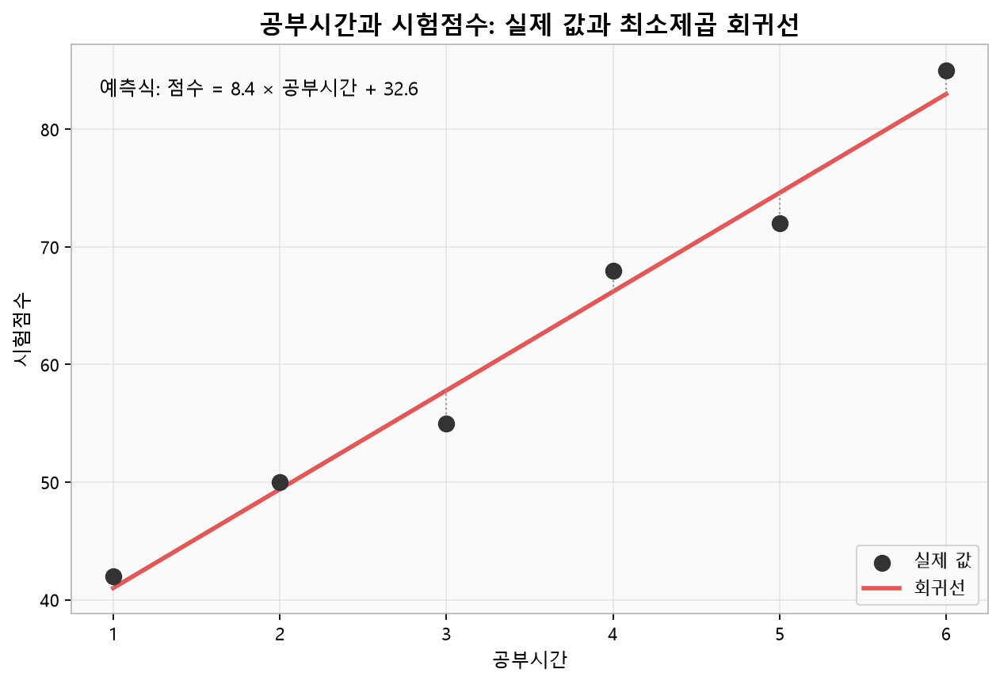
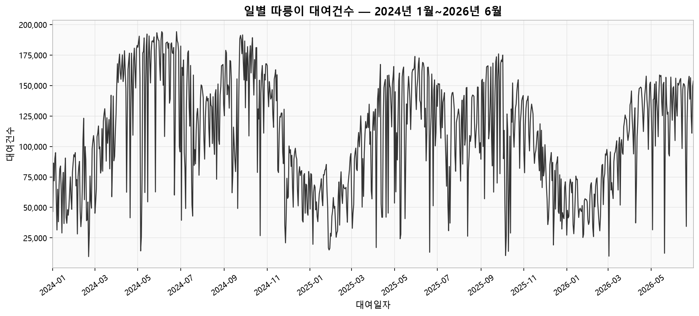
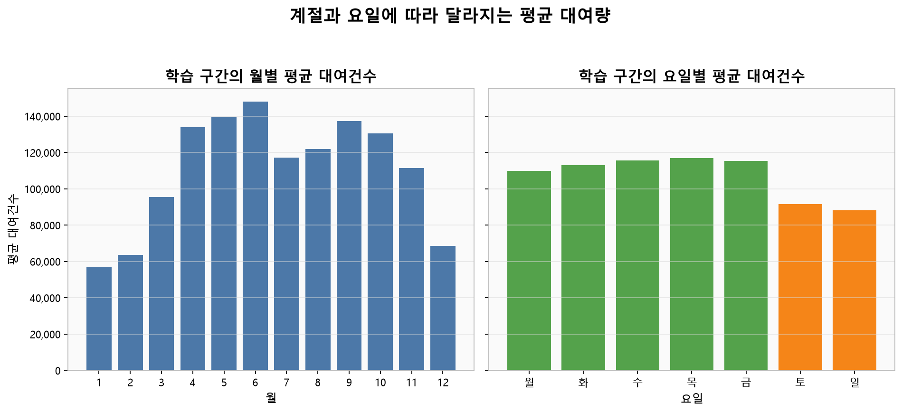
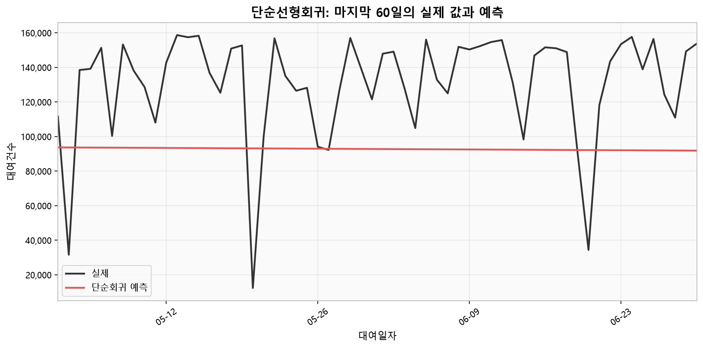
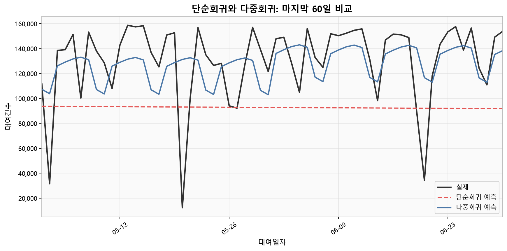
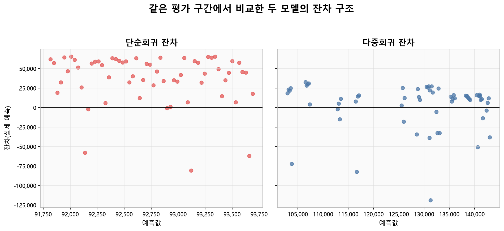

# 2주차 — Linear Regression

## 이 장을 공부하기 전에

1주차에서 살펴본 `DataFrame` 열 선택, 파생변수, 결측·이상치 확인과 그래프 읽기를 바탕으로 시작합니다. 아직 익숙하지 않은 부분이 있다면 1주차 예제의 해당 셀을 다시 확인해도 좋습니다. `example.ipynb`를 실행할 때 **어떤 기간으로 학습했고 어떤 기간으로 평가했는지**를 셀마다 함께 표시해 두면 결과를 해석하기가 쉬워집니다.

이 장을 마치면 다음 내용을 자신의 말로 설명할 수 있게 됩니다.

- 최소제곱 선형회귀가 무엇을 최소화하는지 수식과 잔차로 설명합니다.
- 학습 오차와 보지 않은 데이터의 평가 오차를 구분합니다.
- 시계열을 과거→미래 순서로 나누고, 무작위 분할이 실제 미래 예측을 낙관적으로 보이게 할 수 있는 이유를 설명합니다.
- 더미변수 계수를 기준 범주와 비교해 해석합니다.
- 선형회귀의 주요 가정·한계와 잔차에서 나타나는 위반 신호를 찾습니다.
- 변수 선택과 전처리에서 평가 데이터가 새어 들어가는 데이터 누수를 피합니다.

## `notion.md`와 `example.ipynb` 함께 읽는 법

이 문서는 선형회귀의 개념·해석·평가 원칙을 설명하고, `example.ipynb`는 같은 흐름을 소규모 예제 데이터와 실제 따릉이 데이터로 실행하는 실습 공간입니다. 한 Part를 읽은 직후 같은 Part를 실행하면 모델의 입력, 출력, 해석을 놓치지 않고 연결할 수 있습니다.

| 순서 | `notion.md`에서 할 일 | `example.ipynb`에서 할 일 | 남길 기록 |
|---|---|---|---|
| 1 | Part의 질문, 모델 식, 평가 기간을 읽습니다. | 대응 코드 셀을 찾되 아직 실행하지 않습니다. | 계수 부호, 출력 크기, 그래프 모양을 먼저 예상합니다. |
| 2 | 본문의 축약 코드에서 `X`, `y`, train, test를 확인합니다. | 위쪽 셀부터 실행합니다. | 어떤 행으로 학습하고 어떤 행으로 평가했는지 적습니다. |
| 3 | 본문의 대표 출력과 자신의 출력을 비교합니다. | 값이 다르면 데이터 파일 수·정렬·라이브러리 버전을 확인합니다. | 차이와 원인을 셀 아래 Markdown으로 기록합니다. |
| 4 | 계수와 잔차를 문장으로 해석합니다. | 그래프에서 그 문장을 뒷받침하거나 반박하는 위치를 찾습니다. | 관찰·모델 해석·말할 수 없는 인과 결론을 구분합니다. |

매 실습은 **실행 전 예상 → 노트북 실행 → 출력 비교 → 본문 질문 답하기** 순서로 진행합니다. `example.ipynb`에는 실행 결과가 저장되어 있지 않으므로, 아래 출력 블록은 제공된 데이터와 노트북 코드로 산출한 대표값입니다. 소수점 끝자리는 라이브러리 버전에 따라 조금 달라질 수 있으며, 직접 실행한 결과를 학습 기록에 남깁니다.

> 노트북 대응표: OLS·잔차·RMSE는 Part 1, 데이터 검증은 Part 2, 변수 탐색은 Part 3, 단순회귀는 Part 4, 다중회귀는 Part 5, 잔차 진단은 Part 6과 연결됩니다.

## 이번 주 학습 지도

처음 학습할 때는 선형회귀의 모든 수식과 진단 방법을 한 번에 이해하지 않아도 됩니다. `✅ 기본 학습`에서 작은 예제와 단순회귀를 한 번 실행한 뒤, 필요한 내용만 다음 단계에서 이어서 살펴봅니다.

| 단계 | 예상 시간 | `notion.md`에서 읽을 정확한 범위 | `example.ipynb`에서 실행할 정확한 범위 | 마쳐도 되는 지점 |
|---|---:|---|---|---|
| ✅ 기본 학습 | 약 60~90분 | `이번 주 목표`, `선형회귀란 무엇인가 — 원리부터`의 예측값·계수·절편과 `'오차가 가장 작다'는 게 정확히 무슨 뜻인가`, `오늘 다룰 데이터 — 따릉이 일별 대여건수`, `순서대로 따라가기`의 Part 2와 Part 4, Part 3의 첫 코드·출력, `과제 안내 — 감귤 착과량 예측`의 `✅ 기본 시도` | `Part 1. 선형회귀란 무엇인가 (간단한 예제)`에서 `7시간 공부 예측 점수`가 출력되는 코드까지 실행하고, 바로 다음 `변수가 여러 개라면 어떻게 됩니까? — 다중선형회귀` 소제목부터는 건너뜁니다. 이어서 Part 2, Part 3의 첫 코드 셀, Part 4를 실행합니다. 과제 노트북에서는 첫 데이터 로딩 셀, `1. ✅ 기본 시도 — 내부 학습·검증 데이터 분리`, `2. ✅ 기본 시도 — 변수 선택과 단순선형회귀`를 순서대로 실행하고 맨 아래 `이번 주 학습 기록`을 채웁니다. | 과거와 미래를 나눈 단순선형회귀의 RMSE(예측 오차 크기를 나타내는 값) 또는 오류를 확인하고, 과제의 질문·시도·관찰 또는 오류·다음 행동을 하나씩 기록하면 마쳐도 됩니다. |
| 🧩 도전 학습 | 약 40~70분 | `변수가 여러 개라면 어떻게 됩니까?`, `선형회귀가 잘 작동하려면`, `순서대로 따라가기`의 Part 3 그래프와 Part 5~6, 과제의 `🧩 문제 분해` | Part 1의 `변수가 여러 개라면 어떻게 됩니까? — 다중선형회귀`, Part 3의 월별·요일별 그래프, `Part 5. 다중선형회귀 — 계절/요일까지 반영`, `Part 6. 잔차 분석` | 단순회귀와 다중회귀를 같은 평가 구간에서 비교하고, 잔차에서 보이는 특징 하나를 문장으로 남기면 멈춰도 됩니다. |
| 🌱 확장 학습 | 약 30분 이상 | `모델 평가를 더 엄밀하게 만드는 순서`, 과제의 `🌱 선택 탐색`, `🌱 선택 이해 점검과 작은 실습`, `선택 실습` | `Part 7. 인사이트 정리 (예시)`와 관심 있는 이전 Part의 그래프 재실행 | 기준선이나 변수를 하나 추가해 같은 분할에서 비교하고, 결과의 한계를 기록하면 충분합니다. |

`✅ 기본 학습`은 약 30~45분씩 두 번으로 나누어 진행해도 됩니다. 위 시간은 끝내야 하는 할당량이 아니라 학습 길잡이입니다. 데이터 다운로드, 패키지 설치, 오류 해결에 걸리는 시간은 예상 시간에 포함하지 않습니다.

> **첫 행동:** `02주차/example.ipynb`를 열고 Part 1의 첫 import 셀부터 실행합니다. 공부시간과 시험점수가 6행으로 표시되면 다중회귀 소제목 직전까지 위에서 아래로 실행합니다.

### 막혔을 때 먼저 확인합니다

`example.ipynb`의 따릉이 로딩 셀은 현재 작업 폴더가 `02주차`라고 가정하고 `../dataset/...`에서 파일을 찾습니다. 파일 목록이 비어 있으면 바로 다음 `pd.concat(dfs)`에서 합칠 표가 없다는 오류가 납니다. 다음 셀로 실제 위치와 열 이름을 먼저 확인합니다.

```python
from pathlib import Path
import pandas as pd

start = Path.cwd().resolve()
root = next((p for p in [start, *start.parents] if (p / '02주차' / 'assignment_baseline.ipynb').exists()), None)
print('현재 작업 폴더:', start)
print('프로젝트 루트:', root)

if root is not None:
    bike_dir = root / 'dataset/open/extracted/따릉이 공공데이터/02_이용정보'
    bike_files = sorted(bike_dir.glob('서울특별시 공공자전거 일별 대여건수_*.csv'))
    citrus_path = root / 'dataset/open/extracted/감귤 착과량 예측 AI 경진대회/train.csv'
    print('따릉이 파일 수:', len(bike_files))
    print('감귤 train.csv:', citrus_path.is_file())
    if bike_files:
        print('따릉이 열:', pd.read_csv(bike_files[0], encoding='cp949', nrows=0).columns.tolist())
```

- `example.ipynb`를 실행할 때 현재 작업 폴더가 `02주차`가 아니면 상대경로가 달라집니다. `02주차`에서 Jupyter를 시작하거나 IDE의 노트북 작업 폴더를 `02주차`로 맞춥니다.
- 따릉이 파일 수가 0이거나 `대여일자`, `대여건수`가 없다면 Part 2에서 멈춥니다. 파일명 패턴, 압축 해제 위치, `cp949` 인코딩을 차례로 확인합니다.
- Part 4는 Part 2의 `df`와 Part 3 첫 셀의 `day_index`, `train`, `test`를 사용합니다. `NameError`가 나면 노트북을 위에서부터 실행하되 Part 1의 다중회귀 소제목은 건너뜁니다.
- 감귤 `train.csv`가 없으면 과제 노트북은 연습용 예시 데이터로 전환합니다. 실제 파일에서 열 오류가 나면 `ID`, `수고(m)`, `수관폭1(min)`, `수관폭2(max)`, `수관폭평균`, `착과량(int)`의 표기를 확인합니다. `test.csv`는 기본 시도에 필요하지 않습니다.
- 대표 RMSE나 행 수가 다르면 사용한 파일 수·기간·`DATA_MODE`를 확인합니다. 차이가 나도 원인을 한 줄 적으면 학습 기록이 됩니다.

해결하지 못해도 아래 네 줄을 남기면 이번 주 기본 기록을 마칠 수 있습니다.

```text
질문:
실행 또는 실행 시도:
관찰한 결과 또는 오류:
다음 행동:
```

## 이번 주 목표

1주차에서는 데이터를 관찰하며 질문에 답하는 EDA를 익혔습니다. 이번 주는 그 관찰(요일·계절 패턴)을 실제로 **예측 모델**에 반영해 봅니다.

- 선형회귀가 수식으로 어떻게 작동하는지, 간단한 예제로 원리를 먼저 손에 익힙니다.
- 모든 변수를 바로 넣기보다, 목표값과의 관계와 사용 가능한 시점을 확인한 뒤 고르는 습관을 들입니다.
- 단순선형회귀와 다중선형회귀의 차이를 성능(RMSE) 차이로 직접 확인합니다.
- 시계열 데이터에서 train/test를 왜 시간 순서로 나눠야 하는지 이해합니다.
- 회귀 계수를 숫자로만 보지 않고 "무엇을 의미하는가"로 해석합니다.
- 잔차(residual)를 보고 모델이 무엇을 놓쳤는지 읽습니다.

> **학습 단계:** ✅ 기본 학습은 여기서 시작합니다. Part 1의 작은 예제로 입력, 예측값, 잔차, RMSE를 먼저 확인합니다. 자세한 최소제곱 수식은 지금 이해되지 않아도 되며 `🧩 도전 학습`에서 다시 읽어도 됩니다.

## 선형회귀란 무엇인가 — 원리부터

선형회귀는 입력 변수의 **선형 결합**으로 목표값을 예측하는 방법입니다. 변수가 하나일 때는 데이터 점들을 완벽하게 모두 지나는 선이 아니라, 학습 데이터의 잔차 제곱합이 가장 작아지는 직선을 찾습니다. 예측값은 보통 다음처럼 씁니다.

**ŷ = w·x + b**

- `ŷ`(와이 햇): 모델이 계산한 예측값
- `w` (기울기, **계수**): 다른 조건이 같을 때 x가 1 늘어날 때 예측값이 얼마나 변하는지
- `b` (**절편**): x가 0일 때의 예측값. x=0이 관측 범위나 현실에 없다면 실질적 의미가 없을 수도 있습니다.

`example.ipynb` Part 1에서 공부시간(x) → 시험점수(y)를 예측하는 6개 관측치로 구성한 예제 데이터로 이 원리를 직접 확인합니다. `LinearRegression().fit()`이 하는 일은 결국 **학습 데이터에서 잔차 제곱합이 가장 작은 계수와 절편을 찾는 것**, 즉 보통최소제곱법(OLS)을 적용하는 것입니다.

### '오차가 가장 작다'는 게 정확히 무슨 뜻인가

**잔차(residual)** = 실제값 − 예측값입니다. 절편을 포함한 OLS를 **학습 데이터에 맞춘 경우** 학습 잔차의 합은 수학적으로 0에 가깝습니다. 평가 데이터나 절편이 없는 모델에서는 그렇다고 보장되지 않습니다. 어느 경우든 잔차를 그냥 더하면 양수·음수가 상쇄되므로 오차의 크기를 재는 데 적합하지 않습니다. 그래서 **제곱해서 평균**을 냅니다. 이것이 **MSE(평균제곱오차)**이고, 다시 제곱근을 씌운 것이 **RMSE**입니다. RMSE는 원래 y와 같은 단위라서 해석하기 쉽지만 큰 오차에 특히 민감합니다.

예제 데이터 분석 결과는 기울기 8.4, 절편 32.6, RMSE 약 1.97입니다. "잔차를 제곱해서 평균 낸 뒤 루트 씌운 것"이 `root_mean_squared_error()` 결과와 정확히 일치한다는 점도 직접 계산으로 확인합니다. 다만 이 값은 모델을 맞추는 데 사용한 6개 점에서 다시 계산한 **학습 RMSE**이므로, 새 학생의 점수를 얼마나 잘 맞힐지는 알려 주지 않습니다. 일반화 성능은 모델이 보지 않은 데이터로 평가하면 확인할 수 있습니다.

노트북 Part 1의 핵심 셀을 한 덩어리로 실행하면 계수, 잔차, RMSE가 연결됩니다.

```python
X = toy[['공부시간']]
y = toy['시험점수']

model = LinearRegression().fit(X, y)
pred = model.predict(X)
residuals = y - pred

print('기울기(w):', model.coef_[0])
print('절편(b):', model.intercept_)
print('잔차:', residuals.values)
print('잔차의 합:', residuals.sum().round(6))
print('RMSE:', root_mean_squared_error(y, pred))
```

```text
기울기(w): 8.4
절편(b): 32.6
잔차: [ 1.   0.6 -2.8  1.8 -2.6  2. ]
잔차의 합: 0.0
RMSE: 1.9663841605003503
```

실행 전에는 기울기가 양수인지 음수인지, 첫 번째 학생의 잔차가 양수인지 음수인지 예상합니다. 실행 후에는 `실제값 - 예측값` 정의를 사용해 첫 번째 잔차 `1.0`을 손으로 확인합니다.



> **그림 — 여섯 점과 최소제곱 회귀선**
>
> - 노트북 연결: `example.ipynb` Part 1의 공부시간 산점도와 회귀선 셀을 실행하고 위 그림과 비교합니다.
> - 그림 읽기 질문: 회귀선 위·아래 점의 잔차 부호는 각각 무엇이며, 선이 모든 점을 지나지 않아도 되는 이유는 무엇입니까?
> - 캡션: 공부시간 1~6시간의 실제 시험점수와 OLS가 찾은 기울기 8.4의 회귀선입니다.

노트북은 학습 범위 1~6시간을 넘어선 7시간 점수도 계산합니다. 이는 짧은 거리의 외삽 예시일 뿐, 관계가 범위 밖에서도 계속 직선이라는 보장은 없습니다. 20시간처럼 멀리 외삽하면 100점을 넘는 비현실적인 예측도 가능합니다.

```python
new_pred = model.predict(pd.DataFrame({'공부시간': [7]}))
print('7시간 공부 예측 점수:', new_pred[0])
```

```text
7시간 공부 예측 점수: 91.4
```

이 출력은 정답이 아니라 선형 관계를 범위 밖까지 연장한 결과입니다. 7시간이 학습 범위에서 얼마나 떨어져 있는지와 점수 상한을 함께 고려해 해석합니다.

> **학습 단계:** 🧩 도전 학습은 이 소제목부터 시작합니다. 기본 학습에서는 여기서 멈추고, 다중회귀를 비교하고 싶을 때 다시 돌아옵니다.

### 변수가 여러 개라면 어떻게 됩니까?

**ŷ = w₁x₁ + w₂x₂ + ⋯ + b**

변수마다 계수가 하나씩 붙을 뿐, 원리는 같습니다. 여전히 학습 잔차 제곱합이 가장 작아지는 계수들을 찾습니다. 이것이 오늘 배울 **다중선형회귀**입니다. 여기서 각 계수는 다른 입력 변수를 고정했을 때의 평균적인 차이로 해석합니다.

## 선형회귀가 잘 작동하려면

아래 표는 모델의 결과를 해석할 때 함께 살펴보면 좋은 가정과 한계를 정리한 것입니다.

| 점검 항목 | 뜻 | 위반 신호와 대응 |
|---|---|---|
| 선형성·가법성 | 입력과 평균 목표값의 관계를 계수의 합으로 표현 | 잔차에 곡선·계절 패턴이 남으면 변환, 상호작용, 비선형 모델 검토 |
| 오차의 독립성 | 한 관측의 오차가 다른 관측의 오차와 강하게 연결되지 않음 | 날짜 순 잔차가 이어서 양수·음수이면 시계열 구조나 집단 효과 검토 |
| 등분산성 | 예측값 크기에 따라 오차의 퍼짐이 크게 달라지지 않음 | 잔차가 부채꼴이면 로그 변환, 가중 회귀, 다른 모델·오차 구조 검토 |
| 심한 다중공선성 없음 | 입력 변수들이 거의 같은 정보를 반복하지 않음 | 계수 부호·크기가 표본에 따라 크게 바뀌면 중복 변수 제거·규제 검토 |
| 영향력이 큰 오류 점검 | 제곱 오차는 극단값에 큰 가중치를 줌 | 원본 오류 확인, 강건한 지표·모델과 민감도 비교 |

잔차의 정규성은 계수의 신뢰구간·가설검정 같은 **통계적 추론**에서 특히 중요합니다. 순수 예측만 한다고 자동으로 무시해도 된다는 뜻은 아니지만, 정규성이 깨졌다는 이유 하나만으로 예측 모델을 폐기하지는 않습니다. 반대로 가정이 잘 맞아도 계수는 관측 데이터의 **조건부 연관성**이지 인과효과가 아닙니다.

또한 따릉이 대여건수처럼 0 이상의 개수 자료에 OLS를 쓰면 음수 예측이 나올 수 있고, 평균이 커질수록 분산도 커질 수 있습니다. 이 장에서는 해석하기 쉬운 기준 모델로 선형회귀를 사용합니다. 문제가 실제로 나타나면 로그 변환이나 포아송 계열 모델 등 대안을 검토합니다.

## 오늘 다룰 데이터 — 따릉이 일별 대여건수

2024년 1월부터 2026년 6월까지 총 912일치 서울시 따릉이 일별 대여건수를 사용합니다. 결측·중복 없이 이어지는 시계열이어서 회귀의 기본 흐름을 연습하기에 적합합니다.

- **한 행의 단위**: 하루이며 목표값은 그날의 총 대여건수입니다.
- **예측 상황**: 과거 자료로 이후 날짜의 일별 대여건수를 예측한다고 가정합니다.
- **평가 범위**: 마지막 60일 하나만 평가하므로 그 시기의 날씨·계절에 성능이 크게 좌우될 수 있습니다. 이 결과만으로 사계절 전체 성능을 일반화하지 않습니다.
- **비교 기준**: 모델 성능은 숫자 하나만 보기보다 학습 구간 평균, 직전 값, 전년 같은 날짜 같은 단순 기준 예측과 함께 살펴보면 좋습니다. 확인 문제에서는 이러한 기준선을 직접 구현해 회귀모델과 비교합니다.

### 데이터 준비 및 다운로드

- 본문 실습은 README의 [서울시 따릉이 일별 대여건수](https://data.seoul.go.kr/dataList/OA-14994/A/1/datasetView.do)를 사용합니다. 파일 목록에서 필요한 기간의 `서울특별시 공공자전거 일별 대여건수_*.csv`를 내려받아 `dataset/open/extracted/따릉이 공공데이터/02_이용정보/`에 두면 됩니다. 준비한 파일의 출처·다운로드 날짜·파일 버전도 함께 기록합니다.
- 과제 데이터는 README의 [감귤 착과량](https://dacon.io/competitions/official/236038) 링크에서 직접 확인하고 내려받을 수 있습니다. 기본 시도에는 `train.csv`만 필요하며, 선택 탐색에서 최종 예측을 만들 때 `test.csv`와 `sample_submission.csv`를 사용합니다. 내려받은 파일을 `dataset/open/extracted/감귤 착과량 예측 AI 경진대회/`에 두면 `assignment_baseline.ipynb`의 경로와 연결됩니다.

## 순서대로 따라가기

아래 순서는 `example.ipynb`와 같은 번호입니다.

### Part 2 — 데이터 준비
5개로 나뉜 파일을 하나로 합치고 날짜순으로 정렬합니다. 빠진 날짜와 중복 날짜가 없는지부터 확인합니다. 912일 기간에 실제 행도 912개이므로 이 점검에서는 문제가 없습니다. 전체 그래프를 그려 보면 매년 비슷하게 오르내리는 **계절성**과 겨울마다 크게 떨어지는 **저점**이 보입니다.

파일을 합친 직후에는 모델을 만들기 전에 시간축이 온전한지 검증합니다. 노트북 Part 2에서 다음 셀들을 연이어 실행합니다.

```python
dfs = [pd.read_csv(f, encoding='cp949') for f in files]
df = pd.concat(dfs, ignore_index=True)
df['대여일자'] = pd.to_datetime(df['대여일자'])
df = df.sort_values('대여일자').reset_index(drop=True)

print(df.shape)
print('중복 날짜 수:', df['대여일자'].duplicated().sum())
print('기간:', df['대여일자'].min(), '~', df['대여일자'].max())
print(
    '전체 일수:',
    len(pd.date_range(df['대여일자'].min(), df['대여일자'].max())),
    '/ 실제 행 수:', len(df),
)
```

```text
(912, 2)
중복 날짜 수: 0
기간: 2024-01-01 00:00:00 ~ 2026-06-30 00:00:00
전체 일수: 912 / 실제 행 수: 912
```

행 수와 달력 일수를 비교한 뒤 중복 날짜가 0인지, 시작·종료일이 의도한 범위인지까지 함께 살펴보면 시간축을 더 확실하게 검증할 수 있습니다.



> **그림 — 912일 전체 시계열의 계절성**
>
> - 노트북 연결: `example.ipynb` Part 2의 일별 대여건수 선그래프를 실행하고 위 그림과 비교합니다.
> - 그림 읽기 질문: 반복되는 저점은 어느 계절에 나타나며, 직선 추세 하나가 이 패턴을 놓치는 이유는 무엇입니까?
> - 캡션: 2024년 1월부터 2026년 6월까지 반복되는 계절 변동을 보이는 서울 따릉이 일별 대여건수입니다.

### Part 3 — 변수 선택
회귀에 사용할 변수는 그 의미와 목표값과의 관계를 먼저 살펴보고 고릅니다. 먼저 마지막 60일을 비교 구간으로 남겨 두고, 앞선 852일의 학습 구간에서 `월`별 평균과 `요일`별 평균을 확인합니다. 두 변수를 모델에 포함하고, 전체적인 증가·감소 추세를 보기 위한 `day_index`(며칠째인지)도 추가합니다.

```python
df['day_index'] = (df['대여일자'] - df['대여일자'].min()).dt.days
df['월'] = df['대여일자'].dt.month
df['요일'] = df['대여일자'].dt.day_name()
df['주말여부'] = df['대여일자'].dt.dayofweek.isin([5, 6]).astype(int)

split_idx = len(df) - 60
train, test = df.iloc[:split_idx], df.iloc[split_idx:]
df[['대여일자', 'day_index', '월', '요일', '주말여부']].head()
```

```text
        대여일자  day_index  월       요일  주말여부
0 2024-01-01          0  1   Monday      0
1 2024-01-02          1  1  Tuesday      0
2 2024-01-03          2  1 Wednesday      0
...
```



> **그림 — 월별 평균과 요일별 평균의 대비**
>
> - 노트북 연결: `example.ipynb` Part 3의 월별·요일별 평균 막대그래프를 실행하고 위 그림과 비교합니다.
> - 그림 읽기 질문: 학습 구간에서 월과 요일 중 어느 쪽의 범주 간 차이가 더 커 보입니까?
> - 캡션: 마지막 60일을 제외한 852일 학습 구간에서 월별 계절 차이와 평일·주말 차이를 비교한 막대그래프입니다.

> **평가 결과를 해석할 때 참고할 점**
>
> 이 실습은 마지막 60일을 먼저 보관하고 학습 구간 안에서만 월·요일 평균을 살펴봅니다. 다만 같은 60일에서 두 모델을 비교하고 해석하므로 이 구간은 학습 목적의 validation에 가깝습니다. 독립적인 최종 성능이 필요하다면 학습 구간 안에서 모델을 선택하고, 더 뒤의 test 기간을 마지막에 한 번만 확인합니다.

### Part 4 — 단순선형회귀
`day_index` 하나만으로 예측하는 가장 단순한 모델입니다. 시계열의 시간 순서를 지키기 위해 **과거 구간을 train, 마지막 60일을 test로 나눕니다.** 무작위로 섞으면 미래 데이터가 학습에 들어가고 계절적으로 가까운 날짜가 양쪽에 섞여, 실제 운영 상황보다 예측이 쉬워 보일 수 있습니다.

```python
split_idx = len(df) - 60
train, test = df.iloc[:split_idx], df.iloc[split_idx:]
y_train, y_test = train['대여건수'], test['대여건수']

simple_model = LinearRegression().fit(train[['day_index']], y_train)
pred_simple = simple_model.predict(test[['day_index']])
rmse_simple = root_mean_squared_error(y_test, pred_simple)

print('train:', train.shape, '/ test:', test.shape)
print('단순회귀 RMSE:', rmse_simple)
print('기울기(day_index 계수):', simple_model.coef_[0])
```

```text
train: (852, 6) / test: (60, 6)
단순회귀 RMSE: 48890.9939057652
기울기(day_index 계수): -31.7508598081616
```

실행 전에는 마지막 60일이 어느 날짜 범위인지 확인하고, `train.index.max() < test.index.min()`인지 예상합니다. 실행 후 RMSE를 약 48,891건으로 읽되, 이를 평균 절대오차가 48,891건이라는 MAE 해석과 혼동하지 않도록 구분합니다.

현재 데이터와 노트북 실행 결과는 RMSE **48,891**, 기울기(계수) 약 **-31.8**입니다. 이는 학습 기간에 이 단순한 직선이 포착한 평균 기울기이며, 시간이 하루 흐르면 대여가 원인적으로 31.8건 감소한다는 뜻은 아닙니다. 계절을 넣지 않았기 때문에 시작·종료 시점의 계절 구성과 장기 변화가 계수에 함께 섞일 수 있습니다. 이 모델은 계절과 요일 정보를 사용하지 않아 매년 반복되는 오르내림을 충분히 반영하기 어렵습니다.



> **그림 — 단순회귀가 놓친 마지막 60일의 굴곡**
>
> - 노트북 연결: `example.ipynb` Part 4의 실제 값과 `pred_simple` 비교 그래프를 실행하고 위 그림과 비교합니다.
> - 그림 읽기 질문: 예측선이 실제선의 어떤 굴곡을 따라가지 못하며, 이것이 추세 변수 하나의 어떤 한계를 보여 줍니까?
> - 캡션: 마지막 60일의 실제 대여건수 변동을 거의 따라가지 못하는 `day_index` 단순회귀 예측입니다.

> **학습 단계:** 🧩 도전 학습은 여기서 이어집니다. 기본 학습의 단순회귀와 같은 평가 구간을 사용해 여러 변수를 넣은 모델과 잔차를 비교합니다.

### Part 5 — 다중선형회귀
`월`, `요일`을 더미변수로 바꿔 추가합니다. 범주형 값을 1~12, 1~7 같은 숫자로 그대로 넣으면 월·요일 사이에 일정한 수치 간격과 직선 순서가 있다고 모델이 해석합니다. 여기서는 `pd.get_dummies`로 각각을 0/1 컬럼으로 바꾸고, `drop_first=True`로 하나(1월, 금요일)를 기준값으로 남깁니다. 절편과 모든 범주 더미를 함께 넣으면 더미들의 합이 항상 1이라 서로를 완벽히 설명하는 **더미 변수 함정**이 생깁니다. 하나를 빼면 이 완전한 다중공선성을 피할 수 있지만, 서로 비슷한 다른 입력 변수에서 생기는 일반적인 다중공선성까지 해결되는 것은 아닙니다.

노트북은 날짜에서만 얻는 고정 범주를 train/test에 동일하게 맞추기 위해 전체 데이터에 `get_dummies`를 적용했습니다. 여기에는 목표값을 사용하지 않으므로 직접적인 정답 누수는 아니지만, 일반적인 프로젝트에서는 `OneHotEncoder(handle_unknown='ignore')`와 `Pipeline`을 학습 데이터에만 `fit`해 전처리 경계를 명확히 하는 편이 안전합니다.

결과는 RMSE **29,196**으로, 단순회귀 대비 **40.3% 개선**되었습니다. 주요 계수는 다음과 같습니다.

- 대여건수를 가장 많이 줄이는 요인(금요일 기준): **일요일(-27,466)**, **토요일(-23,939)**
- 대여건수를 가장 많이 늘리는 요인(1월 기준): **6월(+91,648)**, **9월(+82,978)**, **5월(+80,894)**

노트북 Part 5에서는 더미변수 생성부터 평가까지 다음 코드로 이어집니다.

```python
month_dummies = pd.get_dummies(df['월'], prefix='월', drop_first=True)
weekday_dummies = pd.get_dummies(df['요일'], prefix='요일', drop_first=True)
X = pd.concat([df[['day_index']], month_dummies, weekday_dummies], axis=1)
X_train, X_test = X.iloc[:split_idx], X.iloc[split_idx:]

multi_model = LinearRegression().fit(X_train, y_train)
pred_multi = multi_model.predict(X_test)
rmse_multi = root_mean_squared_error(y_test, pred_multi)
coef_series = pd.Series(multi_model.coef_, index=X_train.columns).sort_values()

print('다중회귀 RMSE:', rmse_multi)
print('단순회귀 대비 개선율:', round((1 - rmse_multi / rmse_simple) * 100, 1), '%')
print(coef_series.head())
print(coef_series.tail())
```

```text
다중회귀 RMSE: 약 29196
단순회귀 대비 개선율: 40.3 %

# 정렬된 계수의 대표값(반올림)
요일_일요일   약 -27466
요일_토요일   약 -23939
...
월_5         약 80894
월_9         약 82978
월_6         약 91648
```

출력의 `...`은 노트북의 실제 출력을 생략해 보여 준 표시입니다. 직접 실행한 뒤 `coef_series.head()`와 `tail()`의 열 이름·값을 모두 확인하고, 기준 범주인 1월과 금요일이 출력 열에 나타나지 않는 이유를 설명합니다.

계수는 모델 식에서 다른 입력의 효과를 조정한 뒤 기준 범주와 비교합니다. 예를 들어 `요일_일요일=-27,466`은 선형 시간 추세와 월 효과를 조정했을 때, 금요일 대비 일요일에 모델이 더하는 오프셋이 -27,466건이라는 뜻입니다. 실제 날짜에서는 `day_index`, 월, 요일이 서로 독립적으로 바뀔 수 없으므로 완벽히 같은 조건의 두 날을 관찰한 인과 비교로 해석하기에는 추가 근거가 필요합니다. 또한 변수의 단위가 다르므로 계수 절댓값만으로 중요도를 비교하기보다 각 변수의 단위와 기준 범주를 함께 살펴봅니다.

→ 주말, 특히 일요일에 대여가 적다는 결과는 통근·통학 목적 이용 비중이 높다는 가설과 일치합니다. 봄·가을 월의 양의 계수도 온화한 날씨 가설과 일치합니다. 그러나 월은 기온·강수·일조시간·공휴일 등을 한꺼번에 대신하는 변수이고 관측 데이터만 사용했으므로, 이 계수만으로 이용 목적이나 날씨의 인과효과를 확정할 수 없습니다.



> **그림 — 실제 값과 두 회귀모델의 비교**
>
> - 노트북 연결: `example.ipynb` Part 5의 실제 값·단순회귀·다중회귀 세 선을 실행하고 위 그림과 비교합니다.
> - 그림 읽기 질문: 다중회귀선이 단순회귀선보다 실제 값에 가까워진 구간은 어디이며, 여전히 크게 빗나간 날짜는 무엇을 추가로 조사하게 합니까?
> - 캡션: 월·요일을 추가한 다중회귀가 추세만 사용한 단순회귀보다 마지막 60일의 변동을 더 잘 따라가는 비교 그래프입니다.

### Part 6 — 잔차 분석
Part 1에서 배운 잔차 개념을 실제 데이터에 적용합니다. 잔차가 0 주변에 뚜렷한 구조 없이 흩어지는지는 중요한 점검 기준이지만, 그것만으로 좋은 모델이 보장되지는 않습니다. 단순회귀 잔차와 다중회귀 잔차를 나란히 놓고 비교하면 다중회귀 쪽의 오차가 줄어듭니다. 계절·요일 정보를 반영한 만큼 설명하지 못한 부분이 감소했다는 뜻입니다.

`예측값-잔차` 그래프와 함께 날짜 순 잔차도 그려 봅니다. 며칠 연속 양수 또는 음수가 이어지면 오차가 독립적이지 않은 **자기상관**이 남았을 수 있습니다. 예측값이 커질수록 잔차 폭이 넓어지면 등분산성 위반을 의심합니다. 비가 온 날처럼 특정 조건에서만 큰 오차가 난다면 빠진 변수를 찾아봅니다. 평균 RMSE와 잔차 그래프를 함께 보면 이러한 오차 패턴을 더 자세히 이해할 수 있습니다.

```python
residuals_simple = y_test.values - pred_simple
residuals_multi = y_test.values - pred_multi

fig, axes = plt.subplots(1, 2, figsize=(11, 4), sharey=True)
axes[0].scatter(pred_simple, residuals_simple)
axes[0].axhline(0, color='red')
axes[0].set_title('단순회귀 잔차')
axes[1].scatter(pred_multi, residuals_multi)
axes[1].axhline(0, color='red')
axes[1].set_title('다중회귀 잔차')
plt.show()
```



> **그림 — 단순회귀와 다중회귀의 잔차 구조**
>
> - 노트북 연결: `example.ipynb` Part 6에서 같은 y축을 사용한 두 잔차 산점도를 실행하고 위 그림과 비교합니다.
> - 그림 읽기 질문: 다중회귀에서 퍼짐이 줄었는지, 곡선·부채꼴·한쪽 치우침이 남았는지 각각 확인할 수 있습니까?
> - 캡션: 예측값 대비 잔차 산점도로 비교한 단순회귀와 월·요일 다중회귀의 남은 오차 구조입니다.

### Part 7 — 인사이트 정리
- 추세 변수에 계절·요일 정보를 더하자 RMSE가 48,891에서 29,196으로 낮아졌습니다.
- 이 평가 구간에서는 요일·월 더미가 대여량의 반복 패턴을 설명하는 데 도움을 주었습니다.
- 계수의 부호와 크기는 모델이 포착한 조건부 연관성을 설명하는 단서가 됩니다.
- 다중회귀도 잔차가 완전히 무작위는 아닐 수 있습니다. 공휴일, 날씨(강수/기온) 같은 변수가 더해지면 개선될 여지가 있습니다.

> **학습 단계:** 🌱 확장 학습은 여기서 시작합니다. 여러 검증 구간과 추가 지표는 기본 완료에 필요하지 않으므로 관심 있는 항목부터 살펴봅니다.

## 모델 평가를 더 엄밀하게 만드는 순서

한 번의 마지막 60일 분할은 입문 실습에는 충분하지만, 모델을 선택하고 성능을 보고할 때는 다음 순서가 더 안전합니다.

1. **예측 시점과 평가 기간을 먼저 정의합니다.** 하루 앞 예측인지 60일 장기 예측인지에 따라 검증 방식이 달라집니다.
2. **단순 기준선을 만듭니다.** 학습 평균, 직전 관측값, 7일 전, 365일 전 값을 사용하되, 각각이 실제 예측 시점에 이용 가능한지와 예측 기간이 같은지를 맞춰 비교합니다.
3. **과거→미래 검증을 여러 번 반복합니다.** expanding window나 rolling window, `TimeSeriesSplit`으로 계절별 성능 변동을 봅니다.
4. **전처리와 변수 선택은 각 학습 구간에서만 맞춥니다.** 결측 대치, 스케일링, 인코딩, 이상치 경계가 검증 미래를 보지 않게 합니다.
5. **RMSE와 MAE를 함께 봅니다.** RMSE는 큰 오차를 더 크게 반영하고, MAE는 전형적인 절대 오차 크기를 읽기 쉽습니다.
6. **최종 테스트는 모든 선택을 마친 뒤 확인합니다.** 결과를 보고 변수를 다시 바꾸었다면 그 세트는 모델 선택에 사용된 검증 세트 역할을 하므로, 별도의 최종 평가 자료가 필요합니다.

시간 순 분할을 했더라도 변수 생성 과정에서 미래 정보가 섞일 수 있습니다. 예측 시점 이후의 날씨 실측값, 전체 기간으로 계산한 목표 평균, 미래 대여건수에서 만든 이동평균을 넣으면 실제 운영에서는 얻을 수 없는 정보를 사용하게 됩니다. 대신 예측 시점에 이미 확정된 요일·공휴일 달력처럼 이용 가능한 정보를 선택합니다. 변수마다 **실제 예측 순간에 알 수 있는가**를 확인하면 누수를 예방하는 데 도움이 됩니다.

## 과제 안내 — 감귤 착과량 예측

이번 과제에서는 가장 낮은 RMSE를 만드는 것보다 **첫 모델을 실행해 보고, 오류나 예상 밖 결과를 기록하며, 큰 문제를 작은 질문으로 나누는 과정**을 더 중요하게 봅니다. 실행이 끝까지 성공하지 않아도 시도와 다음 행동이 분명하면 학습 기록이 됩니다.

과제 데이터는 [감귤 착과량](https://dacon.io/competitions/official/236038) 페이지에서 내려받습니다. 베이스라인(`assignment_baseline.ipynb`)은 파일 위치를 먼저 진단하고, 파일이 없을 때는 연습용 소규모 예시 데이터로 최소 실행 흐름을 연습합니다. 예시 데이터의 RMSE나 계수는 실제 감귤 데이터에 대한 결론으로 사용하지 않습니다.

과제는 다음 세 단계로 나누어 진행합니다.

| 단계 | 이번 주에 할 일 | 권장 범위 |
|---|---|---|
| ✅ 기본 시도 | 변수 하나로 학습·검증 분할 → 회귀 학습 → RMSE 확인 | 모든 학습자 |
| 🧩 문제 분해 | 변수 중복, 잔차, 파일 경로나 코드 오류 가운데 하나를 골라 확인 | 기본 시도 다음 |
| 🌱 선택 탐색 | 다중회귀, 추가 변수, 최종 `test.csv` 예측 | 시간과 관심이 있을 때 |

### ✅ 기본 시도

1. “수고 하나로 착과량을 어느 정도 예측할 수 있습니까?”처럼 질문을 하나 정합니다.
2. `train.csv`를 내부 학습·검증 세트로 나눕니다.
3. 단순선형회귀를 한 번 학습하고 검증 RMSE를 출력합니다.
4. 결과 또는 오류를 한 문장으로 적고 다음 행동을 정합니다.

이 데이터는 각 나무가 독립 표본이라는 가정 아래 `train_test_split`으로 무작위 분할합니다. 비교하는 모든 모델은 같은 행 분할과 `random_state`를 사용합니다. 같은 농장·구역의 나무처럼 서로 묶인 표본이라는 정보가 있다면 그룹 단위 분할이 필요합니다.

`train.csv`가 없다면 노트북이 출력한 **확인한 경로와 파일 상태**를 기록합니다. 다운로드 페이지 확인 → 압축 해제 → 정확한 폴더에 `train.csv` 배치 순서로 다음 행동을 정합니다. 노트북은 그동안 연습용 소규모 예시 데이터로 실행 흐름을 이어갑니다. `test.csv`가 없어도 기본 시도에는 지장이 없으며, 선택 탐색의 최종 예측만 건너뜁니다.

### 🧩 문제 분해

다음 가운데 하나만 골라도 충분합니다.

- `수관폭평균`과 두 원측정치가 왜 중복되는지 계산으로 확인합니다.
- 검증 잔차 그래프에서 곡선·부채꼴·극단값 가운데 하나를 찾습니다.
- 파일 경로, 열 이름, 자료형, 모델 입력 모양 중 오류가 난 단계를 확인합니다.

특히 `수관폭평균`은 로컬 데이터 2,207행 모두에서 `(수관폭1 + 수관폭2) / 2`와 정확히 같습니다. 세 변수를 동시에 넣으면 정확한 선형 중복이 생깁니다. `수관폭평균` 하나를 쓰거나 `수관폭1·수관폭2` 두 개를 쓰는 등 중복을 피한 조합을 정합니다.

### 🌱 선택 탐색

- 중복을 피한 여러 변수로 다중회귀를 만들고 같은 검증 행에서 RMSE를 비교합니다.
- 계수와 잔차를 해석합니다.
- 나무별 새순·엽록소 일별 측정치 178개 컬럼 중 일부를 추가해 성능 변화를 비교합니다.
- `test.csv`로 예측하고 `sample_submission.csv`와 같은 구조를 만듭니다. `test.csv`에는 정답이 없으므로 검증 성능 계산에 사용하지 않습니다.

`ID`는 행을 구분하는 식별자이므로 기본 예측 변수에서 제외합니다. 목표값과의 관계를 보고 변수를 고르는 작업도 내부 학습 세트에서 진행하면 검증 정보가 변수 선택에 섞이는 일을 줄일 수 있습니다.

### 이번 주 기본 완료 기준

다음 네 가지가 학습 기록에 있으면 충분합니다.

- 질문 1개
- 실행 또는 실행 시도 1개
- 관찰 결과 또는 오류 기록 1개
- 다음 행동 1개

> **여기까지 하면 이번 주 기록 완료입니다.** 다중회귀, 잔차 그림, 제출 파일 생성은 기본 기록을 남긴 뒤 이어서 진행합니다.

### 선택 탐색 점검

아래 항목은 기본 완료 기준을 충족한 뒤 다중회귀와 잔차 분석을 확장할 때 확인합니다. 모든 항목을 기본 의무로 완료할 필요는 없습니다.

- 내부 검증 세트를 변수 선택 전에 분리하고, 모든 모델에 같은 행을 사용했습니까?
- 학습 평균 같은 기준 모델보다 RMSE가 낮습니까? MAE도 함께 비교했습니까?
- 수관폭의 정확한 중복 변수를 피했습니까?
- 계수를 "다른 변수를 고정했을 때의 연관성"으로 해석했습니까?
- 잔차-예측값 그래프와 잔차 분포에서 곡선·부채꼴·극단값을 확인했습니까?

## 장 요약

- OLS 선형회귀는 학습 데이터의 잔차 제곱합을 최소화하며, 학습 오차가 작다고 새 데이터 성능이 보장되지는 않습니다.
- RMSE는 목표값과 같은 단위지만 큰 오차에 민감합니다. MAE와 단순 기준선을 함께 보면 오차의 성격을 더 잘 이해할 수 있습니다.
- 시계열 예측은 과거로 학습하고 미래로 검증하며, 여러 시점의 rolling/expanding 검증이 한 번의 분할보다 안정적입니다.
- 더미 계수는 생략한 기준 범주 대비 조건부 차입니다. 계수는 연관성을 나타낼 뿐 인과관계를 증명하지 않습니다.
- 잔차의 곡선, 부채꼴, 시간 순 패턴은 비선형성·이분산·자기상관·누락 변수의 신호가 될 수 있습니다.
- 변수 선택·대치·인코딩처럼 데이터에서 규칙을 배우는 단계는 학습 데이터 안에서 수행해 평가 정보가 섞이지 않도록 합니다.

## 다음 주와 연결하기

선형회귀의 잔차에 곡선이나 구간별 패턴이 남는다면 하나의 직선만으로는 관계를 충분히 표현하지 못했을 수 있습니다. 3주차에는 데이터를 조건에 따라 나누어 비선형 관계를 표현하는 Decision Tree를 살펴봅니다.

## 🌱 선택 이해 점검과 작은 실습

아래 문제는 기본 기록을 마친 뒤 개념을 더 확인하고 싶을 때 골라 봅니다. 모두 풀 필요는 없습니다.

1. 절편이 있는 OLS의 학습 잔차 합이 거의 0인 이유와, 테스트 잔차 합까지 0일 필요가 없는 이유를 설명해 봅니다.
2. 따릉이 데이터를 무작위로 나눈 모델의 RMSE가 더 낮게 나왔습니다. 이것만으로 더 좋은 평가 방법이라고 할 수 없는 이유는 무엇입니까?
3. `월_6=+91,648`이라는 계수를 정확히 한 문장으로 해석하고, 말할 수 없는 인과적 결론도 한 가지 적어 봅니다.
4. 감귤 과제에서 `수관폭1`, `수관폭2`, `수관폭평균`을 모두 넣었더니 모델은 실행되었습니다. 계수를 그대로 해석하기 어려운 이유와 대안 변수 조합을 적어 봅니다.
5. 다중회귀의 RMSE가 단순회귀보다 낮지만 날짜 순 잔차가 일주일씩 같은 부호로 이어집니다. 모델이 놓쳤을 가능성이 있는 구조와 다음 점검을 제안해 봅니다.

### 해설 가이드

1. 절편을 포함해 학습 잔차 제곱합을 최소화하면 잔차가 상수항 방향과 직교해 학습 잔차 합이 0이 됩니다. 보지 않은 데이터는 최적화에 사용하지 않았으므로 같은 성질이 보장되지 않습니다.
2. 미래 관측값이 학습에 들어가고 시간적으로 가까운·같은 계절의 행이 양쪽에 섞여 실제 미래 예측보다 쉬워질 수 있습니다. 운영 상황과 같은 과거→미래 분할로 비교하는 편이 적절합니다.
3. 선형 시간 추세와 요일 효과를 조정했을 때, 1월 대비 6월에 모델이 더하는 오프셋이 +91,648건이라는 뜻입니다. 날짜 파생변수들은 독립적으로 바뀌지 않으며, 6월이라는 사실이나 날씨가 그만큼 증가를 **일으켰다**고는 말할 수 없습니다.
4. 평균이 두 폭의 정확한 선형 결합이어서 완전 다중공선성이 생깁니다. 평균 하나만 사용하거나 두 원측정치만 사용하고, 검증 성능과 해석 목적에 따라 선택합니다.
5. 자기상관, 주 단위 패턴, 연속된 날씨·공휴일 효과를 의심합니다. 잔차-날짜 그래프와 시차별 상관을 보고, 지연 변수·날씨·공휴일을 예측 시점 가용성에 맞게 추가한 뒤 시계열 교차검증합니다.

## 용어집

| 용어 | 뜻 |
|---|---|
| 계수 (coefficient, w) | 모델 식에서 다른 입력을 고정할 때 x가 1 늘어나면 예측값이 얼마나 달라지는지를 나타내는 값 |
| 절편 (intercept, b) | 모든 입력이 0일 때의 예측값. 그 조합이 현실적이지 않으면 실질적 해석이 없을 수 있음 |
| 잔차 (residual) | 실제값 − 예측값 |
| MSE (평균제곱오차) | 잔차를 제곱해서 평균 낸 값 |
| RMSE | MSE에 제곱근을 씌운 값. 원래 y와 같은 단위라 해석이 쉬움 |
| 더미변수 (dummy variable) | 범주형 변수를 0/1 숫자 컬럼들로 바꾼 것 (`pd.get_dummies`) |
| drop_first | 더미변수 중 하나를 기준값으로 남기고 나머지만 컬럼으로 만드는 옵션 |
| 다중공선성 (multicollinearity) | 변수들끼리 서로를 설명해버려 계수 해석이 불안정해지는 현상 |
| 외삽 (extrapolation) | 학습 때 본 범위 밖의 값을 예측하는 것 (3주차에서 다시 다룸) |
| train/test split | 학습용/평가용 데이터를 나누는 것. 시간·집단·반복 측정 구조와 실제 예측 상황에 맞춰 분할 방법을 정함 |
| OLS (보통최소제곱법) | 학습 잔차 제곱합이 최소가 되도록 선형회귀 계수를 구하는 방법 |
| MAE (평균절대오차) | 오차의 절댓값을 평균 낸 값. RMSE보다 극단적인 오차의 영향이 작음 |
| 검증 세트 | 변수·모델·설정을 고르는 데 사용하는 보지 않은 데이터. 최종 테스트와 역할이 다름 |
| 데이터 누수 | 실제 예측 시점에는 알 수 없는 평가·미래 정보가 학습 과정에 들어가는 현상 |
| 자기상관 | 시간적으로 가까운 오차들이 서로 비슷한 방향으로 이어지는 현상 |

## 선택 실습

- 학습 구간 평균·직전 값·전년 같은 날짜를 사용하는 단순 기준선을 구현하고, RMSE와 MAE로 회귀모델과 비교합니다.
- 잔차를 날짜 순서로 그려 자기상관을 확인하고, rolling 또는 expanding 방식의 시계열 검증으로 모델 순위가 유지되는지 점검합니다.
- 데이터 출처 URL·라이선스·실행 환경과 라이브러리 버전을 기록해 같은 결과를 재현할 수 있는지 확인합니다.
