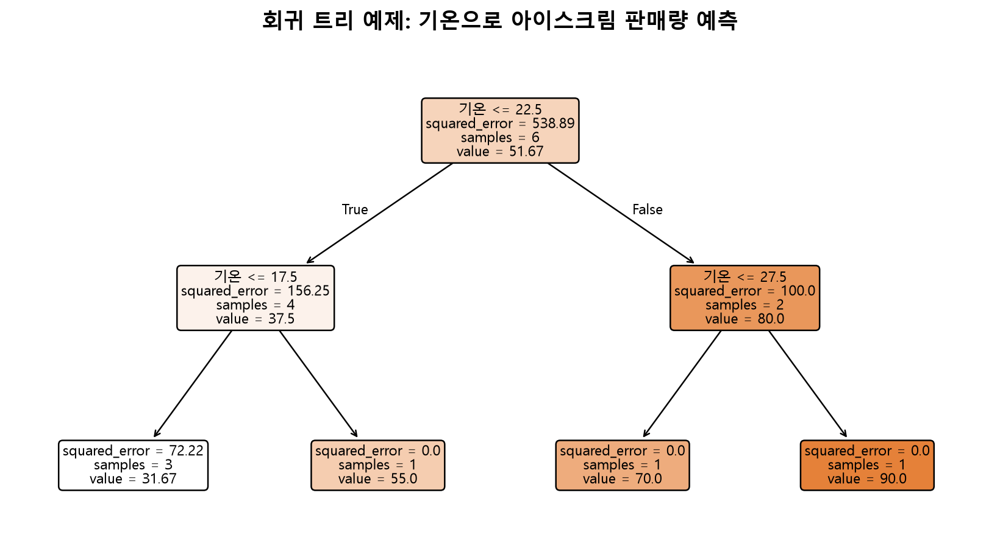
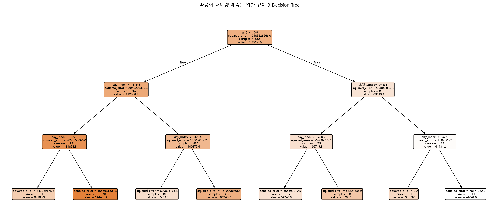
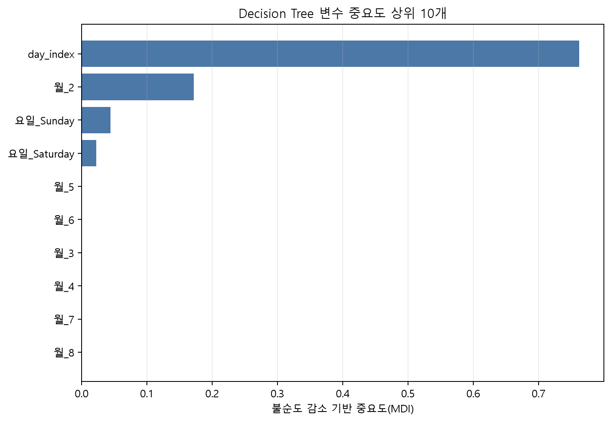
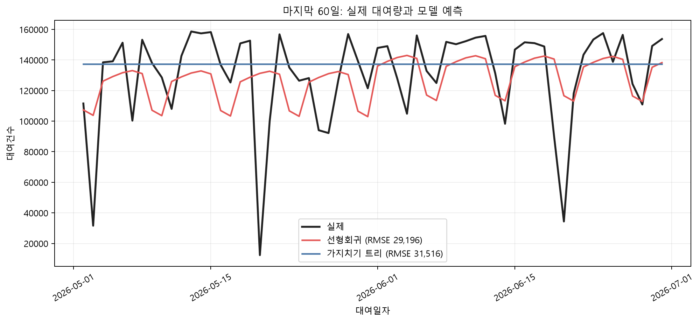

# 3주차 — Decision Tree

## 이번 주 목표

지난주와 같은 데이터와 변수를 사용해 Decision Tree를 학습하고 선형회귀와 같은 기준에서 나란히 비교합니다. 이번 주에는 어느 한 모델의 우위를 미리 정하기보다, **각 모델이 어떤 관계를 잘 표현하며 어디에서 한계가 나타나는지 데이터로 살펴봅니다.**

- 트리가 예측값과 분기 기준을 만드는 원리를 간단한 예제로 이해합니다.
- 과적합을 훈련·검증 RMSE의 차이로 진단합니다.
- 가지치기 하이퍼파라미터를 검증 데이터로 선택하는 이유를 이해합니다.
- 회귀 계수와 트리의 feature importance가 답하는 질문의 차이를 구분합니다.
- 시간 데이터에서 무작위 분할과 테스트 세트 반복 사용이 평가를 낙관적으로 보이게 할 수 있는 이유를 설명합니다.
- 트리의 구조적 한계인 계단형 예측과 외삽 불가를 확인합니다.

## `notion.md`와 `example.ipynb`를 함께 읽는 방법

이 문서는 개념과 판단 기준을 설명하고, `example.ipynb`는 같은 내용을 직접 실행해 확인하는 실험실 역할을 합니다. 한쪽을 끝까지 읽은 뒤 다른 쪽을 여는 방식보다, 아래 순서로 짧게 왕복하면 이해하기 쉽습니다.

| 문서에서 읽을 내용 | 노트북 위치 | 노트북에서 할 일 | 문서로 돌아와 확인할 질문 |
|---|---|---|---|
| 트리의 잎과 분기 | Part 1 — Decision Tree란 무엇인가 | 트리 규칙을 출력하고 그림과 평균을 확인합니다. | 잎의 `value`가 어떤 관측치의 평균인지 설명할 수 있습니까? |
| 과적합 | Part 1 — 조건 없이 학습하면? / Part 4 — 제한 없이 학습 | 제한 없는 트리의 훈련 예측과 RMSE를 확인합니다. | 훈련 오차 0만으로 일반화 성능을 판단하기 어려운 이유는 무엇입니까? |
| 가지치기 | Part 6 — 가지치기로 과적합 줄이기 | 제한 없는 트리와 가지치기 트리의 RMSE를 비교합니다. | 어떤 성능을 포기하고 어떤 성능을 얻었습니까? |
| 변수 중요도 | Part 7 — Feature Importance | 상위 10개 중요도 막대그래프를 확인합니다. | 중요도가 방향이나 인과를 뜻하지 않는 이유는 무엇입니까? |
| 모델 비교와 외삽 | Part 8 — 세 모델 종합 비교 | 표와 시계열 예측 그래프를 확인합니다. | 미래 구간에서 트리 예측이 평평해지는 이유는 무엇입니까? |

> ℹ️ **실행 결과 안내**  
> `example.ipynb`에는 셀 출력이 저장되어 있지 않습니다. 아래 출력 블록은 동일한 노트북 코드로 산출한 참고값이며, RMSE는 정수 단위로 반올림했습니다. 노트북을 직접 실행한 뒤 자신의 출력과 비교해 보면 좋습니다. 데이터나 라이브러리 버전이 달라졌다면 값이 조금 달라질 수 있습니다.

## 이번 주 학습 지도

처음 학습할 때는 트리의 모든 수식과 모델 비교를 한 번에 마칠 필요가 없습니다. `✅ 기본 학습`에서 작은 트리와 제한 없는 트리를 한 번 실행하고, 더 자세한 비교는 다음 단계로 남겨 둡니다.

| 단계 | 예상 시간 | `notion.md`에서 읽을 정확한 범위 | `example.ipynb`에서 실행할 정확한 범위 | 마쳐도 되는 지점 |
|---|---:|---|---|---|
| ✅ 기본 학습 | 약 60~90분 | `먼저 구분할 세 가지 데이터`, `Decision Tree란 무엇입니까? — 원리부터 살펴보기` 중 잎·분기와 `조건 없이 학습하면 어떻게 됩니까?`, `순서대로 따라가기`에서 Part 2의 데이터 재구성과 Part 4, Part 3의 저장된 선형회귀 RMSE, `과제 안내 — 전력사용량 예측`의 `✅ 기본 시도` | `Part 1. Decision Tree란 무엇인가 (간단한 예제)`, `Part 2. 지난주 데이터 재구성`, `Part 4. Decision Tree — 제한 없이 학습`만 실행합니다. `Part 3. 선형회귀 성능 다시 확인 (기준점)`은 실행하지 않고 본문의 저장값만 읽습니다. 과제 노트북에서는 `1. ✅ 기본 시도 — 데이터 불러오기와 조인`의 코드 셀, `5. ✅ 기본 시도 — 변수 선택 및 공통 시각 분할`, `6. ✅ 기본 시도 — 작은 트리 한 번 실행`을 순서대로 실행하고 `8. 이번 주 학습 기록`을 채웁니다. | 작은 예제의 잎 예측값을 확인하고, 제한 없는 트리의 학습·홀드아웃 RMSE(예측 오차 크기) 또는 오류를 기록한 뒤 과제의 질문·시도·관찰 또는 오류·다음 행동을 하나씩 남기면 마쳐도 됩니다. |
| 🧩 도전 학습 | 약 45~70분 | `어디에서 나눕니까? — 오차 감소량`, `순서대로 따라가기`의 Part 3과 Part 5~6, 과제의 `🧩 문제 분해` | 필요하면 `Part 3. 선형회귀 성능 다시 확인 (기준점)`을 실행한 뒤 `Part 5. 트리 시각화`와 `Part 6. 가지치기(pruning)로 과적합 줄이기`를 실행합니다. | 트리 그림의 분기 하나를 읽고, 제한 없는 트리와 가지치기 트리의 학습·홀드아웃 RMSE 차이를 한 문장으로 설명하면 멈춰도 됩니다. |
| 🌱 확장 학습 | 약 30분 이상 | `순서대로 따라가기`의 Part 7~8, `결과가 예상과 다를 때 점검할 내용`, `인사이트를 쓰는 방법`, 과제의 `🌱 선택 탐색`, `🌱 선택 이해 점검`, `선택 실습` | `Part 7. Feature Importance`와 `Part 8. 세 모델 종합 비교` | 중요도나 세 모델 비교에서 질문 하나를 고르고, 관찰과 해석의 한계를 각각 한 문장으로 남기면 충분합니다. |

`✅ 기본 학습`은 약 30~45분씩 두 번으로 나누어 진행해도 됩니다. 위 시간은 끝내야 하는 할당량이 아니라 학습 길잡이입니다. 데이터 다운로드, 패키지 설치, 오류 해결에 걸리는 시간은 예상 시간에 포함하지 않습니다.

> **첫 행동:** `03주차/example.ipynb`를 열고 Part 1의 첫 import 셀부터 실행합니다. 기온을 기준으로 나눈 트리 규칙이 글자로 출력되면 Part 1을 이어서 실행합니다.

### 막혔을 때 먼저 확인합니다

`example.ipynb`의 Part 2는 현재 작업 폴더가 `03주차`라고 가정하고 2주차와 같은 따릉이 파일을 찾습니다. 과제 노트북은 프로젝트 루트를 자동으로 찾은 뒤 전력 데이터의 두 파일을 확인합니다. 다음 셀로 두 경로를 한 번에 점검할 수 있습니다.

```python
from pathlib import Path
import pandas as pd

start = Path.cwd().resolve()
root = next((p for p in [start, *start.parents] if (p / '03주차' / 'assignment_baseline.ipynb').exists()), None)
print('현재 작업 폴더:', start)
print('프로젝트 루트:', root)

if root is not None:
    bike_dir = root / 'dataset/open/extracted/따릉이 공공데이터/02_이용정보'
    bike_files = sorted(bike_dir.glob('서울특별시 공공자전거 일별 대여건수_*.csv'))
    power_dir = root / 'dataset/open/extracted/2023 전력사용량 예측 AI 경진대회'
    print('따릉이 파일 수:', len(bike_files))
    for name in ['train.csv', 'building_info.csv']:
        path = power_dir / name
        print(name, path.is_file(), pd.read_csv(path, nrows=0).columns.tolist() if path.is_file() else '없음')
```

- `example.ipynb`의 현재 작업 폴더가 `03주차`가 아니거나 따릉이 파일 수가 0이면 Part 2의 `pd.concat`에서 멈춥니다. `02_이용정보`의 파일명 패턴과 `대여일자`, `대여건수` 열을 확인합니다.
- 기본 실행 순서는 Part 1 → Part 2 → Part 4입니다. Part 4의 `X_train`, `y_train`은 Part 2에서 만들어지므로 `NameError`가 나면 Part 2를 다시 실행합니다. Part 3은 건너뛰어도 됩니다.
- 전력 과제는 `train.csv`와 `building_info.csv` 중 하나라도 없으면 연습용 예시 데이터로 전환합니다. 실제 파일에서는 두 표의 `건물번호`, train의 `일시`·`기온(C)`·`전력소비량(kWh)`, 건물정보의 `연면적(m2)` 열을 우선 확인합니다.
- 조인 뒤 건물정보가 모두 비어 있거나 모델용 행이 0개라면 `건물번호`의 자료형, `일시`의 `YYYYMMDD HH` 형식, 필수 열 결측을 순서대로 확인합니다. 과제 셀은 `train`·`building` → `df` → `일시_dt` → `X_train` 순서로 실행합니다.
- 대표 RMSE와 다르더라도 실제 파일의 기간이나 `DATA_MODE`가 다를 수 있습니다. 출력 크기와 처음 달라진 셀을 함께 기록합니다.

해결하지 못해도 아래 네 줄을 남기면 이번 주 기본 기록을 마칠 수 있습니다.

```text
질문:
실행 또는 실행 시도:
관찰한 결과 또는 오류:
다음 행동:
```

## 사용할 데이터와 다운로드 위치

- 본문 실습은 2주차와 같은 [서울시 따릉이 일별 대여건수](https://data.seoul.go.kr/dataList/OA-14994/A/1/datasetView.do)를 이어서 사용합니다. 필요한 기간의 `서울특별시 공공자전거 일별 대여건수_*.csv`를 내려받아 `dataset/open/extracted/따릉이 공공데이터/02_이용정보/`에 두면 됩니다. 준비한 파일의 출처·다운로드 날짜·파일 버전도 함께 기록합니다.
- 과제 데이터는 README의 [전력사용량 (건물정보 join + 결측치 처리)](https://dacon.io/competitions/official/236125) 링크에서 직접 확인하고 내려받을 수 있습니다. 내려받은 `train.csv`와 `building_info.csv`를 `dataset/open/extracted/2023 전력사용량 예측 AI 경진대회/`에 두면 `assignment_baseline.ipynb`의 경로와 연결됩니다.

> **학습 단계:** ✅ 기본 학습은 여기서 시작합니다. train, validation, test의 역할을 구분한 뒤 Part 1, Part 2, Part 4에서 작은 트리와 제한 없는 트리를 한 번씩 실행합니다. Part 3의 선형회귀는 본문의 저장값만 읽고, 오차 감소량 수식은 `🧩 도전 학습`에서 다시 확인해도 됩니다.

## 먼저 구분할 세 가지 데이터

모델을 학습하기 전에 데이터의 역할부터 분리합니다.

| 구분 | 용도 | 사용 횟수 |
|---|---|---|
| 학습(train) | 트리의 분기와 잎 예측값을 학습 | 여러 번 |
| 검증(validation) | `max_depth`, `min_samples_leaf` 같은 설정 선택 | 여러 번 |
| 테스트(test) | 모든 선택이 끝난 모델의 최종 성능 추정 | 원칙적으로 한 번 |

검증 점수를 보고 설정을 바꾸면 그 데이터는 모델 선택에 사용되므로, 실질적으로 검증 데이터 역할을 하게 됩니다. 이 장의 `example.ipynb`는 지난주와의 연속성을 위해 **마지막 60일 하나만 따로 떼어** 세 모델을 비교합니다. 미리 정한 세 모델을 한 번 비교하는 학습 실험으로는 유용합니다. 다만 마지막 60일의 결과를 보며 가지치기 값을 조정했다면 그 구간을 `test`보다 **validation**으로 보는 것이 더 정확합니다.

실전에서는 다음처럼 시간순으로 나눕니다.

```text
과거                                      미래
|----------- 학습 -----------|--- 검증 ---|--- 최종 테스트 ---|
          분기 학습             설정 선택       마지막 한 번 평가
```

데이터가 충분하다면 여러 시점에서 `과거로 학습 → 바로 다음 기간으로 검증`을 반복하는 시계열 교차검증(`TimeSeriesSplit`)을 사용합니다. 어느 경우든 미래 관측치로 학습하고 과거를 평가하는 무작위 분할은 실제 미래 예측 상황을 재현하지 못합니다.

## Decision Tree란 무엇입니까? — 원리부터 살펴보기

Decision Tree(의사결정나무)는 '예/아니오' 질문을 반복해 데이터를 점점 비슷한 그룹으로 나누는 방법입니다. 스무고개를 떠올리면 됩니다. "기온이 22.5도 이하입니까?"처럼 한 질문으로 데이터를 두 그룹으로 나누고, 각 그룹을 다시 질문으로 나눕니다. 더 이상 나누지 않는 지점인 **잎(leaf)** 에서는 그 잎에 속한 훈련 데이터의 평균을 회귀 예측값으로 사용합니다.

`example.ipynb` Part 1에서는 다음 소규모 예제 데이터를 사용합니다.

```python
toy = pd.DataFrame({
    '기온': [5, 10, 15, 20, 25, 30],
    '판매량': [20, 35, 40, 55, 70, 90],
})

tree_toy = DecisionTreeRegressor(max_depth=2, random_state=42)
tree_toy.fit(toy[['기온']], toy['판매량'])

print(export_text(tree_toy, feature_names=['기온']))
```

핵심 출력은 다음과 같이 읽습니다.

```text
|--- 기온 <= 22.50
|   |--- 기온 <= 17.50
|   |   |--- value: [31.67]
|   |--- 기온 > 17.50
|   |   |--- value: [55.00]
|--- 기온 > 22.50
|   |--- 기온 <= 27.50
|   |   |--- value: [70.00]
|   |--- 기온 > 27.50
|   |   |--- value: [90.00]
```

`기온 <= 17.5`인 세 관측치의 판매량은 20, 35, 40이며 평균은 약 31.67입니다. 다음 셀로 직접 검산하면 트리의 예측값과 일치합니다.

```python
print('기온<=17.5 그룹 평균:', toy[toy['기온'] <= 17.5]['판매량'].mean())
print('트리가 예측한 값 :', tree_toy.predict(pd.DataFrame({'기온': [10]}))[0])
```

```text
기온<=17.5 그룹 평균: 31.666666666666668
트리가 예측한 값 : 31.666666666666668
```

트리는 직선이나 곡선을 추정하지 않습니다. **입력 공간을 구역으로 나눈 뒤 구역마다 상수 하나를 배정합니다.**

> 🔄 **예측 → 실행 → 비교 → 해석 ①: 잎의 값 확인**
>
> 1. 먼저 기온 10도의 예측값을 손으로 계산합니다.
> 2. `example.ipynb` Part 1에서 예제 데이터 생성, 트리 시각화, 잎 평균 검산 코드를 차례로 실행합니다.
> 3. 손으로 계산한 평균, 텍스트 규칙의 `value`, `predict()` 결과를 비교합니다.
> 4. 세 값이 일치하는 이유를 "잎에 들어간 훈련 타깃의 평균"이라는 표현으로 설명합니다.



*그림 3-1. 기온을 22.5도, 17.5도, 27.5도 기준으로 나눈 깊이 2 회귀 트리와 각 잎의 평균 판매량입니다.*

> **그림에서 볼 점:** 루트에서 잎까지 조건이 중첩되고, 각 잎에 `value`가 배정되는 모습을 확인합니다.  
> **관찰 질문:** 기온 10도와 25도는 각각 어떤 경로를 지나며 최종 `value`는 얼마입니까?  
> **노트북 연결:** `example.ipynb` Part 1의 트리 시각화 코드를 실행하고 위 그림과 비교합니다.

### 어디에서 나눕니까? — 오차 감소량

회귀 트리의 기본 분할 기준인 `squared_error`는 각 노드 안의 평균제곱오차를 이용합니다. 노드 (t)에 관측치가 (n_t)개 있을 때 불순도(impurity)는 다음과 같습니다.

\[
I(t)=\frac{1}{n_t}\sum_{i \in t}(y_i-\bar{y}_t)^2
\]

어떤 후보 기준으로 왼쪽 노드 (L)과 오른쪽 노드 (R)을 만들었을 때의 감소량은 다음과 같습니다.

\[
\Delta I=I(t)-\frac{n_L}{n_t}I(L)-\frac{n_R}{n_t}I(R)
\]

트리는 가능한 변수와 기준값을 비교해 \(\Delta I\)가 가장 큰 분기를 고릅니다. 다시 말해 **나뉜 두 그룹 안의 제곱오차가 가장 작아지는 분기**를 탐욕적으로 선택합니다. 전체 평가 지표인 RMSE는 MSE에 제곱근을 취한 값이므로 크기 순서는 같지만, 트리가 매 분기에서 직접 계산하는 것은 전체 테스트 RMSE가 아니라 해당 훈련 노드의 불순도 감소량입니다.

이 방식은 현재 노드에서 가장 좋은 선택을 할 뿐, 이후의 모든 분기까지 고려해 전역 최적 트리를 찾지는 않습니다. 그래서 작은 데이터 변화에도 첫 분기가 달라지고 트리 전체 구조가 크게 바뀔 수 있습니다.

### 조건 없이 학습하면 어떻게 됩니까? — 과적합 미리보기

`max_depth` 등을 지정하지 않으면 트리는 잎을 계속 세분할 수 있습니다. 이 예제에서는 제한 없는 트리의 훈련 예측이 실제값과 완전히 같아집니다.

```python
tree_unlimited = DecisionTreeRegressor(random_state=42).fit(
    toy[['기온']], toy['판매량']
)
print('제한 없는 트리 예측값:', tree_unlimited.predict(toy[['기온']]))
print('실제 판매량        :', toy['판매량'].tolist())
```

```text
제한 없는 트리 예측값: [20. 35. 40. 55. 70. 90.]
실제 판매량        : [20, 35, 40, 55, 70, 90]
```

다만 **훈련 오차 0은 새 데이터 성능을 보장하지 않으며, 모델이 훈련 데이터에 지나치게 맞춰졌을 가능성을 보여 주는 신호일 수 있습니다.**

트리 크기를 제어하는 대표 설정은 다음과 같습니다.

| 설정 | 역할 | 제한을 크게 했을 때 살펴볼 현상 |
|---|---|---|
| `max_depth` | 뿌리부터 잎까지 최대 깊이를 제한 | 중요한 상호작용을 배우지 못함 |
| `min_samples_split` | 분기를 시도할 노드의 최소 표본 수 | 세밀한 패턴을 놓침 |
| `min_samples_leaf` | 각 잎에 남아야 할 최소 표본 수 | 예측이 지나치게 평평해짐 |
| `max_leaf_nodes` | 잎 개수의 상한을 설정 | 복잡한 구간을 충분히 나누지 못함 |
| `ccp_alpha` | 학습한 트리에서 비용-복잡도 기준으로 가지를 제거 | 값이 크면 과소적합 |

`max_depth`, `min_samples_leaf`처럼 **자라기 전에 제한하는 방법은 사전 가지치기(pre-pruning)** 입니다. `ccp_alpha`처럼 큰 트리에서 가지를 제거하는 방법은 사후 가지치기(post-pruning)입니다. 이 장에서는 이해하기 쉬운 사전 가지치기를 사용합니다.

## 모델이 잘 작동하는 조건과 한계

트리는 함수 형태를 정할 때 선형성이나 잔차 정규성을 가정하지 않으며, 변수 간 비선형 관계와 상호작용을 자동으로 표현합니다. 다만 트리에도 결과를 해석할 때 함께 살펴볼 조건과 한계가 있습니다.

- **미래 데이터가 학습 데이터와 비슷할수록 분기 규칙을 안정적으로 적용할 수 있습니다.** 분포가 크게 바뀌면 과거에 만든 분기의 효과가 달라질 수 있습니다.
- **예측은 구간별 상수입니다.** 부드러운 함수도 계단 모양으로 근사하며, 잎이 작을수록 예측이 흔들립니다.
- **회귀 트리는 외삽하지 못합니다.** 훈련 범위 밖 입력도 기존 잎 중 하나로 보내며, 예측값은 훈련 표본에서 만든 잎 평균입니다.
- **축에 평행한 분기를 사용합니다.** 비스듬한 경계를 표현하려면 많은 분기가 필요할 수 있습니다.
- **범주 코드를 숫자로 넣으면 순서가 생깁니다.** 예를 들어 지역 A/B/C를 0/1/2로 바꾸면 `지역코드 <= 1.5`라는 인위적인 묶음이 만들어집니다.
- **결측 처리 동작은 구현과 버전에 따라 다를 수 있습니다.** 어떤 모델이 결측을 받는다는 사실과 결측의 의미를 올바르게 모델링했다는 사실은 별개입니다.

## 순서대로 따라가기

아래 Part 번호와 소제목은 `example.ipynb`와 같습니다. 같은 제목을 찾아 위에서부터 실행합니다.

### Part 2~3 — 데이터 재구성 및 선형회귀 기준점

> **학습 단계:** ✅ 기본 학습에서는 Part 2로 데이터를 재구성한 뒤 아래의 저장된 선형회귀 RMSE만 읽습니다. Part 3 코드를 직접 다시 실행하는 활동은 `🧩 도전 학습`입니다.

2주차와 동일한 X(`day_index`, 월 더미, 요일 더미), y(대여건수), 마지막 60일 홀드아웃을 사용합니다. 변수를 바꾸면 성능 차이가 모델 때문인지 변수 때문인지 분리하기 어렵기 때문입니다.

```python
split_idx = len(df) - 60
X_train, X_test = X.iloc[:split_idx], X.iloc[split_idx:]
y_train, y_test = y.iloc[:split_idx], y.iloc[split_idx:]

linear_model = LinearRegression().fit(X_train, y_train)
rmse_linear = root_mean_squared_error(y_test, linear_model.predict(X_test))
print('선형회귀 RMSE:', rmse_linear)
```

문서에 기록된 대표 실행 결과는 다음과 같습니다.

```text
선형회귀 RMSE: 약 29,196
```

월과 요일처럼 가능한 범주를 사전에 아는 달력 변수는 전체 열 집합을 맞춰도 결과에 미치는 영향이 작습니다. 그러나 결측치 대푯값, 스케일, 빈도 인코딩, 타깃 인코딩처럼 데이터에서 값을 **학습하는 전처리**는 학습 구간에만 `fit`하고 검증·테스트에는 `transform`만 적용합니다. 이렇게 하면 미래 정보가 전처리 기준에 섞이는 일을 막을 수 있으며, `Pipeline`을 사용하면 이 원칙을 일관되게 지키기 쉽습니다.

### Part 4 — 제한 없는 Decision Tree

다음 코드는 같은 데이터에서 제한 없는 트리를 학습하고 훈련과 홀드아웃 RMSE를 함께 계산합니다.

```python
tree_full = DecisionTreeRegressor(random_state=42).fit(X_train, y_train)

rmse_full_train = root_mean_squared_error(y_train, tree_full.predict(X_train))
rmse_full_test = root_mean_squared_error(y_test, tree_full.predict(X_test))
print('제한 없는 트리 - train RMSE:', rmse_full_train)
print('제한 없는 트리 - test RMSE :', rmse_full_test)
```

```text
제한 없는 트리 - train RMSE: 0.0
제한 없는 트리 - test RMSE : 약 34,742
```

훈련 오차가 낮다는 사실만으로 새 데이터 성능까지 판단하기는 어렵습니다. 이 사례에서 훈련과 홀드아웃의 큰 격차는 과적합 가능성을 보여 줍니다. 다만 분포 변화가 큰 시간 데이터에서는 이 격차에 **과적합과 시점 변화**가 함께 섞일 수 있으므로 여러 시점의 검증 결과도 함께 살펴봅니다.

> 📷 **스크린샷 플레이스홀더 — 제한 없는 트리의 과적합 출력**
> - **캡처 출처:** `03주차/example.ipynb` Part 4의 `tree_full = DecisionTreeRegressor(...)`로 시작하는 코드 셀과 바로 아래 출력입니다.
> - **의도:** train RMSE 0과 더 큰 홀드아웃 RMSE를 한 화면에서 대비합니다.
> - **관찰 질문:** 두 점수의 격차는 모델의 어떤 상태를 시사하며, 시간 변화가 있다면 무엇이 함께 섞일 수 있습니까?
> - **캡션/대체 텍스트:** "제한 없는 회귀 트리의 훈련 RMSE는 0이지만 마지막 60일 RMSE는 약 34,742로 커진 출력"을 사용합니다.

> **학습 단계:** 🧩 도전 학습은 여기서 이어집니다. 트리 그림의 분기 하나와 가지치기 전후의 RMSE만 비교해도 충분합니다.

### Part 5 — 트리 시각화

제한 없는 트리는 깊어서 한 화면에서 읽기 어렵기 때문에 시각화 전용으로 `max_depth=3`인 별도 트리를 만듭니다. 이 그림은 원리를 살펴보기 위한 트리이므로, 성능 비교에 사용한 트리와 구분해서 읽으면 좋습니다.

```python
tree_for_viz = DecisionTreeRegressor(
    max_depth=3, random_state=42
).fit(X_train, y_train)

fig, ax = plt.subplots(figsize=(18, 8))
plot_tree(tree_for_viz, feature_names=X.columns, filled=True, ax=ax, fontsize=8)
plt.show()
```

최상위 분기에 `day_index`가 반복해서 등장한다면 모델이 시점을 이용해 대여량 차이를 크게 줄였다는 뜻입니다. 이것은 **예측에 사용한 방식**에 대한 설명이지, 시간이 대여량의 원인이라는 인과 증거는 아닙니다.



*그림 3-2. 따릉이 훈련 데이터에 맞춘 깊이 3 회귀 트리로, 상위 분기에 `day_index`가 반복해서 나타나는 구조입니다.*

> **그림에서 볼 점:** 실제 데이터에서 어떤 변수가 상위 분기에 사용되는지 읽는 방법을 확인합니다.  
> **관찰 질문:** 루트와 그다음 분기에서 가장 자주 보이는 변수는 무엇이며, 그것이 인과관계를 의미합니까?  
> **노트북 연결:** `example.ipynb` Part 5의 트리 시각화 코드를 실행하고 위 그림과 비교합니다.

### Part 6 — 사전 가지치기

노트북은 `max_depth=6`, `min_samples_leaf=20`으로 트리의 복잡도를 제한합니다.

```python
tree_pruned = DecisionTreeRegressor(
    max_depth=6,
    min_samples_leaf=20,
    random_state=42,
).fit(X_train, y_train)

rmse_pruned_train = root_mean_squared_error(y_train, tree_pruned.predict(X_train))
rmse_pruned_test = root_mean_squared_error(y_test, tree_pruned.predict(X_test))
print('가지치기 트리 - train RMSE:', rmse_pruned_train)
print('가지치기 트리 - test RMSE :', rmse_pruned_test)
```

```text
가지치기 트리 - train RMSE: 약 29,583
가지치기 트리 - test RMSE : 약 31,516
```

제한 없는 트리의 0 / 34,742와 비교하면 훈련 RMSE는 높아졌지만 홀드아웃 RMSE는 낮아졌습니다. 이는 **분산을 낮추는 대신 일부 편향을 받아들이는** 가지치기의 핵심을 보여 줍니다.

> 🔄 **예측 → 실행 → 비교 → 해석 ②: 가지치기의 대가와 이점**
>
> 1. 실행 전에 가지치기 후 train RMSE와 홀드아웃 RMSE가 각각 어느 방향으로 움직일지 예상합니다.
> 2. Part 4의 제한 없는 트리와 Part 6의 가지치기 트리를 차례로 실행합니다.
> 3. `0 / 34,742`와 `29,583 / 31,516`을 비교합니다.
> 4. "훈련 적합을 일부 포기해 일반화 격차를 줄였습니다"라고 해석하되, 같은 홀드아웃으로 설정을 골랐는지 확인합니다.

여기서 사용한 6과 20은 이 실습을 위한 설정이며, 모든 데이터에 같은 값이 가장 잘 맞는 것은 아닙니다. 여러 후보를 검증 구간에서 비교해 하나를 고른 뒤, 설정을 확정한 모델을 최종 테스트 구간에서 평가하는 흐름이 적절합니다. 예를 들면 다음 순서를 사용할 수 있습니다.

1. 가장 오래된 구간으로 각 후보 모델을 학습합니다.
2. 그다음 구간의 평균 RMSE와 시점별 오차를 비교합니다.
3. `max_depth`와 `min_samples_leaf`를 선택합니다.
4. 학습+검증 구간으로 선택한 모델을 다시 학습합니다.
5. 마지막 테스트 구간을 한 번만 평가합니다.

후보를 많이 시험할수록 우연히 검증 구간에 잘 맞는 설정을 고를 가능성도 커집니다. 가능하면 여러 검증 시점을 사용하고 평균뿐 아니라 표준편차나 최악 시점 성능도 함께 확인합니다.

> **학습 단계:** 🌱 확장 학습은 여기서 시작합니다. 변수 중요도와 세 모델 종합 비교는 기본 완료에 필요하지 않으며, 관심 있는 질문 하나만 골라 살펴봅니다.

### Part 7 — Feature Importance를 해석할 때 함께 볼 점

`feature_importances_`는 각 변수가 훈련 과정에서 만든 **불순도 감소량(MDI)** 을 합산하고 정규화한 값입니다.

```python
importances = pd.Series(
    tree_pruned.feature_importances_, index=X.columns
).sort_values(ascending=False)

fig, ax = plt.subplots(figsize=(7, 5))
importances.head(10).plot(kind='barh', ax=ax)
ax.invert_yaxis()
ax.set_title('Decision Tree Feature Importance (상위 10개)')
plt.show()
```

회귀 계수와 달리 부호가 없으며, 값이 0.6이라고 해서 예측값을 60% 설명하거나 타깃을 60% 증가시킨다는 뜻도 아닙니다.

- 연속형 변수나 고유값이 많은 변수처럼 **분기 후보가 많은 변수에 중요도가 부풀려질 수 있습니다.** `day_index`의 높은 중요도에는 실제 추세와 이 편향이 모두 영향을 줄 수 있습니다.
- 서로 비슷한 정보를 가진 상관 변수는 중요도를 나눠 갖거나 한 변수에 임의로 몰릴 수 있습니다.
- 훈련 데이터에서 계산하므로 과적합한 변수도 중요해 보일 수 있습니다.
- 중요도는 예측 의존도를 나타낼 뿐 방향이나 인과관계를 알려주지 않습니다.

보완 방법은 검증 데이터에서 **permutation importance**를 계산하는 것입니다. 한 변수의 값을 섞었을 때 RMSE가 얼마나 나빠지는지 반복 측정합니다. 분기 후보 수 편향을 줄이고 새 데이터에서의 기여를 볼 수 있지만, 상관된 변수끼리는 서로 대체할 수 있어 둘 다 낮게 나오는 한계가 있습니다. 따라서 `feature_importances_`, permutation importance, 부분 의존성, 도메인 지식을 함께 사용합니다.

> 🔄 **예측 → 실행 → 비교 → 해석 ③: 중요도와 인과 구분**
>
> 1. 그래프를 보기 전에 어떤 변수가 1위일지 예상하고 근거를 적습니다.
> 2. Part 7의 변수 중요도 계산과 막대그래프 코드를 실행합니다.
> 3. 예상 순위와 실제 MDI 순위를 비교합니다.
> 4. 1위 변수를 원인으로 확정하기 전에, 고유값 수 편향과 상관 변수 가능성을 함께 기록합니다.



*그림 3-3. 가지치기한 Decision Tree의 불순도 감소 기반 변수 중요도 상위 10개를 표시한 가로 막대그래프입니다.*

> **그림에서 볼 점:** 트리가 어떤 변수를 분기에 많이 활용했는지 순위로 확인하고 MDI 해석을 시작합니다.  
> **관찰 질문:** `day_index`의 막대가 크다면 실제 추세와 고유값 수 편향 중 어느 쪽의 영향인지 이 그래프만으로 구분할 수 있습니까?  
> **노트북 연결:** `example.ipynb` Part 7의 변수 중요도 막대그래프를 실행하고 위 그림과 비교합니다.

### Part 8 — 세 모델 종합 비교

노트북은 세 모델의 같은 홀드아웃 RMSE를 다음 코드로 묶습니다.

```python
comparison = pd.DataFrame({
    '모델': ['선형회귀', '트리(제한없음)', '트리(가지치기)'],
    'test RMSE': [rmse_linear, rmse_full_test, rmse_pruned_test],
})
comparison
```

대표 실행 결과를 정수 단위로 반올림하면 다음과 같습니다.

```text
             모델  test RMSE
0          선형회귀      29,196
1       트리(제한없음)      34,742
2       트리(가지치기)      31,516
```

이 결과는 **같은 단일 홀드아웃에서 관찰한 값**입니다. 이 표만으로 통계적 우열을 확정하기는 어려우므로, 여러 시간 구간에서도 순위가 유지되는지 추가로 살펴봅니다.

이 구간에서는 가지치기한 트리의 RMSE가 선형회귀보다 높았습니다. 테스트 시점의 `day_index`는 학습 범위보다 큽니다. 트리는 새로운 값도 마지막 분기 중 하나로 보내 기존 잎 평균을 반환하므로 상승 추세를 계속 연장하기 어렵습니다. 선형회귀는 학습한 직선을 범위 밖까지 연장할 수 있어 이번 평가 구간에서는 더 낮은 RMSE를 보였습니다.

물론 선형회귀의 외삽도 추세가 실제로 계속된다는 보장은 없습니다. 구조 변화가 생기면 직선 외삽 역시 크게 틀릴 수 있습니다. 이 결과는 선형회귀가 언제나 더 우수하다는 뜻이 아니라, **이번 평가 구간의 데이터 구조에 선형회귀의 귀납적 편향이 더 잘 맞았다는 뜻**입니다.

> 🔄 **예측 → 실행 → 비교 → 해석 ④: 외삽 한계 확인**
>
> 1. 그래프를 보기 전에 마지막 60일에서 선형회귀와 트리 예측선의 모양을 예상합니다.
> 2. Part 8의 모델 비교표와 시계열 예측 그래프를 차례로 실행합니다.
> 3. RMSE 순위와 실제·예측 시계열의 모양을 함께 비교합니다.
> 4. 트리의 평평한 구간을 기존 잎 평균 반환과 연결하고, 단일 홀드아웃이라는 한계도 적습니다.



*그림 3-4. 마지막 60일의 실제 따릉이 대여건수와 선형회귀 및 가지치기 Decision Tree 예측을 날짜순으로 비교한 선그래프입니다.*

> **그림에서 볼 점:** 숫자 한 개로는 보이지 않는 시점별 오차와 트리의 계단형·외삽 한계를 확인합니다.  
> **관찰 질문:** 학습 기간 이후의 `day_index`에서 어느 모델의 선이 더 평평하며, RMSE 차이와 어떻게 연결됩니까?  
> **노트북 연결:** `example.ipynb` Part 8의 시계열 예측 그래프를 실행하고 위 그림과 비교합니다.

## 결과가 예상과 다를 때 점검할 내용

| 관찰된 모습 | 가능한 원인 | 확인·대응 |
|---|---|---|
| train RMSE만 매우 낮음 | 트리가 학습 데이터에 과도하게 맞춰졌을 가능성 | validation RMSE와 잎 표본 수를 확인합니다. |
| 설정을 바꿀수록 test 점수가 좋아짐 | test를 튜닝에 반복 사용 | 해당 구간을 validation으로 보고, 가능하면 별도의 test를 마련합니다. |
| 무작위 분할 점수만 유난히 좋음 | 미래 정보가 학습에 섞임 | 시간순 분할 또는 `TimeSeriesSplit`을 사용합니다. |
| 특정 ID가 중요도 1위임 | 고유값 수 편향 또는 ID 패턴에 대한 과도한 의존 | ID 의미와 홀드아웃 permutation importance를 확인합니다. |
| 예측이 미래에 평평해짐 | 트리의 외삽 불가 | 시간축 예측 그래프를 확인하고 추세 모델·추세 제거를 검토합니다. |
| 검증할 때만 범주·결측 오류 발생 | 전처리를 따로 `fit`함 | train에만 fit하는 `Pipeline`과 unknown 처리를 사용합니다. |

특히 타깃으로 만든 평균 인코딩, 전체 기간의 결측 대푯값, 미래를 포함한 이동평균은 대표적인 누수 원인입니다. 모든 변수에 대해 "이 값은 실제 예측 시점에 알 수 있었습니까?"라고 확인해 보면 누수를 찾는 데 도움이 됩니다.

## 인사이트를 쓰는 방법

좋은 인사이트는 `질문 → 비교 → 수치 → 해석 → 한계` 순서로 작성합니다.

> 제한 없는 트리의 train/홀드아웃 RMSE는 0/34,742였고, 사전 가지치기 트리는 29,583/31,516이었습니다. 훈련 오차를 일부 포기하면서 홀드아웃 오차와 격차가 줄었으므로 가지치기가 이 구간의 과적합을 완화했다고 볼 수 있습니다. 다만 설정을 같은 홀드아웃으로 골랐다면 독립 테스트 성능으로 해석하기 어려우며, 여러 미래 구간에서 재검증할 필요가 있습니다.

"과적합이 줄었습니다"라는 해석에는 훈련·홀드아웃 수치를 함께 제시하면 근거가 분명해집니다. 중요도가 높은 `day_index`를 설명할 때도 인과관계로 확정하기보다, 모델이 예측에 많이 활용한 변수라는 점과 해석의 한계를 함께 적습니다.

## 과제 안내 — 전력사용량 예측

- 과제 데이터는 [전력사용량 (건물정보 join + 결측치 처리)](https://dacon.io/competitions/official/236125) 페이지에서 내려받을 수 있습니다. 베이스라인(`assignment_baseline.ipynb`)은 `train.csv`와 `building_info.csv` 조인, 설비 없음(`'-'`)을 0으로 변환, 강수량 결측을 0으로 채우는 **가설의 예시**까지 제공합니다.
- 강수량 결측이 정말 무강수를 뜻하는지는 원자료 설명, 다른 기상 변수, 시간대별 분포로 확인합니다. 확인 결과에 따라 0 대치와 다른 처리 방법을 비교해 선택합니다.
- `풍속`, `습도`, `일조`, `일사`는 시간대·건물·관측 규칙을 살펴 "구조적인 0"과 "관측 실패"를 구분합니다.
- 평균이나 중앙값으로 대체한다면 그 값은 **학습 구간에서 계산**해 검증 구간에 적용합니다. 전체 기간의 평균을 사용하면 미래 정보가 섞일 수 있기 때문입니다.
- 시간별 데이터이므로 모델이 미래 사용량을 예측하는 목적이라면 무작위 `train_test_split`보다 날짜 기준 분할이 적절합니다. 같은 기준 시각으로 모든 건물을 나누면 실제 배포 상황과 더 가깝습니다.
- **기본 시도**에서는 같은 기준 시각으로 모든 건물을 과거 train과 미래 validation으로 한 번 나눕니다. 이 점수는 설정을 살펴보는 학습용 결과이며 독립적인 최종 test 점수로 부르지 않습니다.
- **선택 탐색**에서는 학습 구간 안에 validation을 따로 만들고, 가장 마지막 기간은 모든 설정을 정한 뒤 한 번만 보는 최종 평가용 test로 남겨 봅니다.
- 선택 탐색 결과에는 결측 처리 근거, 선형회귀·제한 없는 트리·가지치기 트리의 train/validation RMSE, 최종 모델 선택 이유, 누수 점검 목록을 포함할 수 있습니다.

이번 과제의 목적은 20만 행을 한 번에 완벽하게 처리하는 것이 아닙니다. **작은 모델을 한 번 실행하거나 실행을 시도하고, 막힌 문제를 더 작은 단계로 나누어 기록하는 것**이 먼저입니다. 성능이 낮거나 오류가 나더라도 그 이유를 확인하고 다음 행동을 정했다면 학습 기록이 됩니다.

베이스라인은 파일 위치를 먼저 진단하고, 파일이 없을 때는 연습용 소규모 예시 데이터로 조인과 시간순 분할을 연습합니다. 예시 데이터의 성능은 실제 건물 전력사용량에 대한 결론으로 사용하지 않습니다.

| 단계 | 이번 주에 할 일 | 권장 범위 |
|---|---|---|
| ✅ 기본 시도 | 파일 확인 → 조인 → 공통 기준 시각으로 분할 → 작은 트리 한 번 실행 | 모든 학습자 |
| 🧩 문제 분해 | 결측 변수 하나 또는 과적합 하나를 골라 원인과 확인 순서 기록 | 기본 시도 다음 |
| 🌱 선택 탐색 | 결측 처리 비교, 가지치기 후보 비교, 선형회귀와 트리 종합 비교 | 시간과 관심이 있을 때 |

### ✅ 기본 시도

1. “기온·시간·건물 정보로 이후 시간대의 전력사용량을 어느 정도 예측할 수 있습니까?”처럼 질문을 하나 정합니다.
2. `train.csv`와 `building_info.csv`가 있는지 확인하고 두 표를 조인합니다.
3. 모든 건물에 같은 기준 시각을 적용해 과거 학습 구간과 이후 검증 구간을 나눕니다.
4. 작은 트리를 한 번 학습해 검증 RMSE 또는 오류를 기록합니다.

파일이 없다면 노트북이 출력한 확인 경로와 누락 파일명을 기록합니다. 다운로드 → 압축 해제 → 정확한 두 파일 배치 순서로 다음 행동을 정하면 됩니다. 파일 준비가 끝나지 않았더라도 이 실행 시도는 기본 기록에 포함됩니다.

시간별 데이터이므로 무작위 `train_test_split`을 기본값으로 사용하지 않습니다. 같은 기준 시각보다 앞선 모든 건물 행을 학습에, 이후 행을 검증에 배치합니다.

### 🧩 문제 분해

다음 가운데 하나를 골라 확인합니다.

- `강수량`, `풍속`, `습도`, `일조`, `일사` 중 한 열의 결측 비율을 시간대별로 비교합니다.
- 제한 없는 트리의 학습 RMSE와 검증 RMSE 차이를 확인합니다.
- 파일 경로 → 열 이름 → 조인 행 수 → 날짜 변환 → 분할 순서 중 오류가 난 단계를 찾습니다.

강수량 결측을 0으로 바꾸는 것은 “빈칸이 무강수를 뜻한다”는 가설의 예시입니다. 원자료 설명과 시간대별 분포로 확인한 뒤 유지하거나 다른 방법과 비교합니다. `풍속`, `습도`, `일조`, `일사`는 같은 방식으로 자동 처리하지 않습니다.

평균이나 중앙값처럼 데이터에서 값을 계산해 대치한다면 **학습 구간에서만 기준을 계산**하고 검증 구간에는 그 값을 그대로 적용합니다. 전체 기간으로 대푯값을 계산하지 않습니다.

### 🌱 선택 탐색

- 학습 구간 안에 별도 시간순 validation을 만들어 `max_depth`, `min_samples_leaf` 후보를 비교합니다.
- 선택한 설정으로 학습+validation 구간을 다시 학습하고 마지막 test 기간을 한 번만 평가합니다.
- 선형회귀, 제한 없는 트리, 가지치기 트리의 train/validation RMSE를 같은 표로 비교합니다.
- 결측 처리 방법을 바꿨을 때 성능과 결론이 얼마나 달라지는지 확인합니다.

### 이번 주 기본 완료 기준

다음 네 가지가 학습 기록에 있으면 충분합니다.

- 질문 1개
- 실행 또는 실행 시도 1개
- 관찰 결과 또는 오류 기록 1개
- 다음 행동 1개

> **여기까지 하면 이번 주 기록 완료입니다.** 모든 결측 열 처리와 하이퍼파라미터 탐색은 기본 기록을 남긴 뒤 이어서 진행합니다.

## 장 요약

- 회귀 트리는 오차 감소가 가장 큰 질문을 반복하고, 잎에 속한 훈련 타깃의 평균을 예측합니다.
- 제한 없는 트리는 훈련 데이터를 외우기 쉬우며, 사전·사후 가지치기로 복잡도를 제어합니다.
- 하이퍼파라미터는 validation에서 선택하고, test는 모든 결정을 마친 모델의 성능을 확인하는 데 사용합니다.
- 시간 데이터는 미래가 학습에 들어가지 않도록 시간순으로 분할합니다.
- 불순도 기반 중요도는 고유값이 많은 변수에 편향될 수 있고 방향과 인과를 말하지 않습니다.
- 트리는 비선형성과 상호작용에 강하지만 예측이 계단형이고 추세를 외삽하지 못합니다.

## 다음 주와 연결하기

하나의 트리는 학습 데이터가 조금 달라져도 분기와 예측이 크게 바뀔 수 있습니다. 4주차에는 서로 다른 여러 트리의 예측을 모아 이러한 불안정성을 줄이는 Random Forest로 이어갑니다.

## 🌱 선택 이해 점검

아래 문제는 기본 기록을 마친 뒤 개념을 더 확인하고 싶을 때 골라 봅니다. 모두 풀 필요는 없습니다.

1. `max_depth=6`을 마지막 60일 점수를 보며 선택했다면, 그 60일을 독립적인 최종 test로 해석하기 어려운 이유는 무엇입니까?
2. 회귀 트리가 후보 분기를 선택할 때 직접 최소화하는 값은 전체 테스트 RMSE입니까, 훈련 노드의 가중 제곱오차입니까?
3. train RMSE가 0인 모델과 validation RMSE가 가장 낮은 모델 중 어느 쪽을 선택하는 것이 적절하며, 추가로 확인할 내용은 무엇입니까?
4. `day_index`의 불순도 기반 중요도가 매우 높을 때 "시간이 대여량의 원인입니다"라고 결론 내릴 수 없는 이유 두 가지는 무엇입니까?
5. 마지막 학습 날짜보다 30일 뒤의 `day_index`가 들어오면 회귀 트리의 예측이 선형 추세를 따라 계속 커지지 않는 이유는 무엇입니까?

### 해설 가이드

1. 그 데이터에 맞춰 설정을 선택했으므로 모델 선택 과정의 일부가 되었고, 독립적인 일반화 오차 추정치가 아니기 때문입니다.
2. 현재 훈련 노드에서 자식 노드의 가중 제곱오차가 가장 작아지는 분기를 고릅니다.
3. validation RMSE가 낮은 모델을 선택하되, 여러 시점에서 안정적인지와 데이터 누수·분포 변화를 함께 확인합니다.
4. 불순도 중요도는 예측 의존도이지 인과가 아니며, `day_index`처럼 고유값이 많은 연속 변수에 편향될 수 있습니다.
5. 트리는 입력을 기존 잎으로 보내 그 잎의 훈련 타깃 평균을 반환하는 구간별 상수 모델이기 때문입니다.

## 참고 자료

- [scikit-learn DecisionTreeRegressor 문서](https://scikit-learn.org/stable/modules/generated/sklearn.tree.DecisionTreeRegressor.html)
- [scikit-learn TimeSeriesSplit 문서](https://scikit-learn.org/stable/modules/generated/sklearn.model_selection.TimeSeriesSplit.html)
- [scikit-learn permutation importance 안내](https://scikit-learn.org/stable/modules/permutation_importance.html)

## 선택 실습

- `TimeSeriesSplit`으로 여러 미래 구간을 검증하고, 가지치기 설정과 모델 순위가 구간마다 얼마나 안정적인지 비교합니다.
- 홀드아웃 데이터에서 permutation importance를 계산하고, 불순도 기반 중요도와 순위가 다른 변수를 찾아 차이의 원인을 설명합니다.
