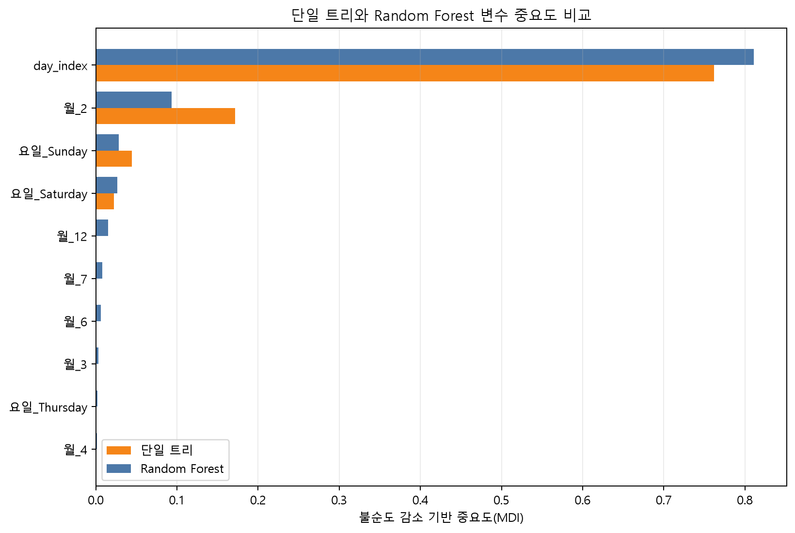
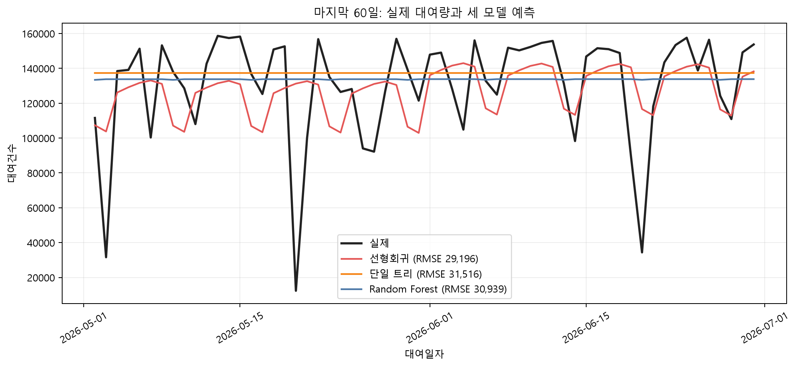

# 4주차 — Random Forest와 모델 비교

## 이번 주 목표

2~3주차와 같은 따릉이 데이터를 이어서 사용합니다. 이번 주에는 Random Forest를 추가해 **선형회귀, 단일 트리, Random Forest를 같은 기준으로 비교합니다.**

본문 데이터는 [서울시 따릉이 일별 대여건수 페이지](https://data.seoul.go.kr/dataList/OA-14994/A/1/datasetView.do)에서 설명과 원본 파일을 확인할 수 있습니다. 필요한 기간의 `서울특별시 공공자전거 일별 대여건수_*.csv`를 내려받아 앞 주차와 같은 로컬 이용정보 경로에 두면 됩니다. 출처·다운로드 날짜·버전도 함께 기록해 둡니다.

- 단일 트리가 작은 데이터 변화에 민감한 이유를 설명합니다.
- 부트스트랩, 변수 부분집합, 평균이 각각 어떤 역할을 하는지 구분합니다.
- OOB(out-of-bag) 평가가 무엇이며, 언제 보조 평가로 활용할 수 있고 언제 다른 평가가 필요한지 이해합니다.
- Random Forest의 하이퍼파라미터를 검증 데이터에서 선택합니다.
- 불순도 기반 feature importance의 편향을 알고 대안을 사용합니다.
- 범주형 ID를 임의의 정수로 바꾸는 문제와 안전한 전처리 원칙을 익힙니다.

## 이번 주 학습 지도

기본 학습은 약 **50~80분**을 예상합니다. 한 번에 진행하기 어렵다면 약 25~40분씩 두 번으로 나누어도 됩니다. 아래 시간에는 데이터 다운로드·환경 설치·오류 해결 시간이 포함되지 않으며, 반드시 채워야 하는 할당량이 아니라 학습 순서를 정하기 위한 길잡이입니다.

**첫 행동:** `04주차/example.ipynb`를 열고 `Part 1`을 위에서부터 실행해 단일 트리와 Random Forest의 예측 비교 출력까지 확인합니다. 첫 가져오기 셀은 출력이 없어도 정상이며, 이 Part는 내려받은 파일 없이 실행할 수 있습니다. `Part 2`에서 원본이 보이지 않으면 아래 진단 셀과 과제의 연습용 데이터 분기를 사용해 시도·오류를 기록할 수 있습니다.

| 단계 | 예상 시간 | `notion.md`에서 읽을 정확한 절 | `example.ipynb`에서 실행할 Part | 마쳐도 되는 지점 |
|---|---:|---|---|---|
| ✅ 기본 학습 | 약 50~80분 | `출발점 — 단일 트리는 왜 불안정합니까?`, `Random Forest의 작동 원리`, `검증 설계 — 모델 비교 전에 먼저 고정합니다`, `Part 2 — 지난주 데이터와 모델 재구성`, `Part 3 — Random Forest 학습`, `과제를 시작하는 가장 짧은 경로` | `Part 1`을 실행하고, `Part 2`에서는 `import glob`으로 시작해 `X_train`, `X_test`, `y_train`, `y_test`를 만드는 첫 데이터 준비 코드 셀까지만 실행합니다. 이어서 `Part 3`의 Random Forest를 실행합니다. | Random Forest 한 개의 RMSE를 확인하고 과제의 `✅ 기본 시도`에서 실행 또는 실행 시도와 관찰을 기록하면 마쳐도 됩니다. |
| 🧩 도전 학습 | 기본 완료 후 약 25~40분 | `OOB 평가는 언제 활용할 수 있습니까?`, `Part 4 — Feature Importance 비교` | `Part 2`의 `linear_model = ...`로 시작하는 다음 코드 셀에서 선형회귀와 단일 트리를 재학습한 뒤 `Part 3~4`를 다시 확인합니다. OOB는 문서의 코드로 한 번 실행합니다. | OOB 결과나 변수 중요도에서 관찰한 점 하나를 적으면 마쳐도 됩니다. |
| 🌱 확장 학습 | 도전 완료 후 약 20~40분 | `Part 5 — 세 모델 종합 비교`, 과제의 `어떤 분할이 맞습니까?` | `Part 5`를 실행합니다. | 세 모델 비교 또는 그룹 분할 가운데 하나만 골라 차이를 기록하면 마쳐도 됩니다. |

### 막혔을 때 먼저 확인합니다

다음 셀은 `04주차` 폴더에서 실행합니다. 예제의 따릉이 파일 수와 과제의 기본 파일 상태, 실제 열 이름을 한 번에 확인할 수 있습니다.

```python
from pathlib import Path
import pandas as pd

bike_dir = Path('../dataset/extracted/따릉이 공공데이터/02_이용정보')
bike_files = sorted(bike_dir.glob('서울특별시 공공자전거 일별 대여건수_*.csv'))
logistics_train = Path('../dataset/extracted/물류 유통량 예측 경진대회/train.csv')
bike_required = {'대여일자', '대여건수'}
logistics_required = {
    '송하인_격자공간고유번호', '수하인_격자공간고유번호',
    '물품_카테고리', '운송장_건수',
}

print('현재 작업 폴더:', Path.cwd())
print('따릉이 파일 수:', len(bike_files))
print('물류 train.csv:', logistics_train.exists())
if bike_files:
    columns = set(pd.read_csv(bike_files[0], encoding='cp949', nrows=0).columns)
    print('따릉이 누락 열:', sorted(bike_required - columns))
if logistics_train.exists():
    columns = set(pd.read_csv(logistics_train, nrows=0).columns)
    print('물류 누락 열:', sorted(logistics_required - columns))
```

- 작업 폴더가 `04주차`가 아니거나 따릉이 파일 수가 0이면 `Part 2`의 `pd.concat`에서 멈출 수 있습니다. 폴더명과 파일명 패턴을 먼저 맞춥니다.
- `대여일자`·`대여건수` 또는 물류의 세 범주형 열·`운송장_건수`가 보이지 않으면 다른 파일을 읽은 것입니다. 열 이름을 임의로 고치기 전에 원본 파일을 확인합니다.
- `X_train`이나 `root_mean_squared_error`가 없다는 오류가 나오면 `Part 1` → `Part 2` 첫 데이터 준비 셀 → `Part 3` 순서로 다시 실행합니다. 기본 학습에는 `Part 2`의 선형회귀·단일 트리 셀이 필요하지 않습니다.
- 물류 범주형 열을 Random Forest에 바로 넣지 않고, 과제 노트북의 `make_pipeline`을 사용합니다. 따릉이 데이터가 60행 이하이거나 학습·타깃 행 수가 다르면 모델 실행 전에 크기를 확인합니다.
- RMSE가 대표값과 조금 다른 것은 파일 기간이나 라이브러리 버전 차이일 수 있습니다. 오류가 아니며, 사용한 파일 수·기간·출력값을 함께 기록합니다.

해결하지 못해도 아래 네 줄을 남기면 이번 주 기본 기록을 마칠 수 있습니다. 이 네 줄은 주간 발표에서 시도 과정을 소개하는 한 장 메모로 그대로 사용할 수 있습니다.

```markdown
- 질문 1개:
- 실행 또는 실행 시도 1개:
- 관찰한 결과 또는 오류 1개:
- 다음 행동 1개:
```

## `notion.md`와 `example.ipynb`를 함께 읽는 방법

이 문서는 Random Forest의 원리와 검증 기준을 설명하고, `example.ipynb`는 같은 데이터에서 예측이 실제로 어떻게 달라지는지 확인하게 합니다. 다음 지도를 기준으로 문서와 노트북을 짧게 왕복합니다.

| 문서에서 읽을 내용 | 노트북 위치 | 노트북에서 할 일 | 문서로 돌아와 확인할 질문 |
|---|---|---|---|
| 단일 트리의 불안정성 | Part 1의 `toy = pd.DataFrame(...)`·예측 비교 셀 | 관측치 하나를 뺀 전후의 규칙과 예측을 비교합니다. | 예측 변화량이 왜 크게 나타났습니까? |
| Random Forest의 평균 효과 | Part 1의 `rf_all = RandomForestRegressor(...)` 셀 | 같은 두 데이터셋으로 만든 RF 예측을 비교합니다. | 평균 후 변화량이 얼마나 줄었습니까? |
| 실제 데이터의 RF 성능 | Part 2~3의 기준 모델·`rf_model` 셀 | 세 모델의 같은 홀드아웃 RMSE를 확인합니다. | 단일 트리 대비 줄어든 약점과 남은 한계는 무엇입니까? |
| 변수 중요도 | Part 4의 `importance_compare` 셀 | 단일 트리와 RF 중요도 그래프를 비교합니다. | 평균으로 안정성은 높아져도 어떤 편향은 남습니까? |
| 최종 모델 비교 | Part 5의 `comparison`·예측 그래프 셀 | 표와 날짜별 예측 그래프를 확인합니다. | 선형회귀가 여전히 앞선 이유는 무엇입니까? |

> ℹ️ **실행 결과 안내**  
> `example.ipynb`에는 셀 출력이 저장되어 있지 않습니다. 아래 출력 블록은 동일한 코드를 실행한 대표 결과이며, 실제 데이터 RMSE는 정수 단위로 반올림했습니다. 노트북을 직접 실행하면 자신의 결과와 대표 결과를 나란히 비교할 수 있습니다. 라이브러리 버전에 따라 Random Forest의 세부 예측은 조금 달라질 수 있습니다.

> 💡 **노트북과 함께 확인할 점**  
> Part 1의 코드는 `max_features`를 따로 지정하지 않습니다. 최근 scikit-learn의 `RandomForestRegressor` 기본값 `max_features=1.0`에서는 매 분기마다 모든 변수를 후보로 보므로, 이 실험에서 트리 사이의 차이는 주로 행 부트스트랩에서 생깁니다. 변수 후보 수도 바꾸어 보고 싶다면 `max_features`를 직접 지정해 비교할 수 있습니다.

## 출발점 — 단일 트리는 왜 불안정합니까?

> **학습 단계:** ✅ 기본 학습은 여기에서 시작합니다. 단일 트리와 Random Forest의 예측 변화만 먼저 비교합니다.

3주차의 기온→아이스크림 판매량 소규모 예제 데이터를 다시 사용합니다. 전체 6개 관측치로 학습한 트리와 기온 20도인 관측치 하나를 뺀 5개로 학습한 트리를 만듭니다.

```python
tree_all = DecisionTreeRegressor(
    max_depth=2, random_state=42
).fit(toy[['기온']], toy['판매량'])

toy_drop = toy.drop(index=3)  # 기온=20, 판매량=55인 점 하나를 제외합니다.
tree_drop = DecisionTreeRegressor(
    max_depth=2, random_state=42
).fit(toy_drop[['기온']], toy_drop['판매량'])

print('전체 6개로 학습:')
print(export_text(tree_all, feature_names=['기온']))
print('점 1개를 뺀 5개로 학습:')
print(export_text(tree_drop, feature_names=['기온']))
```

두 트리는 분기 기준과 잎의 평균이 달라집니다. 기온 22도에서 예측값을 비교하는 코드는 다음과 같습니다.

```python
print('기온=22일 때 예측값 비교')
print('전체 데이터로 학습한 트리:',
      tree_all.predict(pd.DataFrame({'기온': [22]}))[0])
print('점 1개 뺀 데이터로 학습한 트리:',
      tree_drop.predict(pd.DataFrame({'기온': [22]}))[0])
```

```text
기온=22일 때 예측값 비교
전체 데이터로 학습한 트리: 55.0
점 1개 뺀 데이터로 학습한 트리: 70.0
```

분기 알고리즘은 현재 노드에서 오차 감소가 가장 큰 기준을 고릅니다. 후보들의 감소량이 비슷할 때 관측치 하나만 달라져도 1등 후보가 바뀔 수 있고, 상위 분기가 바뀌면 아래의 모든 분기도 영향을 받습니다. 이렇게 **학습 데이터가 조금 달라졌을 때 모델의 예측이 크게 달라지는 성질**을 분산(variance)이 크다고 표현합니다.

> 🔄 **예측 → 실행 → 비교 → 해석 ①: 단일 트리의 흔들림**
>
> 1. 관측치 하나를 제외하면 기온 22도의 예측이 어느 방향으로 바뀔지 먼저 예상합니다.
> 2. `example.ipynb` Part 1의 `toy = pd.DataFrame(...)`와 예측 비교 셀을 실행합니다.
> 3. 두 트리의 첫 분기와 `55.0 → 70.0`의 변화량을 비교합니다.
> 4. 결과를 "한 점의 영향"에서 한 걸음 더 확장해, 탐욕적 상위 분기가 바뀌면서 전체 구조가 달라진 현상으로 해석합니다.

> 📷 **스크린샷 플레이스홀더 — 관측치 하나에 따라 달라진 두 트리 규칙**
> - **캡처 출처:** `04주차/example.ipynb` Part 1의 `tree_all = DecisionTreeRegressor(...)`로 시작하는 코드 셀과 `export_text` 출력입니다.
> - **의도:** 데이터 한 행을 제외했을 때 분기 기준과 잎의 값이 함께 달라지는 모습을 나란히 보여줍니다.
> - **관찰 질문:** 두 텍스트 트리에서 가장 먼저 달라지는 분기와 그 아래 달라진 잎은 어디입니까?
> - **캡션/대체 텍스트:** "기온 20도 관측치 포함 여부에 따라 서로 다른 분기 규칙을 만든 깊이 2 회귀 트리 두 개"를 사용합니다.

같은 두 데이터셋으로 트리 100개의 Random Forest를 학습합니다.

```python
rf_all = RandomForestRegressor(
    n_estimators=100, max_depth=2, random_state=42
).fit(toy[['기온']], toy['판매량'])

rf_drop = RandomForestRegressor(
    n_estimators=100, max_depth=2, random_state=42
).fit(toy_drop[['기온']], toy_drop['판매량'])

print('전체 데이터 RF 예측(기온=22):',
      rf_all.predict(pd.DataFrame({'기온': [22]}))[0])
print('점 1개 뺀 RF 예측(기온=22) :',
      rf_drop.predict(pd.DataFrame({'기온': [22]}))[0])
```

같은 설정의 대표 실행 결과는 다음과 같습니다.

```text
전체 데이터 RF 예측(기온=22): 약 59.5
점 1개 뺀 RF 예측(기온=22) : 약 62.8
```

단일 트리의 변화량은 15.0이었지만 Random Forest의 변화량은 약 3.3입니다. 이 한 번의 비교만으로 분산 감소를 증명할 수는 없지만, 단일 트리보다 변화 폭이 작아지는 원리를 관찰할 수 있습니다. 더 엄밀하게 확인하려면 여러 번 표본을 다시 뽑아 예측값의 분포나 표준편차를 비교하는 과정이 필요합니다.

> 📷 **스크린샷 플레이스홀더 — 단일 트리와 Random Forest의 예측 변화량**
> - **캡처 출처:** `04주차/example.ipynb` Part 1의 단일 트리 예측 비교 셀과 `rf_all = RandomForestRegressor(...)`로 시작하는 셀의 출력이 한 화면에 보이도록 캡처합니다.
> - **의도:** 같은 데이터 변화에서 단일 트리의 변화량 15.0과 RF의 변화량 약 3.3을 시각적으로 대비합니다.
> - **관찰 질문:** 평균을 사용한 뒤 예측 변화량은 얼마나 줄었으며, 이것이 편향 감소가 아니라 분산 감소인 이유는 무엇입니까?
> - **캡션/대체 텍스트:** "관측치 하나를 제외했을 때 단일 트리 예측은 55.0에서 70.0으로, Random Forest 예측은 약 59.5에서 62.8로 변한 출력 비교"를 사용합니다.

## Random Forest의 작동 원리

회귀용 Random Forest는 서로 조금씩 다른 회귀 트리를 만든 뒤 예측값을 평균합니다.

### 1단계 — 행을 다르게 뽑습니다: bootstrap

원본 학습 데이터가 (n)개라면 중복을 허용해 (n)번 뽑아 한 트리의 학습 표본을 만듭니다. 어떤 행은 여러 번 뽑히고 어떤 행은 한 번도 뽑히지 않습니다. 이 과정을 각 트리마다 새로 반복하므로 트리들이 서로 다른 데이터를 보게 됩니다.

표본 수가 충분히 크면 한 부트스트랩 표본에 한 번 이상 포함되는 고유 행은 원본의 약 63.2%이며, 포함되지 않는 행은 약 36.8%입니다. 포함되지 않은 행은 해당 트리의 **OOB 표본**이 됩니다.

### 2단계 — 분기 후보 변수를 제한할 수 있습니다: `max_features`

각 분기에서 전체 변수 중 무작위 부분집합만 후보로 보여주면 강한 변수 하나가 모든 트리를 지배하는 현상을 줄이고 트리 사이의 상관을 낮출 수 있습니다. 서로 덜 비슷한 트리의 오차를 평균할수록 분산 감소 효과가 커집니다.

다만 이 동작은 `max_features` 설정에 달려 있습니다. **현재 `example.ipynb`는 `max_features`를 명시하지 않습니다.** 최근 scikit-learn의 `RandomForestRegressor` 기본값 `max_features=1.0`은 각 분기에서 모든 변수를 후보로 봅니다. 따라서 현재 노트북의 결과는 주로 행 부트스트랩의 효과로 설명하는 편이 정확합니다. 변수 부분집합의 효과까지 관찰하고 패키지 버전에 따른 기본값 변화의 영향도 줄이려면 실습 코드에서 다음처럼 값을 명시할 수 있습니다.

```python
rf_model = RandomForestRegressor(
    n_estimators=300,
    max_depth=6,
    min_samples_leaf=10,
    max_features=0.7,  # 각 분기에서 변수의 70%를 후보로 사용합니다.
    bootstrap=True,
    random_state=42,
    n_jobs=-1,
)
```

`max_features`를 작게 하면 트리 다양성은 커지지만 유용한 변수를 자주 놓쳐 각 트리의 편향이 커질 수 있습니다. 따라서 이 값도 검증 결과를 살펴 선택하는 것이 좋습니다. 위 코드는 원리를 분명히 하기 위한 후보일 뿐 정답 설정이 아니며, 기존 노트북의 수치와 달라질 수 있습니다.

> 🔄 **예측 → 실행 → 비교 → 해석 ②: 기본값을 코드에서 확인하기**
>
> 1. 현재 노트북 코드에서 `max_features`가 설정되었는지 먼저 찾아봅니다.
> 2. Part 1의 `rf_all`과 Part 3의 `rf_model`을 만드는 `RandomForestRegressor(...)` 인자를 확인합니다.
> 3. 자신의 환경에서 `rf_model.max_features`를 출력해 명시된 값과 기본값을 구분합니다.
> 4. 현재 결과를 행 부트스트랩과 변수 부분집합 효과 중 어디까지로 설명할 수 있는지 기록합니다.

### 3단계 — 예측을 평균합니다

트리 (B)개의 예측을 \(\hat{f}_1(x),\ldots,\hat{f}_B(x)\)라고 하면 Random Forest 회귀 예측은 다음과 같습니다.

\[
\hat{f}_{RF}(x)=\frac{1}{B}\sum_{b=1}^{B}\hat{f}_b(x)
\]

개별 트리의 흔들림이 완전히 같은 방향이 아니라면 평균 과정에서 일부가 상쇄됩니다. 그러나 모든 트리가 같은 편향을 가지면 평균으로 없앨 수 없습니다. 예를 들어 각 트리가 추세를 외삽하지 못하므로 그 평균인 Random Forest도 외삽하지 못합니다.

## OOB 평가는 언제 활용할 수 있습니까?

> **학습 단계:** 🧩 도전 학습입니다. 기본 기록을 마친 뒤 OOB를 보조 평가로 한 번 확인하고 싶을 때 읽습니다.

각 행은 자신을 뽑지 않은 여러 트리의 OOB 표본이 됩니다. 그 트리들의 예측만 평균해 행별 OOB 예측을 만들면 학습 데이터만으로도 일반화 오차를 대략 추정할 수 있습니다.

```python
from sklearn.ensemble import RandomForestRegressor
from sklearn.metrics import root_mean_squared_error

rf_oob = RandomForestRegressor(
    n_estimators=300,
    max_depth=6,
    min_samples_leaf=10,
    max_features=0.7,
    bootstrap=True,
    oob_score=True,
    random_state=42,
    n_jobs=-1,
)
rf_oob.fit(X_train, y_train)

oob_rmse = root_mean_squared_error(y_train, rf_oob.oob_prediction_)
```

OOB는 유용한 보조 평가이지만 독립 테스트와는 역할이 다릅니다.

- 행들이 독립이고 같은 분포에서 왔다는 가정에 더 잘 맞습니다.
- **따릉이처럼 미래 예측이 목적인 시간 데이터에는 시간순 검증을 최종 평가로 사용하는 편이 적절합니다.** OOB에서는 미래 행이 부트스트랩 학습에 들어간 트리가 과거 행을 예측할 수 있어 실제 예측 상황의 시간 순서와 달라지기 때문입니다.
- 같은 고객·건물·지역의 중복 행이 있으면 그룹 정보가 다른 트리에 남아 점수가 낙관적일 수 있습니다.
- 트리 수가 너무 적으면 일부 행의 OOB 예측이 불안정할 수 있습니다.
- 기본 `oob_score_`는 R²입니다. RMSE 비교표와 혼동하지 않도록 같은 지표를 직접 계산해 비교합니다.

따릉이 예제에서는 마지막 기간을 시간순 홀드아웃으로 두고 OOB는 원리를 확인하는 보조 진단으로만 다룹니다. 이 홀드아웃으로 설정까지 고른다면 validation 역할을 하므로, 최종 성능을 따로 보고하려면 더 뒤의 기간을 test로 남겨야 합니다. 물류 과제도 실제 예측 대상이 새 지역인지 기존 지역의 새 운송인지에 따라 무작위 홀드아웃 또는 그룹 홀드아웃을 우선합니다.

## 주요 하이퍼파라미터

| 설정 | 늘리거나 완화했을 때 | 확인할 점 |
|---|---|---|
| `n_estimators` | 평균이 안정되지만 시간·메모리가 증가 | validation/OOB 성능이 평탄해지는 지점 |
| `max_depth` | 개별 트리가 복잡해짐 | train-validation 격차 |
| `min_samples_leaf` | 값을 키우면 잎 예측이 부드러워짐 | 희소 구간을 지나치게 뭉개는지 여부 |
| `max_features` | 값을 줄이면 트리 다양성이 커짐 | 편향 증가와 분산 감소의 균형 |
| `max_samples` | 트리마다 사용하는 행 수를 조절 | 속도와 개별 트리 정보량 |
| `bootstrap` | `True`일 때 행 재표본화와 OOB가 가능 | OOB를 사용하려면 `True`가 필요함 |
| `random_state` | 무작위 과정을 재현 | 비교 모델에서 고정 |

`n_estimators`를 늘리면 대체로 예측이 안정되지만 적절하지 않은 분할, 누수, 외삽 한계까지 해결되지는 않습니다. 깊은 트리를 많이 만들수록 메모리 사용량과 학습 시간도 함께 늘어나므로 성능이 평탄해지는 지점을 살펴보는 것이 좋습니다.

## 검증 설계 — 모델 비교 전에 먼저 고정합니다

3주차와 마찬가지로 train, validation, test의 역할을 분리합니다. 따릉이처럼 시간 순서가 있는 문제라면 다음 절차가 기본입니다.

1. 마지막 기간은 **최종 test**로 따로 보관합니다.
2. 그보다 앞선 여러 구간에서 확장 창 방식의 시간순 교차검증을 수행합니다.
3. 평균 validation RMSE와 시점별 변동을 기준으로 세 모델과 설정을 선택합니다.
4. 선택이 끝나면 train+validation으로 다시 학습합니다.
5. 따로 보관한 test를 마지막에 한 번 평가해 최종 성능으로 기록합니다. 이 결과를 보고 설정을 다시 바꾸면 test가 선택용 데이터가 되므로, 추가 수정이 필요할 때는 새로운 평가 데이터를 마련합니다.

현재 `example.ipynb`의 마지막 60일 점수는 같은 데이터와 분할에서 모델을 비교한 홀드아웃 결과입니다. 그 점수를 보며 `max_depth`, `min_samples_leaf`, `max_features`를 바꿨다면 마지막 60일은 validation이며, 별도 test 없이는 최종 일반화 성능이라고 부를 수 없습니다.

전처리는 각 학습 폴드 안에서만 `fit`하는 것이 중요합니다. 전체 데이터로 결측 대푯값, 빈도, 타깃 평균, 범주 목록을 만든 뒤 교차검증하면 검증 행의 정보가 학습에 들어가기 때문입니다. `Pipeline`으로 전처리와 모델을 묶으면 이 순서를 일관되게 지킬 수 있습니다.

## 순서대로 따라가기

아래 Part 번호와 코드 이름을 기준으로 `example.ipynb`의 대응 셀을 찾습니다.

### Part 2 — 지난주 데이터와 모델 재구성

> **학습 단계:** ✅ 기본 학습에서는 `example.ipynb` Part 2의 첫 데이터 준비 셀만 실행해 `X_train`, `X_test`, `y_train`, `y_test`를 만듭니다. 아래 선형회귀·단일 트리 재학습과 비교는 🧩 도전 학습에서 진행합니다.

2~3주차와 같은 X(`day_index`, 월 더미, 요일 더미), y(대여건수), 마지막 60일 홀드아웃을 사용합니다. Part 2의 `linear_model`과 `tree_model`을 학습하는 셀에서 선형회귀와 사전 가지치기 단일 트리의 기준점을 다시 계산합니다.

```python
linear_model = LinearRegression().fit(X_train, y_train)
rmse_linear = root_mean_squared_error(y_test, linear_model.predict(X_test))

tree_model = DecisionTreeRegressor(
    max_depth=6,
    min_samples_leaf=20,
    random_state=42,
).fit(X_train, y_train)
rmse_tree = root_mean_squared_error(y_test, tree_model.predict(X_test))

print('선형회귀 RMSE:', rmse_linear)
print('단일 트리(가지치기) RMSE:', rmse_tree)
```

```text
선형회귀 RMSE: 약 29,196
단일 트리(가지치기) RMSE: 약 31,516
```

### Part 3 — Random Forest 학습

현재 노트북의 설정은 `n_estimators=100`, `max_depth=6`, `min_samples_leaf=10`이며 `max_features`는 명시하지 않습니다.

```python
rf_model = RandomForestRegressor(
    n_estimators=100,
    max_depth=6,
    min_samples_leaf=10,
    random_state=42,
)
rf_model.fit(X_train, y_train)

rmse_rf_train = root_mean_squared_error(y_train, rf_model.predict(X_train))
rmse_rf_test = root_mean_squared_error(y_test, rf_model.predict(X_test))
print('Random Forest - train RMSE:', rmse_rf_train)
print('Random Forest - test RMSE :', rmse_rf_test)
```

```text
Random Forest - train RMSE: 약 28,242
Random Forest - test RMSE : 약 30,939
```

> **기본 학습 멈춤:** 위 두 RMSE 중 마지막 60일 RMSE 하나를 관찰로 적으면 됩니다. 아래의 단일 트리·선형회귀 비교는 기본 완료에 필요하지 않습니다.

> **학습 단계:** 🧩 도전 학습에서는 Part 2의 비교 모델 셀을 실행한 뒤 아래 세 모델 수치와 해석을 이어서 확인합니다.

같은 홀드아웃에서 Random Forest의 RMSE는 단일 트리의 31,516보다 낮았습니다. 여러 부트스트랩 트리의 평균이 단일 트리의 불안정성을 일부 줄였다는 설명과 일치합니다. 다만 한 홀드아웃의 차이는 특정 구간에서 얻은 결과이므로, 여러 시간 구간의 점수 분포도 함께 비교하면 결론을 더 안정적으로 설명할 수 있습니다.

> 🔄 **예측 → 실행 → 비교 → 해석 ③: 실제 데이터에서 앙상블 효과 확인**
>
> 1. 실행 전에 RF의 train RMSE와 마지막 60일 RMSE가 단일 트리보다 각각 높을지 낮을지 예상합니다.
> 2. Part 2의 기준 모델 셀과 Part 3의 `rf_model` 셀을 실행합니다.
> 3. `29,196 / 31,516 / 30,939`의 모델 순위와 train-test 격차를 비교합니다.
> 4. 단일 트리 대비 개선은 분산 감소로, 선형회귀 대비 열세는 외삽 편향으로 나누어 해석합니다.

> 📷 **스크린샷 플레이스홀더 — Random Forest 훈련·홀드아웃 RMSE 출력**
> - **캡처 출처:** `04주차/example.ipynb` Part 3의 `rf_model = RandomForestRegressor(...)`로 시작하는 코드 셀과 출력입니다.
> - **의도:** 하이퍼파라미터와 train/test RMSE가 한 화면에서 연결되도록 보여줍니다.
> - **관찰 질문:** train과 test의 격차는 제한 없는 단일 트리보다 작습니까? 같은 test로 설정을 골랐다면 이 구간의 올바른 이름은 무엇입니까?
> - **캡션/대체 텍스트:** "100개 트리, 깊이 6, 최소 잎 표본 10으로 학습한 Random Forest의 train RMSE 약 28,242와 마지막 60일 RMSE 약 30,939"를 사용합니다.

### Part 4 — Feature Importance 비교

Random Forest의 `feature_importances_`는 각 트리의 불순도 감소 기반 중요도(MDI)를 평균한 값입니다. 노트북에서는 단일 트리와 Random Forest의 상위 10개 중요도를 나란히 그립니다.

```python
importance_compare = pd.DataFrame({
    '단일 트리': tree_model.feature_importances_,
    'Random Forest': rf_model.feature_importances_,
}, index=X.columns).sort_values('Random Forest', ascending=False)

fig, ax = plt.subplots(figsize=(8, 6))
importance_compare.head(10).plot(kind='barh', ax=ax)
ax.invert_yaxis()
ax.set_title('Feature Importance 비교 (상위 10개)')
plt.show()
```

여러 트리를 평균하면 표본 변화에 덜 흔들릴 수 있지만, **평균을 냈다고 해서 중요도 편향이 사라지는 것은 아닙니다.**

- 고유값이 많은 연속형 변수와 ID는 분기 후보가 많아 중요도가 과대평가될 수 있습니다.
- 상관된 변수들은 중요도를 나눠 갖거나 한쪽에 몰아줄 수 있습니다.
- 훈련 데이터에서 계산하므로 과적합한 신호도 중요해 보일 수 있습니다.
- 중요도에는 방향이 없으며 인과 효과를 뜻하지 않습니다.

검증 데이터에서 permutation importance를 함께 계산하면 중요도를 더 균형 있게 이해할 수 있습니다. 변수 하나를 여러 번 섞어 RMSE가 얼마나 증가하는지 평균과 표준편차로 확인합니다. 모델 자체의 validation 성능이 충분한지 먼저 살펴보고, 상관 변수가 있으면 개별 순위는 신중하게 해석합니다.

> 🔄 **예측 → 실행 → 비교 → 해석 ④: 평균된 중요도 읽기**
>
> 1. 단일 트리와 RF에서 중요도 순위가 얼마나 비슷할지 예상합니다.
> 2. Part 4의 `importance_compare`를 만드는 셀을 실행합니다.
> 3. 같은 변수의 두 막대와 상위 순위 변화를 비교합니다.
> 4. 막대가 안정적으로 보인다는 사실과 편향이 제거되었다는 주장을 구분합니다.



*그림 4-1. 단일 Decision Tree와 100개 트리 Random Forest의 불순도 기반 변수 중요도 상위 10개를 나란히 표시한 가로 막대그래프입니다.*

> **그림에서 볼 점:** 같은 변수에 대한 단일 트리와 RF의 MDI를 한 그래프에서 비교합니다.  
> **관찰 질문:** RF에서 막대가 덜 쏠려 보이더라도 고유값 수 편향과 상관 변수 문제는 왜 남습니까?  
> **노트북 연결:** `example.ipynb` Part 4에서 같은 변수 중요도 그래프를 직접 생성해 본문 그림과 비교합니다.

### Part 5 — 세 모델 종합 비교

> **학습 단계:** 🌱 확장 학습입니다. 세 모델을 모두 비교하거나 과제에서 그룹 분할을 시도하려는 경우에 진행합니다.

노트북은 세 모델의 홀드아웃 RMSE를 정렬해 한 표로 만듭니다.

```python
comparison = pd.DataFrame({
    '모델': ['선형회귀', '단일 트리(가지치기)', 'Random Forest'],
    'test RMSE': [rmse_linear, rmse_tree, rmse_rf_test],
}).sort_values('test RMSE')
comparison
```

대표 실행 결과를 정수 단위로 반올림하면 다음과 같습니다.

```text
                  모델  test RMSE
0               선형회귀      29,196
2        Random Forest      30,939
1       단일 트리(가지치기)      31,516
```

Random Forest는 이 구간에서 단일 트리보다 낮은 RMSE를 보였지만 선형회귀보다는 RMSE가 높았습니다. Random Forest도 결국 구간별 상수인 트리들의 평균입니다. 학습 범위를 벗어난 `day_index`가 들어오면 기존 잎들의 평균을 조합할 뿐 상승 직선을 연장하지 못합니다.

따라서 이번 결과는 다음 두 문장으로 분리해 해석합니다.

1. **단일 트리 대비:** 여러 트리를 평균해 분산을 줄였습니다.
2. **선형회귀 대비:** 트리 계열의 외삽 한계가 남았습니다.

앙상블은 기반 모델의 불안정성을 줄일 수 있지만, 적절하지 않은 변수, 데이터 누수, 분포 변화, 구조적 편향을 자동으로 해결하지는 않습니다.

> 🔄 **예측 → 실행 → 비교 → 해석 ⑤: 점수와 시계열 모양 함께 보기**
>
> 1. 마지막 60일에서 RF 예측선이 선형회귀와 단일 트리 중 어느 쪽에 더 가까울지 예상합니다.
> 2. Part 5의 `comparison` 표와 날짜별 예측 그래프를 만드는 셀을 실행합니다.
> 3. RMSE 순위와 날짜별 예측선의 모양을 함께 비교합니다.
> 4. RF가 단일 트리보다 나아진 이유와 선형회귀를 이기지 못한 이유를 서로 다른 문장으로 기록합니다.



*그림 4-2. 마지막 60일의 실제 따릉이 대여건수와 선형회귀, 가지치기 단일 트리, Random Forest 예측을 날짜순으로 비교한 선그래프입니다.*

> **그림에서 볼 점:** RMSE 한 개로 가려지는 시점별 오차와 트리 계열의 외삽 한계를 확인합니다.  
> **관찰 질문:** Random Forest와 단일 트리의 선은 미래 구간에서 어떤 공통 모양을 보이며, 선형회귀와 무엇이 다릅니까?  
> **노트북 연결:** `example.ipynb` Part 5에서 같은 예측 비교 그래프를 직접 생성해 본문 그림과 비교합니다.

## 과제 안내 — 물류 유통량 예측

> 📥 **과제 데이터 다운로드**  
> [데이콘 물류 유통량 예측 경진대회](https://dacon.io/competitions/official/235867) 페이지에서 원본 데이터와 데이터 설명을 확인할 수 있습니다. 페이지에 로그인한 뒤 데이터 탭의 안내에 따라 내려받습니다. 압축을 푼 파일을 `assignment_baseline.ipynb`에 적힌 경로에 두면 준비된 코드를 그대로 실행할 수 있습니다.

### 과제를 시작하는 가장 짧은 경로

이 과제는 높은 점수나 완성된 분석보다 **직접 실행하고, 예상과 다른 결과나 오류를 작은 문제로 나누어 기록하는 과정**을 더 중요하게 봅니다. 아래 세 단계 가운데 `✅ 기본 시도`만 진행해도 충분하며, 실행이 멈췄다면 `🧩 문제 분해` 기록으로 바꾸어 마칠 수 있습니다.

| 구분 | 이번 주에 할 일 |
|---|---|
| ✅ 기본 시도 | 데이터를 불러오고 학습·검증 데이터를 나눈 뒤, 제공된 one-hot Pipeline으로 Random Forest 한 개를 실행합니다. |
| 🧩 문제 분해 | 파일 경로, 열 이름, 메모리, 미지 범주 가운데 어디에서 멈췄는지 확인하고 오류 메시지와 한 번의 확인 결과를 적습니다. |
| 🌱 선택 탐색 | 여유가 있을 때만 다른 모델 한 개, 그룹 분할, 미지 ID별 오차 또는 permutation importance 가운데 하나를 골라 비교합니다. |

파일이 보이지 않으면 모델 코드를 바꾸기 전에 다음 셀로 경로부터 확인합니다.

```python
from pathlib import Path

data_dir = Path('../dataset/extracted/물류 유통량 예측 경진대회')
train_path = data_dir / 'train.csv'
test_path = data_dir / 'test.csv'
print('현재 작업 폴더:', Path.cwd())
print('기본 시도 train.csv:', train_path.exists())
print('선택 제출 test.csv:', test_path.exists())
```

`train.csv`가 `False`이면 압축을 푼 폴더 이름과 현재 작업 폴더가 `04주차`인지 확인합니다. 노트북은 그동안 연습용 소규모 예시 데이터로 같은 코드 흐름을 이어가며, 예시 RMSE는 실제 물류 데이터의 결론으로 해석하지 않습니다. `test.csv`가 없어도 기본 시도는 실행할 수 있습니다. 최소 실행 경로는 **파일 확인 → 원본 범주 세 열 준비 → 학습·검증 분리 → Random Forest 한 개 학습 → validation RMSE 한 개 확인**입니다. competition `test.csv` 제출이나 세 모델 비교는 기본 완료 조건이 아닙니다.

송하인·수하인의 격자공간 ID와 물품 카테고리로 운송장 건수를 예측합니다. 모델을 선택하기 전에 **범주형 ID를 어떻게 표현하고, 학습에서 보지 못한 ID를 어떻게 평가할지**부터 차근차근 살펴봅니다.

### 전처리를 시작하기 전에 — 입력 변수에 알맞은 인코더를 선택합니다

`assignment_baseline.ipynb`는 아래 원칙에 맞춰 세 범주형 열을 원본 범주로 유지하고, 모델마다 train에만 fit되는 one-hot Pipeline 골격을 제공합니다. 다음과 같은 흔한 접근은 피하는 것이 좋습니다.

이유는 세 가지입니다.

1. `LabelEncoder`는 scikit-learn에서 입력 변수 X가 아니라 **타깃 y의 라벨을 변환하는 도구**입니다.
2. 격자 ID A/B/C를 0/1/2로 바꾸면 선형회귀는 코드 간 거리와 증가 방향이 있다고 보고, 트리는 `코드 <= 351` 같은 임의의 순서로 지역을 묶습니다. 코드 숫자의 크기는 실제 공간 거리나 순서를 보장하지 않습니다.
3. `train+test`로 범주 목록을 학습하는 것은 타깃을 보지 않으므로 곧바로 **타깃 누수**라고 부를 일은 아니지만, test 분포를 미리 이용하는 transductive 전처리입니다. 실제 배포의 미지 범주 상황을 충분히 재현하기 어려우므로, 기본 평가에서는 train으로만 범주 목록을 학습하는 편이 적절합니다.

test에 train에서 보지 못한 격자 ID가 많다는 사실은 **미지 지역으로 일반화하는 일이 이 문제의 중요한 과제**임을 알려줍니다. 따라서 encoder를 합쳐 학습하기보다 미지 범주를 처리할 수 있는 인코더와 그 상황을 재현하는 평가 방법을 함께 준비합니다. 인코딩은 변환 오류를 예방할 수 있지만, 보지 못한 지역의 타깃 패턴을 새로 만들어 주지는 않는다는 점도 기억해 두면 좋습니다.

### 권장하는 기준선 — train에만 fit하는 one-hot Pipeline

먼저 competition `train.csv` 내부를 학습과 validation으로 나눕니다. 아래 코드는 행들이 같은 모집단에서 무작위로 왔다는 가정에 기반한 **기본 시도**입니다.

```python
from sklearn.model_selection import train_test_split

cat_cols = [
    '송하인_격자공간고유번호',
    '수하인_격자공간고유번호',
    '물품_카테고리',
]

X = train[cat_cols].astype('string')
y = train['운송장_건수']

X_fit, X_valid, y_fit, y_valid = train_test_split(
    X, y, test_size=0.2, random_state=42
)
```

그다음 모델마다 새로운 encoder를 포함한 Pipeline을 만듭니다. `handle_unknown='ignore'`는 학습 때 없던 범주를 변환할 때 오류를 내지 않고 해당 one-hot 묶음을 0으로 만듭니다.

```python
from sklearn.pipeline import Pipeline
from sklearn.preprocessing import OneHotEncoder

def make_pipeline(model):
    return Pipeline([
        ('encode', OneHotEncoder(handle_unknown='ignore')),
        ('model', model),
    ])
```

이 구조에서는 `fit(X_fit, y_fit)`을 호출할 때 encoder도 X_fit에만 학습되고 validation에는 같은 범주 목록으로 `transform`만 적용됩니다. 기본 시도에서는 Random Forest 한 개를 이 validation에서 실행해 흐름을 확인합니다. 같은 validation을 보며 설정을 바꾸었다면 그 점수는 독립적인 최종 test 점수가 아니라는 점만 기록하면 됩니다. 더 탐색하고 싶다면 다른 모델을 하나 추가하거나 train을 fit·validation·holdout 세 부분으로 나누고, holdout은 모든 설정을 고른 뒤 한 번만 평가합니다. competition `test.csv`는 제출 예측을 만들 때만 변환합니다.

One-hot은 범주에 가짜 순서를 만들지 않는 안전한 출발점이지만 만능은 아닙니다.

- 격자 ID 종류가 많으면 행렬이 매우 넓어지고 트리 학습이 느려질 수 있습니다. 기본 sparse 출력을 유지하고 메모리를 확인합니다.
- 미지 ID의 one-hot 묶음은 모두 0이므로 다른 변수와 전체 평균에 의존하게 됩니다. 보지 못한 ID의 지역적 특성을 새로 알게 되는 것은 아닙니다.
- 모든 one-hot 열을 넣은 비규제 선형회귀의 개별 계수는 공선성 때문에 유일하거나 안정적으로 해석되지 않을 수 있습니다. 이 과제에서는 예측 기준선으로 사용하고, 계수 해석이 목적이라면 기준 범주와 규제를 별도로 설계합니다.
- ID를 실제 좌표로 변환할 수 있는 공식 매핑이 제공된다면 위도·경도, 거리, 권역 같은 의미 있는 공간 변수가 더 좋은 대안입니다. 매핑이 없다면 추측으로 ID의 자릿수를 좌표로 해석하지 않습니다.
- 빈도 인코딩은 학습 데이터에서만 빈도를 계산하고 미지 범주는 0 등의 사전 규칙으로 처리합니다. 타깃 인코딩에는 fold 밖 타깃으로 통계를 만드는 cross-fitting이 필요합니다. 같은 행의 타깃으로 인코딩하면 검증 정보가 특징에 직접 반영되어 성능이 실제보다 크게 보일 수 있기 때문입니다.

### 어떤 분할이 맞습니까?

무작위 행 분할은 "같은 분포에서 새로운 운송 행이 옵니다"라는 상황을 평가합니다. 실제 목적이 "처음 보는 송하인 지역" 또는 "처음 보는 수하인 지역" 예측이라면 이 점수는 낙관적일 수 있습니다. 이때는 해당 격자 ID를 그룹으로 묶어 train과 validation에 같은 그룹이 겹치지 않는 `GroupShuffleSplit` 같은 평가를 추가합니다.

최소한 각 분할에서 다음 비율을 보고합니다.

- validation의 송하인 ID 중 fit에 없던 비율을 보고합니다.
- validation의 수하인 ID 중 fit에 없던 비율을 보고합니다.
- 두 ID 조합 중 fit에 없던 비율을 보고합니다.
- 물품 카테고리별 표본 수와 타깃 분포를 보고합니다.

전체 점수와 함께 **알려진 ID 행과 미지 ID 행의 RMSE를 따로** 계산하면 모델이 어느 상황에서 더 어려움을 겪는지 이해할 수 있습니다.

### 과제 기록에 포함할 내용

#### ✅ 기본 시도

질문 하나를 정하고 Random Forest 한 개를 실행하거나 실행을 시도합니다. 예를 들어 “원본 위치 코드를 문자열 범주로 바꾼 Pipeline이 끝까지 실행됩니까?”라고 질문할 수 있습니다. validation RMSE 또는 발생한 오류를 한 줄로 적고, 다음에 확인할 행동도 하나 정합니다.

#### 🧩 문제 분해

실행되지 않았다면 완성된 모델을 만들 필요가 없습니다. 다음 네 항목만 남겨도 됩니다.

1. 마지막으로 성공한 셀과 처음 실패한 셀
2. 오류 메시지의 마지막 줄
3. 경로·열 이름·메모리·자료형·미지 범주 중 의심한 원인 하나
4. `Path.exists()`, `train.columns`, `X.shape`처럼 원인을 확인하려고 실행한 작은 코드와 그 결과

#### 🌱 선택 탐색

기본 시도가 끝난 뒤 여유가 있을 때만 다음 중 하나를 고릅니다. 여러 항목을 모두 수행할 필요는 없습니다.

- 선형회귀나 Decision Tree 중 한 모델만 추가해 같은 validation RMSE와 비교합니다.
- 송하인 또는 수하인 ID를 기준으로 그룹 분할을 시도하고 미지 ID 비율을 확인합니다.
- validation permutation importance 또는 알려진 ID·미지 ID별 RMSE 중 하나를 계산합니다.
- 별도 holdout을 남긴 뒤 모든 선택이 끝난 마지막 한 번만 평가합니다.

### 여기까지 하면 이번 주 기록 완료

다음 네 항목이 있으면 모델 성능이나 과제 성공 여부와 관계없이 이번 주 기록을 마친 것입니다.

- 질문 1개
- 실행 또는 실행 시도 1개
- 관찰한 결과 또는 오류 1개
- 다음 행동 1개

## 자주 만나는 문제와 점검 방법

| 증상 | 가능한 원인 | 확인·대응 |
|---|---|---|
| RF가 실행할 때마다 달라짐 | 무작위 표본 또는 동률 분기 | `random_state`를 고정하고 여러 seed의 안정성을 확인합니다. |
| 트리를 늘려도 점수가 좋아지지 않음 | 편향, 변수 부족, 외삽 한계 | validation 잔차와 데이터 구조를 점검합니다. |
| OOB는 좋지만 미래 test가 나쁨 | OOB가 시간 순서를 무시 | 시간순 validation을 사용합니다. |
| 격자 ID 중요도가 압도적임 | 정수 순서 또는 고유값 편향 | one-hot 또는 의미 있는 공간 변수를 사용하고 permutation으로 검증합니다. |
| validation 변환에서 unknown 오류 발생 | encoder의 fit 대상이 알맞지 않음 | train에만 `OneHotEncoder(handle_unknown='ignore')`를 fit합니다. |
| 내부 validation은 좋지만 competition test가 나쁨 | 미지 ID 비율 또는 분포가 다름 | 그룹 분할과 known/unknown별 점수를 보고합니다. |
| 타깃 인코딩 점수가 지나치게 높음 | 같은 행의 y가 인코딩에 포함됨 | fold 밖 통계로 cross-fitting합니다. |

## 인사이트를 쓰는 방법

좋은 설명은 단순 순위가 아니라 **어느 약점이 줄었고 어느 한계가 남았는지**를 구분합니다.

> 같은 마지막 60일에서 Random Forest RMSE는 30,939로 단일 트리의 31,516보다 낮았습니다. 부트스트랩으로 달라진 트리 예측을 평균해 단일 트리의 분산을 줄였다는 설명과 일치합니다. 그러나 선형회귀의 29,196보다는 높았습니다. 모든 기반 트리가 학습 범위 밖의 시간 추세를 외삽하지 못하므로 평균 후에도 그 편향이 남았기 때문입니다. 이 결론은 단일 홀드아웃 관찰이므로 여러 미래 구간에서 재검증하면 신뢰도를 더 높일 수 있습니다.

## 장 요약

- Random Forest 회귀는 부트스트랩 표본으로 여러 트리를 학습하고 예측을 평균해 분산을 줄입니다.
- 변수 부분집합은 `max_features`로 제어하며, 현재 노트북은 이를 명시하지 않아 최신 기본값에서는 모든 변수를 후보로 봅니다.
- OOB는 각 트리에 뽑히지 않은 행으로 내부 성능을 추정하지만 시간·그룹 구조를 무시하므로 모든 문제의 검증 대안은 아닙니다.
- 트리를 평균해도 외삽 불가, 적절하지 않은 변수 표현, 누수 같은 공통 편향은 사라지지 않습니다.
- RF의 불순도 중요도 역시 고유값 수와 상관관계의 영향을 받으므로 홀드아웃 permutation importance로 보완합니다.
- 범주형 격자 ID를 `LabelEncoder` 정수로 넣지 않고 train에만 fit한 unknown-safe 전처리를 Pipeline으로 묶습니다.
- 모델 선택은 validation에서, 최종 성능 평가는 따로 보관한 holdout/test에서 수행합니다.

## 다음 주와 연결하기

이번 주에는 숫자형 결과의 RMSE로 회귀 모델을 비교했습니다. 다음 주에는 범주를 예측하는 분류로 넘어가, 전체 정답률뿐 아니라 어떤 방향의 오류를 냈는지 혼동행렬과 precision·recall로 살펴봅니다.

## 🌱 선택 이해 점검

아래 문제는 기본 기록을 마친 뒤 개념을 더 확인하고 싶을 때 골라 봅니다. 모두 풀 필요는 없습니다.

1. 트리 수를 1개에서 300개로 늘리면 줄어들 가능성이 큰 것은 분산입니까, 편향입니까? 외삽 문제도 해결됩니까?
2. 현재 노트북에서 `max_features`를 지정하지 않았을 때 "각 트리가 매 분기에서 일부 변수만 봅니다"라는 설명이 정확하지 않을 수 있는 이유는 무엇입니까?
3. OOB 점수가 따릉이 미래 예측의 최종 평가를 대신할 수 없는 이유는 무엇입니까?
4. 격자 ID를 `LabelEncoder`로 0, 1, 2에 대응시키면 선형회귀와 트리가 각각 어떤 의도하지 않은 의미를 부여합니까?
5. competition test에 train에 없던 ID가 있을 때 `OneHotEncoder(handle_unknown='ignore')`가 해결하는 것과 해결하지 못하는 것은 무엇입니까?

### 해설 가이드

1. 주로 분산을 줄입니다. 모든 기반 트리의 구간별 상수와 외삽 불가라는 공통 편향은 평균해도 남습니다.
2. 최근 `RandomForestRegressor`의 기본 `max_features=1.0`은 모든 변수를 후보로 보기 때문입니다. 부분집합을 사용하려면 값을 명시하는 것이 좋습니다.
3. 부트스트랩은 시간 순서를 무시해 미래 행을 본 트리가 과거 OOB 행을 예측할 수 있으므로 실제 미래 예측을 재현하지 못합니다.
4. 선형회귀는 코드 간 동일한 거리와 증가 방향을 가정하고, 트리는 코드 임계값으로 임의의 순서 그룹을 만듭니다.
5. 변환 오류와 가짜 정수 순서는 피하지만 보지 못한 ID의 타깃 패턴이나 공간 특성을 새로 학습해주지는 않습니다.

## 용어집

| 용어 | 뜻 |
|---|---|
| 앙상블(ensemble) | 여러 모델의 예측을 결합해 하나의 예측을 만드는 방법 |
| 분산(variance) | 학습 데이터가 바뀔 때 모델 예측이 흔들리는 정도 |
| 부트스트랩(bootstrap) | 원본에서 중복을 허용해 같은 개수의 표본을 다시 뽑는 방법 |
| OOB(out-of-bag) | 특정 트리의 부트스트랩 표본에 포함되지 않은 학습 행 |
| `n_estimators` | forest를 구성하는 트리 수 |
| `max_features` | 각 분기에서 후보로 검토할 변수 수 또는 비율 |
| transductive 전처리 | 학습 때 예측 대상 test의 입력 분포도 함께 이용하는 처리 |

## 참고 자료

- [scikit-learn RandomForestRegressor 문서](https://scikit-learn.org/stable/modules/generated/sklearn.ensemble.RandomForestRegressor.html)
- [scikit-learn LabelEncoder 문서](https://scikit-learn.org/stable/modules/generated/sklearn.preprocessing.LabelEncoder.html)
- [scikit-learn OneHotEncoder 문서](https://scikit-learn.org/stable/modules/generated/sklearn.preprocessing.OneHotEncoder.html)
- [scikit-learn permutation importance 안내](https://scikit-learn.org/stable/modules/permutation_importance.html)
