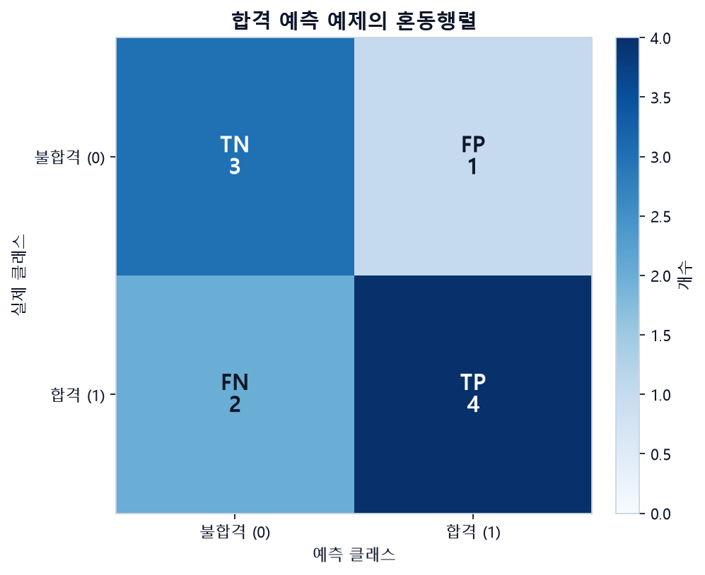
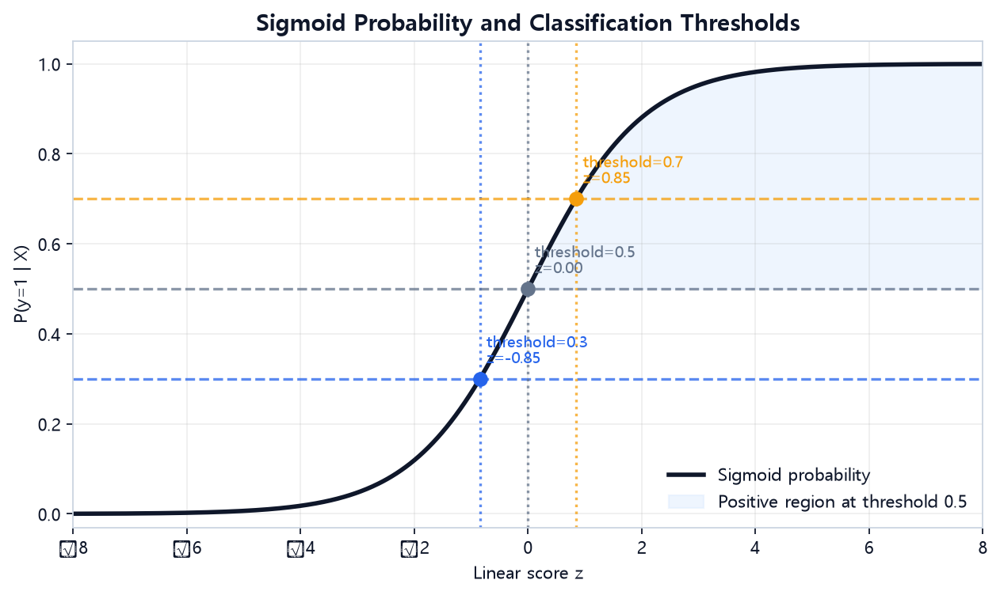
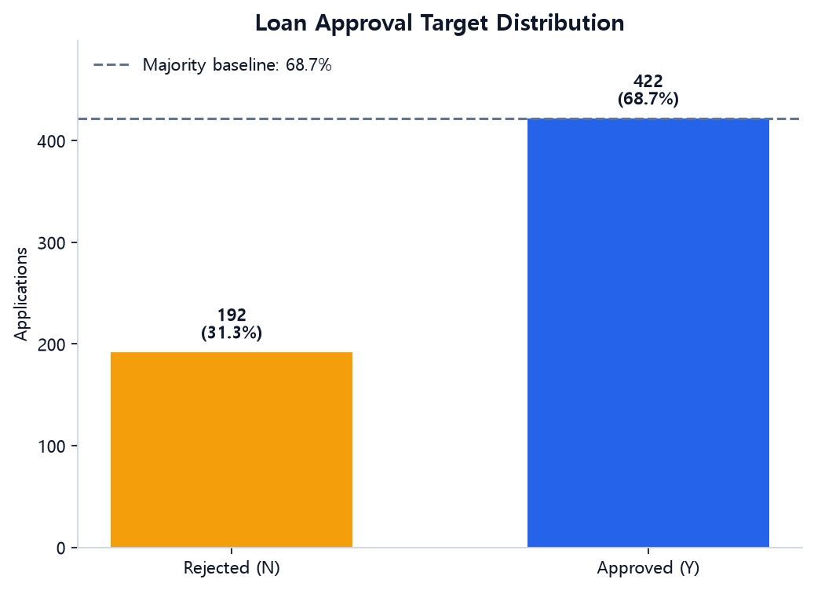
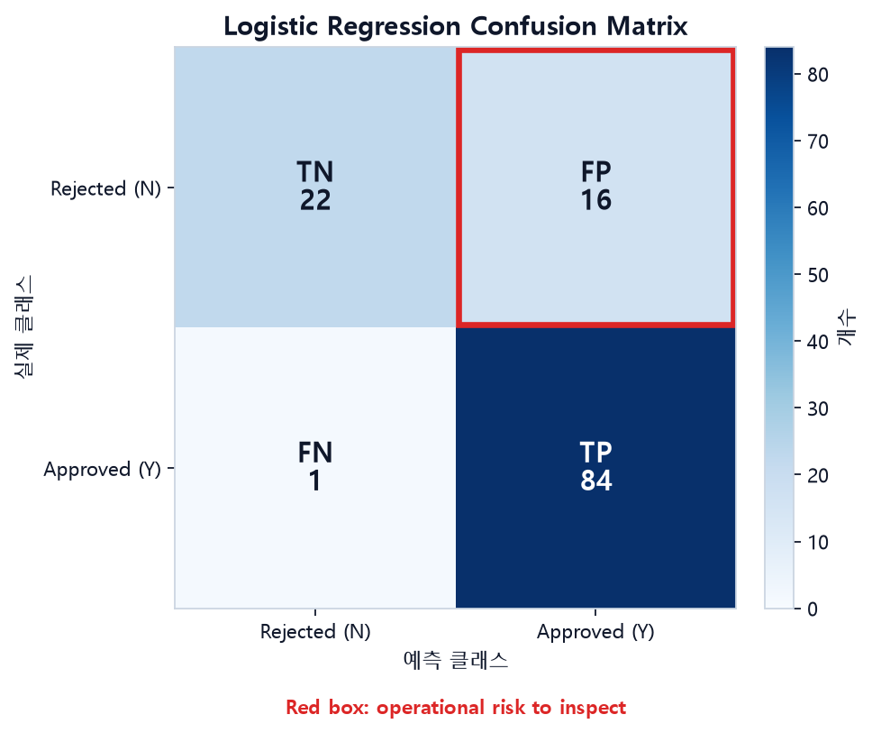
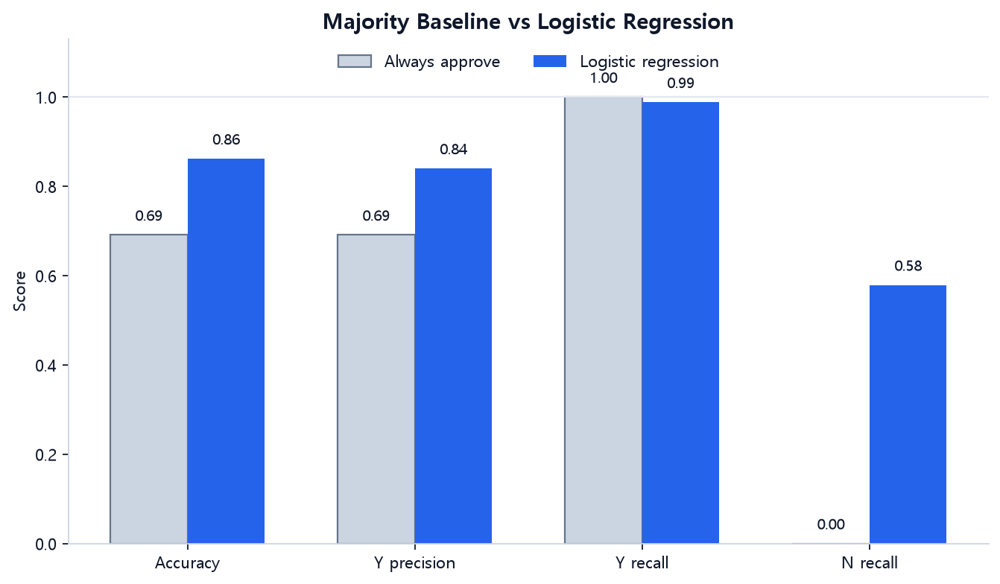

# 5주차 — Classification

## 이번 주 목표

1~4주차에는 숫자를 예측하는 회귀를 다뤘습니다. 이번 주부터는 대출 승인 여부처럼 정해진 범주를 예측하는 **분류(classification)** 로 넘어갑니다.

- 혼동행렬과 accuracy, precision, recall, F1을 손으로 계산하고 각 지표가 어떤 실수를 보는지 이해합니다.
- 로지스틱 회귀가 점수를 확률로 바꾸는 과정과 **분류 임계값(threshold)** 의 역할을 이해합니다.
- 불균형 데이터에서 accuracy만으로는 성능을 충분히 판단하기 어려운 이유를 확인합니다.
- ROC/PR 곡선과 확률 보정(calibration)이 답하는 질문을 구분합니다.
- 전처리 누수를 예방하고, 검증 데이터와 테스트 데이터의 역할을 구분합니다.

## 이번 주 학습 지도

기본 학습은 약 **60~90분**을 예상합니다. 한 번에 진행하기 어렵다면 약 30~45분씩 두 번으로 나누어도 됩니다. 아래 시간에는 데이터 다운로드·환경 설치·오류 해결 시간이 포함되지 않으며, 반드시 채워야 하는 할당량이 아니라 학습 순서를 정하기 위한 길잡이입니다.

**첫 행동:** `05주차/example.ipynb`를 열고 `Part 1`을 위에서부터 실행합니다. 이 Part는 내려받은 파일 없이 실행할 수 있습니다. Loan 원본이 없는 경우에도 과제 노트북의 연습용 항공편 데이터와 아래 네 줄 기록으로 기본 시도를 남길 수 있습니다.

| 단계 | 예상 시간 | `notion.md`에서 읽을 정확한 절 | `example.ipynb`에서 실행할 Part | 마쳐도 되는 지점 |
|---|---:|---|---|---|
| ✅ 기본 학습 | 약 60~90분 | `1.1 먼저 양성(positive)을 정합니다`, `2. 로지스틱 회귀가 확률을 만드는 방법`의 시그모이드 그림·0~1 확률 직관·`predict_proba` 코드, `4. 오늘 다룰 데이터 — Loan Prediction`, `Part 2 — 타깃 분포를 확인합니다`부터 `Part 6~8 — 모델과 혼동행렬을 확인합니다`까지, `과제를 시작하는 가장 짧은 경로` | 지표 함수까지 준비되도록 `Part 1` 전체를 실행한 뒤 `Part 2~8`을 실행합니다. 출력된 실제 모델 지표는 모두 해석하지 않고 하나만 고릅니다. | 로지스틱 회귀 한 개를 실행하고 실제 모델의 지표 하나를 한 문장으로 읽은 뒤 과제의 `✅ 기본 시도`를 기록하면 마쳐도 됩니다. |
| 🧩 도전 학습 | 기본 완료 후 약 25~40분 | `1.2 업무 질문에 맞는 지표를 고릅니다`, `2. 로지스틱 회귀가 확률을 만드는 방법`의 두 수식, `Part 6~8 — 모델과 혼동행렬을 확인합니다`, `Part 9 — 다수 클래스 베이스라인과 비교합니다` | `Part 8`에서 지표 두 개를 비교하고 `Part 9`를 실행합니다. | 지표 두 개가 보는 오류의 차이 또는 다수 클래스 기준선과의 차이 하나를 적으면 마쳐도 됩니다. |
| 🌱 확장 학습 | 도전 완료 후 약 20~40분 | `2.1 0.5는 자연법칙이 아니라 선택한 기준입니다`, `3. ROC/PR 곡선과 확률 보정을 구분합니다`, `6. 임계값을 직접 바꾸어 봅니다` | `Part 7~9`의 예측 결과를 확인한 뒤 문서의 임계값 코드를 실행합니다. | 임계값을 한 번 변경하거나, PR 곡선이 답하는 질문을 한 문장으로 설명하면 마쳐도 됩니다. |

### 막혔을 때 먼저 확인합니다

다음 셀은 `05주차` 폴더에서 실행합니다. 큰 항공편 파일은 내용 전체가 아니라 열 이름만 읽습니다.

```python
from pathlib import Path
import pandas as pd

loan_path = Path('../dataset/extracted/Loan Prediction Problem Dataset/train_u6lujuX_CVtuZ9i.csv')
flight_path = Path('../dataset/extracted/월간 데이콘 항공편 지연 예측 AI 경진대회/train.csv')
loan_required = {
    'Loan_Status', 'Gender', 'Married', 'Dependents', 'Education',
    'Self_Employed', 'Property_Area', 'ApplicantIncome',
    'CoapplicantIncome', 'LoanAmount', 'Loan_Amount_Term', 'Credit_History',
}
flight_required = {
    'ID', 'Tail_Number', 'Delay', 'Estimated_Departure_Time',
    'Estimated_Arrival_Time', 'Origin_State', 'Destination_State',
    'Airline', 'Carrier_Code(IATA)',
}

print('현재 작업 폴더:', Path.cwd())
for name, path, required in [
    ('Loan 예제', loan_path, loan_required),
    ('항공편 과제', flight_path, flight_required),
]:
    print(name, '파일 존재:', path.exists())
    if path.exists():
        columns = set(pd.read_csv(path, nrows=0).columns)
        print(name, '누락 열:', sorted(required - columns))
```

- 작업 폴더가 `05주차`가 아니면 두 상대경로가 달라집니다. Loan 예제 파일이 없으면 `Part 2`에서 멈추고, 항공편 과제 파일이 없으면 노트북이 연습용 데이터 모드로 이어집니다.
- `KeyError`가 나오면 위 `누락 열`부터 확인합니다. 특히 `Loan_Status`, `Delay`, `Carrier_Code(IATA)`의 철자와 괄호를 그대로 사용합니다.
- 실제 모델 지표까지 보려면 `Part 1` 전체 → `Part 2~8` 순서로 실행합니다. `pred`, `X_train`, 지표 함수가 없다는 오류는 앞 셀이 실행되지 않았다는 신호입니다.
- `stratify` 오류가 나오면 타깃이 비었거나 한 클래스만 남지 않았는지 `y.value_counts()` 또는 `labeled['Delay'].value_counts()`로 확인합니다. 모델에는 여섯 입력 열을 전처리와 모델을 한 순서로 묶은 과제의 Pipeline으로 전달합니다. 문자열 범주와 결측치는 별도 숫자 치환 대신 Pipeline 안에서 처리합니다.
- Loan 예제의 행 수·지표가 대표 출력과 다르면 먼저 파일 버전과 `random_state=42`를 확인합니다. 항공편의 연습용 지표는 실제 데이터 성능과 비교하지 않습니다.

해결하지 못해도 아래 네 줄을 남기면 이번 주 기본 기록을 마칠 수 있습니다. 이 네 줄은 주간 발표에서 시도 과정을 소개하는 한 장 메모로 그대로 사용할 수 있습니다.

```markdown
- 질문 1개:
- 실행 또는 실행 시도 1개:
- 관찰한 결과 또는 오류 1개:
- 다음 행동 1개:
```

## `notion.md`와 `example.ipynb`를 함께 읽는 방법

두 파일의 Part 번호는 서로 대응합니다. 아래 순서를 한 번의 학습 단위로 사용합니다.

| 단계 | `notion.md`에서 할 일 | `example.ipynb`에서 할 일 |
|---|---|---|
| 1. 예측 | 코드 아래의 질문을 읽고 결과와 오류 방향을 먼저 적습니다. | 셀을 실행하기 전에 예상해 봅니다. |
| 2. 실행 | 제시된 핵심 코드와 출력 형식을 확인합니다. | 같은 Part의 셀을 위에서부터 실행합니다. |
| 3. 비교 | 이 문서의 대표 출력과 자신의 출력을 비교합니다. | 값이 다르면 데이터 경로, 전처리, 시드, 라이브러리 버전을 확인합니다. |
| 4. 해석 | 수치가 의미하는 실제·예측 조합과 업무 비용을 문장으로 씁니다. | 임계값이나 입력을 바꾸어 확장 실험을 진행합니다. |

> **실행 결과 안내:** `example.ipynb`에는 저장된 셀 출력이 없습니다. 아래 출력은 제공 데이터와 `random_state=42`를 사용한 **대표 실행 결과**입니다. 라이브러리 버전에 따라 마지막 자릿수나 표시 형식은 달라질 수 있습니다.

---

## 1. 분류 평가지표 — 원리부터 확인합니다

### 1.1 먼저 양성(positive)을 정합니다

> **학습 단계:** ✅ 기본 학습은 여기에서 시작합니다. 양성 클래스와 혼동행렬 네 칸을 구분하는 데 먼저 집중합니다.

10명의 합격 여부를 예측한다고 가정합니다. 여기서는 **합격을 양성(1)**, 불합격을 음성(0)으로 정합니다. 실제 합격자는 6명이고 불합격자는 4명이며, 모델의 일부 예측은 실제 결과와 달랐습니다. 그 결과를 **Confusion Matrix**(혼동행렬)라는 2×2 표로 정리합니다.

| | 예측: 합격(1) | 예측: 불합격(0) |
|---|---|---|
| **실제: 합격(1)** | TP — 맞게 합격으로 예측 | FN — 합격인데 불합격으로 예측한 놓침 |
| **실제: 불합격(0)** | FP — 불합격인데 합격으로 예측한 오탐 | TN — 맞게 불합격으로 예측 |

다음 코드를 실행해 혼동행렬의 네 칸과 주요 지표를 직접 계산합니다.

```python
import pandas as pd
from sklearn.metrics import confusion_matrix

toy = pd.DataFrame({
    "실제": [1, 1, 1, 1, 1, 1, 0, 0, 0, 0],
    "예측": [1, 1, 1, 1, 0, 0, 0, 0, 0, 1],
})

cm = confusion_matrix(toy["실제"], toy["예측"])
tn, fp, fn, tp = cm.ravel()

accuracy = (tp + tn) / (tp + tn + fp + fn)
precision = tp / (tp + fp)
recall = tp / (tp + fn)
f1 = 2 * precision * recall / (precision + recall)

print(cm)
print(f"TP={tp}, FP={fp}, FN={fn}, TN={tn}")
print(f"accuracy={accuracy:.3f}, precision={precision:.3f}, "
      f"recall={recall:.3f}, f1={f1:.3f}")
```

대표 출력은 다음과 같습니다.

```text
[[3 1]
 [2 4]]
TP=4, FP=1, FN=2, TN=3
accuracy=0.700, precision=0.800, recall=0.667, f1=0.727
```

각 지표는 다음 질문에 답합니다.

- **accuracy** = $(TP+TN)/전체 = 0.700이며, 전체 중 맞힌 비율을 나타냅니다.
- **precision** = $TP/(TP+FP) = 0.800이며, 양성이라고 예측한 것 중 실제 양성의 비율을 나타냅니다.
- **recall** = $TP/(TP+FN) = 0.667이며, 실제 양성 중 모델이 찾아낸 비율을 나타냅니다.
- **F1** = $2 \times (precision \times recall)/(precision+recall) = 0.727이며, precision과 recall의 조화평균을 나타냅니다.

recall이 precision보다 낮은 이유는 실제 합격자 6명 중 2명을 불합격으로 놓쳤기 때문입니다. 어느 오류의 영향이 더 큰지는 문제에 따라 달라집니다. 암 진단에서는 환자를 놓치는 FN의 영향이 특히 클 수 있고, 스팸 필터에서는 정상 메일을 스팸으로 처리하는 FP도 큰 비용이 될 수 있습니다.

> 🔁 **예측 → 실행 → 비교 → 해석**
>
> 1. **예측:** 셀을 실행하기 전에 혼동행렬의 네 칸과 recall 값을 손으로 적습니다.
> 2. **실행:** `example.ipynb` Part 1의 `toy`, `confusion_matrix`, 지표 계산 셀을 차례로 실행합니다.
> 3. **비교:** 행이 실제, 열이 예측인지 확인한 뒤 위 출력과 비교합니다.
> 4. **해석:** “실제 합격자를 몇 명 놓쳤습니까?”를 FN과 연결하여 한 문장으로 씁니다.



*그림 5-1. 실제값을 행, 예측값을 열로 둔 합격 예제 혼동행렬입니다. `example.ipynb` Part 1의 `toy = pd.DataFrame(...)`와 `cm = confusion_matrix(...)` 셀을 사용했습니다.*

> **그림 읽기 질문:** 합격을 양성으로 두었을 때 놓친 합격자는 어느 칸이며 몇 명입니까?

> 💡 **함께 확인할 점:** TP, FP, FN, TN은 양성 클래스를 무엇으로 정했는지에 따라 이름이 바뀝니다. 분석을 시작할 때 “이 장에서 양성은 무엇입니까?”를 먼저 적어두면 뒤의 지표를 더 편안하게 해석할 수 있습니다.

### 1.2 업무 질문에 맞는 지표를 고릅니다

> **학습 단계:** 🧩 도전 학습입니다. 기본 기록을 마친 뒤 여러 지표가 서로 다른 실수를 어떻게 보는지 비교할 때 읽습니다.

| 알고 싶은 것 | 특히 경계하는 실수 | 먼저 확인할 지표 |
|---|---|---|
| 전체적으로 얼마나 맞혔는지 | 두 클래스의 비용이 비슷한 상황 | accuracy |
| 양성이라고 한 판단을 얼마나 믿을 수 있는지 | FP(오탐) | precision |
| 실제 양성을 얼마나 놓치지 않았는지 | FN(놓침) | recall |
| precision과 recall을 한 수치로 절충하고 싶은지 | FP와 FN 모두 | F1 |
| 소수 클래스를 포함해 클래스별 성능을 고르게 보고 싶은지 | 다수 클래스 편향 | 클래스별 지표, macro F1 |

F1이 모든 문제에 가장 알맞은 지표인 것은 아닙니다. FN 비용이 FP보다 열 배 큰 문제라면 두 오류를 대칭적으로 절충하는 F1보다 recall이나 실제 비용을 반영한 지표가 더 적절합니다. **모델을 학습하기 전에 업무상 오류 비용을 먼저 정의하면 목적에 맞는 지표를 선택하기 쉬워집니다.**

---

## 2. 로지스틱 회귀가 확률을 만드는 방법

> **학습 단계:** ✅ 기본 학습에서는 시그모이드 그림, 점수가 0~1 확률로 바뀐다는 직관, `predict_proba` 코드에 집중합니다. 아래 두 수식의 구조를 자세히 확인하는 일은 🧩 도전 학습으로 남겨도 됩니다.

이름에는 Regression이 들어가지만 로지스틱 회귀는 대표적인 분류 모델입니다. 먼저 입력 변수의 가중합으로 점수 $z$를 만듭니다.

$$
z = b_0 + b_1x_1 + b_2x_2 + \cdots + b_px_p
$$

$z$는 음의 무한대부터 양의 무한대까지 갈 수 있으므로 그대로는 확률이 아닙니다. 이를 **시그모이드(sigmoid)** 함수에 넣어 0과 1 사이 값으로 바꿉니다.

$$
P(y=1 \mid X) = \sigma(z) = \frac{1}{1+e^{-z}}
$$

- $z=0$이면 확률은 0.5입니다.
- $z$가 커질수록 양성일 확률은 1에 가까워집니다.
- $z$가 작아질수록 양성일 확률은 0에 가까워집니다.



*그림 5-2. 선형 점수를 0~1 사이 확률로 바꾸는 시그모이드 곡선입니다. 기본 학습에서는 S자 곡선과 `z=0`일 때 확률 0.5라는 점만 확인하고, 세 임계값의 차이는 확장 학습에서 살펴봅니다.*

> **기본 그림 읽기 질문:** 선형 점수 `z`가 음수에서 양수로 커질 때 양성 확률은 어느 방향으로 움직입니까?

`example.ipynb` Part 6에서 학습한 모델은 다음처럼 양성 확률과 최종 클래스를 만듭니다.

```python
model.fit(X_train, y_train)

proba_y = model.predict_proba(X_val)[:, 1]
pred_050 = (proba_y >= 0.50).astype(int)
```

### 2.1 0.5는 자연법칙이 아니라 선택한 기준입니다

`model.predict()`는 이진분류에서 보통 확률 0.5를 기준으로 클래스를 나눕니다. 그러나 0.5가 반드시 업무상 최적인 것은 아닙니다.

- 임계값을 **낮추면** 양성 예측이 많아집니다. 일반적으로 recall은 올라가고 precision은 내려갈 수 있습니다.
- 임계값을 **높이면** 양성 예측이 적어집니다. 일반적으로 precision은 올라가고 recall은 내려갈 수 있습니다.

대출 예제에서는 Y(승인)를 1로 둡니다. 승인 임계값을 0.5에서 0.7로 높이면 승인에 더 확신이 있는 신청자만 Y로 분류하므로, 거절해야 할 신청자를 잘못 승인하는 사례를 줄일 가능성이 있습니다. 대신 실제 우량 신청자를 거절하는 사례가 늘어날 수 있습니다.

임계값은 검증 데이터에서 업무 비용과 precision-recall의 균형을 보고 선택합니다. **선택에 사용한 검증 데이터에서 최종 성능까지 보고하면 낙관적인 평가가 될 수 있으므로**, 마지막에는 모델이나 임계값 선택에 사용하지 않은 테스트 데이터가 필요합니다.

> **확장 질문:** 임계값을 0.7로 높이면 어떤 신청자가 새로 거절되며, FP와 FN은 일반적으로 어느 방향으로 움직입니까?

---

## 3. ROC/PR 곡선과 확률 보정을 구분합니다

> **학습 단계:** 🌱 확장 학습입니다. 임계값 변화와 PR 곡선까지 살펴보고 싶을 때 진행합니다.

한 임계값의 혼동행렬은 실제 운영 지점을 평가합니다. 반면 ROC와 PR 곡선은 임계값을 0부터 1까지 움직였을 때 성능이 어떻게 변하는지 보여줍니다.

| 도구 | 답하는 질문 | 특히 유용한 상황 | 주의할 점 |
|---|---|---|---|
| ROC-AUC | 양성을 음성보다 높은 점수로 순위화합니까? | 클래스가 심하게 쏠리지 않았거나 전반적 구분력을 비교할 때 | 희소 양성 문제에서 좋아 보일 수 있으며 운영 임계값을 정해주지 않습니다. |
| PR 곡선 / Average Precision | recall을 높일 때 precision이 얼마나 유지됩니까? | 지연·이상 탐지처럼 관심 있는 양성이 드물 때 | 어떤 클래스를 양성으로 두었는지 밝혀야 합니다. |
| Calibration curve | 예측확률과 실제 발생 비율이 일치합니까? | 확률 자체로 의사결정하거나 비용을 계산할 때 | AUC가 높아도 확률 보정은 나쁠 수 있습니다. |

예를 들어 확률 0.8을 받은 신청자 100명 중 실제 승인 대상이 약 80명이라면 확률이 잘 보정되었다고 말할 수 있습니다. 반면 AUC는 확률값 자체가 맞는지보다 **순서를 잘 매기는지**에 가깝습니다.

분석 목적을 정하지 않은 채 여러 지표 중 가장 높아 보이는 값만 고르면 결과를 일관되게 해석하기 어렵습니다. 항공편 지연처럼 지연 비율이 17.6%라면 지연을 양성으로 두고, “지연을 놓치지 않는 것이 중요합니까, 지연 경보를 믿을 수 있는 것이 중요합니까?”를 먼저 정해 보는 것이 좋습니다.

---

## 4. 오늘 다룰 데이터 — Loan Prediction

614명의 대출 신청자 정보로 대출 승인 여부(`Loan_Status`: Y/N)를 예측합니다. 제공 데이터에는 승인 Y가 422건, 거절 N이 192건 있습니다. 이 예제에서는 **Y(승인)=1**로 정의하므로 별도 설정 없이 계산한 precision과 recall은 승인(Y)을 기준으로 합니다.

> 📥 **예제 데이터 다운로드**  
> [Kaggle Loan Prediction Problem Dataset](https://www.kaggle.com/datasets/altruistdelhite04/loan-prediction-problem-dataset) 페이지에서 원본 데이터를 내려받을 수 있습니다. Kaggle에 로그인한 뒤 **Download**를 선택합니다. 압축을 푼 `train_u6lujuX_CVtuZ9i.csv`를 아래 코드에 적힌 경로에 두면 준비된 셀을 그대로 실행할 수 있습니다.

---

## 5. 노트북을 순서대로 실행합니다

### Part 2 — 타깃 분포를 확인합니다

다음 셀은 원본 데이터의 크기와 타깃 비율을 확인합니다.

```python
df = pd.read_csv(
    "../dataset/extracted/Loan Prediction Problem Dataset/"
    "train_u6lujuX_CVtuZ9i.csv"
)

print(df.shape)
print(df["Loan_Status"].value_counts())
print(df["Loan_Status"].value_counts(normalize=True).round(3))
```

대표 출력은 다음과 같습니다.

```text
(614, 13)
Loan_Status
Y    422
N    192

Loan_Status
Y    0.687
N    0.313
```

승인(Y) 68.7%, 거절(N) 31.3%로 쏠려 있습니다. 이 비율은 뒤에서 다수 클래스만 예측해도 얻는 accuracy의 기준이 됩니다. 전체 데이터의 분포를 탐색하는 것은 가능하지만, 테스트 라벨을 보면서 모델이나 임계값을 바꾸면 테스트 데이터가 공정한 최종 평가용으로 남지 않습니다.

> 🔁 **예측 → 실행 → 비교 → 해석**
>
> 1. **예측:** 항상 Y만 예측할 때 accuracy가 약 몇 퍼센트인지 먼저 적습니다.
> 2. **실행:** `example.ipynb` Part 2의 데이터 로드와 `value_counts(normalize=True)` 셀을 실행합니다.
> 3. **비교:** 614건, Y 422건, N 192건인지 확인합니다.
> 4. **해석:** accuracy 68.7%가 모델 없이도 가능한 기준선이라는 점을 설명합니다.



*그림 5-3. 승인 Y 422건(68.7%)과 거절 N 192건(31.3%)의 타깃 분포입니다. `example.ipynb` Part 2의 `df['Loan_Status'].value_counts(normalize=True)` 셀과 같은 원본 데이터를 사용했습니다.*

> **그림 읽기 질문:** 모든 신청자를 Y로 예측하면 왜 0.687의 accuracy를 얻습니까?

### Part 3 — 결측치를 확인하고 전처리 대상을 지정합니다

노트북에서는 결측치의 위치와 개수를 먼저 확인하고, 범주형 변수와 수치형 변수를 나눠 적습니다. 이 시점에는 아직 값을 채우지 않습니다. 결측이 특정 집단이나 결과에 몰려 있는지도 함께 살펴보면 좋습니다. 결측치 처리법도 모델의 일부이기 때문입니다.

### Part 4 — 원본 입력과 타깃을 준비합니다

`Loan_Status`를 0/1로 바꾸되, 입력 X는 결측치가 남은 원본 열로 준비합니다. 범주형 변수의 one-hot 인코딩과 결측치 대체는 데이터를 나눈 다음 Pipeline 안에서 수행합니다.

### Part 5 — 학습 데이터와 검증 데이터를 분리합니다

`train_test_split(..., stratify=y)`를 사용하면 학습·검증 데이터의 클래스 비율이 전체와 비슷하게 유지됩니다. 제공 데이터와 고정된 시드에서는 다음과 같은 출력이 나옵니다.

```text
학습: (491, 11) 검증: (123, 11)
학습 타겟 비율: 0.686 검증 타겟 비율: 0.691
```

위의 11개 열은 Pipeline에 들어가기 전 원본 입력의 열 수입니다. Part 6에서 범주형 변수가 one-hot 열로 펼쳐지므로 모델이 실제로 받는 변환 행렬의 열 수는 더 많아집니다.

`stratify`는 **클래스 비율을 유지하는 옵션이며, 누수나 대표성까지 해결해 주지는 않습니다.** 같은 사람이 여러 행에 있다면 사람 단위 분할을 사용하고, 미래를 예측하는 문제라면 시간 순서 분할을 사용하면 실제 예측 상황에 더 가까운 평가가 됩니다.

### Part 3~6 — 전처리 누수를 예방합니다

현재 노트북은 다음 순서로 검증 데이터의 분포가 전처리 기준에 들어가지 않도록 구성되어 있습니다.

1. 원본 데이터를 먼저 학습 데이터와 검증 데이터로 나눕니다.
2. 중앙값, 최빈값, 스케일 같은 전처리 기준은 **학습 데이터에서만 학습(fit)** 합니다.
3. 학습한 기준으로 검증 데이터에는 변환(transform)만 수행합니다.
4. `Pipeline`과 `ColumnTransformer`를 사용하면 교차검증 안에서도 이 순서를 일관되게 적용할 수 있습니다.

로지스틱 회귀는 기본적으로 규제를 사용하므로 수치 Pipeline에는 `StandardScaler`도 포함합니다. 스케일이 다르면 규제가 변수마다 다르게 작용할 수 있고, 계수 크기도 단순 비교하기 어렵습니다. 이 데이터에서는 스케일링 뒤에도 아래 대표 혼동행렬과 지표가 같으며, 학습 과정의 수치적 안정성은 좋아집니다.

### Part 6~8 — 모델과 혼동행렬을 확인합니다

`example.ipynb` Part 6~8의 핵심 실행 흐름은 다음과 같습니다.

```python
from sklearn.compose import ColumnTransformer
from sklearn.impute import SimpleImputer
from sklearn.linear_model import LogisticRegression
from sklearn.metrics import (
    confusion_matrix,
    accuracy_score,
    precision_score,
    recall_score,
    f1_score,
)
from sklearn.pipeline import Pipeline
from sklearn.preprocessing import OneHotEncoder, StandardScaler

categorical_pipeline = Pipeline([
    ('impute', SimpleImputer(strategy='most_frequent')),
    ('onehot', OneHotEncoder(drop='first', handle_unknown='ignore')),
])
numeric_pipeline = Pipeline([
    ('impute', SimpleImputer(strategy='median')),
    ('scale', StandardScaler()),
])
preprocessor = ColumnTransformer([
    ('categorical', categorical_pipeline, categorical_features),
    ('numeric', numeric_pipeline, numeric_features),
])

model = Pipeline([
    ('preprocess', preprocessor),
    ('classifier', LogisticRegression(max_iter=5000)),
])
model.fit(X_train, y_train)
pred = model.predict(X_val)

cm = confusion_matrix(y_val, pred)
print(cm)
print("Accuracy :", accuracy_score(y_val, pred))
print("Precision:", precision_score(y_val, pred))
print("Recall   :", recall_score(y_val, pred))
print("F1       :", f1_score(y_val, pred))
```

제공 데이터와 `random_state=42`의 대표 출력은 다음과 같습니다.

```text
[[22 16]
 [ 1 84]]
Accuracy : 0.8617886178861789
Precision: 0.84
Recall   : 0.9882352941176471
F1       : 0.9081081081081082
```

scikit-learn의 `confusion_matrix(y_true, y_pred)`는 기본적으로 행이 실제, 열이 예측이며 배열 순서는 `[[TN, FP], [FN, TP]]`입니다. 따라서 실제 N 38건 중 16건을 Y로 예측했고, 실제 Y 85건 중 1건을 N으로 예측했습니다.

| 클래스 | precision | recall | 해석 |
|---|---:|---:|---|
| N(거절) | 0.96 | **0.58** | 실제 N 중 약 42%를 Y로 놓쳤습니다. |
| Y(승인) | 0.84 | 0.99 | 실제 Y는 거의 모두 찾았습니다. |

**Y를 양성으로 둔 전체 혼동행렬에서는 ‘실제 N, 예측 Y’가 FP입니다.** `classification_report`의 N 행에서는 N을 일대나머지 방식의 기준 클래스로 보므로 같은 사례를 ‘N을 놓친 경우’라고 설명할 수 있습니다. 실제 클래스와 예측 클래스를 함께 적으면 두 표현을 더 쉽게 구분할 수 있습니다.

대출 심사처럼 잘못된 승인이 큰 손실로 이어질 수 있다면 accuracy보다 N recall, Y precision 또는 승인 오류의 실제 비용이 중요할 수 있습니다. 다만 이 데이터의 `Loan_Status`는 과거 승인 결과이지 실제 상환 여부가 아닙니다. **승인 결과를 잘 예측하는 모델이 부도 위험을 잘 예측하는 모델은 아닙니다.**

> 🔁 **예측 → 실행 → 비교 → 해석**
>
> 1. **예측:** Y가 다수 클래스라는 사실만 보고 혼동행렬에서 FP와 FN 중 어느 쪽이 더 많을지 예상합니다.
> 2. **실행:** Part 6의 학습 셀부터 Part 8의 지표 셀까지 실행합니다.
> 3. **비교:** `[[22, 16], [1, 84]]`와 비교하고 행·열 라벨을 다시 확인합니다.
> 4. **해석:** “실제 N 38건 중 16건을 Y로 예측했습니다”처럼 분모와 실제·예측 클래스를 함께 씁니다.



*그림 5-4. 검증 데이터의 혼동행렬 `[[22, 16], [1, 84]]`입니다. `example.ipynb` Part 7의 `cm = confusion_matrix(y_val, pred)` 셀을 재현했으며, 실제 N을 Y로 예측한 FP 칸을 빨간 테두리로 강조했습니다.*

> **그림 읽기 질문:** accuracy 86.2%만 보았을 때 놓치기 쉬운 오류는 어느 칸입니까?

### Part 9 — 다수 클래스 베이스라인과 비교합니다

```python
dummy_pred = [1] * len(y_val)

print("더미 accuracy :", accuracy_score(y_val, dummy_pred))
print("더미 precision:", precision_score(y_val, dummy_pred))
print("더미 recall   :", recall_score(y_val, dummy_pred))
print("모델 accuracy :", accuracy_score(y_val, pred))
```

대표 출력은 다음과 같습니다.

```text
더미 accuracy : 0.6910569105691057
더미 precision: 0.6910569105691057
더미 recall   : 1.0
모델 accuracy : 0.8617886178861789
```

항상 Y만 예측하는 모델도 accuracy 69.1%를 얻으며 Y recall은 100%입니다. 실제 모델의 accuracy는 약 17%p 높지만, 이 차이만으로 결론을 내리기보다 클래스별 오류와 업무 비용도 함께 비교하는 것이 좋습니다.

한 번의 8:2 분할 결과는 우연에 따라 달라질 수 있습니다. 모델 후보나 하이퍼파라미터를 비교한다면 **Stratified K-fold 교차검증의 평균과 변동성**을 확인하고, 최종 테스트 데이터는 마지막에 한 번만 평가하는 편이 타당합니다.



*그림 5-5. `example.ipynb` Part 9의 항상 승인하는 더미 모델과 로지스틱 회귀를 비교했습니다. 다수 클래스 지표만으로는 더미 모델의 한계를 발견하기 어려울 수 있어 N recall도 함께 표시했습니다.*

> **그림 읽기 질문:** 더미 모델의 Y recall 1.0이 좋은 모델을 뜻하지 않는 이유는 무엇입니까?

---

## 6. 임계값을 직접 바꾸어 봅니다

다음 코드를 `example.ipynb` Part 8 뒤에 붙여 실행하고, Part 6에서 학습한 모델의 확률을 0.3, 0.5, 0.7에서 나누어 precision, recall과 혼동행렬을 비교합니다.

```python
from sklearn.metrics import precision_score, recall_score, confusion_matrix

proba_y = model.predict_proba(X_val)[:, 1]

for threshold in [0.3, 0.5, 0.7]:
    pred_t = (proba_y >= threshold).astype(int)
    print(
        f"threshold={threshold:.1f}",
        "precision=", round(precision_score(y_val, pred_t), 3),
        "recall=", round(recall_score(y_val, pred_t), 3),
        "cm=", confusion_matrix(y_val, pred_t).tolist(),
    )
```

> 🔁 **예측 → 실행 → 비교 → 해석**
>
> 1. **예측:** 임계값별 precision과 recall의 일반적인 방향을 표로 적습니다.
> 2. **실행:** 위 코드를 Part 8 뒤에 붙여 실행합니다.
> 3. **비교:** 예상과 실제 수치가 다른 임계값을 표시합니다. 동점과 데이터 분포 때문에 단조롭게 변하지 않는 구간이 있을 수 있습니다.
> 4. **해석:** 각 임계값의 혼동행렬에 승인 오류와 우량 신청자 거절 비용을 연결합니다.

이 출력에서 가장 좋아 보이는 숫자가 곧바로 최종 임계값이 되는 것은 아닙니다. 같은 검증 데이터로 임계값을 선택했다면 별도의 테스트 데이터에서 최종 성능을 평가하는 것이 좋습니다. 이렇게 하면 선택 과정의 낙관적 편향을 줄일 수 있습니다. 예측확률을 실제 위험도나 비용 계산에 사용하려면 calibration도 별도로 확인하는 것이 좋습니다.

---

## 7. 인사이트를 근거와 함께 씁니다

다음 문장 구조를 활용합니다.

> 무엇을 보호하려는지 설명합니다 → 양성 클래스를 정의합니다 → 지표와 임계값을 밝힙니다 → 남은 오류를 실제·예측 클래스로 씁니다 → 업무상 조정과 검증 계획을 제시합니다.

예시는 다음과 같습니다.

> “승인(Y)을 양성으로 두고 클래스별 recall을 확인했습니다. Y recall은 0.99였지만 N recall은 0.58이어서 실제 거절 대상의 상당수를 승인으로 분류했습니다. 잘못된 승인의 비용이 크다면 accuracy 0.86만으로 운영하지 않고 승인 임계값을 높인 후보를 검증하겠습니다. 임계값은 검증 데이터에서 선택하고, 최종 테스트 데이터에서는 N recall과 우량 신청자 거절 비용을 함께 확인하겠습니다.”

상관관계와 과거 승인 패턴을 학습한 결과는 인과관계나 공정성의 증거와 구분할 필요가 있습니다. 실제 대출 의사결정에 사용한다면 성별·혼인 여부 등 민감할 수 있는 변수에 대해 집단별 오류율과 법적·윤리적 요건을 별도로 검토하는 것이 중요합니다. 과거의 편향이 모델을 통해 반복될 수 있기 때문입니다.

---

## 8. 학습하면서 자주 확인할 점

1. **precision과 recall을 보고할 때 양성 클래스를 함께 적습니다.**  
   “지연(1) recall”처럼 기준 클래스를 함께 적으면 지표의 의미가 분명해집니다.
2. **accuracy는 다수 클래스 기준선과 클래스별 지표를 함께 봅니다.**  
   이 비교를 통해 높은 accuracy가 실제로 어느 오류를 줄였는지 확인할 수 있습니다.
3. **데이터를 먼저 나눈 뒤 전처리를 학습 데이터에만 fit합니다.**  
   이 순서를 지키면 검증 정보가 학습 과정에 들어가는 누수를 예방할 수 있습니다.
4. **선택용 검증과 최종 평가용 테스트를 구분합니다.**  
   중첩 교차검증을 활용하는 방법도 있으며, 같은 점수로 선택과 최종 평가를 모두 하면 성능이 낙관적으로 보일 수 있습니다.
5. **ROC-AUC와 운영 임계값의 혼동행렬을 따로 확인합니다.**  
   AUC는 임계값 전반의 순위 능력이므로 임계값 0.5의 성능을 직접 보장하지는 않습니다.
6. **예측확률을 의사결정에 사용할 때 calibration을 확인합니다.**  
   이렇게 하면 예측확률 0.8이 실제 발생 비율 80%와 비슷한지 확인할 수 있습니다.

---

## 9. 과제 안내 — 항공편 지연 예측

> 📥 **과제 데이터 다운로드**  
> [데이콘 항공편 지연 예측 경진대회](https://dacon.io/competitions/official/236094) 페이지에서 원본 데이터와 변수 설명을 확인할 수 있습니다. 페이지에 로그인한 뒤 데이터 탭의 안내에 따라 내려받습니다. 압축을 푼 파일을 `assignment_baseline.ipynb`에 적힌 경로에 두면 준비된 코드를 그대로 실행할 수 있습니다.

베이스라인(`assignment_baseline.ipynb`)은 원본 100만 행 중 정답이 있는 약 25.5만 행을 고르고, 클래스 비율을 유지한 채 2만 행으로 줄입니다. 원본의 약 74.5%에는 정답이 없습니다. 식별자 성격의 `ID`와 `Tail_Number`는 제거하고, 시작 변수 여섯 개와 **지연=1**인 타깃을 준비합니다.

### 과제를 시작하는 가장 짧은 경로

이 과제는 높은 지표나 완성된 보고서보다 **실행 또는 실행 시도와 그 과정에서 발견한 문제**를 기록하는 데 목적이 있습니다.

| 구분 | 이번 주에 할 일 |
|---|---|
| ✅ 기본 시도 | 파일을 확인하고 2만 행을 준비한 뒤, `stratify`로 나누어 로지스틱 회귀 한 개를 실행합니다. 지연 클래스 지표 하나를 골라 한 문장으로 읽습니다. |
| 🧩 문제 분해 | 파일·메모리·열 이름·결측치·학습 시간 중 어디에서 멈췄는지 나누고, 오류와 작은 확인 결과를 기록합니다. |
| 🌱 선택 탐색 | 더미 기준선, 임계값 하나, 시간 분할, 다른 모델 하나, PR 곡선 가운데 한 가지만 골라 비교합니다. |

먼저 파일 경로를 확인합니다.

```python
from pathlib import Path

train_path = Path('../dataset/extracted/월간 데이콘 항공편 지연 예측 AI 경진대회/train.csv')
print('현재 작업 폴더:', Path.cwd())
print('train.csv 존재:', train_path.exists())
```

`False`가 나오면 압축을 푼 폴더 이름과 현재 작업 폴더가 `05주차`인지 확인합니다. 노트북은 그동안 두 클래스를 포함한 연습용 소규모 예시 데이터로 실행 흐름을 이어가며, 예시 지표는 실제 항공편 성능으로 해석하지 않습니다. 실제 파일에서 메모리 오류가 나면 노트북처럼 필요한 열만 `usecols`로 읽었는지 확인하고, 샘플 크기를 5,000행으로 낮추어 다시 시도해도 됩니다.

최소 실행 경로는 **파일 확인 → 정답 있는 행과 클래스 비율 확인 → 2만 행 샘플 → 학습·검증 분리 → train에만 fit되는 Pipeline으로 로지스틱 회귀 한 개 학습 → 지연 recall 한 번 확인**입니다. 제공된 `make_pipeline`은 수치형 중앙값과 범주형 최빈값·one-hot 기준을 학습 데이터에서만 계산하므로, 분할 뒤 `model.fit(X_train, y_train)`을 호출하면 검증 데이터는 전처리 기준을 정하는 데 사용되지 않습니다.

지연 비율은 약 17.6%로 Loan Prediction보다 더 불균형합니다. accuracy가 높아도 지연 항공편을 거의 찾지 못할 수 있으므로, 기록에는 **지연=1이 양성**이라는 점과 지연 recall 또는 F1 중 하나의 뜻을 적습니다. precision·recall·F1 전체 비교, PR 곡선, Average Precision은 선택 탐색으로 남겨도 됩니다.

실제 미래 항공편을 예측한다면 무작위 분할은 미래 상황을 충분히 재현하지 못할 수 있습니다. 출발일 기준 시간 분할은 `🌱 선택 탐색`에서 비교하며, 두 분할을 모두 완성할 필요는 없습니다.

### 여기까지 하면 이번 주 기록 완료

다음 네 항목이 있으면 모델 실행 성공 여부와 관계없이 이번 주 기록을 마친 것입니다.

- 질문 1개
- 실행 또는 실행 시도 1개
- 관찰한 결과 또는 오류 1개
- 다음 행동 1개

---

## 10. 장 요약

- 혼동행렬은 예측 오류를 TP, FP, FN, TN으로 나누며, 네 이름은 양성 클래스에 따라 달라집니다.
- accuracy, precision, recall, F1은 서로 다른 질문에 답하므로 업무상 오류 비용을 기준으로 선택하는 것이 적절합니다.
- 로지스틱 회귀는 선형 점수를 sigmoid로 변환해 양성 확률을 만들고, 임계값으로 클래스를 나눕니다.
- 0.5는 기본값일 뿐이며, 임계값을 바꾸면 precision과 recall의 균형이 달라집니다.
- ROC/PR은 임계값 전반의 구분력을 보여주고, calibration은 확률값 자체의 신뢰도를 보여줍니다.
- `stratify`는 클래스 비율만 유지하며 전처리 누수를 막아주지 않습니다.
- 모델과 임계값을 선택하는 데이터와 최종 성능을 보고하는 데이터를 구분하면 평가의 신뢰도를 지킬 수 있습니다.

## 다음 주와 연결하기

이번 주 분류는 정답 라벨을 기준으로 오류를 계산했습니다. 다음 주에는 정답 라벨이 없는 데이터에서 거리와 스케일을 정해 비슷한 대상을 묶고, 군집의 특징을 해석합니다.

## 11. 🌱 선택 이해 점검

아래 문제는 기본 기록을 마친 뒤 개념을 더 확인하고 싶을 때 골라 봅니다. 모두 풀 필요는 없습니다.

1. Y(승인)를 양성으로 정했을 때 실제 N인데 예측 Y인 신청자는 FP와 FN 중 무엇입니까?
2. 지연 비율이 17.6%인 항공편 1,000건을 모두 정상으로 예측하면 accuracy와 지연 recall은 얼마입니까?
3. 양성 임계값을 0.5에서 0.3으로 낮추면 일반적으로 양성 precision과 recall은 어느 방향으로 움직입니까?
4. `stratify=y`를 사용해도 전처리 누수가 생길 수 있는 이유는 무엇입니까?
5. ROC-AUC가 높은 모델이 임계값 0.5에서 좋지 않은 혼동행렬을 만들 수 있는 이유는 무엇입니까?

### 해설 가이드

1. **FP입니다.** 양성이 Y이므로 실제 음성 N을 양성 Y로 오탐했습니다.
2. 정상은 82.4%이므로 accuracy는 **82.4%**이고, 지연을 하나도 잡지 못하므로 지연 recall은 **0%**입니다.
3. 양성 예측이 늘어나므로 일반적으로 **recall은 올라가고 precision은 내려갈 수 있습니다.**
4. `stratify`는 타깃 비율만 맞춥니다. 분리 전에 전체 데이터의 중앙값이나 스케일을 계산하면 검증 정보가 학습 전처리에 들어갑니다.
5. ROC-AUC는 모든 임계값에 걸친 순위 능력을 요약합니다. 0.5가 업무 비용과 확률 분포에 맞는 운영 임계값이라는 보장은 없습니다.

## 용어집

| 용어 | 뜻 |
|---|---|
| Confusion Matrix | 예측과 실제의 조합을 TP·FP·FN·TN 네 칸으로 정리한 표 |
| positive class | precision, recall과 TP·FP·FN·TN의 기준으로 삼는 클래스 |
| accuracy | 전체 중 맞힌 비율 |
| precision | 양성이라고 예측한 것 중 실제 양성의 비율 |
| recall | 실제 양성 중 모델이 찾아낸 비율 |
| F1 | precision과 recall의 조화평균 |
| threshold | 예측확률을 0/1 클래스로 나누는 기준값 |
| sigmoid | 모든 실수값을 0과 1 사이 값으로 바꾸는 S자 함수 |
| ROC-AUC | 여러 임계값에서 TPR과 FPR을 이용해 구분력을 요약한 값 |
| PR curve | 여러 임계값에서 precision과 recall의 관계를 그린 곡선 |
| calibration | 예측확률과 실제 발생 비율이 얼마나 일치하는지 나타내는 성질 |
| stratify | 데이터를 나눌 때 클래스 비율을 유지하는 옵션 |
| data leakage | 검증 또는 미래 정보가 학습 과정에 들어가는 문제 |
| 불균형 데이터 | 클래스 비율이 한쪽으로 크게 쏠린 데이터 |
