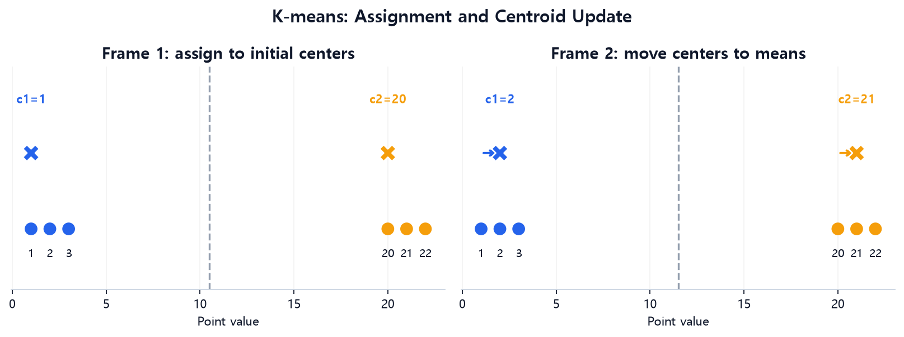
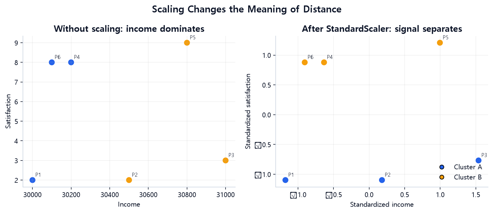
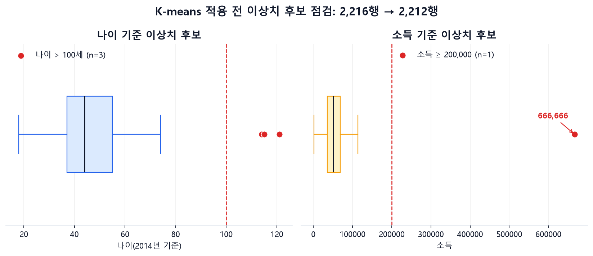
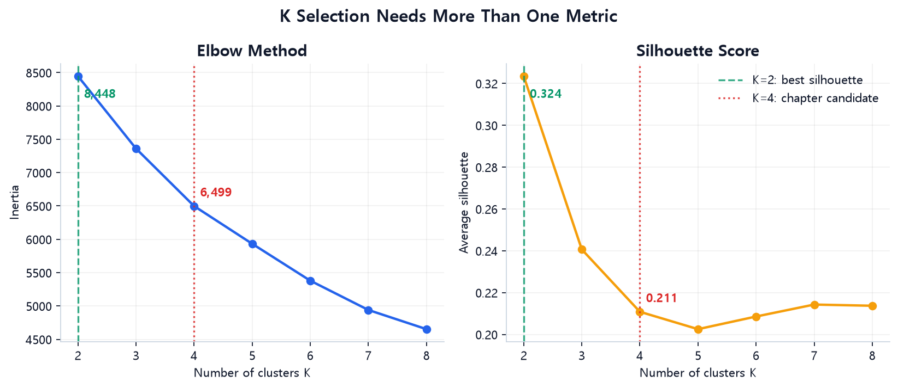
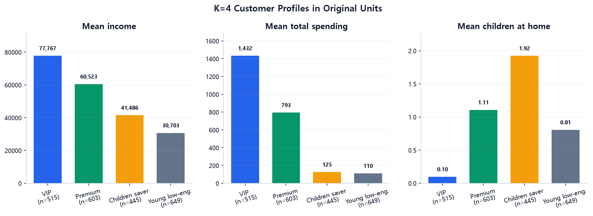

# 6주차 — Clustering

## 이번 주 목표

지금까지는 정답(target)이 있는 지도학습인 회귀와 분류를 다뤘습니다. 이번 주에는 정답 없이 비슷한 대상끼리 묶는 **비지도학습**, 그중에서도 K-means 군집분석을 배웁니다.

- K-means의 ‘배정 → 중심 이동’ 과정을 손으로 계산하고 무엇을 최소화하는지 이해합니다.
- 초기 중심점에 따라 결과가 달라지는 이유와 `k-means++`, `n_init`의 역할을 이해합니다.
- 거리 기반 분석에서 스케일링과 이상치가 결과를 어떻게 바꾸는지 확인합니다.
- K-means가 잘 작동하는 데이터 모양과 잘 작동하지 않는 조건을 구분합니다.
- Elbow, Silhouette, 안정성, 활용 가능성을 함께 고려해 K를 선택합니다.
- 각 군집을 번호가 아니라 사람이 이해하고 행동으로 옮길 수 있는 언어로 설명합니다.

## 이번 주 학습 지도

기본 학습은 약 **60~90분**을 예상합니다. 한 번에 진행하기 어렵다면 약 30~45분씩 두 번으로 나누어도 됩니다. 아래 시간에는 데이터 다운로드·환경 설치·오류 해결 시간이 포함되지 않으며, 반드시 채워야 하는 할당량이 아니라 학습 순서를 정하기 위한 길잡이입니다.

**첫 행동:** `06주차/example.ipynb`를 열고 `Part 1`의 중심 이동 셀부터 실행합니다. 이 Part는 내려받은 파일 없이 실행할 수 있습니다. 고객 원본이 없는 경우에도 과제 노트북의 연습용 거래 데이터로 K(만들 군집 수)=3 흐름을 시도할 수 있습니다.

| 단계 | 예상 시간 | `notion.md`에서 읽을 정확한 절 | `example.ipynb`에서 실행할 Part | 마쳐도 되는 지점 |
|---|---:|---|---|---|
| ✅ 기본 학습 | 약 60~90분 | `1. K-means — 원리부터 확인합니다`의 배정→중심 이동 예제와 그림 6-1까지, `2. 스케일링은 거리의 의미를 정합니다`, `4. 오늘 다룰 데이터 — Customer Personality Analysis`, `Part 2 — 데이터를 불러오고 결측치를 확인합니다`부터 `Part 5 — 스케일링합니다`까지, `Part 8~9 — 최종 모델과 군집 특성을 해석합니다`의 `cluster_summary` 표까지, `과제를 시작하는 가장 짧은 경로` | `Part 1`, `Part 2~5`, `Part 8`을 실행한 뒤, `Part 9`에서는 `cluster_summary = df.groupby(...)`로 시작해 군집별 평균표가 나오는 첫 코드 셀까지만 실행합니다. `Part 6~7`의 K 탐색은 건너뛰어도 됩니다. K=4는 기본 실행을 위한 제공값이며 적정 K라는 결론이 아닙니다. | K 하나로 군집을 한 번 만들고 과제의 `✅ 기본 시도`에서 군집 크기나 평균 하나를 기록하면 마쳐도 됩니다. |
| 🧩 도전 학습 | 기본 완료 후 약 25~40분 | `1.1 K-means가 최소화하는 값을 확인합니다`, `Part 6~7 — Elbow와 Silhouette을 함께 확인합니다` | `Part 6~7`을 실행합니다. | 목적함수의 뜻을 자신의 말로 적거나, K 후보별 그래프와 점수에서 관찰한 점 하나를 적으면 마쳐도 됩니다. |
| 🌱 확장 학습 | 도전 완료 후 약 25~45분 | `Part 8~9 — 최종 모델과 군집 특성을 해석합니다`의 3패널 그래프와 군집 해석, `6. 군집 결과를 여러 관점에서 검증합니다`, 과제의 `RFM을 만들 때 유지할 원칙` | `example.ipynb` Part 9에서 `fig, axes = plt.subplots(1, 3, ...)`로 시작하는 3패널 그래프 셀을 실행하고, 원하면 다른 시드나 K로 Part 8~9를 한 번 다시 실행합니다. 다섯 테이블 조인은 `assignment_baseline.ipynb`의 `2. 테이블 조인` 설명과 `sales['거래날짜'] = ...`로 시작하는 바로 아래 코드 셀에서 선택합니다. | 3패널 그래프 해석, 다섯 테이블 조인, 시드·표본·기간 안정성 가운데 하나만 골라 기록하면 마쳐도 됩니다. |

### 막혔을 때 먼저 확인합니다

다음 셀은 `06주차` 폴더에서 실행합니다. 예제 파일은 탭(`\t`) 구분자를 사용한다는 점도 함께 확인합니다.

```python
from pathlib import Path
import pandas as pd

marketing_path = Path('../dataset/extracted/Customer Personality Analysis/marketing_campaign.csv')
sales_path = Path('../dataset/extracted/이커머스 고객 세분화 분석 아이디어 경진대회/Onlinesales_info.csv')
marketing_required = {
    'Income', 'Dt_Customer', 'Year_Birth', 'Recency', 'Kidhome', 'Teenhome',
    'MntWines', 'MntFruits', 'MntMeatProducts', 'MntFishProducts',
    'MntSweetProducts', 'MntGoldProds', 'NumDealsPurchases',
    'NumWebPurchases', 'NumCatalogPurchases', 'NumStorePurchases',
}
sales_required = {'고객ID', '거래ID', '거래날짜', '수량', '평균금액'}

print('현재 작업 폴더:', Path.cwd())
if marketing_path.exists():
    columns = set(pd.read_csv(marketing_path, sep='\t', nrows=0).columns)
    print('마케팅 예제 누락 열:', sorted(marketing_required - columns))
else:
    print('마케팅 예제 파일이 없습니다.')
print('과제 거래내역 존재:', sales_path.exists())
if sales_path.exists():
    columns = set(pd.read_csv(sales_path, nrows=0).columns)
    print('과제 거래내역 누락 열:', sorted(sales_required - columns))
```

- 작업 폴더가 `06주차`가 아니면 상대경로가 달라집니다. `marketing_campaign.csv`가 한 열로만 읽히면 쉼표가 아니라 `sep='\t'`로 다시 읽습니다. 과제의 거래내역이 없으면 노트북이 연습용 데이터 모드로 이어집니다.
- `Income`이나 파생변수 열의 `KeyError`는 파일·구분자·앞 셀 가운데 하나가 맞지 않을 때 자주 나타납니다. 예제는 `Part 2~5`를 순서대로 실행한 뒤 `Part 8`, `Part 9`의 첫 요약 셀로 이동합니다.
- `X_scaled`가 없다는 오류는 스케일링 셀이 실행되지 않았다는 뜻입니다. 모델 입력은 결측이 없는 숫자 배열이어야 하므로 `pd.DataFrame(X_scaled).isna().sum().sum()`이 0인지 확인합니다.
- 필터 뒤 예제 고객이 4명보다 적거나 과제 RFM 고객이 3명 이하이면 각각 K=4 또는 K=3과 Silhouette 계산을 이어갈 수 없습니다. 이때는 삭제 기준과 조인 결과가 비어 있지 않은지 행 수부터 확인합니다.
- 군집 번호는 임의의 이름표이므로 대표 출력과 번호가 바뀌어도 오류가 아닙니다. 고객 수와 원본 변수 평균의 조합이 비슷한지 비교합니다.

해결하지 못해도 아래 네 줄을 남기면 이번 주 기본 기록을 마칠 수 있습니다. 이 네 줄은 주간 발표에서 시도 과정을 소개하는 한 장 메모로 그대로 사용할 수 있습니다.

```markdown
- 질문 1개:
- 실행 또는 실행 시도 1개:
- 관찰한 결과 또는 오류 1개:
- 다음 행동 1개:
```

## `notion.md`와 `example.ipynb`를 함께 읽는 방법

두 파일의 Part 번호는 서로 대응합니다. 다음 순서를 한 번의 학습 단위로 사용합니다.

| 단계 | `notion.md`에서 할 일 | `example.ipynb`에서 할 일 |
|---|---|---|
| 1. 예측 | 중심 이동, 군집 배정, 그래프 모양을 먼저 예상합니다. | 셀을 실행하기 전에 예상해 봅니다. |
| 2. 실행 | 핵심 코드와 확인할 출력 형식을 읽습니다. | 같은 Part의 셀을 위에서부터 실행합니다. |
| 3. 비교 | 이 문서의 대표 출력과 자신의 결과를 비교합니다. | 군집 번호보다 각 군집에 포함된 관측치를 비교합니다. |
| 4. 해석 | 전처리·거리·K가 결과에 준 영향을 문장으로 씁니다. | 시드, 스케일링, K를 바꾸어 민감도를 확인합니다. |

> **실행 결과 안내:** `example.ipynb`에는 저장된 셀 출력이 없습니다. 아래 출력은 제공 데이터와 `random_state=42`를 사용한 **대표 실행 결과**입니다. K-means의 군집 번호는 임의의 이름표이므로 번호가 서로 뒤바뀌어도 같은 분할일 수 있습니다.

---

## 1. K-means — 원리부터 확인합니다

> **학습 단계:** ✅ 기본 학습은 여기에서 시작합니다. 배정과 중심 이동을 이해하고 K 하나를 실행하는 데 먼저 집중합니다.

K-means는 가까운 점끼리 묶는 규칙을 다음 순서로 반복합니다.

1. 중심점(centroid)을 K개 정합니다.
2. 모든 점을 **가장 가까운 중심점**에 배정합니다.
3. 각 군집에 속한 점들의 **평균 위치로 중심점을 옮깁니다.**
4. 배정이나 중심점이 더 이상 거의 변하지 않을 때까지 2~3단계를 반복합니다.

`example.ipynb` Part 1에서는 숫자 6개 `[1, 2, 3, 20, 21, 22]`를 손으로 묶습니다. 다음 코드는 해당 셀을 그대로 실행할 수 있도록 옮긴 것입니다.

```python
import numpy as np

points = np.array([1, 2, 3, 20, 21, 22])
c1, c2 = 1, 20

for it in range(5):
    dist_to_c1 = np.abs(points - c1)
    dist_to_c2 = np.abs(points - c2)

    group1 = points[dist_to_c1 <= dist_to_c2]
    group2 = points[dist_to_c1 > dist_to_c2]

    new_c1, new_c2 = group1.mean(), group2.mean()
    print(
        f"{it}번째 반복: c1={c1:.1f}->{new_c1:.1f} (그룹={group1}), "
        f"c2={c2:.1f}->{new_c2:.1f} (그룹={group2})"
    )

    if new_c1 == c1 and new_c2 == c2:
        print("중심점이 더 안 움직임 -> 종료")
        break

    c1, c2 = new_c1, new_c2
```

대표 출력은 다음과 같습니다.

```text
0번째 반복: c1=1.0->2.0 (그룹=[1 2 3]), c2=20.0->21.0 (그룹=[20 21 22])
1번째 반복: c1=2.0->2.0 (그룹=[1 2 3]), c2=21.0->21.0 (그룹=[20 21 22])
중심점이 더 안 움직임 -> 종료
```

scikit-learn으로도 같은 중심을 확인할 수 있습니다.

```python
from sklearn.cluster import KMeans

km = KMeans(
    n_clusters=2,
    random_state=42,
    n_init=10,
).fit(points.reshape(-1, 1))

print("중심점:", np.sort(km.cluster_centers_.ravel()))
print("그룹별 값:", [
    points[km.labels_ == label].tolist()
    for label in np.unique(km.labels_)
])
```

대표 출력은 다음과 같습니다. 군집 목록의 순서는 뒤바뀔 수 있습니다.

```text
중심점: [ 2. 21.]
그룹별 값: [[20, 21, 22], [1, 2, 3]]
```

> 🔁 **예측 → 실행 → 비교 → 해석**
>
> 1. **예측:** 첫 배정 뒤 두 중심점이 어디로 이동할지 평균을 손으로 계산합니다.
> 2. **실행:** `example.ipynb` Part 1의 반복문 셀과 `KMeans` 셀을 실행합니다.
> 3. **비교:** 중심점이 2와 21인지 확인하고, 군집 번호가 아니라 포함된 숫자를 비교합니다.
> 4. **해석:** 중심점이 바뀌지 않을 때 반복이 종료되는 이유를 설명합니다.



*그림 6-1. 점 1·2·3의 평균 2와 점 20·21·22의 평균 21로 중심점이 이동한 뒤 수렴하는 과정입니다. `example.ipynb` Part 1의 `points = np.array([1, 2, 3, 20, 21, 22])` 반복문을 재현했습니다.*

> **그림 읽기 질문:** 첫 번째 배정 뒤 각 중심이 왜 2와 21로 이동합니까?

### 1.1 K-means가 최소화하는 값을 확인합니다

> **학습 단계:** 🧩 도전 학습입니다. 기본 학습에서는 배정→중심 이동의 직관까지만 확인하고, 목적함수와 지역 최적해는 나중에 읽어도 됩니다.

K-means의 목표는 각 점과 자신이 속한 군집 중심 사이의 **제곱 유클리드 거리 합**을 작게 만드는 것입니다.

$$
J = \sum_{k=1}^{K}\sum_{x_i \in C_k}\lVert x_i-\mu_k\rVert^2
$$

- $C_k$는 k번째 군집에 속한 점들의 집합입니다.
- $\mu_k$는 k번째 군집의 중심입니다.
- $J$는 scikit-learn에서 `inertia_`로 확인합니다.

배정 단계는 현재 중심에서 가장 가까운 군집을 고르고, 이동 단계는 배정된 점들의 평균을 새 중심으로 고릅니다. 두 단계는 inertia를 늘리지 않는 방향으로 진행되므로 결국 멈춥니다.

그러나 이 과정은 **전 세계에서 가장 작은 값(global optimum)** 을 보장하지 않습니다. 시작점 주변에서 더 줄일 수 없는 **지역 최적해(local optimum)** 에 멈출 수 있습니다.

### 1.2 초기화와 재현성을 관리합니다

초기 중심점이 다르면 최종 군집도 달라질 수 있습니다. 다음 세 설정의 역할을 구분해 두면 결과를 이해하는 데 도움이 됩니다.

- `init='k-means++'`는 초기 중심들이 한곳에 몰리지 않도록 비교적 멀리 퍼뜨려 선택합니다.
- `n_init=10`은 서로 다른 초기값으로 10번 학습하고 inertia가 가장 작은 결과를 선택합니다.
- `random_state=42`는 같은 환경에서 같은 난수 흐름을 재현하도록 돕습니다.

`n_init`을 늘리면 결과에 불리한 초기값 하나에 좌우될 가능성을 줄일 수 있지만, 데이터의 모양이 K-means 가정에 맞지 않는 문제까지 해결하지는 못합니다. 라이브러리 버전에 따라 기본값이 달라질 수 있으므로 재현 가능한 분석을 위해 값을 명시하는 편이 안전합니다.

---

## 2. 스케일링은 거리의 의미를 정합니다

K-means는 가깝다는 뜻을 유클리드 거리로 판단합니다. 따라서 변수의 단위와 숫자 범위가 곧 변수의 영향력이 됩니다.

`example.ipynb` Part 1의 두 번째 예제에는 6명의 소득과 만족도가 있습니다. 소득 차이는 그룹과 무관한 잡음으로 설계했고, 만족도는 2~3점과 8~9점으로 나뉩니다.

```python
import pandas as pd
from sklearn.preprocessing import StandardScaler

toy2 = pd.DataFrame({
    "소득": [30000, 30500, 31000, 30200, 30800, 30100],
    "만족도": [2, 2, 3, 8, 9, 8],
})

km_raw = KMeans(n_clusters=2, random_state=42, n_init=10).fit(toy2)

scaled = StandardScaler().fit_transform(toy2)
km_scaled = KMeans(n_clusters=2, random_state=42, n_init=10).fit(scaled)

print("스케일링 전:", km_raw.labels_)
print("스케일링 후:", km_scaled.labels_)
```

대표적으로 스케일링 전에는 소득이 비슷한 행끼리 묶여 만족도 2~3점과 8~9점이 섞입니다. 스케일링 후에는 앞의 세 행과 뒤의 세 행이 각각 같은 군집으로 나뉩니다. 군집 번호 0과 1의 방향은 실행에 따라 뒤바뀔 수 있으므로, 번호보다 각 군집에 포함된 관측치를 비교하는 편이 정확합니다.

> 🔁 **예측 → 실행 → 비교 → 해석**
>
> 1. **예측:** 소득과 만족도 중 어느 변수가 원본 거리에서 더 큰 영향을 줄지 적습니다.
> 2. **실행:** Part 1의 `km_raw`와 `km_scaled` 셀을 실행합니다.
> 3. **비교:** 번호가 아니라 각 군집에 포함된 행의 만족도 값을 비교합니다.
> 4. **해석:** 표준화가 만족도를 더 중요하게 만든 것이 아니라 두 변수의 1표준편차 변화를 같은 기준으로 비교하게 했다고 설명합니다.



*그림 6-2. 같은 여섯 관측치를 원본 좌표와 표준화 좌표에서 비교했습니다. `example.ipynb` Part 1의 `toy2`, `km_raw`, `StandardScaler`, `km_scaled` 셀을 같은 시드로 재현했습니다.*

> **그림 읽기 질문:** 원본 좌표에서 만족도 차이가 보이는데도 소득이 군집을 지배하는 이유는 무엇입니까?

여기서 기억할 점은 모든 상황에 같은 스케일링을 기계적으로 적용하는 것이 아니라, 변수의 단위와 분석 목적에 맞추어 선택한다는 것입니다.

> **각 변수의 원래 단위와 범위가 의도한 중요도를 나타내지 않는다면 스케일링이 필요합니다.**

- 소득(원)과 만족도(점)처럼 단위가 다르면 보통 스케일링합니다.
- 모든 변수가 같은 단위이고 원래 거리가 업무상 비용을 정확히 나타낸다면 스케일링하지 않는 편이 더 자연스러울 수 있습니다.
- 특정 변수를 두 배 중요하게 반영하려면 단순 표준화 후에도 별도의 가중치를 설계할 수 있습니다.
- `StandardScaler`는 각 변수의 분산을 같게 취급합니다. 이는 중립적인 사실이 아니라 **군집의 모양을 바꾸는 모델링 선택**입니다.

이상치가 있으면 평균과 표준편차도 영향을 받을 수 있습니다. 먼저 오류 여부를 조사한 뒤 필요한 경우 로그 변환이나 `RobustScaler`를 비교합니다. 전처리 방법별로 군집이 얼마나 달라지는지도 기록하면 전처리 선택의 영향을 이해하는 데 도움이 됩니다.

---

## 3. K-means가 잘 맞는 조건과 한계를 확인합니다

| 조건 | K-means에 주는 영향 |
|---|---|
| 수치형 변수 | 평균과 유클리드 거리를 자연스럽게 사용할 수 있습니다. |
| 둥글고 볼록한 군집 | 중심에서 가까운 점을 묶는 방식과 잘 맞습니다. |
| 군집 크기와 밀도가 비슷한 구조 | 큰 군집이 작은 군집을 흡수하거나 밀도가 다른 군집을 잘못 자르는 문제가 줄어듭니다. |
| 극단적 이상치가 적은 구조 | 평균 중심점이 멀리 끌려가는 현상이 줄어듭니다. |
| K를 미리 정할 수 있는 문제 | 알고리즘이 군집 수를 스스로 정하지 않으므로 적용하기 쉽습니다. |

다음 상황에서는 K-means의 적합성을 조금 더 신중히 살펴보는 것이 좋습니다.

- 초승달처럼 휘어 있거나 고리 모양인 군집입니다.
- 크기나 밀도가 크게 다른 군집입니다.
- 범주형 코드가 섞인 데이터입니다.
- 이상치 자체가 중요한 희귀 집단인 데이터입니다.
- 변수 수가 매우 많아 점 사이 거리가 서로 비슷해지는 데이터입니다.

범주형 값을 0, 1, 2로 바꾸어 K-means에 넣으면 숫자 사이의 순서와 거리가 있다고 가정합니다. 지역 A=0, B=1, C=2일 때 A와 C가 B보다 두 배 멀다는 의미는 없습니다. 이 경우에는 범주형 자료에 맞는 거리나 다른 군집 알고리즘을 검토하는 것이 좋습니다.

K-means가 만든 군집은 데이터 안에 원래 존재하던 절대적 정답을 발견했다기보다, **선택한 변수·전처리·거리·K 아래에서 유사성을 정의한 결과**입니다.

---

## 4. 오늘 다룰 데이터 — Customer Personality Analysis

마케팅 캠페인 고객 2,240명의 데이터입니다. 소득, 출생연도, 카테고리별 지출액, 자녀 수, 구매 채널별 횟수 등이 담겨 있습니다.

> 📥 **예제 데이터 다운로드**  
> [Kaggle Customer Personality Analysis](https://www.kaggle.com/datasets/imakash3011/customer-personality-analysis) 페이지에서 원본 데이터를 내려받을 수 있습니다. Kaggle에 로그인한 뒤 **Download**를 선택합니다. 압축을 푼 `marketing_campaign.csv`를 아래 코드에 적힌 경로에 두면 준비된 셀을 그대로 실행할 수 있습니다.

---

## 5. 노트북을 순서대로 실행합니다

### Part 2 — 데이터를 불러오고 결측치를 확인합니다

```python
df = pd.read_csv(
    "../dataset/extracted/Customer Personality Analysis/"
    "marketing_campaign.csv",
    sep="\t",
)

print(df.shape)
print(df.isna().sum()[df.isna().sum() > 0])

df = df.dropna(subset=["Income"]).reset_index(drop=True)
print(df.shape)
```

대표 출력은 다음과 같습니다.

```text
(2240, 29)
Income    24
dtype: int64
(2216, 29)
```

`Income` 결측은 약 1.1%이므로 노트북에서는 해당 행을 제거합니다. 다만 결측 비율이 작더라도 결측 고객이 특정 연령·지역·소비 수준에 몰려 있다면 제거 후 군집 분포가 달라질 수 있습니다. 실무에서는 결측 집단과 비결측 집단의 다른 변수 분포를 먼저 비교하면 제거에 따른 편향 가능성을 살펴볼 수 있습니다.

### Part 3 — 파생변수를 만듭니다

고객을 요약하는 수치 변수를 다음과 같이 만듭니다.

- `Age`는 기준연도에서 출생연도를 뺀 값입니다.
- `Total_Spending`은 품목별 지출액의 합입니다.
- `Purchase_Activity_Sum`은 할인 구매 횟수와 채널별 구매 횟수를 더한 **구매 활동 합계**입니다.
- `Children_at_Home`은 `Kidhome + Teenhome`으로 계산한 **동거 자녀 수**입니다.

파생변수의 이름과 정의를 정확히 읽어 두면 이후 해석을 더 명확하게 할 수 있습니다.

- `Children_at_Home`은 성인 구성원을 포함한 가족 규모가 아닙니다. 변수 이름처럼 ‘동거 자녀 수’로 설명합니다.
- `NumDealsPurchases`는 할인 구매 횟수이고 웹·카탈로그·매장 구매는 채널별 횟수입니다. 두 차원이 겹칠 가능성이 있으므로 `Purchase_Activity_Sum`은 고유 거래 건수가 아니라 **서로 겹칠 수 있는 활동 지표의 합**입니다. 데이터 설명서에서 중복 여부를 확인하기 전에는 ‘총 구매 건수’라고 부르지 않습니다.
- `Age`와 Recency는 **고정된 분석 기준일**을 사용하면 결과를 재현하기 쉽습니다. 시스템의 오늘 날짜를 그대로 사용하면 실행 시점마다 값이 바뀌기 때문입니다. 이 노트북의 `Age`는 고객 등록일의 최대 연도인 2014년을 기준으로 계산합니다.

좋은 군집은 알고리즘보다 입력 특징에서 시작합니다. 같은 원본 데이터라도 지출만 사용할 때, 가족 특성까지 사용할 때, 할인 민감도를 사용할 때 서로 다른 고객 유사성을 정의합니다.

### Part 4 — 이상치를 확인하고 처리합니다

다음 셀은 `Age > 100`인 고객 수와 상위 소득을 확인합니다.

```python
print("Age > 100인 사람 수:", (df["Age"] > 100).sum())
print("Income 상위 5개:")
print(df["Income"].sort_values(ascending=False).head().tolist())

df = df[
    (df["Age"] <= 100) &
    (df["Income"] < 200000)
].reset_index(drop=True)

print("필터 적용 후:", df.shape)
```

대표 출력은 다음과 같습니다.

```text
Age > 100인 사람 수: 3
Income 상위 5개:
[666666.0, 162397.0, 160803.0, 157733.0, 157243.0]
필터 적용 후: (2212, 33)
```

파생변수 네 개가 추가되었으므로 필터 적용 후 열 수는 33개입니다. 노트북은 100세 초과 고객 3명과 소득 666,666인 고객 1명을 입력 오류 가능성이 높은 값으로 보고 제거합니다.

다만 **멀리 떨어져 있다는 이유만으로 바로 제거하기보다는 값의 배경을 먼저 살펴보는 것이 좋습니다.** 실제 VIP 고객일 수도 있고 희귀 집단이 분석 목적일 수도 있기 때문입니다. 다음 내용을 기록하면 판단 근거를 분명하게 남길 수 있습니다.

1. 도메인상 불가능한 값인지 단지 드문 값인지 확인합니다.
2. 제거 기준을 군집 결과를 보기 전에 정했는지 밝힙니다.
3. 이상치를 포함했을 때와 제외했을 때 K와 군집 특성이 얼마나 달라지는지 비교합니다.



*그림 6-3. 100세 초과 고객 3명과 소득 666,666 고객 1명을 제거 후보로 표시했습니다. `example.ipynb` Part 3~4의 파생변수와 필터를 사용했으며, 필터 전후 표본 수는 2,216명에서 2,212명입니다.*

> **그림 읽기 질문:** 이 네 관측치를 오류라고 단정하려면 어떤 추가 정보가 필요합니까?

### Part 5 — 스케일링합니다

사용 변수는 `Income`, `Age`, `Total_Spending`, `Recency`, `Children_at_Home`, `Purchase_Activity_Sum`입니다. 단위와 범위가 크게 다르므로 이 예제에서는 `StandardScaler`가 합리적입니다. 스케일링하지 않으면 수만 단위의 Income이 자녀 수나 Recency보다 거리에 훨씬 크게 반영됩니다.

현재처럼 한 시점의 전체 고객을 탐색적으로 세분화할 때는 전체 코호트에 scaler를 fit할 수 있습니다. 반면 신규 고객에게 기존 군집을 일관되게 배정하려면 다음 순서를 사용하는 것이 좋습니다.

1. 기준 고객 집단에서 scaler와 K-means를 fit합니다.
2. 신규 고객은 기존 scaler로 transform합니다.
3. 기존 중심점에 가장 가까운 군집을 배정합니다.

신규 고객이 들어올 때마다 scaler를 다시 fit하면 좌표계와 중심의 의미가 바뀌어 지난달 군집과 직접 비교하기 어려워집니다.

### Part 6~7 — Elbow와 Silhouette을 함께 확인합니다

> **학습 단계:** 🧩 도전 학습입니다. 기본 군집 한 번을 마친 뒤 여러 K를 비교하고 싶을 때 진행합니다.

다음 코드는 노트북의 두 탐색 셀에서 공통 계산 부분을 모은 것입니다.

```python
from sklearn.metrics import silhouette_score

K_range = range(2, 9)
inertias = []
sil_scores = []

for k in K_range:
    km = KMeans(
        n_clusters=k,
        random_state=42,
        n_init=10,
    ).fit(X_scaled)

    inertias.append(km.inertia_)
    sil_scores.append(silhouette_score(X_scaled, km.labels_))

for k, inertia, silhouette in zip(K_range, inertias, sil_scores):
    print(
        f"K={k}: inertia={inertia:.1f}, "
        f"silhouette={silhouette:.3f}"
    )
```

K를 늘리면 각 점이 더 가까운 중심을 선택할 수 있으므로 inertia는 **항상 같거나 감소합니다.** 따라서 가장 작은 inertia만으로는 K를 선택하기 어렵습니다. Elbow Method는 K를 늘렸을 때 감소 폭이 둔해지는 지점을 찾지만, 이 데이터의 곡선에는 뚜렷한 팔꿈치가 없습니다.

노트북이 탐색한 K=2~8 중에는 **K=2의 평균 실루엣 점수가 가장 높습니다.** 그러나 두 집단만으로 나누면 마케팅 행동으로 연결하기에 지나치게 거칠 수 있습니다. 이 장에서는 세분화의 활용 가능성과 해석 가능성을 고려해 **K=4**를 탐색 후보로 선택합니다.

K=2와 K=4는 서로 다른 기준에서 살펴본 후보입니다. K=2는 이 범위에서 실루엣이 가장 높고, K=4는 활용 가능성과 해석 가능성을 더 세분화해 살펴보려는 선택입니다. 실루엣도 둥글고 잘 떨어진 군집을 선호하는 내부 지표 중 하나이므로, K=4를 실제로 채택하려면 군집별 고객 수, 여러 초기값·표본에서의 안정성, 캠페인 차별화 가능성까지 확인하는 것이 좋습니다.

> 🔁 **예측 → 실행 → 비교 → 해석**
>
> 1. **예측:** K가 커질 때 inertia와 silhouette이 각각 반드시 감소하는지 먼저 답합니다.
> 2. **실행:** Part 6의 Elbow 셀과 Part 7의 Silhouette 셀을 실행합니다.
> 3. **비교:** inertia는 감소하지만 silhouette은 단조롭게 변하지 않는다는 점을 확인합니다.
> 4. **해석:** K=2와 K=4 중 하나를 고른 뒤 내부 품질, 해석 가능성, 활용 가능성을 각각 근거로 씁니다.



*그림 6-4. K=2~8의 inertia와 평균 silhouette을 같은 가로축에서 비교했습니다. `example.ipynb` Part 6~7의 `K_range`, `inertias`, `sil_scores` 계산을 재현했으며 K=2와 K=4를 각각 초록색과 빨간색으로 표시했습니다.*

> **그림 읽기 질문:** silhouette이 가장 높은 K=2 대신 K=4를 후보로 둘 때 추가로 검증해야 할 것은 무엇입니까?

서로 다른 특징 집합이나 스케일링으로 계산한 inertia는 거리의 좌표계가 서로 다릅니다. 따라서 동일한 특징과 전처리 조건 안에서 값을 비교하면 의미를 일관되게 해석할 수 있습니다.

### Part 8~9 — 최종 모델과 군집 특성을 해석합니다

노트북은 다음 설정을 사용합니다. 기본 학습에서 사용하는 **K=4는 코드를 한 번 실행하기 위한 제공값이며, 적정 K라는 결론이 아닙니다.** K의 근거를 비교하는 일은 도전 학습의 Part 6~7에서 이어갑니다.

```python
k_final = 4

km_final = KMeans(
    n_clusters=k_final,
    random_state=42,
    n_init=10,
).fit(X_scaled)

df["Cluster"] = km_final.labels_

cluster_counts = df["Cluster"].value_counts().sort_index()
cluster_summary = df.groupby("Cluster")[features].mean()

print(cluster_counts)
display(cluster_summary)
```

> **기본 학습 멈춤:** `example.ipynb` Part 9의 첫 `cluster_summary` 셀에서 군집 크기 또는 평균 하나를 적으면 됩니다. 아래의 완성된 이름·3패널 그래프·안정성 해석은 기본 완료에 필요하지 않습니다.

> **학습 단계:** 🌱 확장 학습에서는 Part 9의 다음 그래프 셀과 아래 해석 예시를 이어서 확인합니다.

`random_state`는 결과 재현을 돕고, `n_init=10`은 여러 초기값 중 inertia가 가장 낮은 결과를 고릅니다. 한 번의 시드에서 얻은 결과와 함께 시드를 바꾸거나 고객을 재표본추출했을 때도 비슷한 중심 특성이 나타나는지 살펴보면 군집의 안정성을 더 잘 판단할 수 있습니다.

스케일된 값은 학습에는 편리하지만 “소득 -0.8”처럼 사람이 이해하기 어렵습니다. 따라서 원본 단위로 군집별 평균·중앙값·고객 수를 계산해 해석합니다. 노트북의 대표 실행 결과를 사람이 읽을 수 있는 이름으로 정리하면 다음과 같습니다.

| 대표 실행의 Cluster | 해석용 이름 | 주요 특징 |
|---:|---|---|
| 3 | VIP | 평균 소득 최고(77,767), 평균 지출 최고(1,432), 동거 자녀가 거의 없습니다. |
| 2 | 우량 | 중상위 소득(60,523), 지출이 많고 구매 활동 합계도 큽니다. |
| 0 | 자녀 동거 알뜰 | 중하위 소득(41,486), 지출이 적고 동거 자녀가 많습니다(1.92). |
| 1 | 젊은 저관여 | 평균 소득 최저(30,703), 평균 나이 최저(37.2), 지출 최저입니다. |

군집 번호는 다시 학습하면 바뀔 수 있으므로 “Cluster 2는 영원히 VIP입니다”처럼 고정된 의미로 저장하면 다음 학습 결과와 맞지 않을 수 있습니다. 대신 중심 특성을 기준으로 이름을 다시 매핑하거나 학습한 모델과 매핑표를 함께 버전 관리하는 것이 좋습니다.

Income과 Total_Spending이 함께 높고, 자녀 수가 많은 군집에서 지출이 낮은 패턴이 관찰됩니다. 그러나 이 표만으로 **자녀 때문에 지출이 감소했다는 인과관계**까지 확인할 수는 없습니다. 소득, 연령, 고객 가입 기간 등 다른 요인이 함께 작용했을 수 있습니다. “이 데이터의 군집 평균에서 두 특성이 함께 나타났습니다”처럼 관찰 수준으로 표현하면 인과관계를 과도하게 해석하는 일을 피할 수 있습니다.

> 🔁 **예측 → 실행 → 비교 → 해석**
>
> 1. **예측:** 스케일된 중심값만 보고 군집 이름을 붙일 때 어떤 문제가 생기는지 적습니다.
> 2. **실행:** Part 8의 최종 학습 셀과 Part 9의 `cluster_summary`·막대그래프 셀을 실행합니다.
> 3. **비교:** 군집 번호가 아니라 원본 단위의 소득·지출·자녀 수 조합을 위 표와 비교합니다.
> 4. **해석:** 각 군집에 이름, 근거 수치, 제안 행동, 이후 검증 지표를 하나씩 연결합니다.



*그림 6-5. K=4 고객 군집의 평균 소득·총지출·동거 자녀 수를 원본 단위로 비교했습니다. `example.ipynb` Part 9의 `cluster_summary`를 재현했으며, 군집 번호 대신 중심 특성으로 이름을 안정적으로 매핑했습니다.*

> **그림 읽기 질문:** VIP와 우량 군집을 구분하는 수치는 무엇이며, 평균만으로 충분합니까?

---

## 6. 군집 결과를 여러 관점에서 검증합니다

> **학습 단계:** 🌱 확장 학습입니다. 다섯 테이블 조인이나 시드·표본·기간에 따른 안정성까지 확인하려는 경우에 읽습니다.

군집에는 정답 라벨이 없으므로 정확도 하나로 평가할 수 없습니다. 다음 네 가지 증거를 함께 확인합니다.

1. **내부 품질:** inertia의 감소 양상과 silhouette을 확인합니다.
2. **안정성:** 시드, 표본, 기간을 바꾸어도 비슷한 군집과 중심 특성이 나오는지 확인합니다.
3. **실용성:** 각 군집의 규모가 충분하고 서로 다른 행동을 설계할 수 있는지 확인합니다.
4. **외부 타당성:** 군집 생성에 사용하지 않은 이후 구매율이나 캠페인 반응에서 실제 차이가 나는지 확인합니다.

K와 군집 이름을 같은 데이터에서 여러 번 바꾸어 골랐다면 현재 결과는 **탐색적 가설**입니다. 다음 기간 고객에게 적용해 군집 비율과 특징이 재현되는지 확인하면 더 강한 결론을 얻을 수 있습니다.

### 시간 누수를 예방합니다

고객을 2025년 12월 31일 기준으로 세분화한다고 가정합니다. 2026년 구매 내역을 RFM이나 총지출에 넣으면 미래 정보가 들어갑니다. 이후 캠페인 반응을 검증할 때는 다음처럼 시간을 나눕니다.

```text
[관찰 기간: RFM·특징 생성] → [기준일: 군집 배정] → [평가 기간: 이후 반응 확인]
```

이 구분이 없으면 미래에 구매할 고객을 미래 구매액으로 미리 VIP라고 부르는 순환 논리가 생깁니다.

---

## 7. 인사이트를 근거와 함께 씁니다

다음 문장 구조를 활용합니다.

> 표현하려는 고객 행동을 정합니다 → 변수를 선택합니다 → 전처리를 밝힙니다 → K 후보의 비교 근거를 제시합니다 → 최종 K의 선택 이유를 설명합니다 → 각 군집의 차이를 원본 단위로 씁니다 → 행동과 검증 계획을 제시합니다.

예시는 다음과 같습니다.

> “K=2의 silhouette이 가장 높았지만 캠페인을 두 종류로만 나누기에는 특성이 지나치게 넓었습니다. K=4에서는 각 군집의 규모가 충분했고 소득·지출·동거 자녀 수 조합이 구분되어 해석 가능성이 높았습니다. 다만 한 시점의 탐색 결과이므로 다음 분기 고객에서 군집 안정성과 캠페인 반응 차이를 추가로 확인하겠습니다.”

---

## 8. 학습하면서 자주 확인할 점

1. **스케일링을 적용하거나 생략한 이유를 기록합니다.**  
   변수별 거리에 어떤 가중치를 주는지 설명하면 결과를 더 쉽게 해석할 수 있습니다.
2. **범주형 코드를 사용할 때 숫자 간 거리의 의미를 확인합니다.**  
   실제 순서와 거리가 없다면 범주형 자료에 맞는 거리나 다른 알고리즘을 검토합니다.
3. **이상치를 처리하기 전에 오류인지 희귀 고객인지 살펴봅니다.**  
   제거 기준과 민감도 분석을 함께 남기면 판단 과정을 투명하게 설명할 수 있습니다.
4. **silhouette과 함께 안정성, 군집 크기, 활용 가능성을 확인합니다.**  
   여러 근거를 함께 보면 K를 하나의 지표에만 의존해 선택하는 일을 줄일 수 있습니다.
5. **여러 초기값과 재표본에서 중심 특성이 유지되는지 확인합니다.**  
   한 번의 `random_state` 결과보다 군집의 안정성을 더 잘 이해할 수 있습니다.
6. **군집 번호보다 중심 특성을 기준으로 이름을 붙입니다.**  
   번호는 임의의 라벨이며 다시 학습하면 바뀔 수 있습니다.
7. **평균과 함께 중앙값, 사분위수, 분포와 군집 크기를 확인합니다.**  
   군집 안의 모든 고객이 평균과 같은 특징을 가진 것은 아니기 때문입니다.
8. **관찰된 군집 차이와 인과관계를 구분합니다.**  
   군집은 패턴을 요약하지만 그 차이의 원인까지 증명하지는 않습니다.

---

## 9. 과제 안내 — 이커머스 고객 세분화

> 📥 **과제 데이터 다운로드**  
> [데이콘 이커머스 고객 세분화 경진대회](https://dacon.io/competitions/official/236222) 페이지에서 원본 데이터와 다섯 테이블의 설명을 확인할 수 있습니다. 페이지에 로그인한 뒤 데이터 탭의 안내에 따라 내려받습니다. 압축을 푼 파일을 `assignment_baseline.ipynb`에 적힌 경로에 두면 준비된 코드를 그대로 실행할 수 있습니다.

베이스라인(`assignment_baseline.ipynb`)은 거래내역으로 고객별 **RFM(Recency·Frequency·Monetary)** 을 계산합니다. 고객정보·할인정보·세율·마케팅비용 파일이 모두 있으면 다섯 테이블 조인도 함께 실행하며, 일부 부가 파일이 없어도 거래내역만으로 기본 군집 시도를 계속할 수 있게 구성합니다.

### 과제를 시작하는 가장 짧은 경로

이 과제는 가장 좋은 K나 완성된 고객 전략을 찾는 일이 기본 목표가 아닙니다. **한 번 군집을 실행하거나, 멈춘 문제를 나누고 다음 행동을 정하는 과정**이 더 중요합니다.

| 구분 | 이번 주에 할 일 |
|---|---|
| ✅ 기본 시도 | 거래내역으로 RFM을 만들고 `log1p`와 `StandardScaler`를 적용한 뒤, 탐색 출발점인 K=3을 한 번 실행해 군집 크기와 RFM 평균을 봅니다. |
| 🧩 문제 분해 | 파일·조인 키·날짜 변환·결측·스케일링 가운데 어디에서 멈췄는지 나누고 오류와 작은 확인 결과를 적습니다. |
| 🌱 선택 탐색 | K=2~6 비교, 다른 스케일링, 부가 테이블 조인, 군집 이름 붙이기 가운데 한 가지만 골라 봅니다. |

먼저 파일 상태를 확인합니다. 기본 시도에 꼭 필요한 파일은 거래내역 하나입니다.

```python
from pathlib import Path

data_dir = Path('../dataset/extracted/이커머스 고객 세분화 분석 아이디어 경진대회')
files = {
    '기본 거래내역': data_dir / 'Onlinesales_info.csv',
    '선택 고객정보': data_dir / 'Customer_info.csv',
    '선택 할인정보': data_dir / 'Discount_info.csv',
    '선택 세율': data_dir / 'Tax_info.csv',
    '선택 마케팅비용': data_dir / 'Marketing_info.csv',
}
print('현재 작업 폴더:', Path.cwd())
for name, path in files.items():
    print(name, path.exists())
```

`기본 거래내역`이 `False`이면 압축 해제 폴더 이름과 현재 작업 폴더가 `06주차`인지 확인합니다. 노트북은 그동안 18명의 연습용 소규모 거래 데이터로 RFM과 K=3 흐름을 이어가며, 예시 군집은 실제 고객 세분화 결론으로 해석하지 않습니다. 나머지 네 파일이 없으면 조인 단계만 건너뛰고 실제 거래내역 하나로 기본 군집 시도를 계속할 수 있습니다. 최소 실행 경로는 **거래내역 확인 → 고객별 RFM 계산 → `log1p`와 스케일링 → K=3 한 번 학습 → 군집 크기와 평균 한 번 확인**입니다.

### RFM을 만들 때 유지할 원칙

- `Frequency`는 행 수가 아니라 `거래ID`의 고유값 수로 계산합니다. 한 거래에 여러 상품 행이 있을 수 있기 때문입니다.
- RFM 기준일과 관찰 기간을 기록합니다. Recency는 기준일에서 마지막 구매일을 뺀 값이므로 **작을수록 최근 고객**입니다.
- RFM은 오른쪽 꼬리가 길 수 있습니다. 기본 시도에서는 세 변수에 `log1p`를 적용하고 스케일을 맞추지만, 이것이 유일한 정답은 아닙니다.
- `discount` 테이블을 선택 조인할 때 일부 카테고리의 결측을 0으로 채우려면 “할인 정보 없음”을 “할인 없음”으로 해석해도 되는지 데이터 설명을 먼저 확인합니다.
- K=3은 코드를 끝까지 실행하기 위한 출발점이지 적정 K라는 결론이 아닙니다. Elbow와 Silhouette, 안정성, 활용 가능성을 함께 비교하는 일은 선택 탐색입니다.
- 현재 전체 관찰 기간을 설명하는 군집과 미래 고객에게 적용할 모델을 구분합니다. 미래 적용이 목적이면 scaler와 K-means를 기준 기간 고객에게만 fit하고 이후 고객에는 transform·predict만 수행합니다.
- Recency가 크다는 관찰만으로 “이탈위험군”이라고 확정하지 않습니다. 실제 미구매 여부를 검증하기 전에는 “장기 미구매 후보군”처럼 가설임을 드러내는 이름을 사용합니다.

### 여기까지 하면 이번 주 기록 완료

다음 네 항목이 있으면 군집 이름이나 최적 K를 정하지 못했더라도 이번 주 기록을 마친 것입니다.

- 질문 1개
- 실행 또는 실행 시도 1개
- 관찰한 결과 또는 오류 1개
- 다음 행동 1개

---

## 10. 장 요약

- K-means는 군집 내 제곱거리 합인 inertia를 줄이도록 배정과 중심 이동을 반복합니다.
- 초기값에 따라 지역 최적해가 달라질 수 있으므로 `k-means++`, `n_init`, `random_state`를 명시하면 결과를 재현하기 쉽습니다.
- 스케일링은 단순 전처리가 아니라 변수별 거리에 주는 가중치를 정하는 선택입니다.
- K-means는 수치형이며 둥글고 크기와 밀도가 비슷한 군집에 잘 맞고, 이상치와 복잡한 모양에 약합니다.
- Elbow와 silhouette만으로 유일한 정답 K를 얻기는 어려우며, 안정성·규모·활용 가능성·외부 타당성을 함께 확인하는 것이 좋습니다.
- 군집 번호에는 의미가 없으며 이름은 원본 단위의 분포를 근거로 붙여야 합니다.
- 군집에서 관찰한 차이는 인과관계가 아닙니다.
- 미래 고객에게 적용할 때는 scaler와 중심점을 기준 집단에서만 fit하여 시간 누수를 예방합니다.

## 다음 주와 연결하기

이번 주에는 변수 공간의 거리로 비슷한 고객을 묶고, 입력 데이터의 대표성이 군집 해석에 미치는 영향을 살펴봤습니다. 다음 주에는 같은 거리 관점을 실제 위경도 공간으로 옮겨 접근성을 계산하고, 제한된 후보 중 우선 위치를 선택합니다.

## 11. 🌱 선택 이해 점검

아래 문제는 기본 기록을 마친 뒤 개념을 더 확인하고 싶을 때 골라 봅니다. 모두 풀 필요는 없습니다.

1. K를 3에서 4로 늘렸을 때 inertia가 커질 수 있습니까? 그 이유는 무엇입니까?
2. 소득과 만족도를 함께 군집화할 때 보통 스케일링이 필요한 이유는 무엇이며, 스케일링하지 않는 편이 나은 예외는 무엇입니까?
3. `n_init=10`은 어떤 문제를 줄이기 위한 설정입니까?
4. 서로 감싸는 두 개의 초승달 모양 데이터에 K-means가 잘 맞지 않는 이유는 무엇입니까?
5. K=2의 silhouette이 가장 높고 K=4가 더 행동 가능한 고객군을 만든다면, K=4를 채택하기 전에 무엇을 추가로 확인해야 합니까?

### 해설 가이드

1. 같은 데이터와 전처리에서 올바르게 최적화했다면 이론적으로 **커지지 않습니다.** 중심이 하나 더 생기면 기존 배정을 유지하거나 더 가까운 중심으로 옮길 수 있기 때문입니다. 실제 실행에서는 지역 최적해와 초기화 때문에 기대와 다른 수치가 나올 수 있으므로 `n_init`을 충분히 설정하면 도움이 됩니다.
2. 숫자 범위가 큰 소득이 거리를 압도하기 때문입니다. 반대로 모든 변수가 같은 단위이고 원래 거리 차이가 업무상 중요도를 정확히 나타낸다면 원본 스케일을 유지할 수 있습니다.
3. 서로 다른 초기 중심 때문에 좋지 않은 지역 최적해에 멈추는 위험을 줄입니다.
4. K-means는 중심에서 가까운 볼록한 영역으로 공간을 나누므로 휘어진 비볼록 군집의 모양을 따라가기 어렵습니다.
5. 군집별 크기, 여러 시드·표본·기간에서의 안정성, 해석 가능성, 캠페인 차별화 가능성, 이후 행동과의 외부 타당성을 확인하는 것이 좋습니다.

## 용어집

| 용어 | 뜻 |
|---|---|
| centroid | 군집에 속한 점들의 평균 위치 |
| inertia | 각 점과 자기 군집 중심 사이 제곱거리의 합 |
| local optimum | 현재 주변에서는 더 좋아지지 않지만 전체에서 가장 좋은 해라는 보장은 없는 상태 |
| k-means++ | 초기 중심이 서로 퍼지도록 선택해 나쁜 초기화를 줄이는 방법 |
| n_init | 서로 다른 초기값으로 K-means를 반복 실행하는 횟수 |
| Elbow Method | K에 따른 inertia 감소가 둔해지는 지점을 찾는 방법 |
| Silhouette Score | 자기 군집과는 가깝고 다른 군집과는 먼 정도를 -1~1로 나타낸 값 |
| StandardScaler | 변수를 평균 0, 표준편차 1이 되도록 변환하는 도구 |
| RobustScaler | 중앙값과 사분위 범위를 이용해 이상치 영향을 덜 받도록 변환하는 도구 |
| cluster stability | 표본·초기값·기간이 달라도 비슷한 군집 구조가 유지되는 정도 |
| RFM | Recency(최근성)·Frequency(빈도)·Monetary(금액)로 고객 행동을 요약하는 방법 |
| time leakage | 군집 기준일 이후의 정보가 특징 생성에 들어가는 문제 |
