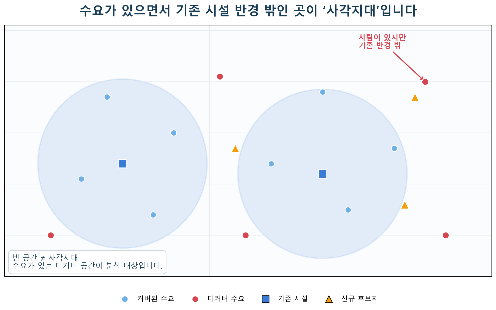
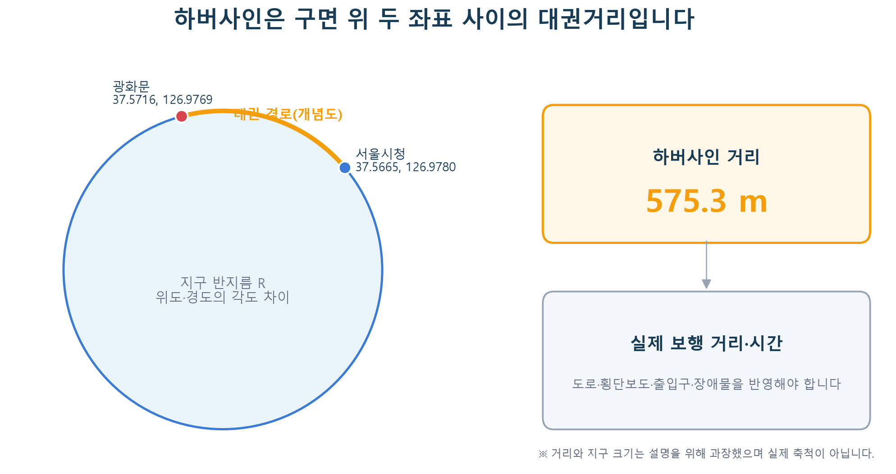
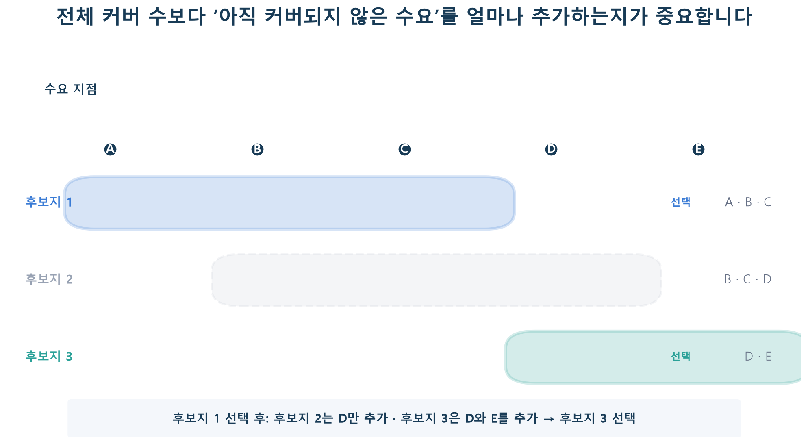
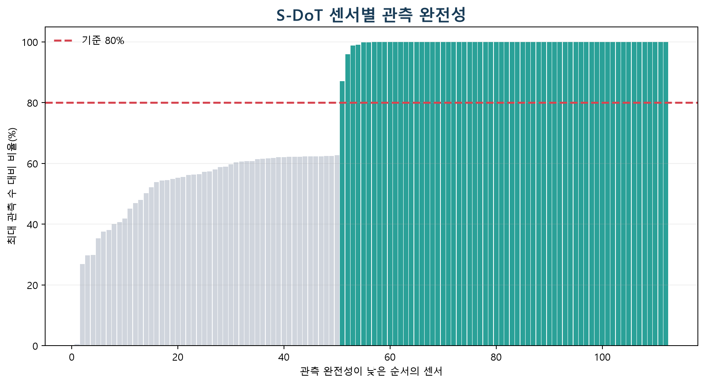
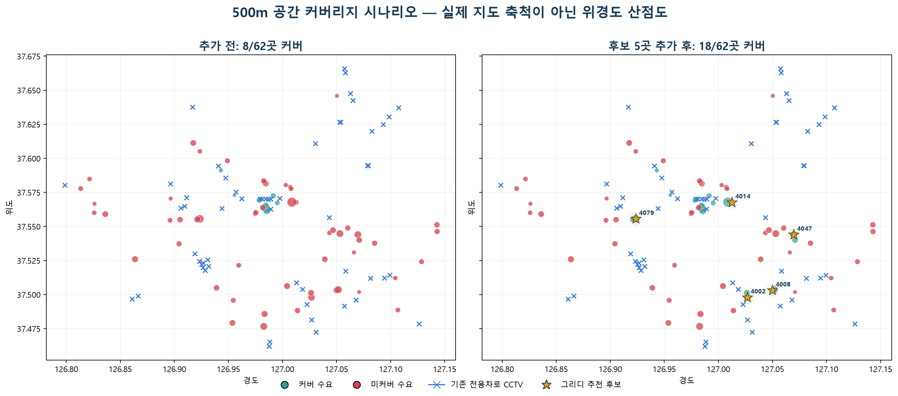
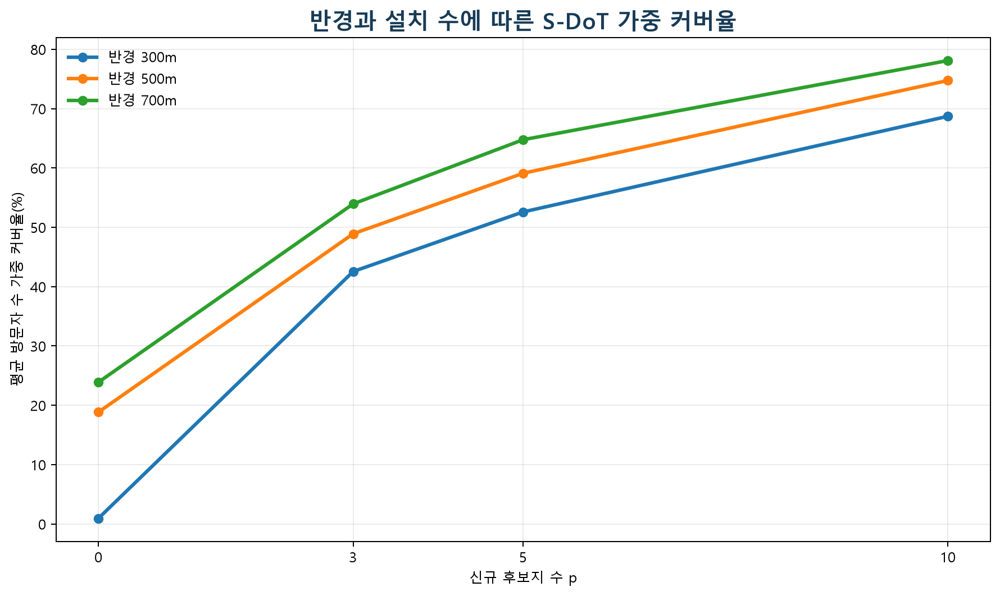

# 7주차 — 사각지대/접근성 분석

## 이번 주 목표

지금까지는 주어진 대상의 값을 예측하거나 비슷한 대상을 묶었습니다. 이번 주는 질문의 형태가 다릅니다. **기존 시설이 어디를 얼마나 커버하는지 측정하고, 한정된 수의 신규 시설을 어디에 두면 더 많은 수요를 커버할 수 있는지** 판단합니다.

- 위도·경도로 두 지점 사이의 거리를 계산합니다.
- 시설까지의 거리와 커버 여부를 구분해서 접근성을 측정합니다.
- 최대커버리지 입지문제(MCLP)의 목적과 제약을 이해합니다.
- 그리디 알고리즘으로 신규 후보지를 선택하고, 이것이 최적해를 보장하지 않는 휴리스틱임을 이해합니다.
- 반경·설치 수·수요 가중치가 바뀔 때 결론이 얼마나 달라지는지 검증합니다.
- 지도에서 보이는 빈 공간을 곧바로 “사각지대”라고 단정하지 않고, 데이터와 가정의 한계를 함께 설명합니다.

## 이번 주 학습 지도

아래 시간은 본문을 읽고 준비된 노트북 셀을 실행하는 데 필요한 **대략적인 길잡이**입니다. 데이터 다운로드, 패키지 설치, 권한 확인, 오류 해결 시간은 포함하지 않습니다. 정해진 할당량이나 마감 시간이 아니므로, 자신의 속도에 맞게 진행하고 `✅ 기본 학습`의 멈춤 지점에서 마쳐도 됩니다. 도전·확장 시간은 기본 학습 이후의 추가 예상 시간입니다.

| 학습 단계 | 예상 시간 | `notion.md`에서 읽을 기존 절 | `example.ipynb`에서 읽거나 실행할 Part | 마쳐도 되는 지점 |
|---|---:|---|---|---|
| ✅ **기본 학습** | 약 60~90분 | `먼저 구분할 세 가지 대상`, `접근성이란 무엇인가`, `위경도 거리 — 하버사인 공식`의 서울시청↔광화문 `575.3 m` 저장 출력과 단위 설명, `과제 안내 — 심야약국 접근성 질문을 작게 나누기`의 ✅ 기본 시도와 기본 완료 기준 | Part 1의 역할표와 Part 3의 `575.3m` 단위 검산 설명만 읽습니다. 코드를 실행할 필요는 없습니다. | 하버사인 결과가 m 단위라는 점을 확인하고, `assignment_baseline.ipynb`의 데이터 없는 약국 요구사항표·질문·네 줄 기록을 남기면 마쳐도 됩니다. |
| 🧩 **도전 학습** | 추가 약 45~75분 | `위경도 거리 — 하버사인 공식`의 수식·코드와 `거리 계산 전 점검`, `실제 CCTV·S-DoT 분석`의 Part 1~3 | **① Part 0~3 전체 실행** 또는 **② 본문 Part 3에 저장된 CCTV 현재 커버리지 표의 값 하나 검산** 중 하나만 고릅니다. 실제 다중 파일 로딩·좌표 정제·거리 행렬·커버리지 계산은 이 단계에서 실행합니다. | 선택한 경로에서 단위·행 수·거리 행렬 크기·현재 커버리지 가운데 한 가지를 확인하고 관찰 한 문장을 남기면 멈춰도 됩니다. |
| 🌱 **확장 학습** | 추가 약 30~60분 | `최대커버리지 입지문제(MCLP)` → `그리디 최대커버리지 알고리즘`, 실제 분석의 `Part 4·5 — 후보지 커버 집합과 그리디 추천`, `Part 6 — 반경·설치 수·가중치 민감도 분석`, `Part 6·7 — 시각화·산출물·현장 검토`, `결과를 평가하는 기준`, `분석할 때 자주 확인하는 부분과 한계`, `🌱 실제 데이터 재현 체크리스트` | Part 4·5의 그리디 추천, Part 6의 민감도, Part 7의 결과 저장·선택형 `folium` 지도 가운데 하나만 고릅니다. | 추천 순서·민감도·PNG·CSV·선택형 지도·현장 조건 가운데 하나를 확인하면 마쳐도 됩니다. 실제 심야약국 분석은 공식 데이터 출처가 확정되기 전까지 TODO이며, 현재는 요구사항과 다음 행동 기록까지만 진행합니다. |

**첫 행동:** `07주차/example.ipynb`의 Part 1 역할표와 Part 3에 저장된 `575.3 m` 설명만 읽습니다. 파일을 내려받거나 코드를 실행하지 않아도 되며, 그다음 `assignment_baseline.ipynb`의 데이터 없는 약국 요구사항표와 네 줄 기록으로 이동합니다.

### 막혔을 때 먼저 확인합니다

먼저 **심야약국 기본 시도**와 **실제 CCTV 도전 실습**을 구분합니다. 심야약국의 공식 데이터 출처는 아직 TODO이므로 파일을 찾을 필요가 없습니다. `assignment_baseline.ipynb`의 요구사항표, 질문 선택, 학습 기록 셀은 데이터 없이 실행됩니다.

`S-DoT`는 서울 곳곳에 설치된 도시 데이터 센서입니다. 이 자료에서는 센서가 놓인 위치와 방문자 관측값을 각각 수요 지점과 수요 가중치의 연습 자료로 사용합니다. 심야약국 데이터와 S-DoT 데이터를 같은 자료로 해석하지 않습니다.

실제 CCTV 실습을 선택했다면 `example.ipynb` Part 0이 프로젝트 루트를 찾은 뒤 CCTV CSV 2개, S-DoT 위치 Excel 1개, 주간 CSV 3개를 정확한 경로에서 확인합니다. Part 0이 파일 목록을 보여 주며 멈췄다면 같은 노트북의 새 셀에서 다음 코드를 실행합니다.

```python
from pathlib import Path

print("현재 작업 폴더:", Path.cwd())
if "required" not in globals():
    print("Part 0이 프로젝트 루트를 찾지 못했습니다. README.md와 07주차 폴더가 함께 보이는 위치를 확인합니다.")
else:
    for path in required:
        print("있음" if path.is_file() else "없음", path)
```

- Excel을 읽을 때 `openpyxl` 오류가 나면 오류 문구를 기록한 뒤 터미널에서 `python -m pip install openpyxl`을 실행합니다. `folium`은 Part 7의 선택 패키지이므로 설치하지 않아도 기본·도전 기록을 마칠 수 있습니다.
- 파일은 열리지만 좌표 단계에서 멈추면 원본에 `위도`, `경도` 열이 있는지 먼저 확인합니다. Part 2는 숫자로 바꿀 수 없는 좌표와 서울 확인 범위인 위도 37.40~37.75, 경도 126.75~127.20 밖의 좌표를 제외하며, 값을 추측해 자동 수정하지 않습니다.
- 해결하지 못해도 `assignment_baseline.ipynb`의 학습 기록 셀에 질문, 실행 또는 실행 시도, 확인한 오류, 다음 행동을 한 줄씩 적으면 이번 주 기본 기록을 마친 것입니다.

## `notion.md`와 `example.ipynb`를 함께 읽는 방법

CCTV 관련 원본 자료는 `dataset/extracted/서울시 CCTV 공공데이터`에 용도별로 정리되어 있습니다. `example.ipynb`에는 실제 전용차로 단속 CCTV와 S-DoT 데이터를 불러와 좌표 품질 점검, 하버사인 거리, 현재 커버리지, 그리디 후보 추천, 민감도 분석, 시각화까지 실행한 Part 0~7이 들어 있습니다. 이 문서의 코드·표·그림을 읽은 뒤 같은 이름의 노트북 셀을 실행하면서 결과를 비교합니다. 아래 네 순서는 확장까지 포함한 전체 경로입니다. 기본 학습에서는 순서 1~2의 역할표와 `575.3m` 설명만 읽고, `example.ipynb`를 실행하지 않은 채 `assignment_baseline.ipynb`의 ✅ 기본 시도로 이동해도 됩니다.

### 데이터 다운로드 안내

> ✅ 기본 학습에서는 아래 파일을 내려받지 않아도 됩니다. 이 목록은 실제 CCTV Part 0~3 실행을 🧩 도전 학습으로 선택했을 때만 사용하며, 심야약국 공식 데이터는 아직 TODO입니다.

- **공식 다운로드 페이지:** [서울시 불법주정차·전용차로 단속 CCTV 위치정보](https://data.seoul.go.kr/dataList/OA-20471/S/1/datasetView.do)
- **S-DoT 공식 다운로드 페이지:** [스마트서울 도시데이터 센서(S-DoT) 유동인구 측정 정보](https://data.seoul.go.kr/dataList/OA-15964/S/1/datasetView.do)
- **정리된 로컬 자료:** [서울시 CCTV 공공데이터 폴더 안내](<../dataset/extracted/서울시 CCTV 공공데이터/README.md>)
- **기존 시설:** `02_교통_단속_CCTV/03_전용차로/서울시 전용차로 위반 단속 CCTV 위치정보.csv`
- **품질·밀도 비교 자료:** `02_교통_단속_CCTV/02_불법주정차/서울시 불법주정차 단속 CCTV 위치정보.csv`
- **수요·후보 좌표:** `03_S-DoT_유동인구/01_설치위치/서울시 도시데이터 센서(S-DoT) 유동인구 설치 위치정보_251113.xlsx`
- **수요 가중치:** `03_S-DoT_유동인구/02_측정데이터/2026/`의 주간 CSV 3개
- **심야약국 데이터:** TODO — 원본 배포기관과 다운로드 링크를 확정한 뒤 추가합니다.

> 공식 페이지의 파일 목록이 비어 있거나 늦게 표시될 수 있고, 이후 제공 방식이 바뀔 수도 있습니다. 이때는 반복해서 새로고침하지 말고 [로컬 자료 폴더 안내](<../dataset/extracted/서울시 CCTV 공공데이터/README.md>)에서 현재 제공 파일과 출처 메모를 확인한 뒤, “공식 페이지에서 파일 목록을 확인하지 못했습니다”라는 상태를 기록합니다.

로컬 폴더에는 방범·수사용, 불법주정차 단속용, 전용차로 단속용 등 설치 목적이 다른 자료가 함께 있습니다. 분석 질문과 맞지 않는 CCTV를 하나의 시설로 합치지 말고, 먼저 폴더 안내에서 기준일·행의 의미·좌표 컬럼을 확인합니다. 내려받은 날짜와 좌표계도 함께 기록하면 같은 분석을 다시 확인하기 쉽습니다.

| 순서 | `notion.md`에서 할 일 | `example.ipynb`에서 할 일 |
|---|---|---|
| 1 | ✅ 수요 지점·기존 시설·후보지의 차이와 Part 1 역할표를 읽습니다. | 기본 학습에서는 역할표만 읽습니다. Part 0~2의 실제 파일 실행은 🧩 도전 학습에서 선택합니다. |
| 2 | ✅ 하버사인 결과가 m 단위라는 점과 저장된 `575.3 m` 출력을 확인합니다. | 기본 학습에서는 Part 3의 단위 검산 설명만 읽습니다. 수식·코드·거리 행렬 실행은 🧩 도전 학습에서 선택합니다. |
| 3 | 🌱 소규모 최대커버리지 예제 표에서 첫 후보를 직접 고릅니다. | Part 4·5의 실제 후보 선택 순서와 추가 커버량을 비교합니다. |
| 4 | 🌱 실제 결과표와 한계를 읽습니다. | Part 6·7에서 민감도 PNG와 처리된 CSV를 다시 생성합니다. |

> ✍️ **읽기 전 질문:** 서울시청과 광화문 좌표의 직선거리가 100m, 500m, 5km 중 어디에 가까울지 먼저 예상해 봅니다. 기본 학습에서는 저장된 `575.3 m` 출력과 비교하기만 해도 됩니다.

> **학습 단계:** ✅ 기본 학습은 세 대상의 역할과 접근성의 뜻을 구분하고, 저장된 `575.3 m` 출력에서 하버사인 결과의 단위를 확인하는 데 집중합니다. 수식이나 CCTV 파일을 실행하지 않고 약국 요구사항표·질문·네 줄 기록으로 이동해도 됩니다.

## 먼저 구분할 세 가지 대상

입지분석을 시작하기 전에 행의 의미부터 분명히 해 두면 이후 과정을 이해하기 쉽습니다.

| 대상 | 의미 | CCTV 예시 | 심야약국 예시 |
|---|---|---|---|
| 수요 지점 | 서비스를 필요로 하는 위치 | 생활인구 또는 격자 중심점 | 심야시간 인구 또는 주거 격자 |
| 기존 시설 | 현재 서비스를 제공하는 위치 | 설치된 CCTV | 운영 중인 심야약국 |
| 후보지 | 새 시설을 설치할 수 있는 위치 | 설치 가능한 교차로·격자 | 신규 지정이 가능한 약국·권역 |

이 셋을 구분하면 “CCTV가 없는 곳”과 “사람이 있는데 CCTV 접근성이 낮은 곳”이 서로 다른 상태임을 이해하기 쉽습니다. 공터처럼 수요가 거의 없는 곳은 시설이 멀더라도 정책적으로 우선순위가 낮을 수 있습니다. 반대로 사람이 많은 곳은 같은 거리라도 더 높은 가중치를 둘 근거가 있습니다.



*캡션: 수요 지점·기존 시설·신규 후보지를 다른 기호로 나누고, 기존 시설의 커버 반경 밖에 남은 수요를 표시했습니다.*

> **그림 읽기:** 시설이 없는 빈 공간과, 사람이 있지만 커버되지 않은 공간을 함께 구분해 봅니다.

## 접근성이란 무엇인가

가장 단순한 접근성은 각 수요 지점에서 가장 가까운 시설까지의 거리입니다.

**최근접 시설 거리(i) = min(수요 지점 i와 모든 시설 사이의 거리)**

분석 목적에 따라 이를 두 방식으로 요약할 수 있습니다.

- **연속형 거리**: 가장 가까운 시설까지 240m처럼 실제 거리를 사용합니다.
- **커버 여부**: 정한 반경 R 안에 시설이 하나라도 있으면 1, 아니면 0으로 표시합니다.

커버리지 방식은 의사결정 기준이 명확하지만, 반경 바로 안쪽과 바로 바깥쪽을 서로 다르게 취급합니다. 예를 들어 반경이 500m라면 499m는 커버, 501m는 미커버가 됩니다. 따라서 결론을 정하기 전에 여러 반경에서도 결과가 유지되는지 함께 확인하는 것이 좋습니다.

### 수요 가중치를 포함한 커버리지

수요 지점마다 중요도가 같지 않다면 인구나 이용량을 가중치로 사용할 수 있습니다.

**가중 커버율 = 커버된 수요 가중치의 합 / 전체 수요 가중치의 합**

지점 개수만 센 커버율과 인구 가중 커버율을 같이 비교하면, 넓은 면적을 커버하는 것과 많은 사람을 커버하는 것의 차이를 볼 수 있습니다. 단, 어떤 가중치를 쓰느냐에는 가치 판단이 들어갑니다. 유동인구만 사용하면 상업지역에 유리하고, 고령인구나 범죄취약도 등을 사용하면 우선순위가 달라질 수 있습니다.

## 위경도 거리 — 하버사인 공식

위도·경도는 평면의 x·y 좌표가 아니라 구면 위의 각도입니다. 두 지점의 위도·경도를 그대로 피타고라스 공식에 넣으면 단위가 도(degree)인 값이 나와 거리로 해석하기 어렵습니다. 가까운 지역의 직선거리를 계산할 때는 지구 곡률을 반영한 **하버사인(Haversine) 공식**을 사용할 수 있습니다.

> **학습 단계:** 🧩 도전 학습에서는 아래 수식·코드를 읽고, `example.ipynb` Part 0~3 전체 실행 또는 본문에 저장된 CCTV 결과 한 가지 검산 중 하나만 고릅니다. 기본 학습에서는 수식과 코드를 건너뛰고 `575.3 m` 출력과 단위 설명만 확인해도 됩니다.

두 지점의 위도를 φ₁, φ₂, 경도를 λ₁, λ₂라고 할 때:

**a = sin²((φ₂−φ₁)/2) + cos(φ₁)cos(φ₂)sin²((λ₂−λ₁)/2)**

**거리 = 2r · arcsin(√a)**

여기서 각도는 라디안으로 바꾸고, 지구 반지름 `r`을 6,371km로 두면 결과도 km로 나옵니다. 미터가 필요하면 1,000을 곱합니다.

아래 하버사인 함수는 데이터셋 없이도 두 좌표만으로 실행할 수 있습니다.

```python
import numpy as np

def haversine_m(lat1, lon1, lat2, lon2):
    """위도·경도를 받아 구면 직선거리(m)를 반환합니다."""
    lat1, lon1, lat2, lon2 = np.radians([lat1, lon1, lat2, lon2])
    dlat = lat2 - lat1
    dlon = lon2 - lon1
    a = (
        np.sin(dlat / 2) ** 2
        + np.cos(lat1) * np.cos(lat2) * np.sin(dlon / 2) ** 2
    )
    return 2 * 6_371_000 * np.arcsin(np.sqrt(a))

distance = haversine_m(37.5665, 126.9780, 37.5716, 126.9769)
print(f"{distance:.1f} m")
```

```text
575.3 m
```

예상보다 1,000배 크거나 작다면 지구 반지름의 단위와 마지막 변환을 확인합니다. 결과가 전혀 다른 지역을 가리킨다면 위도와 경도의 순서를 확인합니다.



*캡션: 구면 위 두 좌표의 대권 거리를 하버사인 공식으로 계산하면 약 575.3m가 됩니다.*

> **그림 읽기:** 그림의 점선이 실제 보행 경로가 아니라 두 좌표 사이의 직선거리라는 점을 살펴봅니다. 위 코드의 `575.3 m` 출력과도 함께 비교해 봅니다.

### 거리 계산 전 점검

- 위도(latitude)와 경도(longitude)의 순서를 바꾸지 않았습니까?
- 좌표가 숫자형이며 결측치가 없습니까?
- 국내 데이터인데 위도 약 33~39, 경도 약 124~132 범위에서 크게 벗어난 값은 없습니까?
- 반경과 거리의 단위가 모두 m 또는 모두 km로 일치합니까?
- 같은 시설이 중복 등록되어 있지 않습니까?

하버사인은 **직선거리**입니다. 강, 철도, 고속도로, 출입구, 실제 보행로를 반영하지 않습니다. 보행 접근성이 핵심인 심야약국 분석에서는 가능하다면 도로망 기반 이동거리·시간을 사용하는 편이 더 타당합니다. 이번 주 결과는 “직선거리 기준 접근성”이라고 범위를 분명히 밝힙니다.

> **학습 단계:** 🌱 확장 학습은 여기서 시작합니다. ✅ 기본 학습만 진행한다면 이 지점에서 본문 읽기를 멈추고 `과제 안내 — 심야약국 접근성 질문을 작게 나누기` 또는 `assignment_baseline.ipynb`로 이동합니다. 확장을 선택했다면 최대커버리지와 그리디 원리, 실제 추천, 민감도, 저장 산출물 가운데 관심 있는 항목 하나만 고릅니다. 아래 실제 분석의 Part 1~3은 🧩 도전 학습 범위이고, Part 4부터 다시 🌱 확장 학습 범위입니다.

## 최대커버리지 입지문제(MCLP)

설치 가능한 후보지가 여러 개이고 신규 시설을 `p`개만 선택할 수 있다고 가정하겠습니다. 각 후보지는 반경 `R` 안의 수요 지점들을 커버합니다. **MCLP(Maximal Covering Location Problem)** 는 `p`개 후보지를 골라 커버되는 수요 가중치의 합을 최대화하는 문제입니다.

핵심 요소는 네 가지입니다.

1. 수요 지점과 각 지점의 가중치
2. 설치 가능한 후보지
3. 커버로 인정할 거리 `R`
4. 설치 가능한 시설 수 `p`

이 네 가지 중 하나만 바뀌어도 추천 위치가 달라질 수 있습니다. 따라서 “최적 위치”라는 표현은 **주어진 후보지·반경·예산·가중치 아래에서의 결과**라는 조건을 붙여야 합니다.

### 간단한 예제로 보는 중복 커버

수요 지점 A~E와 후보지 1~3이 있고, 각 후보지가 커버하는 지점이 다음과 같다고 가정하겠습니다.

| 후보지 | 반경 안 수요 지점 |
|---|---|
| 1 | A, B, C |
| 2 | B, C, D |
| 3 | D, E |

시설을 두 개 선택할 때 후보지 1과 2의 단순 커버 개수는 각각 3개지만, 둘을 같이 고르면 B와 C가 겹쳐 새로 커버되는 지점은 D 하나뿐입니다. 후보지 1 다음에 후보지 3을 고르면 A~E를 모두 커버합니다. 입지선정에서는 후보지별 커버 개수를 따로 세는 것보다 **이미 커버된 지점을 제외한 추가 커버량**이 중요합니다.



*캡션: 후보지 1과 2는 B·C를 중복 커버하지만, 후보지 3은 기존 선택에서 빠진 D·E를 추가로 커버합니다.*

> **그림 읽기:** 후보지 1을 이미 골랐다고 생각하고, 전체 커버 수가 아닌 **추가 커버 수**를 기준으로 2와 3 중 어디를 고를지 살펴봅니다.

## 그리디 최대커버리지 알고리즘

정확한 MCLP는 정수계획법으로 풀 수 있습니다. 이번 주에는 원리를 쉽게 확인하기 위해 다음 그리디 휴리스틱을 사용합니다.

1. 기존 시설이 이미 커버한 수요를 표시합니다.
2. 아직 선택하지 않은 각 후보지의 **추가 커버 가중치**를 계산합니다.
3. 추가 커버가 가장 큰 후보지 하나를 선택합니다.
4. 새로 커버된 수요를 표시합니다.
5. `p`개를 선택하거나 추가 커버가 0이 될 때까지 2~4를 반복합니다.

매 단계에서 현재 가장 좋은 후보를 고르기 때문에 구현이 단순하고 선택 근거를 설명하기 쉽습니다. 하지만 앞의 선택을 되돌리지 않으므로 전체 조합의 최적해를 항상 보장하지는 않습니다. 따라서 결과를 **정확한 최적입지**가 아니라 **그리디 기준 추천입지**라고 표현합니다.

동률인 후보가 여럿이면 결과가 임의의 행 순서에 따라 바뀌지 않도록 명시적인 동률 규칙을 둡니다. 예를 들어 추가 커버가 같다면 평균 최근접 거리를 더 많이 줄이는 후보, 그마저 같다면 후보지 ID 순으로 고를 수 있습니다.

이 예제 표를 다음 코드로 옮기면 선택 과정을 한 단계씩 확인할 수 있습니다. 실행 전에 첫 번째와 두 번째 선택을 종이에 가볍게 적어 본 뒤 결과와 비교해 봅니다.

```python
coverage = {
    "후보지1": {"A", "B", "C"},
    "후보지2": {"B", "C", "D"},
    "후보지3": {"D", "E"},
}

selected = []
covered = set()

for _ in range(2):
    best = min(
        (site for site in coverage if site not in selected),
        key=lambda site: (-len(coverage[site] - covered), site),
    )
    newly_covered = coverage[best] - covered
    selected.append(best)
    covered |= coverage[best]
    print(best, "추가 커버:", sorted(newly_covered))

print("최종 선택:", selected)
print("최종 커버:", sorted(covered))
```

```text
후보지1 추가 커버: ['A', 'B', 'C']
후보지3 추가 커버: ['D', 'E']
최종 선택: ['후보지1', '후보지3']
최종 커버: ['A', 'B', 'C', 'D', 'E']
```

출력은 “각 후보지가 원래 몇 개를 커버합니까?”가 아니라 “현재 상태에서 몇 개를 **새로** 커버합니까?”를 보여줍니다. 실제 데이터에서는 집합의 원소 수 대신 수요 가중치의 합을 사용합니다.

## 실제 CCTV·S-DoT 분석

`example.ipynb`는 아래 Part 0~7을 실제 파일로 실행합니다. 🧩 도전 학습에서 실제 파일 실행을 골랐다면 Part 0~3까지만 진행하고, Part 4~7은 🌱 확장 학습으로 남겨 둡니다. 숫자는 노트북에 저장된 출력과 같으며, 원본 파일이 갱신되면 다시 실행해 달라진 값을 확인합니다.

### Part 1 — 문제와 분석 단위 정의

| 역할 | 실제 분석의 정의 | 행의 의미 |
|---|---|---|
| 기존 시설 | 전용차로 단속 CCTV 원본 60행을 정리한 56개 고유 위치 | 전용차로 단속 CCTV가 설치된 한 좌표 |
| 수요 지점 | 관측 완전성 80% 이상인 S-DoT 62곳 | 유동인구 센서가 놓인 한 지점 |
| 수요 가중치 | 3주간 센서별 관측 1회당 평균 방문자 수 | 누적합이 아니라 관측량 차이를 줄인 평균값 |
| 후보지 | 서울특별시 주소가 있는 S-DoT 설치 위치 126곳 | 설치 가능성을 확인하지 않은 계산 후보 |
| 기준 시나리오 | 반경 `R=500m`, 신규 후보 `p=5` | 알고리즘 비교를 위해 정한 가정 |

전용차로 단속 CCTV는 범죄예방 시설이 아니며, 500m도 카메라의 촬영거리나 법정 서비스 반경이 아닙니다. 따라서 결과는 **전용차로 단속 CCTV와 S-DoT 공개 좌표를 이용한 공간 근접성 실습**으로만 해석합니다. 서울대공원으로 표시된 S-DoT 위치 8곳은 서울 행정구역 밖이므로 후보지에서 제외했습니다.

### Part 2 — 좌표·중복·관측 완전성 점검

CSV는 CP949로 읽습니다. 최신 S-DoT 설치 위치 파일의 `방문자 센서코드`와 측정 파일의 `시리얼`을 연결하며, 장치 고유번호인 `시리얼번호`와 혼동하지 않습니다.

```python
parking_raw = pd.read_csv(PARKING_PATH, encoding="cp949")
cctv_raw = pd.read_csv(CCTV_PATH, encoding="cp949")
sensors_raw = pd.read_excel(SENSOR_PATH)
walk_raw = pd.concat(
    [pd.read_csv(path, encoding="cp949") for path in WALK_PATHS],
    ignore_index=True,
)
```

좌표는 위도 37.40~37.75, 경도 126.75~127.20 범위로 검사하고, 범위 밖 값을 근거 없이 자동 수정하지 않습니다.

| 자료 | 원본 행 | 좌표 결측 | 범위 밖 좌표 | 중복 좌표 | 분석 행·위치 |
|---|---:|---:|---:|---:|---:|
| 불법주정차 CCTV | 4,607 | 0 | 5 | 33 | 4,569 |
| 전용차로 단속 CCTV | 60 | 0 | 0 | 4 | 56 |
| S-DoT 설치 위치 | 134 | 0 | 0 | 0 | 134 |

불법주정차 CCTV의 범위 밖 좌표에는 위·경도가 뒤바뀐 것으로 보이는 값과 소수점 위치가 깨진 값이 섞여 있습니다. 원본 주소만으로 모든 값을 확실하게 복원할 수 없으므로 이 비교 분석에서는 5행을 제외합니다. 주 분석에 사용하는 전용차로 CCTV는 좌표 범위 오류가 없습니다.

S-DoT 측정자료의 실제 시간 범위는 `2026-07-26 23:50:00`부터 `2026-08-16 23:48:00`까지입니다. 원본 265,146행에서 같은 센서·측정시간인 7행은 등록일이 가장 늦은 값을 남겨 265,139행으로 정리했습니다. 112개 측정 센서 중 센서별 최대 관측 수 3,003건의 80%인 2,403건 이상을 가진 62곳만 수요로 사용합니다. 공식 안내에 따르면 방문자 수는 Wi-Fi 단말 신호 집계 또는 CCTV 피플카운팅 방식의 센서 관측값이므로 정확한 보행자 총인구로 해석하지 않습니다.

```python
sensor_summary["관측완전성"] = sensor_summary["관측수"] / sensor_summary["관측수"].max()
demand = sensor_summary.loc[sensor_summary["관측완전성"] >= 0.80]
```

| 관측 완전성 기준 | 포함 센서 수 |
|---|---:|
| 50% 이상 | 99 |
| 80% 이상 | 62 |
| 90% 이상 | 61 |



*캡션: 112개 센서를 관측 완전성이 낮은 순서로 놓고, 기준을 통과한 62곳을 청록색으로 표시했습니다.*

> **그림 읽기:** 80% 기준을 50%로 낮추면 수요 지점은 늘지만, 적은 관측으로 계산한 평균의 불확실성도 커집니다.

### Part 3 — 현재 공간 커버리지 측정

하버사인 함수는 서울시청과 광화문 사이를 `575.3m`로 계산해 단위를 먼저 검산합니다. 정제 후 거리 행렬의 크기는 수요×기존 시설 `(62, 56)`, 수요×후보지 `(62, 126)`입니다.

500m 반경에서 두 CCTV 자료를 각각 기존 시설로 사용하면 다음과 같습니다.

| 시설 자료 | 고유 위치 수 | 커버 수요 | 지점 커버율 | 평균 방문자 수 가중 커버율 |
|---|---:|---:|---:|---:|
| 불법주정차 CCTV | 4,569 | 61/62 | 98.4% | 99.7% |
| 전용차로 단속 CCTV | 56 | 8/62 | 12.9% | 18.8% |

불법주정차 CCTV는 이미 매우 촘촘해 500m 시나리오에서 추천 과정이 거의 남지 않습니다. 알고리즘이 추가 커버를 선택하는 과정을 살펴보기 위해 전용차로 단속 CCTV를 주 분석의 기존 시설로 사용합니다. 이는 두 CCTV의 정책 성과나 품질을 비교한 결과가 아닙니다.

신규 후보를 추가하기 전 최근접 거리 중앙값은 1,364.7m, 상위 90%는 2,978.8m입니다.

### Part 4·5 — 후보지 커버 집합과 그리디 추천

각 후보지에서 500m 안에 들어오는 수요를 표시하고, 아직 커버되지 않은 평균 방문자 수의 합이 가장 큰 후보를 고릅니다. 동률이면 신규 커버 지점 수가 많은 후보, 그마저 같으면 센서코드가 작은 후보를 선택합니다.

```python
uncovered = ~covered
new_cover = uncovered[:, None] & candidate_cover
gains = (new_cover * weights[:, None]).sum(axis=0)

best = max(
    available,
    key=lambda idx: (gains[idx], new_cover[:, idx].sum(), -candidate_code[idx]),
)
covered |= candidate_cover[:, best]
```

| 단계 | 후보 센서코드 | 주소 | 신규 커버 지점 | 추가 평균방문자수 합 | 누적 가중 커버율 |
|---:|---:|---|---:|---:|---:|
| 1 | 4014 | 서울특별시 중구 신당동 204-9 | 2 | 385.2 | 34.2% |
| 2 | 4079 | 서울특별시 마포구 어울마당로 121 | 2 | 217.7 | 42.9% |
| 3 | 4008 | 서울특별시 강남구 대치동 889-45 | 2 | 149.2 | 48.9% |
| 4 | 4002 | 서울특별시 서초구 서초4동 1318-9 | 2 | 129.1 | 54.1% |
| 5 | 4047 | 서울특별시 광진구 화양동 34-75 | 2 | 125.9 | 59.1% |

| 구분 | 커버 지점 | 지점 커버율 | 가중 커버율 | 최근접 중앙값 | 최근접 상위 90% |
|---|---:|---:|---:|---:|---:|
| 신규 후보 추가 전 | 8/62 | 12.9% | 18.8% | 1,364.7m | 2,978.8m |
| 후보 5곳 추가 후 | 18/62 | 29.0% | 59.1% | 1,187.7m | 2,977.2m |

가중 커버율은 크게 증가하지만 상위 90% 거리는 거의 변하지 않습니다. 이 그리디 목적함수는 방문자 가중 커버를 최대화하며, 가장 먼 지점의 거리를 줄이는 문제를 직접 최적화하지 않기 때문입니다. 최악 거리까지 줄이려면 목적함수나 제약을 다르게 정의해야 합니다.



*캡션: 점의 크기는 평균 방문자 수, 색은 500m 반경 커버 여부입니다. 별표와 반투명 원은 선택된 계산 후보와 분석 반경입니다.*

> **그림 읽기:** 별표가 기존 CCTV와 멀면서 크기가 큰 빨간 수요 지점을 포함하는지 확인합니다. 이 그림에는 도로와 행정경계가 없으므로 실제 설치 가능성을 판단할 수 없습니다.

### Part 6 — 반경·설치 수·가중치 민감도 분석

| 반경 | 신규 0곳 | 신규 3곳 | 신규 5곳 | 신규 10곳 |
|---:|---:|---:|---:|---:|
| 300m | 0.9% | 42.5% | 52.6% | 68.7% |
| 500m | 18.8% | 48.9% | 59.1% | 74.7% |
| 700m | 23.9% | 53.9% | 64.8% | 78.1% |



*캡션: 같은 후보지 수라도 반경에 따라 출발점과 증가 폭이 달라지며, 후보를 더 추가할수록 증가 폭이 작아집니다.*

> **그림 읽기:** `p=0`에서 반경별 시작점이 어떻게 다른지, `p=5` 이후 선의 기울기가 얼마나 완만해지는지 살펴봅니다.

평균 방문자 수를 가중치로 쓰면 `4014, 4079, 4008, 4002, 4047`이 선택되고 실제 방문자 가중 커버율은 59.1%입니다. 모든 지점을 동일하게 보면 `4019, 4037, 4040, 4002, 4008`이 선택되며, 이를 실제 방문자 가중치로 다시 평가한 커버율은 36.4%입니다. 가중치는 계산 편의를 위한 숫자가 아니라 어떤 수요를 우선할지 정하는 판단임을 보여 줍니다.

> **확장 안내:** 저장 산출물과 현장 조건을 검산하고 싶다면 이 부분으로 이어갑니다. `folium` 지도와 실제 심야약국 분석은 🌱 확장 학습에서도 선택 사항이며, 기본 또는 도전 학습의 완료 조건이 아닙니다.

### Part 6·7 — 시각화·산출물·현장 검토

노트북을 실행하면 다음 파일을 만듭니다.

| 산출물 | 위치 | 역할 |
|---|---|---|
| 수요별 설치 전후 거리·커버 여부 | `dataset/processed/서울시 CCTV 공공데이터/week7_sdot_demand_coverage.csv` | 수요 지점별 결과 검산 |
| 단계별 추천 후보 | `dataset/processed/서울시 CCTV 공공데이터/week7_greedy_recommendations.csv` | 추천 순서와 추가 커버 근거 확인 |
| 민감도 표 | `dataset/processed/서울시 CCTV 공공데이터/week7_sensitivity.csv` | 반경·설치 수 비교 |
| 센서 관측 완전성 그림 | `07주차/assets/sdot-observation-completeness.png` | 80% 품질 기준과 포함 센서 확인 |
| 민감도 그림 | `07주차/assets/cctv-sensitivity.png` | 반경·후보 수에 따른 커버율 비교 |
| 정적 결과 그림 | `07주차/assets/cctv-coverage-before-after.png` | 설치 전후 공간 분포 비교 |

`folium`이 설치된 환경에서는 노트북 마지막 셀을 다시 실행해 `assets/cctv-coverage-map.html`을 만들 수 있습니다. 정적 그림이나 대화형 지도만으로 추천지의 설치 가능성이 확인되는 것은 아닙니다. 전용차로 존재 여부, 카메라 방향·화각, 전력·통신, 토지 소유, 사생활과 민원 영향을 별도로 검토합니다.

> 📷 **스크린샷 플레이스홀더 — 선택형 folium 결과 검산**
> - 캡처 대상: 브라우저에서 `cctv-coverage-map.html`을 열고 추천 별표와 500m 원을 확대한 화면
> - 표시할 내용: 기존 전용차로 CCTV, 커버·미커버 S-DoT, 추천 후보, 반경 원
> - 독자 질문: “추천 좌표가 실제 전용차로 또는 설치 가능한 공공 공간에 있습니까?”
> - 권장 캡션/대체 텍스트: “그리디 계산 후보를 대화형 지도에서 현장 조건과 대조하는 화면”

## 결과를 평가하는 기준

| 지표 | 답하는 질문 | 주의점 |
|---|---|---|
| 커버 지점 비율 | 몇 개 수요 지점이 반경 안에 있습니까? | 인구가 다른 지점을 동일하게 취급 |
| 가중 커버율 | 전체 수요량 중 얼마를 커버합니까? | 가중치 선택에 따라 결론이 달라짐 |
| 최근접 거리 중앙값 | 전형적인 수요 지점의 접근성은 어떻습니까? | 최악의 사각지대를 가릴 수 있음 |
| 최근접 거리 상위 90% | 접근성이 나쁜 꼬리 구간은 개선되었습니까? | 일부 극단 지점은 별도로 확인 필요 |
| 집단별 커버율 | 특정 지역·집단이 소외됩니까? | 집단 구분과 표본 크기를 함께 제시 |

신규 설치 전후의 지표를 같은 조건에서 비교합니다. 설치 후 전체 커버율이 올라도 특정 지역의 격차가 커질 수 있으므로 전체 평균과 집단별 결과를 함께 봅니다.

## 분석할 때 자주 확인하는 부분과 한계

아래 항목은 작은 차이도 결과에 영향을 주기 쉬우므로, 분석 과정에서 하나씩 확인해 두면 좋습니다.

- 위도와 경도의 순서가 맞고, degree 값을 그대로 거리처럼 사용하지 않았는지 확인합니다.
- m와 km가 섞이지 않도록 반경과 거리의 단위를 통일합니다.
- 후보지별 커버 수를 비교할 때 중복 커버를 제외했는지 확인합니다.
- 수요가 없는 지도상의 빈 공간과 실제 접근성 사각지대를 구분합니다.
- 그리디 결과는 수학적으로 보장된 전역 최적해가 아니라 휴리스틱 결과라고 설명합니다.
- 여러 반경과 설치 수를 시험했다면 가장 좋아 보이는 결과만 고르기보다 전체 민감도 결과를 함께 제시합니다.
- 전용차로 단속 CCTV를 범죄예방 CCTV로 해석하지 않습니다.
- S-DoT 62곳은 서울 전체 보행자나 모든 지역을 대표하는 표본이 아니며, 방문자 수도 정확한 생활인구가 아닌 센서 관측값입니다.
- 500m 반경은 카메라의 실제 화각·촬영거리나 정책 기준이 아니라 시나리오 입력값입니다.
- S-DoT 설치 위치를 계산 후보로 사용했을 뿐, 전용차로 존재 여부나 실제 CCTV 설치 가능성은 확인하지 않았습니다.
- 직선거리와 실제 보행시간, 안전 효과는 서로 다른 개념임을 밝힙니다.
- CCTV 설치 추천만으로 범죄 예방의 인과적 효과를 판단하기는 어려우므로, 별도의 효과 평가가 필요하다고 설명합니다.
- 민감한 시설 위치나 개인 수준 데이터는 사생활 침해 우려가 있으므로, 공개 지도에는 집계하거나 비식별화한 정보만 표시합니다.

특히 CCTV는 시설의 존재만으로 실제 안전 효과를 보장하지 않습니다. 따라서 감시의 편익과 함께 사생활·지역 낙인 위험도 살펴볼 필요가 있습니다. 이번 분석은 어디까지나 **정한 거리 기준의 공간적 커버리지 분석**입니다.

## 과제 안내 — 심야약국 접근성 질문을 작게 나누기

이번 과제에서는 완성된 지도를 만드는 것보다 **어디서 시작했고, 무엇을 확인했으며, 어디에서 막혔는지**를 남기는 일이 더 중요합니다. 심야약국 원본 출처가 아직 확정되지 않았으므로, 데이터가 없다는 이유로 과제를 시작하지 못한 것으로 보지 않습니다. `assignment_baseline.ipynb`의 요구사항표와 기록 셀은 데이터 없이도 바로 실행할 수 있습니다.

| 구분 | 이번 주에 할 일 | 데이터가 없어도 할 수 있습니까? |
|---|---|---|
| ✅ **기본 시도** | 심야약국 접근성 질문 하나를 고르고, 필요한 데이터·기준을 표로 나눈 뒤 결과 또는 현재 막힌 지점을 기록합니다. | 예 |
| 🧩 **문제 분해** | 막힌 이유를 데이터 출처·운영시간 기준·수요 단위·좌표·거리 기준 가운데 하나로 좁히고, 가장 작은 확인 행동을 정합니다. | 예 |
| 🌱 **선택 탐색** | 데이터가 준비되면 실제 약국 분석을 시작하거나, 완성된 CCTV 예제에서 반경·후보 수를 바꾸어 결과를 비교합니다. | 일부 데이터 필요 |

### ✅ 기본 완료 기준

다음 네 가지를 한 줄씩 남기면 충분합니다.

1. **질문 1개** — 예: “자정부터 오전 5시 사이에 운영하는 약국까지 직선거리가 먼 지역은 어디입니까?”
2. **실행 또는 실행 시도 1개** — 요구사항표를 실행하거나, 준비한 파일을 읽어 봅니다.
3. **관찰한 결과 또는 오류 1개** — 예: “공식 출처와 운영시간 기준이 확정되지 않아 좌표 계산 전에 멈췄습니다.”
4. **다음 행동 1개** — 예: “배포기관·기준일·심야 운영시간 정의를 먼저 확인하겠습니다.”

> **여기까지 하면 이번 주 기록 완료입니다.** 분석 성공 여부는 기본 완료 조건이 아닙니다. 오류가 났다면 오류 문구와 시도한 코드, 문제를 더 작게 나눈 과정이 학습 기록이 됩니다. 발표에서는 네 줄 기록 표를 그대로 한 장에 붙이고, 막힌 지점을 어떻게 나누었는지 한 문장으로 덧붙이면 충분합니다. 그래프나 완성된 지도는 필요하지 않습니다.

### 🧩 막혔을 때 문제를 나누는 순서

1. 심야약국 시설 자료와 지역별 수요 자료 가운데 어떤 자료가 없는지 구분합니다.
2. “심야 운영”을 몇 시부터 몇 시까지, 어느 요일 기준으로 볼지 적습니다.
3. 한 행이 약국 한 곳인지, 날짜별 운영 기록 한 건인지 확인합니다.
4. 위도·경도 컬럼과 결측·중복 여부를 확인합니다.
5. 직선거리·커버 반경·수요 가중치 중 이번 시도에서 한 가지만 고릅니다.

한 번에 다 해결할 필요는 없습니다. 예를 들어 출처가 없다면 “공식 배포기관 확인”까지만, 파일은 있지만 열리지 않는다면 “경로와 확장자 확인”까지만 진행해도 됩니다.

### 🌱 데이터가 준비된 뒤의 선택 탐색

심야약국과 수요 데이터가 준비되면 다음 항목 가운데 하나만 골라도 됩니다.

- 데이터 로딩 후 행의 의미, 기준일, 운영시간 기준을 확인합니다.
- 좌표 결측·중복·범위 가운데 한 가지를 점검합니다.
- 수요 지점에서 가장 가까운 심야약국까지의 직선거리를 계산합니다.
- 접근성 취약지역 한 곳을 골라 거리와 수요 규모를 함께 설명합니다.
- 반경 또는 가중치 하나를 바꾸어 결과가 달라지는지 살펴봅니다.

약국 데이터 대신 이미 완성된 CCTV 분석을 활용해도 됩니다. `example.ipynb` Part 6의 민감도 표에서 반경 또는 신규 후보 수 하나를 바꾸어 보고, 커버율과 추천 순서가 어떻게 달라졌는지 한 문장으로 기록합니다. 이 선택은 심야약국을 분석한 것으로 간주하지 않으며, 접근성 분석 절차를 한 번 더 연습하는 활동입니다.

> **현재 제공 범위:** 심야약국의 원본 배포기관과 다운로드 링크, 수요 데이터는 여전히 TODO입니다. `assignment_baseline.ipynb`에는 데이터 없이 실행하는 요구사항표·질문 분해·학습 기록 코드와, CCTV 결과를 확인하는 선택형 코드가 들어 있습니다. 출처가 확정되면 약국 데이터 로딩·좌표 정제 셀을 추가합니다.

## 장 요약

- 접근성은 시설 위치뿐 아니라 수요 지점, 거리 기준, 가중치를 함께 정의할 때 의미 있게 측정할 수 있습니다.
- 하버사인은 위경도로 구면상의 직선거리를 계산하며 실제 이동경로와는 다릅니다.
- 최대커버리지는 제한된 시설 수로 커버되는 수요를 최대화하는 문제입니다.
- 그리디 방식은 매 단계 추가 커버가 가장 큰 후보를 고르는 설명 가능한 휴리스틱이지만 전역 최적해를 보장하지 않습니다.
- 추천 위치는 반경·예산·가중치·후보지라는 가정에 조건부이므로 민감도 분석과 현장 검토가 필요합니다.
- 실제 기준 시나리오에서는 가중 커버율이 18.8%에서 59.1%로 증가했지만, 이는 전용차로 CCTV 56개 고유 위치와 S-DoT 수요 62곳에 한정된 교육용 결과입니다.

## 다음 주와 연결하기

이번 주에 공간 질문을 작은 요구사항으로 나누고 거리의 단위·가정·한계를 기록한 방식은 8주차 자유 프로젝트에서 질문을 정하고 외부데이터를 결합할 때 그대로 사용할 수 있습니다. 네 줄 기록을 가져가 질문, 데이터 점검 또는 오류, 다음 행동을 발표 흐름으로 이어 봅니다.

## 🌱 선택 이해 점검

아래 문제는 기본 기록을 마친 뒤 개념을 더 확인하고 싶을 때 골라 봅니다. 모두 풀 필요는 없습니다.

1. 시설이 없는 지역과 접근성 사각지대가 항상 같은 의미가 아닌 이유는 무엇입니까?
2. 후보지별 커버 수를 단순히 더하면 중복 커버 때문에 어떤 문제가 생깁니까?
3. 하버사인 거리와 보행시간 기반 거리의 차이를 심야약국 사례로 설명해 봅니다.
4. 그리디 알고리즘이 추천한 위치를 설명할 때 “최적 위치”라는 표현의 범위를 분명히 해야 하는 이유는 무엇입니까?
5. 전체 가중 커버율은 올랐지만 고령인구 커버율이 낮아졌다면 어떤 지표와 제약을 추가해야 합니까?

### 해설 가이드

1. 시설이 멀어도 수요가 거의 없는 곳은 우선순위가 낮을 수 있고, 시설이 존재해도 인구가 많거나 장애물 때문에 실제 접근성이 낮을 수 있습니다. 따라서 수요와 서비스 기준을 함께 정의하는 것이 좋습니다.
2. 같은 수요 지점을 두 시설이 함께 커버하면 해당 지점이 두 번 집계됩니다. 이를 피하기 위해 이미 커버된 수요를 제외한 **추가 커버량**으로 후보를 비교합니다.
3. 하버사인은 두 좌표 사이의 구면 직선거리라 도로, 강, 출입구, 경사, 이동수단을 반영하지 않습니다. 심야약국 이용자의 실제 접근성을 보려면 도로망 이동거리나 시간이 더 직접적입니다.
4. 그리디 방식은 매 단계의 최선만 고르고 앞선 선택을 되돌리지 않아 전체 후보 조합의 전역 최적해를 보장하지 않습니다. 반경·후보지·가중치 같은 입력 가정에도 결과가 조건부입니다.
5. 전체뿐 아니라 고령인구의 별도 커버율과 최근접 거리 상위 분위수를 보고, 최소 고령인구 커버율이나 지역별 최소 서비스 수준을 제약으로 추가할 수 있습니다.

## 용어집

| 용어 | 뜻 |
|---|---|
| 수요 지점 (demand point) | 시설의 서비스를 필요로 하는 위치와 수요량을 나타내는 점 |
| 후보지 (candidate site) | 신규 시설을 설치할 수 있다고 가정한 위치 |
| 최근접 거리 | 한 수요 지점에서 가장 가까운 시설까지의 거리 |
| 하버사인 거리 | 위도·경도로 지구 곡률을 반영해 계산한 두 지점 사이의 직선거리 |
| 커버 반경 | 시설이 수요를 서비스한다고 인정하는 최대 거리 |
| 커버리지 | 반경 안에 시설이 존재하는 수요의 비율 또는 가중치 합 |
| MCLP | 제한된 수의 시설로 커버되는 수요를 최대화하는 입지문제 |
| 그리디 알고리즘 | 매 단계에서 현재 가장 이득이 큰 선택을 반복하는 방법 |
| 휴리스틱 | 빠르고 실용적인 해를 찾지만 항상 전역 최적해를 보장하지는 않는 방법 |
| 민감도 분석 | 반경·예산·가중치 같은 가정을 바꿨을 때 결론이 얼마나 달라지는지 확인하는 과정 |

## 🌱 실제 데이터 재현 체크리스트

CCTV 분석은 `example.ipynb`에 구현되어 있습니다. 다음 항목은 기본 완료 이후, 저장된 출력만 읽지 않고 자신의 환경에서 같은 결과를 재현하고 싶을 때 사용하는 선택 체크리스트입니다. 모두 수행할 필요는 없습니다. 심야약국 과제 자료만 출처가 확정될 때까지 TODO로 남겨 둡니다.

- [ ] [로컬 폴더 안내](<../dataset/extracted/서울시 CCTV 공공데이터/README.md>)에서 노트북이 사용하는 입력 파일 6개를 확인합니다.
- [ ] `example.ipynb`의 Part 0~2를 실행하고 분석 행 56개, 수요 지점 62개, 후보지 126개가 나오는지 확인합니다.
- [ ] Part 3~5를 실행하고 초기 가중 커버율 18.8%, 후보 5곳 추가 후 59.1%와 비교합니다.
- [ ] Part 6에서 반경·설치 수·가중치를 바꾸고 추천 순서가 달라지는 이유를 한 문장으로 적습니다.
- [ ] 생성된 PNG와 `dataset/processed/서울시 CCTV 공공데이터/`의 CSV 3개를 확인합니다.
- [ ] 추천 좌표가 실제 설치안이 아닌 계산 후보라는 점과 데이터의 한계를 결과에 함께 기록합니다.
- [ ] 심야약국 및 수요 데이터의 공식 출처를 확정하고 `dataset/extracted`에 배치합니다. — TODO
- [ ] 출처가 확정되면 `assignment_baseline.ipynb`에 데이터 로딩과 좌표 정제 셀을 추가합니다. — TODO
