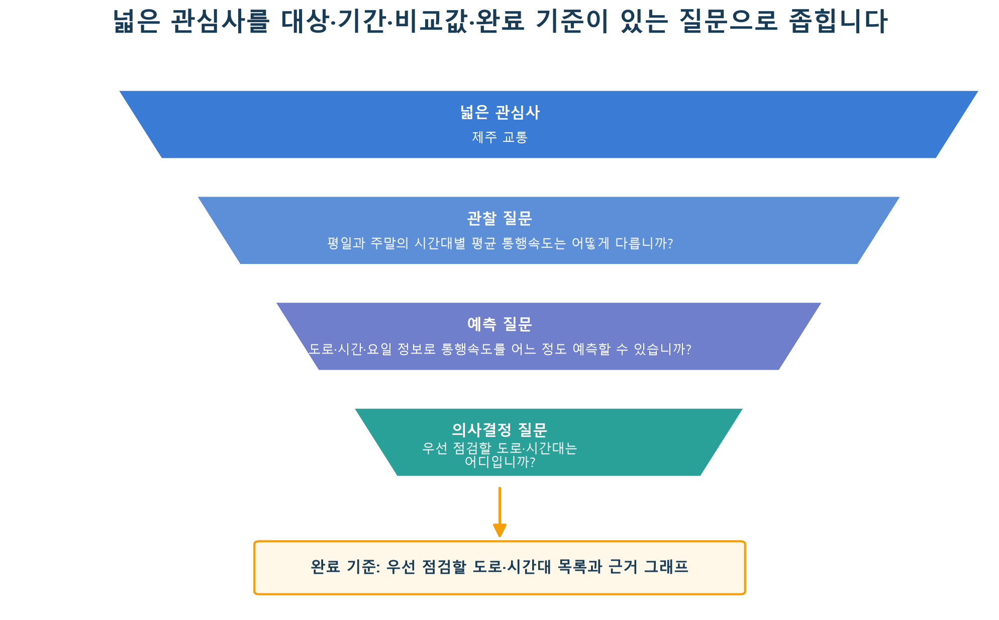
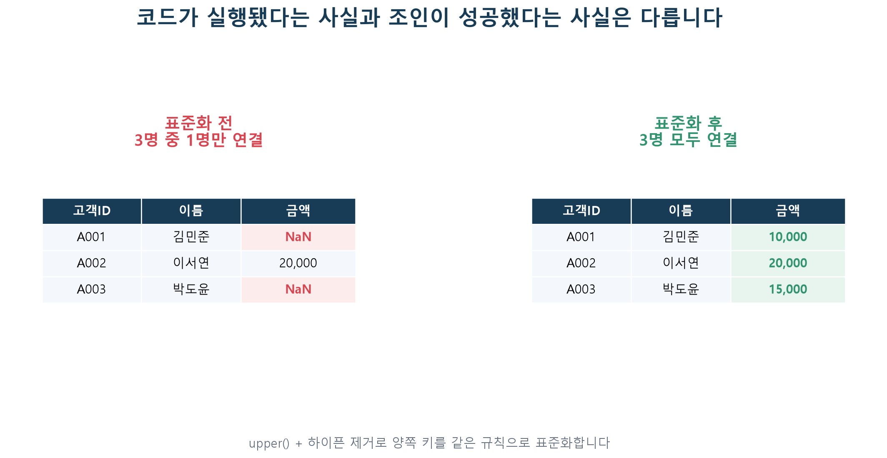
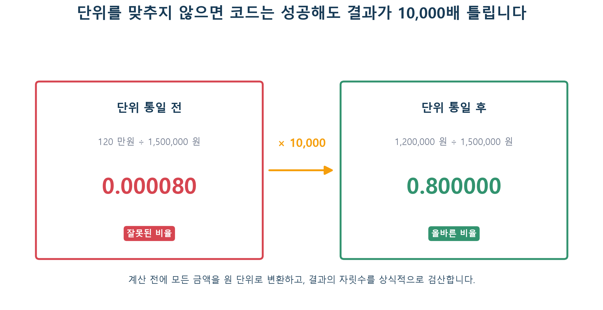
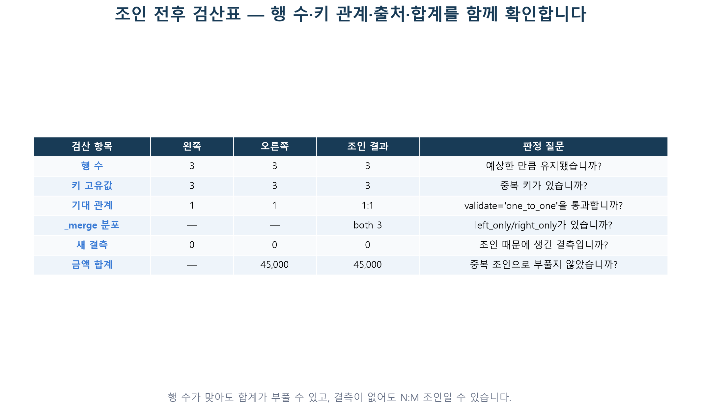
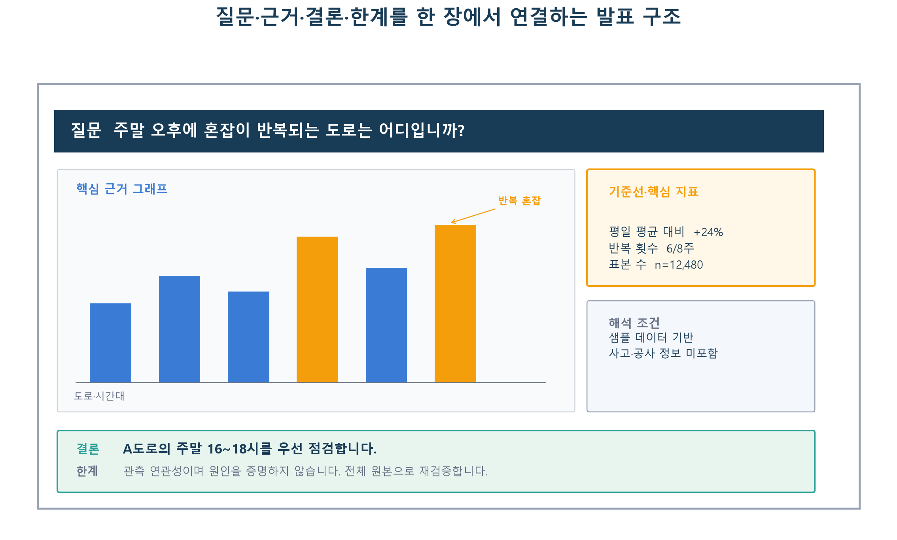

# 8주차 — 자유 프로젝트 / 제공 트랙

## 이번 주 목표

7주 동안 배운 내용을 하나로 연결해, **스스로 질문 하나를 정하고 작은 분석 또는 실행 시도를 공유합니다.** 프로젝트 완성과 좋은 성능보다 어디까지 시도했고 무엇을 다음 행동으로 정했는지가 중요합니다.

아래 목표는 프로젝트를 더 발전시킬 때 참고하는 방향입니다. 기본 범위에서는 질문·시도·관찰·다음 행동을 한 줄씩 남기면 충분합니다.

- 관심사를 분석 가능한 질문으로 좁힙니다.
- 질문에 맞는 분석 단위, 비교 기준, 평가 방법을 먼저 정합니다.
- 외부데이터를 결합할 때 키·단위·행 수가 의도대로 유지되는지 검증합니다.
- 필요한 분석만 선택하고, 결과를 뒷받침하는 핵심 근거를 남깁니다.
- 결론과 함께 데이터·방법의 한계와 다음 행동을 제시합니다.

## 이번 주 학습 지도

아래 시간은 본문을 읽고 준비된 노트북 셀을 실행하는 데 필요한 **대략적인 길잡이**입니다. 데이터 다운로드, 패키지 설치, 로그인·권한 확인, 오류 해결 시간은 포함하지 않습니다. 정해진 할당량이나 마감 시간이 아니므로, 자신의 속도에 맞게 진행하고 `✅ 기본 학습`의 멈춤 지점에서 마쳐도 됩니다. 도전·확장 시간은 기본 학습 이후의 추가 예상 시간입니다.

| 학습 단계 | 예상 시간 | `notion.md`에서 읽을 기존 절 | `example.ipynb`에서 실행할 Part | 마쳐도 되는 지점 |
|---|---:|---|---|---|
| ✅ **기본 학습** | 약 30~60분 | `데이터 다운로드`에서 트랙 링크 하나를 확인하고, `Part 1 — 질문을 좁히는 참고 체크리스트`의 첫 질문과 `과제 안내 — 세 가지 트랙 중 택1`의 ✅ 기본 완료 기준만 읽습니다. | Part 1에서 질문 예시 하나만 고릅니다. Part 1에는 필수 실행 코드가 없으며, Part 2 이후는 건너뛰어도 됩니다. | `assignment_baseline.ipynb`에서 트랙 하나를 고르고 경로 점검을 실행한 뒤 질문·시도·관찰 또는 오류·다음 행동의 네 줄을 남기면 마쳐도 됩니다. 데이터 파일과 완성된 분석은 필요하지 않습니다. |
| 🧩 **도전 학습** | 추가 약 30~60분 | `Part 2~3 — 외부데이터를 결합할 때 살펴볼 부분`과 `Part 4 — 지금까지 배운 조인 사례 되짚기`를 읽습니다. 선택한 트랙에서는 EDA 요약 하나 또는 조인 검산 하나만 고릅니다. | Part 2의 키 매칭과 Part 3의 단위 통일을 실행합니다. Part 4는 사례를 읽고 자신의 데이터와 연결합니다. | 키·단위 검산 결과 하나, 트랙 A의 EDA 표 하나, 트랙 B의 조인 결과 하나 가운데 하나를 관찰로 남기면 멈춰도 됩니다. |
| 🌱 **확장 학습** | 추가 약 60~120분 | `Part 5 — 🌱 프로젝트를 확장할 때 쓰는 선택 체크리스트`, `Part 6 — 분석과 검증 설계`, `🌱 선택 탐색 — 발표를 더 발전시키는 구성 예시`를 필요한 만큼만 읽습니다. | Part 5의 설계 체크리스트를 선택적으로 적용합니다. `example.ipynb`에는 별도의 모델링 셀이 없으므로, 모델이나 추가 그래프는 과제 노트북에서 직접 선택합니다. | 추가 그래프·기준선 모델·조인 검산·발표 자료 중 하나만 더 만들어도 됩니다. 완성된 모델과 완성 발표는 확장 목표이며 기본 완료 조건이 아닙니다. |

**첫 행동:** `08주차/assignment_baseline.ipynb`의 첫 코드 셀을 `TRACK = 'A'`, `LOAD_DATA = False`인 기본값 그대로 실행합니다. 파일 존재 여부가 출력되면 질문 하나와 시도·관찰 또는 오류·다음 행동을 한 줄씩 적으며, 이 단계에서는 데이터를 내려받거나 주제를 확정하지 않아도 됩니다.

### 막혔을 때 먼저 확인합니다

`example.ipynb`의 짧은 키·단위 예제는 외부 파일 없이 실행됩니다. 실제 데이터 경로는 `assignment_baseline.ipynb`의 첫 코드 셀에서만 확인하므로, 먼저 `TRACK = 'A'`, `'B'`, `'C'` 중 하나를 고르고 `LOAD_DATA = False`로 둡니다. 무엇을 고를지 어렵다면 코드에 적힌 기본값 `TRACK = 'A'`를 그대로 사용해 경로 점검만 해도 됩니다. 이 선택은 프로젝트 주제를 확정한다는 뜻이 아닙니다. `None`은 데이터 객체를 아직 만들지 않았다는 파이썬 표시이며, 선택하지 않은 트랙이 “건너뜁니다”라고 출력되는 것도 오류가 아닙니다.

첫 코드 셀을 실행한 뒤 아래 코드를 새 셀에 복사하면 선택한 트랙의 상대경로와 파일 크기를 함께 확인할 수 있습니다. 이 경로는 현재 작업 폴더가 `08주차`일 때 노트북의 기본 폴더 구조와 맞습니다.

```python
from pathlib import Path

print("현재 작업 폴더:", Path.cwd())
for name, path in paths_to_check:
    if path is None:
        print(name, "경로 미입력")
    else:
        size = path.stat().st_size if path.is_file() else None
        print(name, "존재:", path.is_file(), "크기(bytes):", size, "경로:", path.resolve())
```

- 트랙 A는 `../dataset/extracted/제주도 도로 교통량 예측 AI 경진대회/open/train.csv` 하나를 사용합니다. `LOAD_DATA=True`이면 약 470만 행 원본을 먼저 읽으므로, 기본 기록에서는 경로만 확인해도 됩니다.
- 트랙 B는 2018년 7월의 회원정보·신용정보 Parquet 두 파일이 모두 필요합니다. Parquet는 표를 저장하는 파일 형식이고, `pyarrow`는 pandas가 이 형식을 읽을 때 사용하는 패키지입니다. 파일은 있는데 `pyarrow` 오류가 나면 오류를 기록한 뒤 터미널에서 `python -m pip install pyarrow`를 실행합니다.
- 트랙 C는 `CUSTOM_PATH`에 CSV·Parquet·Excel 경로를 적습니다. 경로가 비어 있거나 파일 크기가 0바이트라면 데이터 로딩을 반복하지 않고 그 상태를 관찰로 남깁니다.
- 파일이 없거나 로딩에 실패해도 기본 시도 셀은 경로 점검표를 결과로 사용합니다. 질문, 실행 또는 실행 시도, 관찰한 결과 또는 오류, 다음 행동의 네 줄을 남기면 이번 주 기본 기록을 마친 것입니다.

## 데이터 다운로드

아래 링크는 `README.md`에 안내된 8주차 제공 트랙의 원본 페이지입니다. ✅ 기본 학습에서는 링크 하나와 노트북의 예상 경로만 확인하면 되며, 파일을 내려받을 필요는 없습니다. 실제 데이터를 불러오는 도전·확장 학습을 선택했다면 해당 페이지에서 데이터 설명과 이용 조건을 먼저 살펴본 뒤 파일을 내려받습니다.

- [제주도교통량](https://dacon.io/competitions/official/235985)
- [신용카드세그먼트](https://dacon.io/competitions/official/236460)

원본을 내려받은 날짜와 사용한 파일명을 함께 기록해 두면, 나중에 분석 과정을 다시 실행하거나 다른 사람과 결과를 비교할 때 도움이 됩니다.

## `notion.md`와 `example.ipynb`를 함께 읽는 방법

8주차 노트북은 긴 모델링 파이프라인 대신 두 개의 짧은 점검 사례를 담고 있습니다. 다음 순서로 본문과 노트북을 번갈아 읽습니다. 아래 네 순서는 확장까지 포함한 전체 경로이며, 기본 학습에서는 순서 1에서 질문 하나를 고른 뒤 과제 노트북의 경로 점검과 네 줄 기록으로 이동해도 됩니다.

| 순서 | 먼저 할 일 | 다음에 확인할 일 |
|---|---|---|
| 1 | 아래 문제 정의 예시에서 넓은 주제를 한 문장 질문으로 바꿉니다. | `example.ipynb` Part 1에서 가장 먼저 확인할 질문 하나를 골라 봅니다. |
| 2 | 키 표준화 전 조인 결과를 예상합니다. | Part 2를 실행해 실제로 몇 행이 붙었는지 비교합니다. |
| 3 | 원/만원을 그대로 나눈 값의 자릿수를 예상합니다. | Part 3의 잘못된 값과 수정된 값이 정확히 10,000배 차이 나는지 확인합니다. |
| 4 | 본문의 확장 점검 항목을 읽습니다. | 과제 노트북에서 키·단위·행 수·시간 범위를 실제 데이터로 검산합니다. |

> ✍️ **실습 방법:** 출력 셀을 보기 전에 예상 결과를 한 줄 적어 보고, 실행 후에는 “왜 예상과 달랐습니까?”에 대한 답도 한 줄 정리해 봅니다. 결과가 같거나 달랐던 이유를 설명해 보면 코드를 더 오래 기억하는 데 도움이 됩니다.

> **학습 단계:** ✅ 기본 학습에서는 Part 1의 첫 질문 하나만 고릅니다. 데이터 로딩, EDA, 모델링으로 이어지지 않아도 경로 점검과 네 줄 기록에서 마칠 수 있습니다.

## Part 1 — 질문을 좁히는 참고 체크리스트

데이터를 열기 전에 참고할 네 가지 질문입니다. 기본 시도에서는 첫 번째 질문 한 문장만 정해도 됩니다. 나머지는 프로젝트를 더 진행하고 싶을 때 하나씩 덧붙입니다.

1. **무엇이 궁금합니까?** — 한 문장 질문으로 적습니다.
2. **그 질문에 답하려면 어떤 데이터가 필요합니까?** — 필요한 데이터를 실제로 확보할 수 있습니까?
3. **완료를 어떻게 판단합니까?** — 숫자/목록/지도 중 무엇으로 결론을 냅니까?
4. **발표에서 무엇을 보여줍니까?** — 그래프 1~2개로 결론이 바로 전달됩니까?

이 네 가지를 먼저 정리해 두면 코드를 작성하는 동안에도 분석의 방향을 편안하게 확인할 수 있습니다.

### 넓은 주제를 분석 가능한 질문으로 바꾸기

“제주 교통량을 분석합니다”는 주제이지 질문은 아닙니다. 질문에는 대상, 비교 또는 예측할 값, 범위가 들어가야 합니다.

| 단계 | 예시 |
|---|---|
| 넓은 관심사 | 제주 교통 |
| 관찰 가능한 질문 | 평일과 주말의 시간대별 평균 통행속도는 어떻게 다릅니까? |
| 예측 질문 | 도로·시간·요일 정보로 통행속도를 어느 정도 예측할 수 있습니까? |
| 의사결정 질문 | 혼잡이 반복되는 도로와 시간대 중 우선 점검할 곳은 어디입니까? |

한 프로젝트에서는 핵심 질문 하나와 이를 보조하는 하위 질문 1~2개에 집중하면 결론을 더 선명하게 전달할 수 있습니다.



*캡션: ‘제주 교통’처럼 넓은 관심사를 관찰·예측·의사결정 질문으로 구체화하는 과정입니다.*

> **노트북 연결:** `example.ipynb` Part 1의 체크리스트로 이동하여 내 질문에 대상·기간·비교값·완료 기준이 들어 있는지 함께 확인해 봅니다.

### 분석 단위를 한 문장으로 적기

분석 단위는 표의 **한 행이 무엇을 뜻하는가**입니다. 도로 관측 1건, 고객 1명, 고객의 월별 상태 1건은 서로 다른 단위입니다. 분석 단위가 불분명하면 같은 고객을 여러 명처럼 세거나, 시간별 관측을 독립된 사람처럼 취급하는 오류가 생깁니다.

예: “이 분석에서 한 행은 특정 도로 구간에서 특정 날짜·시간대에 측정한 통행 기록 1건입니다.”

### 완료 기준을 미리 정하기

완료 기준은 “그래프를 많이 만듭니다”가 아니라 질문에 답했다고 판단할 증거입니다.

- EDA: 비교 집단의 차이와 변동을 보여주는 요약표·그래프
- 회귀: 기준 모델 대비 RMSE 개선과 잔차 점검
- 분류: 다수 클래스 기준선 대비 적절한 지표 개선과 클래스별 오류
- 군집: K 선택 근거, 군집별 특징, 군집의 안정성과 활용 방안
- 공간분석: 거리·반경의 정의, 현재와 개선안의 커버리지 비교

모델링은 선택 사항입니다. 질문이 “어떤 집단에서 차이가 나타납니까?”라면 잘 설계된 EDA가 불필요한 예측 모델보다 더 직접적인 답이 될 수 있습니다.

> **학습 단계:** 🧩 도전 학습은 여기서 시작합니다. 키 매칭과 단위 통일을 모두 완성하기보다, 예제 하나를 실행하거나 선택 트랙에서 EDA·조인 점검 하나를 남기면 충분합니다.

## Part 2~3 — 외부데이터를 결합할 때 살펴볼 부분

### ① 키 매칭
서로 다른 곳에서 온 두 테이블을 합칠 때, ID 형식이 `A001`과 `a001`, `A-003`처럼 미묘하게 다르면 오류 메시지는 없지만 일부 행만 연결되고 나머지 값은 `NaN`으로 채워질 수 있습니다. `customers`(3명)와 `orders`(3명)를 그대로 조인하면 대소문자와 하이픈이 달라 1명만 연결됩니다. 양쪽 키를 `upper()` + 하이픈 제거로 문자열 표준화한 뒤 다시 조인하면 3명 모두 연결됩니다. 이처럼 조인 뒤에 `NaN` 개수와 연결된 행 수를 확인하면 표기 차이를 일찍 발견할 수 있습니다.

`example.ipynb` Part 2의 핵심 코드는 다음과 같습니다. 실행 전에 어느 고객의 금액이 `NaN`이 될지 먼저 예상해 봅니다.

```python
import pandas as pd

customers = pd.DataFrame({
    "고객ID": ["A001", "A002", "A003"],
    "이름": ["김민준", "이서연", "박도윤"],
})
orders = pd.DataFrame({
    "고객ID": ["a001", "A002", "A-003"],
    "금액": [10000, 20000, 15000],
})

merged = customers.merge(orders, on="고객ID", how="left")
merged
```

```text
   고객ID   이름       금액
0  A001  김민준      NaN
1  A002  이서연  20000.0
2  A003  박도윤      NaN
```

코드는 오류 없이 끝났지만 3명 중 1명만 연결되었습니다. 다음 셀에서 키를 표준화하고 다시 조인합니다.

```python
def normalize_id(s):
    return s.str.upper().str.replace("-", "", regex=False)

customers["고객ID_정규화"] = normalize_id(customers["고객ID"])
orders["고객ID_정규화"] = normalize_id(orders["고객ID"])

merged_fixed = customers.merge(orders, on="고객ID_정규화", how="left")
merged_fixed[["고객ID_x", "이름", "금액"]]
```

```text
  고객ID_x   이름     금액
0    A001  김민준  10000
1    A002  이서연  20000
2    A003  박도윤  15000
```



*캡션: `example.ipynb` Part 2의 출력을 바탕으로, 표준화 전 `NaN` 두 칸이 대소문자·하이픈 제거 후 올바른 금액으로 채워지는 과정을 표시했습니다.*

> **그림 읽기:** 코드가 오류 없이 실행된 것과 의도한 키가 모두 연결된 것은 어떤 점에서 다른지 함께 살펴봅니다.

### ② 단위 통일
키가 맞아도 단위가 다르면 의도와 다른 계산 결과가 나올 수 있습니다. 매출이 '원' 단위, 예산이 '만원' 단위인 두 테이블을 그대로 나누면 실제보다 10,000배 작은 비율이 나옵니다. 먼저 단위를 같은 기준으로 맞춘 뒤 계산하면 이 차이를 예방할 수 있습니다. 코드가 오류 없이 실행되더라도 결과 숫자가 데이터의 단위와 가능한 범위에 맞는지 검산해 두는 습관이 도움이 됩니다.

`example.ipynb` Part 3에서는 같은 식을 단위 통일 전후로 계산합니다.

```python
sales = pd.DataFrame({"상품": ["A", "B"], "매출_원": [1_500_000, 2_300_000]})
budget = pd.DataFrame({"상품": ["A", "B"], "예산_만원": [120, 200]})

m = sales.merge(budget, on="상품")
m["잘못된_비율"] = m["예산_만원"] / m["매출_원"]
m["예산_원"] = m["예산_만원"] * 10_000
m["올바른_비율"] = m["예산_원"] / m["매출_원"]
m[["상품", "잘못된_비율", "올바른_비율"]]
```

```text
  상품   잘못된_비율   올바른_비율
0  A    0.000080      0.800000
1  B    0.000087      0.869565
```



*캡션: `example.ipynb` Part 3의 잘못된 비율 `0.000080`이 단위를 원으로 통일한 뒤 `0.800000`이 되는 과정을 ×10,000 주석으로 표시했습니다.*

> **그림 읽기:** 코드 오류가 없는데도 의도와 다른 결과가 나올 수 있는 이유를 큰 숫자의 단위와 연결해 살펴봅니다.

### 조인 검증은 전후 비교로 합니다

`merge`가 실행됐다는 사실만으로 올바른 조인이라고 볼 수 없습니다. 조인 전후에 최소한 다음을 확인합니다.

1. 양쪽 테이블에서 키가 유일합니까, 중복됩니까?
2. 예상한 관계가 1:1, 1:N, N:M 중 무엇입니까?
3. 조인 전후 행 수가 왜 달라졌습니까?
4. 왼쪽에만, 오른쪽에만 존재하는 키는 몇 개입니까?
5. 조인 후 새로 생긴 결측치는 몇 개입니까?
6. 금액·건수 합계가 중복 조인으로 부풀지 않았습니까?

가능하면 `merge(..., validate='one_to_one')`처럼 기대한 키 관계를 코드로 검증하고, `indicator=True`로 어느 테이블에서 온 행인지 확인합니다. N:M 조인은 행 수를 크게 늘릴 수 있으므로, 의도한 관계가 아니라면 키를 다시 정의하거나 먼저 집계하는 편이 안전합니다.

```text
1:1  고객 한 명 ───── 고객 프로필 한 행
1:N  고객 한 명 ─┬── 주문 1
                 ├── 주문 2
                 └── 주문 3
N:M  상품 여러 개 ╳ 캠페인 여러 개  → 의도하지 않은 관계라면 행 수가 크게 늘어날 수 있습니다.
```



*캡션: 양쪽 원본 행 수·키 고유값 수·조인 후 행 수·`_merge` 분포를 한번에 비교하는 검산표입니다.*

> **노트북 연결:** 프로젝트 노트북의 첫 `merge` 바로 아래에 같은 검산표를 만들어 봅니다. 행이 늘거나 줄었다면 어떤 키 관계가 원인인지 차근차근 확인합니다.

### 시간과 모집단도 맞춰야 합니다

키와 단위가 같아도 기준 시점과 모집단이 다르면 비교가 어긋납니다. 2018년 고객 상태에 2024년 지역 통계를 붙이거나, 전체 고객 매출을 활성 회원 수로만 나누는 식입니다. 각 데이터의 기준일·관측기간·포함 대상을 데이터 설명표에 기록합니다.

## Part 4 — 지금까지 배운 조인 사례 되짚기

| 주차 | 조인/결합 | 만난 문제 | 해결 |
|---|---|---|---|
| 3주차 | 전력사용량 + 건물정보 | 결측치가 `NaN`이 아니라 문자열 `'-'`로 표시됨 | `'-'`를 0으로 명시적으로 치환 후 형변환 |
| 4주차 | 물류 격자ID/카테고리 인코딩 | test에 train에서 못 본 격자ID가 다수 | train에만 `fit`한 unknown-safe one-hot을 기준선으로 사용하고 미지 ID 성능을 별도 평가 |
| 6주차 | 이커머스 5개 테이블 | `discount`의 `월` 컬럼이 `'Jan'` 같은 축약형, `sales`는 날짜 전체 | `dt.strftime('%b')`로 형식을 맞춰서 조인 |

세 사례를 살펴보면, **같은 의미를 서로 다르게 표기한 경우**가 조인 결과가 기대와 달라지는 주요 원인 가운데 하나임을 알 수 있습니다. 미니 프로젝트에서 외부데이터를 더할 때도 키의 의미와 표기 방식부터 차근차근 확인해 봅니다.

> **학습 단계:** 🌱 확장 학습에서는 체크리스트·모델·그래프·발표 구성 가운데 필요한 항목만 고릅니다. 완성된 분석이나 발표는 기본·도전 학습의 완료 조건이 아닙니다.

## Part 5 — 🌱 프로젝트를 확장할 때 쓰는 선택 체크리스트

아래 항목은 기본 기록을 마친 뒤 분석을 더 발전시키고 싶을 때 사용합니다. 모두 확인할 필요는 없습니다.

- [ ] Part 1의 질문 4개에 한 문장씩 답했습니다.
- [ ] 한 행이 무엇을 뜻하는지 정의했습니다.
- [ ] 타깃 또는 핵심 지표가 실제 의사결정 시점에 알 수 있는 정보인지 확인했습니다.
- [ ] 사용할 데이터의 키/단위가 맞는지 미리 확인했습니다.
- [ ] 조인 전후 행 수·키 중복·결측치·합계를 검산했습니다.
- [ ] 모델링한다면 train/validation/test의 역할과 분리 기준을 정했습니다.
- [ ] 비교할 단순한 기준선(baseline)을 정했습니다.
- [ ] 최종적으로 보여줄 그래프나 표를 1~2개 정도 미리 스케치했습니다.
- [ ] 결론을 바꿀 수 있는 한계 한 가지를 적었습니다.
- [ ] 발표 시간(질의응답 포함)을 고려해 분량을 조절했습니다.

## Part 6 — 분석과 검증 설계

### 기준선을 먼저 만듭니다

복잡한 분석 전에 단순한 비교 대상을 정합니다. 회귀라면 항상 평균을 예측하는 모델, 분류라면 다수 클래스만 예측하는 모델, 군집이라면 전체 평균과의 차이가 기준선이 될 수 있습니다. 복잡한 모델의 점수만 제시하면 그 성능이 실제로 유용한지 판단하기 어렵습니다.

### 분리 기준은 데이터 구조에 맞춘다

- 서로 독립적인 개체 데이터: 무작위 분할을 고려합니다.
- 시간 순서가 있는 데이터: 과거로 학습하고 미래로 평가합니다.
- 한 고객·도로·건물의 행이 여러 개: 같은 개체가 train과 test에 동시에 들어가 정체성을 외우지 않도록 그룹 단위 분할을 고려합니다.
- 공간 데이터: 가까운 위치가 train과 test에 함께 있으면 공간적 유사성 때문에 성능이 과대평가될 수 있어 지역 단위 분할을 고려합니다.

결측치 대체, 스케일링, 인코딩 기준은 원칙적으로 train에만 `fit`하고 validation/test에는 `transform`만 합니다. 결과를 보며 분석 선택을 반복했다면 마지막 test는 모든 선택이 끝난 뒤 한 번만 사용합니다.

### 분석 기록을 남깁니다

프로젝트를 다른 사람이 다시 실행할 수 있도록 다음을 기록합니다.

- 데이터 출처, 다운로드 날짜, 라이선스
- 원본에서 제외하거나 수정한 행과 그 이유
- 사용한 컬럼과 단위
- 라이브러리 버전과 `random_state`
- 학습·검증·평가 분리 기준
- 최종 결론에 사용한 코드와 그래프

## 분석 과정에서 자주 점검할 부분

아래 항목을 미리 살펴보면 분석 결과를 더 정확하고 편안하게 설명할 수 있습니다.

- 질문을 먼저 정한 뒤 그 질문에 필요한 그래프를 선택하면, 결과에 맞춰 질문을 바꾸는 일을 줄일 수 있습니다.
- 상관관계와 인과관계는 근거의 수준이 다르므로 표현을 구분합니다.
- 스케일링·인코딩·변수 선택 기준은 train에서 정한 뒤 validation/test에 적용합니다.
- 여러 모델을 비교할 때 test를 반복해서 사용하기보다 validation에서 선택을 마치고 test는 마지막 확인에 사용합니다.
- 고객별 행이 여러 개라면 같은 고객이 양쪽에 들어가지 않도록 고객 단위 분할을 고려합니다.
- 조인 후 행 수와 합계를 함께 확인하면 중복 연결로 값이 커지는 문제를 발견할 수 있습니다.
- 결론은 데이터가 대표하는 기간·지역·집단의 범위 안에서 설명합니다.
- 마지막 결론이 처음 질문에 직접 답하는지 다시 연결해 봅니다.

## 과제 안내 — 세 가지 트랙 중 택1

8주차의 기본 과제는 완성된 프로젝트를 만드는 일이 아닙니다. 관심 있는 트랙 하나에서 **질문을 정하고, 데이터를 확인하거나 확인을 시도한 뒤, 관찰과 다음 행동을 남기는 것**이 목표입니다. 분석 성공 여부보다 시도·오류·브레이크다운 기록이 중요하며, 분석이 끝까지 이어지지 않아도 충분합니다.

여기서 **브레이크다운**은 막힌 문제를 지금 확인할 수 있는 더 작은 질문으로 나누는 일입니다. 예를 들어 “데이터가 안 됩니다”를 “파일이 없습니까?”, “경로가 다릅니까?”, “파일은 있지만 읽기 패키지가 없습니까?”로 나누어 하나씩 확인합니다.

| 구분 | 이번 주에 할 일 |
|---|---|
| ✅ **기본 시도** | 트랙 하나를 고르고 질문·실행 또는 실행 시도·관찰·다음 행동을 한 줄씩 기록합니다. |
| 🧩 **문제 분해** | 막힌 지점을 파일·경로·메모리·자료형·분석 질문 중 하나로 좁히고 가장 작은 확인 행동을 정합니다. |
| 🌱 **선택 탐색** | EDA, 조인 검산, 기준선 모델, 그래프, 발표 자료 가운데 관심 있는 한 가지를 더 진행합니다. |

`assignment_baseline.ipynb`의 첫 코드 셀에서 `TRACK = 'A'`, `'B'`, `'C'` 중 하나를 고릅니다. `LOAD_DATA = False`인 상태에서는 파일 존재 여부만 점검하므로 데이터가 없어도 위에서부터 실행할 수 있습니다. 파일을 준비한 뒤 실제로 불러오려면 `LOAD_DATA = True`로 바꿉니다. 선택하지 않은 트랙의 셀은 안내 문구만 출력하고 건너뜁니다.

### 트랙 선택

- **트랙 A (제공)**: 제주도 도로 교통량. 별도의 3만 행 샘플 파일을 제공하는 방식이 아닙니다. `LOAD_DATA = True`로 바꾸면 `assignment_baseline.ipynb`가 원본 약 470만 행을 먼저 불러온 뒤 메모리에서 3만 행을 무작위로 추출합니다. 시간·요일별 EDA, 통행속도 회귀, 위치 기반 분석 중 핵심 질문 하나를 고릅니다. 무작위 샘플은 전체 시공간 분포를 정확히 보존하지 않을 수 있으므로 원본 대비 대표성 한계를 적습니다.
- **트랙 B (제공)**: 신용카드 고객 세그먼트. 8개 영역(회원정보~성과정보) 중 회원정보+신용정보 2개를 2018년 7월 한 달치만 조인한 예시를 제공합니다. A 162명·B 24명·E 320,342명으로 클래스 불균형이 매우 심해, 기본 코드는 5천 행 표본을 만들지 않고 40만 행을 유지합니다. accuracy만 쓰지 않고 클래스별 recall 또는 macro F1 등을 함께 봅니다. 같은 고객의 여러 월을 확장해 쓴다면 고객 단위 분리를 고려합니다.
- **트랙 C (자유)**: 원하는 주제 + 직접 수집한 데이터. 베이스라인은 없지만 문제 정의, 데이터 출처·라이선스, 키·단위·시점 점검, 검증 설계는 동일하게 적용합니다. 개인 또는 민감정보는 사생활 침해 위험이 있으므로 수집·공개하지 않고, 필요하다면 공개된 집계·비식별 데이터를 사용합니다.

### ✅ 기본 완료 기준

다음 네 가지를 한 줄씩 적습니다.

1. **질문 1개** — 누구 또는 무엇을, 어떤 범위에서 살펴볼지 적습니다.
2. **실행 또는 실행 시도 1개** — 파일 경로 확인, `shape` 출력, 요약표 계산 중 하나면 충분합니다.
3. **관찰한 결과 또는 오류 1개** — 숫자 하나, 눈에 띈 패턴 하나, 오류 문구 하나 중 하나를 기록합니다.
4. **다음 행동 1개** — 다음에 확인할 가장 작은 행동을 적습니다.

데이터 파일이 없다면 다운로드 페이지를 확인하고, 예상 경로가 존재하는지 점검한 실행도 한 번의 시도입니다. “파일을 찾지 못했습니다”라는 출력과 확인한 경로, 다음 다운로드 행동을 그대로 기록합니다. 메모리나 Parquet 엔진 오류가 나도 오류 종류를 기록하고 문제를 나누면 됩니다.

> **여기까지 하면 이번 주 기록 완료입니다.** 모델, 최종 그래프, 완성된 결론은 기본 완료 조건이 아닙니다. 네 줄 기록을 1~2장의 발표 자료로 옮겨 어떤 시도와 판단을 했는지 공유합니다.

### 🧩 막혔을 때 문제를 나누는 예

| 현재 상태 | 먼저 확인할 작은 질문 | 다음 행동 예시 |
|---|---|---|
| 파일이 없습니다. | 다운로드하지 않았습니까, 경로가 다릅니까? | 노트북이 출력한 예상 경로와 실제 폴더를 비교합니다. |
| 제주 원본이 너무 큽니다. | 파일 읽기에서 막혔습니까, 분석 계산에서 막혔습니까? | 원본 크기와 사용 가능한 메모리를 기록하고 DM으로 환경을 공유합니다. |
| Parquet를 읽지 못합니다. | 파일 문제입니까, 엔진 설치 문제입니까? | 오류에 `pyarrow`가 보이는지 확인합니다. |
| 무엇을 분석할지 모르겠습니다. | 비교할 두 집단이나 요약할 값 하나가 있습니까? | 노트북의 기본 질문을 그대로 사용합니다. |

## 🌱 선택 탐색 — 발표를 더 발전시키는 구성 예시

기본 기록 이후 분석을 더 진행하고 싶다면 아래 구성을 참고합니다. 여섯 항목을 모두 채울 필요는 없습니다.

1. **질문** — 무엇을 왜 알고 싶습니까?
2. **데이터** — 한 행의 의미, 기간, 표본, 핵심 한계는 무엇입니까?
3. **방법** — 어떤 비교·모델·지표를 선택했고 그 이유는 무엇입니까?
4. **근거** — 결론을 직접 뒷받침하는 그래프·표 1~3개는 무엇입니까?
5. **결론** — 질문에 대한 한 문장 답은 무엇입니까?
6. **한계와 다음 단계** — 어디까지 믿을 수 있고 무엇을 더 확인해야 합니까?

코드 화면을 길게 보여주기보다 판단의 근거와 결과를 보여줍니다. 그래프 제목만 읽어도 질문과 결론의 방향을 알 수 있게 만들고, 축·단위·표본 수를 표시합니다.



*캡션: 상단의 한 문장 질문, 중앙의 핵심 그래프, 오른쪽의 기준·지표, 하단의 결론·한계를 한 장에 배치한 발표 와이어프레임입니다.*

> **그림 읽기:** `assignment_baseline.ipynb`의 최종 그래프를 중앙에 넣었다고 생각하고, 그래프 하나가 질문에 직접 답하며 결론의 범위를 정하는 한계까지 보여주는지 살펴봅니다.

## 🌱 프로젝트를 더 발전시킬 때 확인할 기준

아래 항목은 완성도 높은 프로젝트로 확장할 때 사용하는 선택 기준입니다. 이번 주 기본 완료를 위해 모두 충족할 필요는 없습니다.

- 질문과 결론이 직접 연결됩니다.
- 중요한 전처리 선택에 이유가 있습니다.
- 기준선 또는 비교 대상이 있습니다.
- 평가 방식이 데이터 구조와 맞습니다.
- 핵심 주장마다 표·그래프·지표 중 하나의 근거가 있습니다.
- 인과로 말할 수 없는 결과를 연관성으로 표현합니다.
- 데이터와 방법의 한계를 최소 한 가지 제시합니다.
- 첫 셀에서 선택한 트랙만 위에서부터 실행했을 때 같은 결과가 재현됩니다.

## 장 요약

- 좋은 프로젝트는 모델에서 시작하지 않고 답할 수 있는 질문에서 시작합니다.
- 분석 단위와 완료 기준을 먼저 정하면 불필요한 분석을 줄일 수 있습니다.
- 외부데이터를 조인할 때는 키뿐 아니라 관계, 행 수, 단위, 시점, 모집단도 함께 검증하는 것이 중요합니다.
- 데이터 분리는 시간·개체·공간 구조에 맞춰야 하며 test는 최종 확인용으로 남깁니다.
- 결론은 핵심 근거와 바로 연결하고, 적용 범위를 이해할 수 있도록 한계도 함께 제시합니다.

## 🌱 선택 이해 점검

아래 문제는 기본 기록을 마친 뒤 개념을 더 확인하고 싶을 때 골라 봅니다. 모두 풀 필요는 없습니다.

1. “고객 데이터를 분석한다”를 대상·범위·완료 기준이 포함된 질문으로 바꾸어 봅니다.
2. 고객 1명이 월별로 12행씩 존재할 때 행 단위 무작위 분할이 위험한 이유는 무엇입니까?
3. 조인 후 행 수가 2배로 늘었지만 결측치는 없습니다. 무엇을 먼저 확인해야 합니까?
4. 제주 교통량의 미래 시점 예측에서 무작위 분할보다 시간 순서 분할이 타당한 이유는 무엇입니까?
5. 모델 점수는 높지만 기준 모델과 차이가 거의 없다면 결과를 어떻게 설명해야 합니까?

### 해설 가이드

1. 예: “2022년 제주 도로 관측 자료에서 평일과 주말의 시간대별 평균 통행속도 차이를 비교하고, 표본 수와 변동을 포함한 그래프 두 개로 반복 혼잡 시간대를 제시합니다.” 대상·기간·비교·완료 기준이 드러나야 합니다.
2. 같은 고객의 다른 달 기록이 양쪽에 들어가면 모델이 고객의 고유 특성을 외워 새 고객보다 쉬운 평가가 됩니다. 실제 목적에 따라 고객 단위 그룹 분리나 시간 순서 분리를 사용합니다.
3. 양쪽 키의 중복과 기대한 1:1·1:N 관계를 확인합니다. 의도하지 않은 N:M 조인이라면 같은 금액이나 관측이 여러 번 복제됐을 수 있으므로 합계도 검산합니다.
4. 무작위 분할은 미래 관측과 시간적으로 가까운 행을 학습에 섞어 실제 미래 예측보다 쉬운 문제를 만들 수 있습니다. 과거로 학습하고 이후 기간으로 평가하면 운영 상황에 더 가까운 조건을 만들 수 있습니다.
5. 절대 점수가 높아도 단순 규칙이 거의 같은 성능을 내면 복잡한 모델이 추가한 실질적 가치가 작습니다. 차이의 변동성과 운영 비용까지 비교해 채택 여부를 판단합니다.

## 용어집

| 용어 | 뜻 |
|---|---|
| 키 매칭 (key matching) | 조인 시 두 테이블의 기준 컬럼(ID 등) 형식을 맞추는 것 |
| 문자열 표준화 | 대소문자·공백·구분자 등을 통일해서 조인 가능한 형태로 맞추는 것 |
| 단위 통일 | 서로 다른 단위(원/만원 등)로 저장된 값을 같은 기준으로 맞추는 것 |
| 검산 | 데이터의 단위와 가능한 범위에 비추어 계산 결과의 크기를 다시 확인하는 것 |
| 분석 단위 | 데이터 한 행이 나타내는 관측 대상과 시점 |
| 기준선 (baseline) | 복잡한 방법이 실제로 개선됐는지 비교하기 위한 단순한 규칙·모델 |
| 데이터 누수 | 평가 시점에 알 수 없는 정보나 평가 데이터의 정보가 학습 과정에 들어가는 문제 |
| 재현성 | 같은 데이터와 절차로 분석했을 때 같은 결과를 다시 얻을 수 있는 성질 |

## 이번 주 기본 기록 확인

- [ ] 선택한 트랙의 질문 1개를 적었습니다.
- [ ] 코드나 파일 확인을 한 번 실행했거나 실행을 시도했습니다.
- [ ] 관찰한 결과 또는 오류를 1개 적었습니다.
- [ ] 다음에 할 작은 행동을 1개 적었습니다.

> **네 항목을 확인했다면 이번 주 기록 완료입니다.** 데이터 파일이 없거나 분석이 중간에 멈췄더라도 괜찮습니다.

더 진행했다면 다음 선택 항목도 확인합니다.

- [ ] 트랙 A에서 원본 대비 시간·지역·타깃 분포의 대표성을 점검하고 한계를 기록했습니다.
- [ ] 트랙 B에서 사용한 월·테이블 범위와 클래스 불균형을 기록했습니다.
- [ ] 트랙 C에서 데이터 출처·라이선스와 한 행의 의미를 기록했습니다.
- [ ] 발표 시간과 공유 형식에 맞게 결과물을 정리했습니다.

## 8주 학습을 마무리하며

1~8주차의 네 줄 기록을 가볍게 훑어보고, 처음보다 문제를 더 작게 나누어 확인할 수 있게 된 사례 하나를 골라 봅니다. [OT의 8주 전 지식 기록](../00_OT/notion.md#8주-전-지식-기록)에서 질문 하나만 다시 골라 처음 답과 지금 답을 비교해도 좋습니다. 완성한 모델의 수보다 질문·시도·관찰 또는 오류·다음 행동을 스스로 이어 간 과정이 이번 학습의 결과입니다.
